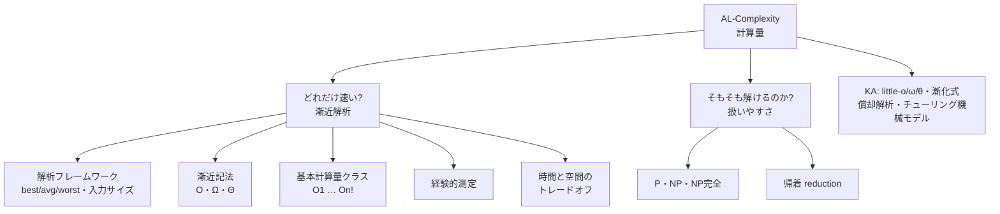
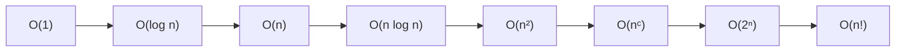
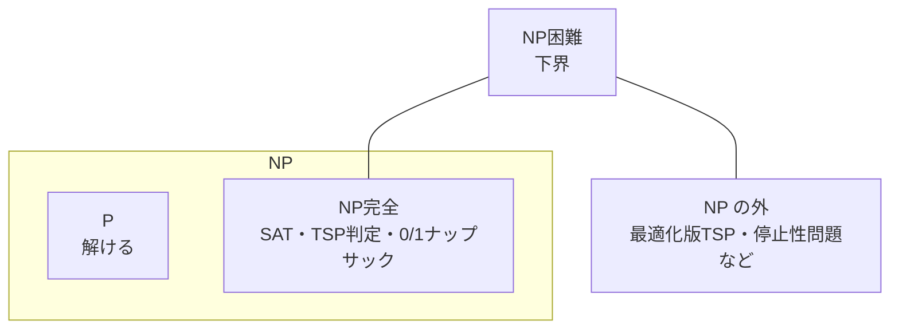
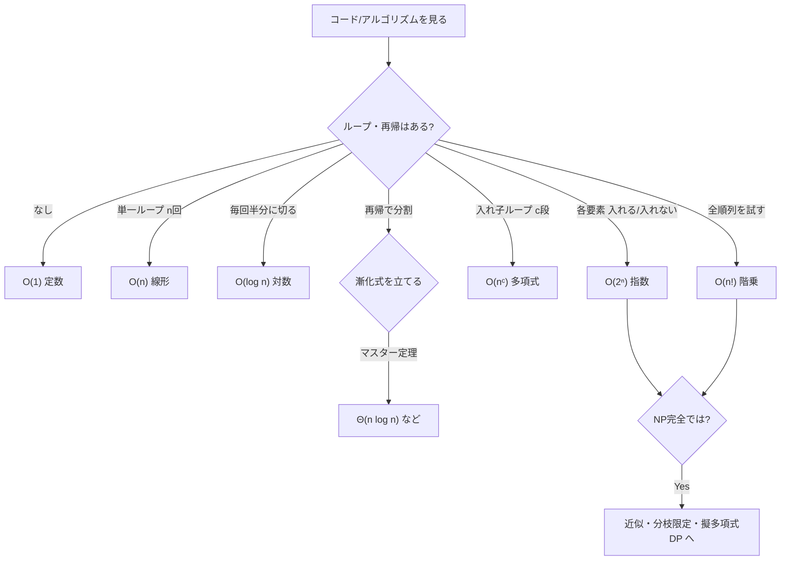

# AL-Complexity: 計算量

CS2023 / Algorithmic Foundations (AL) の3つ目の Knowledge Unit「**AL-Complexity**（Complexity）」を整理した学習メモ。アルゴリズムの**コストが入力サイズとともにどう伸びるか**を測る言語（漸近記法）と、**そもそも現実的に解けるのか**（扱いやすさ／NP完全性）を扱うユニット。

!!! info "出典・凡例"
    出典: `ComputerScienceCurricula2023.pdf` pp.91–93。
    **CS Core** = 全卒業生必須 / **KA Core** = 当該分野で必須 / **Non-core** = 発展。
    例に登場するアルゴリズムの多くは [AL-Foundational](AL-Foundational.md)、難しさの直感は [AL-Strategies](AL-Strategies.md) で扱った。このユニットはそれらに**測る言葉と理論的根拠**を与える。

## 全体像

このユニットは大きく **2 つの問い**に分かれる。

!!! note "計算量とは『伸び方』を測ること"
    自動車の燃費を比べるとき、「ガソリン 1L 使った」という**絶対値**ではなく「距離が伸びると消費がどう増えるか」という**伸び方**で比べる。アルゴリズムも同じで、「この入力で 0.3 秒」ではなく「**入力が 2 倍になると時間は何倍になるか**」を見る。定数や機種差を捨てて伸び方だけ残したのが漸近記法（Big-O など）。

!!! quote "このユニットのゴール"
    1. 任意のアルゴリズムを見て「**おおよそどの計算量クラスか**」を見積もれる（学習成果5）。
    2. **O・Ω・Θ** と **best/average/worst** を**混同せず**組み合わせて言える（例:「クイックソートは worst で O(n²)、average で Θ(n log n)」）。
    3. **扱いやすい (P) / 扱いにくい (NP完全)** の境界と、それが実務に意味することを非専門家にも説明できる（学習成果10・11）。

---

## 1. 計算量解析のフレームワーク

「速い／遅い」を**客観的に比較するための土台**。4 つの約束ごとを最初に固める。

### 1a. Best / Average / Worst-case ＝「どの入力を考えるか」

同じアルゴリズムでも入力次第で実行時間は変わる。そこで**どの入力を代表値に取るか**を決める。

| | 意味 | 例: 線形探索（n 要素から目的を探す） |
|---|---|---|
| **Best-case** | 最も運が良い入力 | 先頭で見つかる → **O(1)** |
| **Average-case** | 入力分布上の期待値 | 平均で半分まで見る → **Θ(n)** |
| **Worst-case** | 最も運が悪い入力 | 末尾／不在 → **Θ(n)**。**保証**として最重要 |

!!! tip "実務では worst-case が基準"
    SLA・レスポンス上限・最悪の詰まりを設計するのは worst-case。average-case は「ふだんどのくらい速いか」の見積もりに使う。**両方を区別して言える**のがこのユニットの肝。

### 1b. 経験的測定 vs 相対的測定（Order of Growth）

- **経験的測定 (empirical)**: 実際に動かして時間・メモリを計る。機種・言語・コンパイラに依存し、**移植性がない**。
- **相対的測定 (relative / Order of Growth)**: 「入力サイズに対する**伸び方**」で表す。機種に依存せず比較できる。これが漸近記法の動機。

### 1c. 入力サイズ (input size) と基本操作 (primitive operation)

伸び方を語るには「何に対して」「何を数えるか」を決める必要がある。

- **入力サイズ n**: 配列なら要素数、グラフなら頂点 V・辺 E、数値なら**ビット長**（後述の擬多項式の落とし穴に直結）。
- **基本操作**: アルゴリズムの本質を握る、定数時間で行える 1 操作（比較・代入・加算など）。これを n の関数として数える。

!!! warning "「数値の大きさ」と「入力サイズ」は別物"
    入力が整数 W のとき、W 自体ではなく **W の表記長 = log₂W ビット**が入力サイズ。これを取り違えると「多項式に見えるが実は指数」という**擬多項式時間**の罠にはまる（→ 0/1 ナップサックの DP。[AL-Strategies-QA Q3](AL-Strategies-QA.md#q3) で予告した回収点）。

### 1d. 時間効率 と 空間効率

数える対象は時間（基本操作の回数）だけでなく**空間（追加で使うメモリ）**も。両者はしばしば**トレードオフ**になる（→ §5）。

---

## 2. 漸近記法 ＝「関数をどう抑えるか」

§1a の「どの入力か」とは**独立な軸**。こちらは「実行時間を表す関数 T(n) を、どの向きで抑えるか」を表す。

| 記法 | 読み | 意味（直感） | 役割 |
|---|---|---|---|
| **O(g)** | ビッグオー | T(n) は g(n) を**超えない**（上界） | 「**最悪でもこれ以下**」 |
| **Ω(g)** | ビッグオメガ | T(n) は g(n) を**下回らない**（下界） | 「**少なくともこれ以上かかる**」 |
| **Θ(g)** | ビッグシータ | O かつ Ω（**ぴったり**） | 「**伸び方が g と同じ**」 |

形式的には、ある定数 c, n₀ が存在して n ≥ n₀ で

- **O**: T(n) ≤ c·g(n)　**Ω**: T(n) ≥ c·g(n)　**Θ**: c₁·g(n) ≤ T(n) ≤ c₂·g(n)

!!! danger "2 軸は直交する — ここが最頻ミス"
    「**どの入力か**（best/avg/worst）」と「**どう抑えるか**（O/Ω/Θ）」は**別の軸**。組み合わせて初めて正確になる。

    - ❌「クイックソートは O(n log n)」← どの入力の話か不明で雑。
    - ✅「クイックソートは **worst-case で O(n²)**、**average-case で Θ(n log n)**」。

    "O(n log n) のソート" という言い方を**自分のノートでもしない**。必ず「どの入力で・どの向きの抑え」かをセットで言う。

!!! note "Ω には 2 つの使い方がある（伏線）"
    Ω は「**あるアルゴリズムの下界**」にも「**問題そのものの下界**」にも使える。後者の代表が**比較ソートの下限 Ω(n log n)**＝[ソートの壁（Foundational-QA Q11）](AL-Foundational-QA.md#q11)。「どんなアルゴリズムでもこれ以上かかる」という問題の下界は、§6 の **NP困難（問題の難しさの下界）** と同じ発想で、学習成果12（NP-Hard は下界・NP は上界）につながる。

---

## 3. 基本計算量クラスと代表例

CS2023 が挙げる 8 つのクラス。**遅い順に上から覚える**より、「**何をすると各クラスになるか**」で覚える。大小の図解は [Foundational-QA Q10](AL-Foundational-QA.md#q10) と対。

| クラス | 名前 | 何をすると現れるか | 代表例 |
|---|---|---|---|
| **O(1)** | 定数 | 入力に触れず一発で決まる | 配列アクセス `a[i]`、ハッシュ表の平均検索 |
| **O(log n)** | 対数 | 毎回**半分を捨てる** | 二分探索、平衡木の検索 |
| **O(n)** | 線形 | **全要素を一度ずつ**見る | 線形探索、合計、最大値 |
| **O(n log n)** | 線形対数 | 分割統治で n を log n 回割る | マージソート、ヒープソート、比較ソートの最良 |
| **O(n²)** | 二乗 | **全ペア**を見る／二重ループ | 選択ソート、挿入ソート最悪、隣接行列の走査 |
| **O(nᶜ)** | 多項式 | ループの入れ子が c 段 | ガウス消去 O(n³)、Floyd-Warshall O(V³) |
| **O(2ⁿ)** | 指数 | **各要素で「入れる／入れない」の 2 択** | 全部分集合（ナップサック全探索、SAT 全代入） |
| **O(n!)** | 階乗 | **全順列**を試す | TSP 全列挙、ハミルトン閉路、全並べ替え |

!!! tip "多項式 (nᶜ まで) と指数 (2ⁿ から) の間に『崖』がある"
    n が増えると O(nᶜ) までは現実的に伸びるが、O(2ⁿ) を超えると**少し n が増えただけで宇宙年齢を超える**。この「多項式以下＝実用的 / 指数以上＝破綻」という境界が、§6 の **P（扱いやすい）vs NP完全（扱いにくい）**の理論的な背骨になる。

---

## 4. 経験的測定で理論を検証する

理論（漸近解析）が正しいかは、**実際に動かして確かめられる**。

- 入力サイズ n を 2 倍・4 倍…と変えて実行時間を測り、**伸び方が理論と一致するか**を見る。
  - O(n) なら n 2 倍で時間 ≈ 2 倍。O(n²) なら ≈ 4 倍。O(log n) なら n 2 倍でも**ほぼ一定**。
- ログ–ログプロットで直線の傾きを見れば指数 c が読める（学習成果7: 仮説検証）。

!!! tip "理論と実測は補い合う"
    漸近解析は**定数を捨てる**ので、「O(n²) だが定数が極小で n が小さいうちは O(n log n) のライブラリより速い」ようなことが起きる。理論で当たりをつけ、実測で**実際の損益分岐点**を確かめるのが実務の作法。

---

## 5. 時間と空間のトレードオフ

同じ問題でも、**メモリを多く使えば時間を減らせる**ことが多い（逆も）。AL-Strategies の[空間と時間のトレードオフ（§6）](AL-Strategies.md#6-space-vs-time-tradeoffs)を、計算量の言葉で捉え直す。

| 余分に使う空間 | 買える時間 | 例 |
|---|---|---|
| ハッシュ表 | 検索 O(n) → 平均 O(1) | 重複検出、索引 |
| メモ化テーブル | 指数 → 多項式 | DP（フィボナッチ O(2ⁿ)→O(n)） |
| 事前計算テーブル | 毎回計算 → O(1) 参照 | ルックアップテーブル、累積和 |

!!! note "トレードオフは双方向"
    組み込み等メモリが貴重な環境では、逆に**時間を払って空間を節約**する。「どちらの資源がボトルネックか」を測って (§1d・§4) 決める。

---

## 6. 扱いやすさ と 扱いにくさ（Tractability / Intractability）

ここからが**第 2 の問い**。「速くする」前に「**そもそも現実的に解けるのか**」。AL-Strategies-QA で予告した NP の正式な回収点（[Q15](AL-Strategies-QA.md#q15)・[Q14 SAT](AL-Strategies-QA.md#q14)）。

!!! warning "P vs NP は未解決"
    以下の関係はすべて「**P ≠ NP だと仮定すれば**」の話。P = NP か P ≠ NP かは**未証明の大問題**（ミレニアム懸賞問題）。「P ≠ NP が証明されている」とは書かないこと。

### 6a. P・NP・NP完全

| クラス | 定義 | 直感 | 例 |
|---|---|---|---|
| **P** | **多項式時間で解ける** | 現実的に**解ける** | ソート、最短経路、二分探索 |
| **NP** | 答えを与えられれば**多項式時間で検証できる** | **答え合わせは速い** | SAT、TSP判定版、ナップサック判定版 |
| **NP完全** | NP の中で**最も難しい**（NP のすべてがここに帰着できる） | NP の**代表選手** | SAT、TSP判定版、0/1 ナップサック |

!!! note "NP の正体は『非決定性多項式時間』"
    NP = **N**ondeterministic **P**olynomial。「**当てずっぽうで答えを引いて (Non-deterministic)、それを多項式時間で検証 (Polynomial) できる**」クラス。数独は解くのは大変だが「これが解」と渡されれば一瞬で確認できる——これが NP の感覚。**P ⊆ NP**（解けるなら当然検証もできる）。

### 6b. NP困難 と NP完全 の違い

- **NP困難 (NP-Hard)**: 「NP のすべての問題と**同じか、それ以上に難しい**」＝難しさの**下界**。NP に属する必要はない（最適化版や決定不能問題も含む）。
- **NP完全 (NP-Complete)**: **NP困難 かつ NP に属する**。＝「NP の中で一番難しいグループ」。

!!! tip "学習成果12 を一言で"
    **NP困難は『下界』（少なくともこれだけ難しい）、NP は『上界』（検証は多項式でできる）**。両方を満たす交点が NP完全。§2 の **O＝上界 / Ω＝下界**と同じ構図で、難しさにも上下から挟む発想が効く。

### 6c. 帰着 (Reduction)

問題 A を問題 B に**多項式時間で変換**できれば、「**B が解ければ A も解ける**」「**A が難しいなら B も難しい**」と言える。[AL-Strategies-QA Q12（帰着）](AL-Strategies-QA.md#q12)の理論的回収。

!!! danger "矢印の向きで意味が真逆になる"
    - **速く解くための帰着**: A →（既に速く解ける）B。例: lcm を gcd に帰着。
    - **難しさを示すための帰着**: 既知の難問（3SAT 等）→ A。「A が簡単に解けるなら難問も簡単に解けてしまう（矛盾）」で **A の NP困難性を証明**（学習成果19。例: 3SAT → Clique）。

!!! note "Cook-Levin の定理 — 最初の NP完全問題"
    **SAT が最初に NP完全と証明された**問題（Cook-Levin）。「NP に属するすべての問題は SAT に多項式時間で帰着できる」＝ SAT は NP 全体の代表。だから新しい問題の NP完全性は「**SAT（やその仲間）からの帰着**」で芋づる式に示せる。[AL-Strategies-QA Q14](AL-Strategies-QA.md#q14) で予告した回収点。

!!! tip "NP完全だと分かったら何をするか（実務の出口）"
    「厳密・高速・任意入力」の 3 つは同時に望めない。[AL-Strategies §7・§9](AL-Strategies.md#7-handling-exponential-growth) の出口へ降りる:

    - **入力が小さい** → backtracking / branch-and-bound で厳密解。
    - **品質保証つきで速く** → 近似アルゴリズム（ナップサックには FPTAS あり）。
    - **特殊構造がある** → 擬多項式 DP（W が小さい 0/1 ナップサック等）、固定パラメータ。

---

## KA Core

ここからは当該分野で必須の発展トピック。漸近記法を**より精密にする**道具と、**理論計算機科学の枠組み**。

## 7. little-o / little-ω / little-θ

Big-O が「**以下**（タイトでもよい）」なのに対し、little-o は「**真に小さい（タイトでない）**」上界。

| | 意味 | 例 |
|---|---|---|
| **o(g)** | T は g より**真に小さく**伸びる（比 → 0） | n = o(n²)、log n = o(n) |
| **ω(g)** | T は g より**真に大きく**伸びる（比 → ∞） | n² = ω(n) |
| **Θ との対比** | Θ は「同じ伸び」、o/ω は「**厳密に差がある**」 | n ∈ O(n) だが n ∉ o(n)、n ∈ o(n²) |

!!! tip "覚え方"
    大文字（O/Ω/Θ）は **≤・≥・=** に対応、小文字（o/ω）は **<・>** に対応。「ぴったり等しい可能性を**含むか含まないか**」が違い。

## 8. 漸化式による再帰解析（Recurrence / Master Theorem）

再帰アルゴリズムの計算量は、**漸化式 (recurrence relation)** を立てて解く。

- 例: マージソート `T(n) = 2T(n/2) + O(n)` → **Θ(n log n)**。

!!! note "マスター定理（3 ケース）"
    `T(n) = a·T(n/b) + Θ(nᵈ)`（a ≥ 1, b > 1）の形なら、**a と bᵈ の大小**で決まる:

    | 条件 | 解 | 直感 | 例 |
    |---|---|---|---|
    | a < bᵈ（分割のコスト勝ち） | **Θ(nᵈ)** | 根の仕事が支配 | 二分探索 `T=T(n/2)+O(1)` → Θ(log n)※ |
    | a = bᵈ（拮抗） | **Θ(nᵈ log n)** | 各段が同コスト | マージソート → Θ(n log n) |
    | a > bᵈ（葉の数勝ち） | **Θ(n^(log_b a))** | 葉の仕事が支配 | Strassen `7T(n/2)+O(n²)` → Θ(n^2.81) |

    ※二分探索は d=0 で a=1=b⁰ の拮抗ケース → Θ(n⁰ log n)=Θ(log n)。3 ケースのどれに当たるかを**取り違えると例ごと壊れる**ので、a と bᵈ を必ず突き合わせる。

## 9. 償却解析 (Amortized Analysis)

**操作 1 回の最悪**ではなく、**操作列全体のコストを均した 1 回あたり**を見る。

- 例: **動的配列の push**。普段は O(1) だが、容量を使い切ると全要素コピー O(n)。だが**倍々に拡張**すれば、n 回 push の総コストは O(n) → **1 回あたり償却 O(1)**。

!!! danger "償却 (amortized) ≠ 平均 (average-case)"
    - **平均 (average-case)**: 入力分布の上での**確率的な期待値**（運に依存）。
    - **償却 (amortized)**: 確率を一切使わず、**操作列全体の最悪を均した**保証（運に依存しない）。

    償却 O(1) は「どんな操作列でも合計が O(n)」という**決定的な保証**。混同しないこと。

## 10. チューリング機械ベースの計算量モデル

計算量を**形式的な機械モデル**の上で定義する、理論計算機科学の枠組み。

### 10a. 時間計算量

- **P / NP / NP完全 / EXP**: チューリング機械が使う**ステップ数**で定義したクラス（§6 を形式化したもの）。EXP は指数時間で解けるクラス。
- **Cook-Levin の定理**: SAT が NP完全（§6c の形式版）。

### 10b. 空間計算量

- **PSPACE**: 多項式**領域 (memory)** で解けるクラス。**NSPACE**: 非決定性版。
- **Savitch の定理**: **NSPACE(f) ⊆ DSPACE(f²)**。「非決定性で f の領域で解けるなら、決定性でも f² の領域で解ける」＝**空間では非決定性の威力は 2 乗で抑えられる**（時間の P vs NP の未解決ぶりとは対照的）。

!!! note "包含関係の地図"
    **P ⊆ NP ⊆ PSPACE ⊆ EXP**。隣り合うどれが真に小さいかはほとんど未解決だが、**P ⊊ EXP** は証明済み（時間階層定理）。「どこかで真の包含があるはずだが、どこかは分からない」のが現代の計算量理論。

---

## 実戦: アルゴリズムの計算量を見積もる思考フロー {#estimate-flow}

未知のコードを見て「だいたいどのクラスか」を当てる順序（学習成果5）。

シグナル → 計算量クラスの対応表:

| コードに見えるシグナル | クラス |
|---|---|
| 入力に触れず即決・添字アクセス | O(1) |
| 毎回探索範囲が半分になる | O(log n) |
| 全要素を一度ずつ走査 | O(n) |
| 分割統治で `2T(n/2)+O(n)` | O(n log n) |
| 二重ループ・全ペア比較 | O(n²) |
| c 段の入れ子ループ | O(nᶜ) |
| 各要素「入れる/入れない」の全列挙 | O(2ⁿ) |
| 全順列・全並べ替えを試す | O(n!) |

!!! warning "見積もりは最初の仮説 — 実測で確かめる"
    入れ子ループでも内側が早期 break するなら O(n²) に届かないことも、再帰でもメモ化すれば指数が多項式に落ちることもある（§5）。フローで当たりをつけたら **§4 の経験的測定**で損益分岐点を確かめるのが「実際に使える」状態。

---

## まとめ：計算量 早見表

| 概念 | 一言で | キーワード |
|---|---|---|
| best/avg/worst | **どの入力**を代表に取るか | worst が保証の基準 |
| O / Ω / Θ | 関数を**どの向き**で抑えるか | 上界・下界・タイト |
| 基本クラス | O(1)…O(n!) の**伸び方の階段** | 多項式と指数の崖 |
| 経験的測定 | 理論を**実測で検証** | n を倍にして伸びを見る |
| 時間↔空間 | **資源の交換** | ハッシュ・メモ化・索引 |
| P / NP / NP完全 | **解ける／検証は速い／一番難しい** | P⊆NP、P vs NP は未解決 |
| 帰着 | 難しさ・易しさを**移し替える** | 矢印の向きに注意・Cook-Levin |
| little-o/ω | **真に**小さい／大きい | <・>（タイトを含まない） |
| マスター定理 | 漸化式を**3 ケース**で解く | a vs bᵈ |
| 償却解析 | **操作列全体**を均す | ≠ 平均（確率を使わない） |
| チューリング機械モデル | 計算量の**形式的定義** | PSPACE・Savitch・包含関係 |

!!! question "理解度チェック"
    - [ ] best/avg/worst（どの入力か）と O/Ω/Θ（どう抑えるか）が**独立な 2 軸**だと説明でき、クイックソートで両方を組み合わせて言える
    - [ ] O・Ω・Θ の違いを「上界・下界・タイト」で説明できる
    - [ ] 8 つの基本クラスそれぞれに「何をするとそうなるか」と例を 1 つずつ対応づけられる
    - [ ] 入力サイズと「数値の大きさ」を取り違える擬多項式の罠を説明できる
    - [ ] P・NP・NP完全を非専門家に説明でき、「P vs NP は未解決」と正しく言える（学習成果10・11）
    - [ ] NP困難＝下界 / NP＝上界 / NP完全＝交点、を説明できる（学習成果12）
    - [ ] 帰着の矢印の向きで「速く解く／難しさを示す」が逆になることを説明できる
    - [ ] マスター定理の 3 ケースを a と bᵈ の大小で判定し、マージソート／二分探索／Strassen を当てはめられる
    - [ ] 償却解析と平均計算量の違い（確率を使うか）を動的配列の例で説明できる
    - [ ] 未知のアルゴリズムを見て、おおよその計算量クラスを見積もれる（学習成果5）
