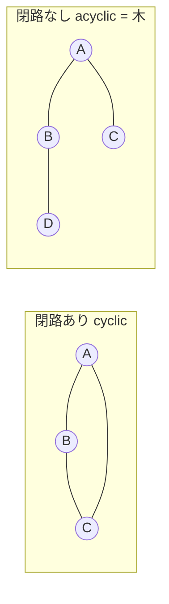
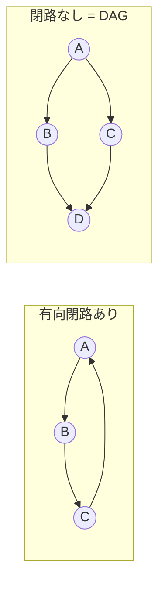
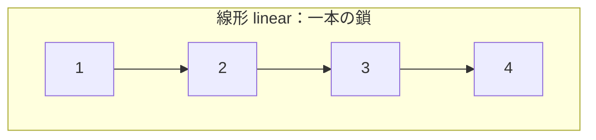
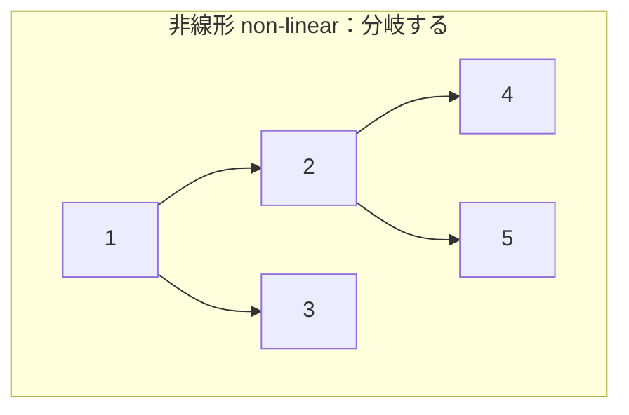

# AL-Foundational Q&A

[AL-Foundational](AL-Foundational.md) の内容について出た疑問と、その回答を記録するページ。質問するたびにここへ追記していく。

!!! info "使い方"
    - 古い質問が先頭（上）、最新が末尾（下）に並ぶ（新しいものを下に追記）。
    - 関連する用語メモへは本文中からリンクする。
    - 各 Q&A には日付と通し番号を付ける。

---

## Q1. 一覧の中で ADT にあたるものはどれ？ Dictionary だけ？ {#q1}

*(2026-06-04)*

**A.** Dictionary だけではない。[AL-Foundational](AL-Foundational.md#0) の一覧は「**ADT（仕様）**」と「**その実装にあたる具体構造**」が混在して並んでいる。

| 区分 | 一覧中の項目 |
|---|---|
| **ADT（操作で定義される仕様）** | **Dictionary/Map**、**Set**、**Stack**、**Queue / Deque**、**Priority Queue** |
| **具体的な実装（表現が決まっている構造）** | **Array**、**Linked list**、**Hash table**、**Heap**、**Trees: BST / AVL / Red-Black**、**Records/Structs/Tuples/Objects** |
| **中間（抽象構造＋具体表現が両方列挙）** | **Graph**（→ 隣接リスト / 隣接行列）、**Tree**（→ 二分・n分・探索木…）|

### ポイント：一覧には「ADT ↔ 実装」のペアが隠れている

CS2023 が Dictionary を ADT の例として**明示**しているだけで、操作で定義される他の型も ADT。むしろ同じ一覧の中に ADT とその実装が**両方**入っているのが要点。

- **Dictionary / Set**（ADT）↔ **Hash table** / **探索木**（実装）
- **Priority Queue**（ADT）↔ **Heap**（実装） ← 一覧6番「Heap-based priority queue」がまさにこれ
- **List / Sequence**（ADT）↔ **Array** / **Linked list**（実装）
- **Stack / Queue / Deque**（ADT、LIFO/FIFO の操作で定義）↔ Array や Linked list で実装

??? note "補足"
    - **Array** は「添字つき連続メモリ」という物理表現が決まっているので実装側。抽象側に対応するのは List/Sequence ADT。
    - **Stack / Queue** は教科書により「データ構造」とも「ADT」とも呼ばれるが、本質は**操作で定義される ADT**で、配列でも連結リストでも実装できる。
    - **Graph / Tree** は操作で見れば ADT 的だが、この一覧では具体表現（隣接リスト/行列、BST/AVL/heap）まで並ぶため中間に置いた。

関連: [ADT / 抽象データ型](AL-Foundational.md#0-基礎概念)

---

## Q2. Graph / Tree に対する ADT が要求する操作は？ {#q2}

*(2026-06-04)*

**A.** ADT の操作集合は教科書で多少異なるので「代表的なもの」として整理する。

### Graph ADT の操作

| 種別 | 操作 | 意味 |
|---|---|---|
| 構築・更新 | `addVertex(v)` / `removeVertex(v)` | 頂点の追加・削除 |
| | `addEdge(u, v)` / `removeEdge(u, v)` | 辺の追加・削除 |
| 問い合わせ | `hasEdge(u, v)` / `adjacent(u, v)` | u–v 間に辺があるか |
| | **`neighbors(v)`** | v に隣接する頂点の列挙（**最重要**）|
| | `vertices()` / `edges()` | 全頂点・全辺の列挙 |
| | `numVertices()` / `numEdges()` | 個数 |
| | `degree(v)`（有向なら `inDegree`/`outDegree`）| 次数 |
| 重み付き | `getWeight(u, v)` / `setWeight(u, v, w)` | 辺の重み |

**なぜこの操作群か**：一覧の **DFS/BFS・Dijkstra・Prim・Kruskal** はすべて「`neighbors(v)` で隣を辿り、必要なら `getWeight` を見る」だけで書ける。ADT がこれらを保証するから、アルゴリズムが実装（隣接リスト/行列）に依存せず書ける。

実装の違いは同じ操作の**計算量**に効く：

| 操作 | 隣接行列 | 隣接リスト |
|---|---|---|
| `hasEdge(u,v)` | O(1) | O(deg u) |
| `neighbors(v)` 列挙 | O(V) | O(deg v) |
| メモリ | O(V²) | O(V+E) |

### Tree ADT の操作 — 2つの見方がある

[Q1](#q1) で Tree を「中間」に置いたとおり、見方で ADT が変わる。

**(A) 一般の木（階層コンテナとしての Tree ADT）** — 構造をナビゲートする操作：

| 操作 | 意味 |
|---|---|
| `root()` | 根を返す |
| `parent(p)` | p の親 |
| `children(p)` / `numChildren(p)` | p の子の列挙・個数 |
| `isRoot(p)` / `isLeaf(p)` / `isInternal(p)` | 種別判定 |
| `size()` / `isEmpty()` | 要素数・空判定 |
| 走査 `preorder/postorder/BFS` | 全ノードを辿る |
| （二分木）`left(p)` / `right(p)` / `sibling(p)` / `inorder` | 左右の子・兄弟・中間順 |

**(B) 探索木（順序付き Dictionary としての見方）** — BST / AVL / Red-Black が実装するのはこちら：

| 操作 | 意味 |
|---|---|
| `insert(key)` / `find(key)` / `delete(key)` | 辞書操作（= Dictionary ADT）|
| `min()` / `max()` | 最小・最大キー |
| `successor(p)` / `predecessor(p)` | 次に大きい/小さいキー |
| `rangeSearch(lo, hi)` | 範囲検索 |

つまり **探索木 = Dictionary ADT に「順序つきの問い合わせ（min/max/successor/range）」を足したもの**。これが「Tree は中間」の正体：構造としては (A) の階層コンテナ、用途としては (B) の順序付き辞書。平衡木 (AVL/Red-Black) はこれら操作を **O(log n)** に保つ実装。

関連: [グラフと木](AL-Foundational.md#tree)、[Q1（ADT と実装の区別）](#q1)

---

## Q3. グラフの「閉路がある／ない」とはどういうこと？ {#q3}

*(2026-06-04)*

**A.** **閉路 (cycle) = ある頂点から出発し、辺をたどって元の頂点に戻ってこられる道**（同じ辺は二度通らない）。

- **閉路がある (cyclic)** = 「ぐるっと一周」できる道が少なくとも1つ存在する。
- **閉路がない (acyclic)** = どの頂点から出発しても、辺をたどって自分には戻れない。

### 有向 / 無向で定義が少し違う

**無向グラフ**：向きがないので辺をたどって戻れば閉路。ただし単純グラフでは**長さ3以上**が必要（A–B–A は同じ辺の往復なので閉路に数えない）。



**有向グラフ**：**矢印の向きに沿って**戻れる必要がある。A→B→C→A は閉路。向きが揃っていなければ閉路にならない。有向では自己ループ A→A（長さ1）や A→B→A（長さ2）も閉路になりうる。



### なぜこの区別が重要か

| 区別 | 重要な特殊形・帰結 |
|---|---|
| **無向・閉路なし・連結** | = **木 (tree)**。閉路なしだが非連結なら **森 (forest)** |
| **有向・閉路なし** | = **DAG（有向非巡回グラフ）**。依存関係・ビルド順・タスクスケジュール・git の履歴・式の計算順 |
| **トポロジカルソート** | **DAG のときだけ**可能（閉路があると「どちらが先か」決められない）|
| その他 | 閉路検出、最短経路での「負の閉路」問題、デッドロック検出（資源の循環待ち）|

直感的には、**閉路がある = 堂々巡りができる**／**閉路がない = 一方通行で必ず終点にたどり着く**。DAG の「依存関係を一列に並べられる（トポロジカルソート）」性質は、閉路がないからこそ成り立つ。

関連: [グラフと木](AL-Foundational.md#tree)、[トポロジカルソート](AL-Foundational.md#6-グラフアルゴリズム-graph-algorithms)

---

## Q4. 線形データ構造は、なぜ「線形」と呼ばれる？ {#q4}

*(2026-06-04)*

**A.** **要素が一直線（一列）に並ぶから**。厳密には：

> 線形データ構造 = **各要素が「直前の要素 (predecessor)」を高々1つ、「直後の要素 (successor)」を高々1つ**しか持たない構造。

要素同士の関係が**一本の鎖**になっていて「1番目・2番目・3番目…」と**一列に順序づけられる**（数学的には全順序 = **linear order / 線形順序**）。



これに対し **非線形 (non-linear)** な木・グラフは、1要素が複数とつながり**分岐・枝分かれ**する（1対多・多対多）ので「一列」にならない。



### 押さえておくべき2つの注意点

!!! warning "「線形」は論理的な並びの話。物理配置ではない"
    配列は連続メモリだが、**連結リストは物理的には飛び飛び**に置かれる。それでも「各ノードが前後1つずつ」という**論理的な隣接関係が一列**なので連結リストは線形。スタック・キュー・デックも同様にすべて線形。

!!! note "計算量の「線形 (linear time, O(n))」とは別概念"
    **線形探索 (linear search) の O(n)** は「実行時間が n に比例する」という**計算量**の話。**線形データ構造**の「線形」は**構造（並び方）**の話。言葉は同じでも指すものが違う。

ひとことで言えば **線形＝要素が一直線に連なる（分岐しない）**。この「分岐しない」が木・グラフとの本質的な違い。

関連: [線形データ構造](AL-Foundational.md#1-線形データ構造)、[グラフと木](AL-Foundational.md#tree)

---

## Q5. Record/Struct は「線形データ型」と呼ばれるが、各フィールドに順序性はある？ {#q5}

*(2026-06-04)*

**A.** まず前提の訂正：**Record/Struct は本来「線形データ構造」ではない**（複合データ型 = heterogeneous aggregate）。当メモが「1. 線形データ構造」節に同居させていたのが不正確だったので、[複合データ型の節](AL-Foundational.md#composite)へ分離した。CS2023 原文も線形/非線形の分類はしていない。

その上で「順序性」は **Tuple と Struct で答えが違う**。

| | アクセス方法 | 順序性 |
|---|---|---|
| **Tuple** | **位置（インデックス）** `t[0]`, `t[1]` | **あり（位置順）**。並べ替えると意味が変わる |
| **Record / Struct** | **名前** `p.name`, `p.age` | **論理的にはなし**（名前付きスロットの集合）。ただし宣言順・メモリ配置順はある |

### Struct の「順序」は2種類を区別する

- **論理的（意味的）な順序：ない**。フィールドは名前で引くので、宣言の順番を入れ替えても `p.name` は `p.name` のまま。「2番目のフィールド」を順に辿る線形的な使い方をしない（＝ predecessor/successor の鎖になっていない → [Q4](#q4) の「線形」の定義に当てはまらない）。
- **物理的（宣言順・メモリ配置順）な順序：ある**。C/C++/Rust/Go などでは構造体は宣言順にメモリ配置され、アライメントの padding が入る。これは `sizeof`・キャッシュ効率・シリアライズ・ABI に影響する。

!!! note "まとめ"
    - **Tuple = 順序つき**（位置で区別）→「線形っぽい」性質はある。
    - **Struct/Record = 名前つきスロットの集合**で意味的な並び順はない。物理レイアウトの順序はあるが、線形「データ構造」としての順序とは別物。
    - 線形（配列・リスト・スタック・キュー）は「**同種の要素を一列に並べて辿る**」、Struct は「**異種の値を名前で束ねる**」——目的が違う。

関連: [複合データ型](AL-Foundational.md#composite)、[Q4（なぜ「線形」と呼ぶか）](#q4)

---

## Q6. ハッシュ表の衝突対処（probing / chaining / rehash）で、insert・衝突時insert・find・delete はどう動く？ {#q6}

*(2026-06-04)*

**A.** まず3手法の性格づけが大事：

- **Chaining（連鎖法）**: 各スロットに連結リストをぶら下げ、衝突要素をそのリストに並べる。
- **Probing（オープンアドレス法）**: 要素は配列本体に置く。衝突したら**別の空きスロットを探索（probe）**して置く。
- **Rehash（リハッシュ）**: 上2つとは別レイヤー。**表が混んできたら（load factor 超過）大きい表を作り直し全要素を入れ直す**メンテ操作。「1回の衝突を解決する」手法ではなく「衝突を起きにくく保つ」仕組み。

### Chaining（連鎖法）

| 操作 | 挙動 |
|---|---|
| **insert（衝突なし）** | `i = h(key)`。スロット i の空リストにノード追加。O(1) |
| **insert（衝突）** | スロット i に既にリストあり → そのリストに追加（先頭挿入 prepend なら O(1)）。重複キー禁止なら追加前に走査確認 → O(L) |
| **find** | `i = h(key)` のリストを走査しキー一致を探す。なければ「なし」。O(1+L) |
| **delete** | `i = h(key)` のリストを走査し該当ノードを外す。**特別な工夫不要**（probing との大きな差）。O(1+L) |

L = 鎖の長さ。load factor α = n/m は **1 を超えてよい**（鎖が伸びるだけ）。性能 O(1+α)。

### Probing（オープンアドレス法）

probe 列の例：linear `h, h+1, h+2,…`／quadratic `h, h+1², h+2²,…`／double hashing `h1, h1+h2, h1+2·h2,…`（全て mod m）。

| 操作 | 挙動 |
|---|---|
| **insert（衝突なし）** | `i = h(key)` が空 → そこに置く。O(1) |
| **insert（衝突）** | i が別キーで埋まる → **probe 列に沿って次の空き（または墓標）を探し**、そこへ置く。途中で同一キーなら更新。O(1) 平均、α→1 で悪化 |
| **find** | h(key) から probe 列を辿りキー比較。一致で返す。**「未使用の空スロット」で「なし」と停止**。⚠️ **墓標（削除済み）では止まらず通過** |
| **delete** | ⚠️ **要注意**。単純に空にすると probe 連鎖が切れ、後続キーの find が手前で止まり誤判定。→ **墓標（tombstone / 遅延削除）でマーク**が定石。find は墓標を通過、insert は墓標を再利用。墓標が溜まったら rehash で掃除 |

load factor は **1 未満必須**。α→1 でクラスタリング悪化するため α ≈ 0.5〜0.75 で rehash。

??? example "linear probing の delete で墓標が要る理由（m=7, h(k)=k mod 7）"
    ```
    insert 10 (10%7=3)         → [3]=10
    insert 17 (17%7=3) 衝突    → [4]=17
    insert 24 (24%7=3) 衝突    → [5]=24
    （スロット: 3:10  4:17  5:24）

    find 24 : 3(10≠)→4(17≠)→5(24=) ✅ 見つかる

    delete 17 を「[4]を空にする」で行うと…
    find 24 : 3(10≠)→4(空→停止) ❌ 「なし」と誤判定！

    正しくは [4] を墓標(DELETED)に：
    find 24 : 3(10≠)→4(墓標→通過)→5(24=) ✅
    後の insert は [4] の墓標を再利用できる
    ```

### Rehash（表のリサイズ＆再配置）

| 操作 | 挙動 |
|---|---|
| **トリガ** | 主に **insert 時**に α = n/m が閾値超過で発動（find/delete では基本起きない。delete 時に縮小・墓標掃除する実装はある）|
| **やること** | より大きい新表（多くは約2倍・素数サイズ）を確保 → **全要素を新しい m で `h(key) mod m_new` を計算し直して挿入**。旧位置は捨てる |
| **コスト** | 1回 O(n)。倍々で増やすので **挿入1回あたり償却 O(1)**（動的配列の倍化と同じ）|
| **位置づけ** | 衝突“解決”ではなく **α を低く保って衝突自体を稀にする**。chaining でも probing でも使う |

!!! note "用語の注意"
    「rehashing」は文脈により **double hashing（2つ目のハッシュで probe 幅を決める probing の一種）** を指すこともある。CS2023 の一覧では probing・chaining と並ぶので、ここでは**表のリサイズ＆再配置**の意味で説明した。

### 計算量まとめ

| | 平均 insert/find/delete | 最悪 | load factor |
|---|---|---|---|
| Chaining | O(1+α) | O(n)（全部同じ鎖）| α>1 可 |
| Probing | O(1) 平均（α<1）| O(n)（クラスタ）| α<1 必須、~0.75で rehash |
| Rehash | 1回 O(n)／償却 O(1) | — | 閾値超過で発動 |

要点：**delete が一番性格差が出る**——chaining はリストから外すだけ、probing は墓標で probe 連鎖を守る必要。rehash は両者を支える土台で主に insert がトリガ。

関連: [ハッシュ表](AL-Foundational.md#2-連想集合の構造)

---

<!-- 新しい Q&A はこの下に追記する（古い順・最新が末尾）-->
