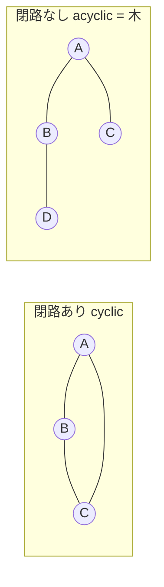
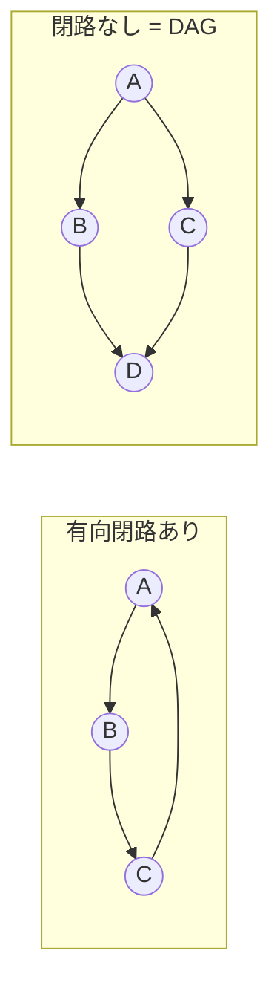

# AL-Foundational Q&A

[AL-Foundational](AL-Foundational.md) の内容について出た疑問と、その回答を記録するページ。質問するたびにここへ追記していく。

!!! info "使い方"
    - 最新の質問が先頭（上）に来るよう並べる（新しいものを上に追記）。
    - 関連する用語メモへは本文中からリンクする。
    - 各 Q&A には日付と通し番号を付ける。

---

<!-- 新しい Q&A はこの下に、最新を上にして追記する -->

## Q3. グラフの「閉路がある／ない」とはどういうこと？ {#q3}

*(2026-06-04)*

**A.** **閉路 (cycle) = ある頂点から出発し、辺をたどって元の頂点に戻ってこられる道**（同じ辺は二度通らない）。

- **閉路がある (cyclic)** = 「ぐるっと一周」できる道が少なくとも1つ存在する。
- **閉路がない (acyclic)** = どの頂点から出発しても、辺をたどって自分には戻れない。

### 有向 / 無向で定義が少し違う

**無向グラフ**：向きがないので辺をたどって戻れば閉路。ただし単純グラフでは**長さ3以上**が必要（A–B–A は同じ辺の往復なので閉路に数えない）。

**有向グラフ**：**矢印の向きに沿って**戻れる必要がある。A→B→C→A は閉路。向きが揃っていなければ閉路にならない。有向では自己ループ A→A（長さ1）や A→B→A（長さ2）も閉路になりうる。

### なぜこの区別が重要か

| 区別 | 重要な特殊形・帰結 |
|---|---|
| **無向・閉路なし・連結** | = **木 (tree)**。閉路なしだが非連結なら **森 (forest)** |
| **有向・閉路なし** | = **DAG（有向非巡回グラフ）**。依存関係・ビルド順・タスクスケジュール・git の履歴・式の計算順 |
| **トポロジカルソート** | **DAG のときだけ**可能（閉路があると「どちらが先か」決められない）|
| その他 | 閉路検出、最短経路での「負の閉路」問題、デッドロック検出（資源の循環待ち）|

直感的には、**閉路がある = 堂々巡りができる**／**閉路がない = 一方通行で必ず終点にたどり着く**。DAG の「依存関係を一列に並べられる（トポロジカルソート）」性質は、閉路がないからこそ成り立つ。

関連: [グラフと木](AL-Foundational.md#tree)、[トポロジカルソート](AL-Foundational.md#6-グラフアルゴリズム-graph-algorithms)

---

## Q2. Graph / Tree に対する ADT が要求する操作は？ {#q2}

*(2026-06-04)*

**A.** ADT の操作集合は教科書で多少異なるので「代表的なもの」として整理する。

### Graph ADT の操作

| 種別 | 操作 | 意味 |
|---|---|---|
| 構築・更新 | `addVertex(v)` / `removeVertex(v)` | 頂点の追加・削除 |
| | `addEdge(u, v)` / `removeEdge(u, v)` | 辺の追加・削除 |
| 問い合わせ | `hasEdge(u, v)` / `adjacent(u, v)` | u–v 間に辺があるか |
| | **`neighbors(v)`** | v に隣接する頂点の列挙（**最重要**）|
| | `vertices()` / `edges()` | 全頂点・全辺の列挙 |
| | `numVertices()` / `numEdges()` | 個数 |
| | `degree(v)`（有向なら `inDegree`/`outDegree`）| 次数 |
| 重み付き | `getWeight(u, v)` / `setWeight(u, v, w)` | 辺の重み |

**なぜこの操作群か**：一覧の **DFS/BFS・Dijkstra・Prim・Kruskal** はすべて「`neighbors(v)` で隣を辿り、必要なら `getWeight` を見る」だけで書ける。ADT がこれらを保証するから、アルゴリズムが実装（隣接リスト/行列）に依存せず書ける。

実装の違いは同じ操作の**計算量**に効く：

| 操作 | 隣接行列 | 隣接リスト |
|---|---|---|
| `hasEdge(u,v)` | O(1) | O(deg u) |
| `neighbors(v)` 列挙 | O(V) | O(deg v) |
| メモリ | O(V²) | O(V+E) |

### Tree ADT の操作 — 2つの見方がある

[Q1](#q1) で Tree を「中間」に置いたとおり、見方で ADT が変わる。

**(A) 一般の木（階層コンテナとしての Tree ADT）** — 構造をナビゲートする操作：

| 操作 | 意味 |
|---|---|
| `root()` | 根を返す |
| `parent(p)` | p の親 |
| `children(p)` / `numChildren(p)` | p の子の列挙・個数 |
| `isRoot(p)` / `isLeaf(p)` / `isInternal(p)` | 種別判定 |
| `size()` / `isEmpty()` | 要素数・空判定 |
| 走査 `preorder/postorder/BFS` | 全ノードを辿る |
| （二分木）`left(p)` / `right(p)` / `sibling(p)` / `inorder` | 左右の子・兄弟・中間順 |

**(B) 探索木（順序付き Dictionary としての見方）** — BST / AVL / Red-Black が実装するのはこちら：

| 操作 | 意味 |
|---|---|
| `insert(key)` / `find(key)` / `delete(key)` | 辞書操作（= Dictionary ADT）|
| `min()` / `max()` | 最小・最大キー |
| `successor(p)` / `predecessor(p)` | 次に大きい/小さいキー |
| `rangeSearch(lo, hi)` | 範囲検索 |

つまり **探索木 = Dictionary ADT に「順序つきの問い合わせ（min/max/successor/range）」を足したもの**。これが「Tree は中間」の正体：構造としては (A) の階層コンテナ、用途としては (B) の順序付き辞書。平衡木 (AVL/Red-Black) はこれら操作を **O(log n)** に保つ実装。

関連: [グラフと木](AL-Foundational.md#tree)、[Q1（ADT と実装の区別）](#q1)

---

## Q1. 一覧の中で ADT にあたるものはどれ？ Dictionary だけ？ {#q1}

*(2026-06-04)*

**A.** Dictionary だけではない。[AL-Foundational](AL-Foundational.md#0) の一覧は「**ADT（仕様）**」と「**その実装にあたる具体構造**」が混在して並んでいる。

| 区分 | 一覧中の項目 |
|---|---|
| **ADT（操作で定義される仕様）** | **Dictionary/Map**、**Set**、**Stack**、**Queue / Deque**、**Priority Queue** |
| **具体的な実装（表現が決まっている構造）** | **Array**、**Linked list**、**Hash table**、**Heap**、**Trees: BST / AVL / Red-Black**、**Records/Structs/Tuples/Objects** |
| **中間（抽象構造＋具体表現が両方列挙）** | **Graph**（→ 隣接リスト / 隣接行列）、**Tree**（→ 二分・n分・探索木…）|

### ポイント：一覧には「ADT ↔ 実装」のペアが隠れている

CS2023 が Dictionary を ADT の例として**明示**しているだけで、操作で定義される他の型も ADT。むしろ同じ一覧の中に ADT とその実装が**両方**入っているのが要点。

- **Dictionary / Set**（ADT）↔ **Hash table** / **探索木**（実装）
- **Priority Queue**（ADT）↔ **Heap**（実装） ← 一覧6番「Heap-based priority queue」がまさにこれ
- **List / Sequence**（ADT）↔ **Array** / **Linked list**（実装）
- **Stack / Queue / Deque**（ADT、LIFO/FIFO の操作で定義）↔ Array や Linked list で実装

??? note "補足"
    - **Array** は「添字つき連続メモリ」という物理表現が決まっているので実装側。抽象側に対応するのは List/Sequence ADT。
    - **Stack / Queue** は教科書により「データ構造」とも「ADT」とも呼ばれるが、本質は**操作で定義される ADT**で、配列でも連結リストでも実装できる。
    - **Graph / Tree** は操作で見れば ADT 的だが、この一覧では具体表現（隣接リスト/行列、BST/AVL/heap）まで並ぶため中間に置いた。

関連: [ADT / 抽象データ型](AL-Foundational.md#0-基礎概念)
