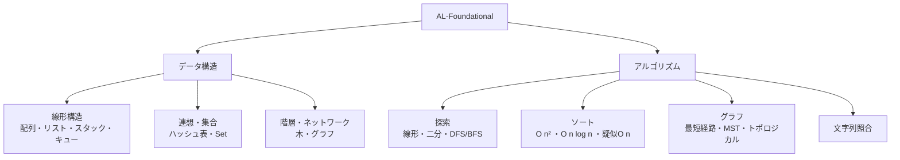
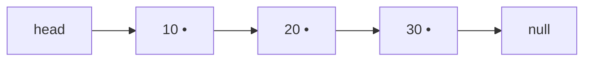
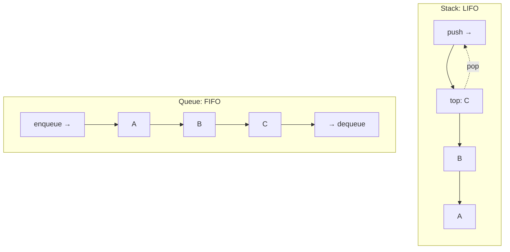
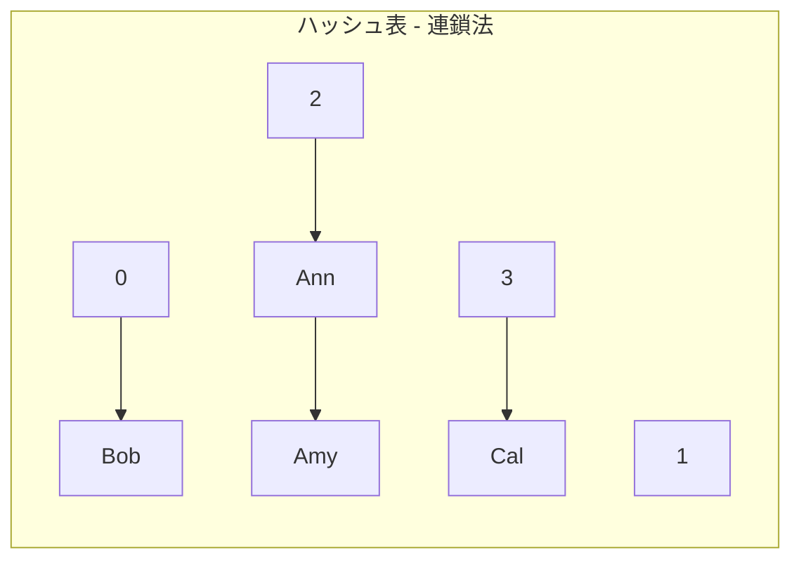
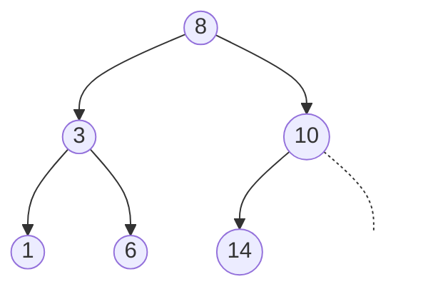
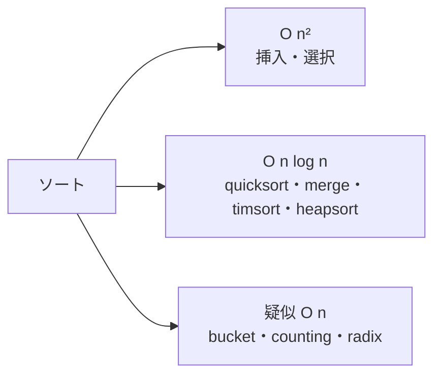

# AL-Foundational: 基礎的データ構造とアルゴリズム

CS2023 / Algorithmic Foundations (AL) の最初の Knowledge Unit「**AL-Foundational**（Foundational Data Structures and Algorithms）」に登場する用語を、意味・例・計算量つきで整理した学習メモ。

!!! info "出典・凡例"
    出典: `ComputerScienceCurricula2023.pdf` pp.88–89。
    **CS Core** = 全卒業生必須 / **KA Core** = 当該分野で必須 / **Non-core** = 発展。計算量の `n` は要素数。
    このユニットは **CS Core 11時間 + KA Core 6時間**（CS Core の11時間は SDF 側で計上する9時間・MSF 側の3時間とは別枠）。AL KA 全体では CS Core 32時間・KA Core 32時間で、AL-SEP の時間は SEP 側に含まれる——つまり**「全卒業生が必ず身につけるべきアルゴリズム知識」の3分の1が本ユニット**にある。

## 全体像 {#overview}

このユニットは「**データ構造**（データの入れ物）」と、その上で動く「**アルゴリズム**（探索・ソート・グラフ処理）」に大別される。



---

## 0. 基礎概念 {#basics}

### Abstract Data Type (ADT) / 抽象データ型

データの「振る舞い（どんな操作ができるか）」だけを規定し、内部の実装方法を隠した型。
**「何ができるか（インタフェース）」と「どう実装するか（配列か連結リストか）」を分離**する考え方。

- **操作 (operations)**: その ADT に定義された手続き。実装に依存しない。
- **Dictionary operations / 辞書操作**: `insert`（挿入）・`delete`（削除）・`find`（検索）の3つ。キーで値を出し入れする最も基本の ADT。ハッシュ表や二分探索木で実装する。

!!! note "ポイント：ADT は『仕様』、データ構造は『実装』"
    同じ Dictionary ADT でも、ハッシュ表なら平均 O(1)、二分探索木なら O(log n) と性能が変わる。

---

## 1. 線形データ構造 {#linear}

### Array / 配列

同じ型の要素を連続メモリに並べ、添字 (index) で **O(1) アクセス**できる構造。

- **Numeric vs non-numeric**: 数値配列か非数値か。**character string（文字列）** は文字の配列。
- **Single (vector) vs multidimensional (matrix)**: 1次元（ベクトル）か2次元以上（行列）か。

| 操作 | 計算量 |
|---|---|
| 添字アクセス | O(1) |
| 末尾追加（容量内） | O(1) |
| 途中挿入・削除 | O(n)（ずらしが必要）|

### Linked list / 連結リスト

各ノードが「値＋次ノードへのポインタ」を持ち、ポインタで連なる構造。連続メモリ不要で、**位置が分かっていれば途中挿入・削除が O(1)**（位置探索自体は O(n)）。



- **Single vs Double / 単方向 vs 双方向**: 次へのポインタだけか、前後両方を持つか。
- **Linear vs Circular / 線形 vs 循環**: 末尾が `null` か、先頭に戻って輪になるか。

??? note "補足：なぜ \"for historical reasons\" と書かれている？"
    原文は連結リストに "for historical reasons" と付記。キャッシュ効率の観点から実務では動的配列が優先されがちだが、ポインタ操作・再帰・他構造（スタック/キュー/木）の土台として概念理解が重要、という位置づけ。

### Stack / スタック

**LIFO（Last In First Out, 後入れ先出し）**。`push`（積む）/ `pop`（取り出す）。

### Queue / キュー、Deque / 両端キュー

- **Queue**: **FIFO（First In First Out, 先入れ先出し）**。`enqueue` / `dequeue`。BFS の探索順管理に使う。
- **Deque (double-ended queue)**: 両端から挿入・削除できるキュー。
- **Heap-based priority queue / 優先度付きキュー**: 要素に優先度を持たせ、常に最優先を取り出せるキュー。二分ヒープ実装で挿入・取り出し O(log n)。→ [Heap](#tree) 参照。



---

## 1b. 複合データ型（Records / Structs / Tuples / Objects） {#composite}

**異なる型の値を1つに束ねた複合データ**。線形構造（同種の要素を一列に並べて辿る）とは目的が異なり、**「異種の値を名前または位置でまとめる」**もの。厳密には線形データ構造ではない。

- **Record / Struct / レコード・構造体**: **名前付き**フィールドの集まり（例: `{name, age}`）。アクセスは名前で `p.name`。
- **Tuple / タプル**: **位置で順序付け**された値の組（例: `(x, y)`）。アクセスは位置で `t[0]`。
- **Object**: データに加えて振る舞い（メソッド）を持つ（→ FPL-OOP）。

!!! note "フィールドに順序はある？（→ [Q5](AL-Foundational-QA.md#q5)）"
    - **Tuple は順序つき**（位置で区別、並べ替えると意味が変わる）。
    - **Struct/Record は名前つきスロットの集合**で**意味的な順序はない**（宣言順を変えても `p.name` は同じ）。ただし C/Rust/Go 等では**宣言順のメモリ配置順**があり、`sizeof`・アライメント・シリアライズ・ABI に影響する（＝物理的な順序は存在）。

---

## 2. 連想・集合の構造 {#assoc-set}

### Hash table / Hash map / ハッシュ表

キーをハッシュ関数で配列の添字に変換し、**平均 O(1)** で `insert`/`find`/`delete` する Dictionary ADT の実装。

- **Collision / 衝突**: 異なるキーが同じ添字に当たること。
- **Collision resolution / 衝突解決**:
    - **Probing / オープンアドレス法**: 衝突したら別の空きスロットを探す（線形・二次探査など）。
    - **Chaining / 連鎖法**: 各スロットに連結リストをぶら下げて並べる。
    - **Rehash / リハッシュ**: 混んできたら大きな表に作り直し、全要素を入れ直す。



!!! warning "衝突回避 vs 衝突解決"
    **avoidance（回避）** = 良いハッシュ関数で衝突を起きにくくする工夫。**resolution（解決）** = 起きた衝突への対処。最悪は全衝突で O(n) に劣化する。

### Set / 集合

重複を許さず、所属（メンバーシップ）を問える構造。和・積・差などの集合演算を持つ。ハッシュ表や木で実装（→ MSF-Discrete）。

---

## 3. グラフと木 {#tree}

### Graph / グラフ

頂点 (vertex) と辺 (edge) で対象間の関係を表す構造。

- **directed / undirected（有向 / 無向）**: 辺に向きがあるか。
- **cyclic / acyclic（閉路あり / 非巡回）**: 戻る経路があるか。**DAG**（有向非巡回グラフ）は依存関係・スケジューリングで重要。
- **connected / unconnected（連結 / 非連結）**。
- **weighted / unweighted（重み付き / 重みなし）**: 辺にコスト（距離・費用）があるか。

=== "隣接リスト (adjacency list)"

    各頂点に「隣接頂点のリスト」を持つ。**疎なグラフで省メモリ**。

    ```
    A: [B, C]
    B: [A, D]
    C: [A, D]
    D: [B, C]
    ```

=== "隣接行列 (adjacency matrix)"

    頂点×頂点の表で辺の有無を保持。**密なグラフ向き**、辺の存在確認 O(1)。

    |   | A | B | C | D |
    |---|---|---|---|---|
    | A | 0 | 1 | 1 | 0 |
    | B | 1 | 0 | 0 | 1 |
    | C | 1 | 0 | 0 | 1 |
    | D | 0 | 1 | 1 | 0 |

### Tree / 木

閉路のない連結グラフ。1つの根 (root) から枝分かれする階層構造。

- **Binary / n-ary**: 子が最大2個 / 最大 n 個。
- **Search tree / 探索木**: 「左 < 親 < 右」の順序を保ち二分探索を可能にする木（二分探索木 BST）。



<figcaption>二分探索木 (BST)：左部分木 < 親 < 右部分木</figcaption>

- **Balanced tree / 平衡木**: 高さを O(log n) に保ち、操作を O(log n) に収める木。偏ると O(n) に劣化するのを防ぐ。
    - **AVL木**: 各ノードで左右の高さ差を ±1 以内に保つ。
    - **Red-Black tree / 赤黒木**: ノードに赤/黒を付け、色の規則で平衡を保つ。多くの言語の `map`/`set` の実装。
    - **Heap / ヒープ**: 「親 ≥ 子（または親 ≤ 子）」という **heap property（ヒープ条件）** を満たす完全二分木。最大/最小が根に来るので優先度付きキューに使う。挿入・取り出し O(log n)。

??? example "Max-Heap の例（親 ≥ 子）"
    ```mermaid
    graph TD
      A((50)) --> B((30))
      A --> C((40))
      B --> D((10))
      B --> E((20))
      C --> F((35))
    ```
    根に最大値 50。任意のノードはその子以上。

---

## 4. 探索アルゴリズム (Search) {#search}

| アルゴリズム | 計算量 | 条件・例 |
|---|---|---|
| 線形探索 (linear/sequential) | O(n) | 未整列でも可。先頭から順に比較 |
| 二分探索 (binary search) | O(log₂ n) | **ソート済み**配列。中央と比較し範囲を半分に |
| 木の探索 DFS/BFS（uninformed）| O(log_b n)〜O(V+E) | ヒューリスティックなしの素朴な探索 |

- **DFS (depth-first / 深さ優先)**: 行けるところまで深く進んでから戻る（スタック/再帰）。
- **BFS (breadth-first / 幅優先)**: 近い順に層ごとに広げる（キュー）。

---

## 5. ソートアルゴリズム (Sort) {#sort}

- **Stable / Unstable（安定 / 不安定）**: 同値要素の元の順序が保たれるか。複数キーのソートで安定性が効く。



??? note "代表的なソートの整理"
    | ソート | 平均計算量 | 安定 | メモ |
    |---|---|---|---|
    | 挿入ソート (insertion) | O(n²) | ○ | ほぼ整列済みで高速 |
    | 選択ソート (selection) | O(n²) | × | 毎回最小を選んで前へ |
    | クイックソート (quicksort) | O(n log n)（最悪 O(n²)）| × | ピボットで分割統治 |
    | マージソート (merge) | O(n log n) | ○ | 分割→併合、最悪も O(n log n) |
    | Timsort | O(n log n) | ○ | merge＋挿入。Python/Java 標準 |
    | ヒープソート (heapsort)[KA] | O(n log n) | × | in-place（追加メモリ不要）|
    | bucket / counting / radix[KA] | 疑似 O(n) | ○ | 比較せずキー値を利用。比較ソートの下限 O(n log n) を回避 |

---

## 6. グラフアルゴリズム (Graph algorithms) {#graph-algorithms}

- **Shortest path / 最短経路**
    - **Dijkstra's / ダイクストラ法**: 非負重みの単一始点最短経路。貪欲法。
    - **Floyd（Floyd–Warshall）**: 全頂点対間の最短経路。動的計画法、O(n³)。
- **Minimal spanning tree (MST) / 最小全域木**: 全頂点を最小総コストでつなぐ木。
    - **Prim's / プリム法**: 木を1頂点ずつ貪欲に成長。
    - **Kruskal's / クラスカル法**: 辺を軽い順に選び、閉路を作らないものを追加（Union-Find 利用）。
- **Transitive closure / 推移閉包**[KA]: 「A→B、B→C なら A→C」と到達可能性を全て求める（**Warshall's**）。
- **Topological sort / トポロジカルソート**[KA]: DAG の頂点を「依存先が先」に並べる。ビルド順・タスク順序付け。

---

## 7. 文字列照合 (Matching) [KA Core] {#matching}

- **Efficient string matching**: テキストからパターンを高速探索。
    - **Boyer-Moore**: 末尾から比較し、不一致時に大きくスキップ。
    - **Knuth-Morris-Pratt (KMP)**: 部分一致情報を前計算し後戻りなし、O(n+m)。
- **Longest common subsequence (LCS) / 最長共通部分列**: 2列に共通して現れる（連続でなくてよい）最長の並び。diff やバイオインフォで使用。動的計画法。
- **Regular expression matching / 正規表現照合**: 正規表現パターンへの合致判定。

---

## 8. 発展トピック (Non-core) {#advanced}

??? abstract "クリックで展開：暗号・並列・合意・量子・FFT・進化計算"
    - **Cryptography / 暗号アルゴリズム**: 例 **SHA-256**（任意長データを256ビット固定長に変換する暗号学的ハッシュ関数）。→ SEC-Crypto
    - **Parallel algorithms / 並列アルゴリズム**: 複数の計算資源で同時実行して高速化。→ PDC-Algorithms
    - **Consensus algorithms / 合意アルゴリズム**: 分散システムで全ノードが1値に合意。例 **Blockchain**。
        - **Proof of Work (PoW)**: 計算難題を解いた者が承認（電力消費大）。
        - **Proof of Stake (PoS)**: 保有量に応じ承認者を選ぶ（省エネ）。→ SEP-Sustainability
    - **Quantum computing algorithms / 量子アルゴリズム**
        - **Oracle 型**: Deutsch-Jozsa / Bernstein-Vazirani / Simon — 隠れた関数の性質を少ない問い合わせで判定。
        - **QFT による超多項式高速化**: **Shor**（素因数分解、RSA を脅かす）。
        - **振幅増幅による多項式高速化**: **Grover**（未整理探索を O(√n) に）。
    - **Fast-Fourier Transform (FFT) / 高速フーリエ変換**: 離散フーリエ変換を O(n log n) で計算。信号処理・多項式乗算に必須。
    - **Differential evolution / 差分進化**: 個体群を変異・交叉・選択で進化させ最適解を探すメタヒューリスティクス。

---

## まとめ：押さえるべき軸 {#summary}

1. **ADT（仕様）とデータ構造（実装）の区別** — 同じ操作でも実装で計算量が変わる。
2. **線形構造と非線形構造（木・グラフ）の使い分け**。
3. **計算量クラスで探索・ソートを整理** — O(1) / O(log n) / O(n) / O(n log n) / O(n²)。
4. **分割統治・貪欲・動的計画法** がアルゴリズムの背後にある（→ 次ユニット **AL-Strategies**）。

!!! question "理解度チェック"
    - [ ] ADT とデータ構造の違いを一言で説明できる
    - [ ] ハッシュ表の衝突解決を3つ挙げられる
    - [ ] 二分探索が O(log n) になる理由を説明できる
    - [ ] 安定ソートと不安定ソートの違いと、それが効く場面を言える
    - [ ] ダイクストラ法とクラスカル法がそれぞれ何を求めるか言える

---

## 学習成果（Illustrative Learning Outcomes） {#learning-outcomes}

CS Core:

| # | 学習成果 | 本文の対応節 |
|---|---|---|
| 1 | 本ユニットの各 **ADT／データ構造**について、定義・性質・表現方法・付随する ADT 操作を説明でき、各操作が構造をどう変化させるかを手順を追って説明できる。 | [§0](#basics)・[§1](#linear)・[§1b](#composite)・[§2](#assoc-set)・[§3](#tree) |
| 2 | 本ユニットの各**アルゴリズム**について、どう動作するかを手順を追って説明できる。 | [§4](#search)・[§5](#sort)・[§6](#graph-algorithms) |
| 3 | 本ユニットの各**アルゴリズム的アプローチ**（例: ソート）について、その典型例（例: マージソート）を適用できる。 | [§4](#search)・[§5](#sort)・[§6](#graph-algorithms) |
| 4 | 問題の要件が与えられたとき、**複数のデータ構造・アルゴリズムで解を作り**、適合性・長所・短所を評価したうえで、要件を最もよく満たすものを選べる。 | [まとめ](#summary)・[AL-Strategies 実戦](AL-Strategies.md#paradigm-selection) |
| 5 | ハッシュ表における**衝突回避と衝突解決**の扱い方を説明できる。 | [§2](#assoc-set) |
| 6 | 計算効率**以外**にアルゴリズム選択を左右する要因——実装にかかる時間、保守性、入力データに固有のパターンの利用——を説明できる。 | [§5](#sort) |
| 7 | **ヒープ条件**と、**優先度付きキューの実装としてのヒープ**の使い方を説明できる。 | [§1](#linear)・[§3](#tree) |

KA Core:

| # | 学習成果 | 本文の対応節 |
|---|---|---|
| 8 | KA Core トピックの各アルゴリズム・アプローチについて、典型例を挙げ、その動作を手順を追って説明できる。 | [§7](#matching)・[§5](#sort) と [§6](#graph-algorithms) の `[KA]` 印の項目 |

Non-core:

| # | 学習成果 | 本文の対応節 |
|---|---|---|
| 9 | **量子計算**とその特定問題への応用について、その意義を理解している。 | [§8](#advanced) |

!!! tip "学習成果6には単独の節がない"
    「計算効率以外の選択要因」は本文の各所に散っている——挿入ソートと Timsort の「ほぼ整列済みで高速」（§5）は**入力データ固有のパターンを利用する**例そのもので、Python や Java が Timsort を標準実装に選んでいることは**実装時間と保守性を買う**判断にあたる。問われたら「速さだけで選ばない理由」を、この具体例に落として答えるとよい。

## 前後のユニット {#related-units}

- 前: なし（AL Knowledge Area の最初のユニット）
- 次: [AL-Strategies](AL-Strategies.md) — アルゴリズム戦略（本ユニットで覚えた個々のアルゴリズムを「どのパラダイムか」で括り直す）
- 関連する他 KA:
    - [OS-Scheduling §2](../OS/OS-Scheduling.md#policies) — 優先度付きキュー（§1・§3）は、OS の優先度スケジューラの中でそのまま動いている。
    - [OS-Memory §5](../OS/OS-Memory.md#allocators) — フリーリストは連結リスト（§1）の応用。空きブロックをどう並べ、どう探すかがアロケータの性能を決める。

疑問が出たら [AL-Foundational Q&A](AL-Foundational-QA.md) に記録する。理解度の評価は [AL-Foundational 採点記録](AL-Foundational-Quiz.md) に残す。
