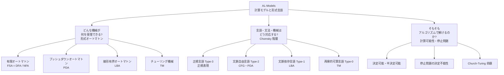
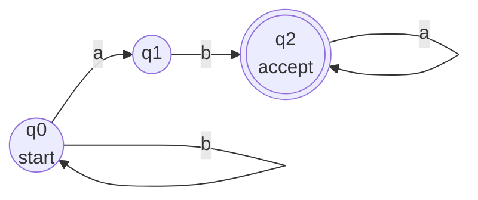
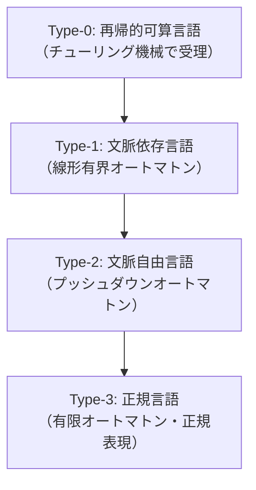

# AL-Models: 計算モデルと形式言語

CS2023 / Algorithmic Foundations (AL) の4つ目の Knowledge Unit「**AL-Models**（Computational Models and Formal Languages）」を整理した学習メモ。**形式オートマトン（機械）**と**形式言語（何を受理できるか）**、そして「**そもそもアルゴリズムで解けるのか**（計算可能性）」を扱うユニット。

!!! info "出典・凡例"
    出典: `ComputerScienceCurricula2023.pdf` pp.93–95。
    **CS Core** = 全卒業生必須 / **KA Core** = 当該分野で必須 / **Non-core** = 発展。
    [AL-Complexity §6](AL-Complexity.md) の P/NP/チューリング機械モデルは、このユニットの形式言語理論の上に立っている。両方合わせると計算量理論の全体像が見える。
    このユニットは **CS Core 9時間 + KA Core 23時間**（AL KA の KA Core 32時間のうち7割を占める、計算理論の中核ユニット）。KA Core の23時間は、計算理論を独立科目として置く場合を想定した配分——§7 以降の分量がそのまま反映されている。

## 全体像 {#overview}

このユニットは大きく **3 つの問い** に分かれる。

---

## 1. 形式オートマトン {#formal-automata}

「**どんな入力列を受理できるか**」という能力が異なる 4 種の機械。下に行くほど能力が高く、上のクラスをすべて含む（包含関係）。

| オートマトン | 記憶機構 | 受理する言語クラス |
|---|---|---|
| **有限オートマトン (FSA)** | なし（状態のみ） | 正規言語（Type-3） |
| **プッシュダウンオートマトン (PDA)** | スタック | 文脈自由言語（Type-2） |
| **線形有界オートマトン (LBA)** | テープ（入力長に比例） | 文脈依存言語（Type-1） |
| **チューリング機械 (TM)** | 無限テープ | 再帰的可算言語（Type-0） |

### 1a. 有限オートマトン (Finite State Automaton / FSA)

状態の有限集合と入力記号を受けて次状態へ遷移する機械。**記憶を持たない**（スタックも追加メモリもない）。

- **DFA（決定性有限オートマトン）**: 各状態×入力記号に対し**遷移先が一意に定まる**。
- **NFA（非決定性有限オートマトン）**: 同じ状態×入力記号から**複数の遷移先**、または ε（空）遷移が許される。**DFA と等価**（どちらも正規言語を受理する）。

*例：「ab で終わる」言語を受理する DFA のイメージ（記憶は今の状態だけ）。*

!!! note "DFA と NFA の等価性"
    NFA は直感的に設計しやすい。**サブセット構成法（Powerset Construction）** で NFA を等価な DFA に変換できる。状態数は最大 2ⁿ に爆発するが、受理する言語クラスは変わらない（→ KA §7・学習成果11・15）。

### 1b. プッシュダウンオートマトン (Pushdown Automaton / PDA)

**スタック**付き有限オートマトン。スタックに積んで取り出すことで「**バランスを覚える**」ことができる。

- 例：`{aⁿbⁿ | n ≥ 0}` は DFA では受理不可（カウントできない）だが PDA は受理できる。
- **非決定性 PDA と CFG は等価**（→ §3・学習成果15）。

### 1c. 線形有界オートマトン (Linear-Bounded Automaton / LBA)

入力テープの長さに**比例した領域だけ**使えるチューリング機械。文脈依存言語（Type-1）に対応する。

### 1d. チューリング機械 (Turing Machine / TM)

**無限テープ**を読み書きし、左右に動く「ヘッド」を持つ最も一般的な計算モデル。

- **決定的 TM (DTM)**: 各状態×テープ記号に対し遷移が一意。
- **非決定的 TM (NTM)**: 複数の遷移が許される（→ KA §13）。
- **万能チューリング機械 (UTM)**: 任意の TM の記述を入力として受け取り、その TM をシミュレートする TM（学習成果6）。「**プログラムがデータになれる**」現代計算機の理論的根拠。

!!! note "AL-Complexity との接続"
    AL-Complexity §10（チューリング機械ベースの計算量）で登場した P・NP・PSPACE は、このユニットのチューリング機械の**形式的定義の上**で定義されている。[AL-Complexity §10](AL-Complexity.md) と組み合わせて読むと体系がつながる。

---

## 2. 形式言語・文法・Chomsky 階層 {#chomsky-hierarchy}

Noam Chomsky が提案した言語クラスの階層。**型番が小さいほど能力が高い（大きな言語クラス）**。

*矢印の方向が「包含される（小さい）」方向。正規言語 ⊂ 文脈自由言語 ⊂ 文脈依存言語 ⊂ 再帰的可算言語。*

### 2a. 正規言語 (Type-3) と正規表現

**有限オートマトン**で受理できる言語。**正規表現 (Regular Expression)** で記述できる。

- 正規表現の基本演算：文字の**連接** (concatenation)・**和** (union `|`)・**クリーネスター** (Kleene star `*`)。
- 例：`(a|b)*ab` = 任意の a, b の列で終わりが "ab" のもの。

!!! warning "プログラミングの正規表現とは別物（学習成果4）"
    Python/JavaScript 等で使う「正規表現」は、先読み・後読み・後方参照などを含むため**Type-2（文脈自由）の能力を一部持つ**。理論上の「正規表現（Type-3 acceptors）」と混同しないこと。CS2023 原文でも "the regular expressions used in programming languages (Type-2 acceptors)" として区別している。

### 2b. 文脈自由言語 (Type-2) と CFG

**文脈自由文法 (Context-Free Grammar / CFG)** で生成できる言語。**非決定性 PDA** で受理できる。

- CFG の構成要素：終端記号・非終端記号・生成規則 (`A → α`)・開始記号。
- **導出木 (parse tree)**：文を CFG でどう導出したかを木で可視化。コンパイラの構文解析の理論的基礎（→ FPL-Translation, FPL-Syntax）。
- 例：四則演算の式、プログラミング言語の構文。

### 2c. 文脈依存言語 (Type-1)

生成規則の左辺が文脈（前後の記号）を含む（`αAβ → αγβ`）。自然言語の一部がここに属す。

### 2d. 再帰的可算言語 (Type-0)

チューリング機械が**停止して受理**する言語。「**半決定可能**」とも呼ばれる（受理は保証、拒否は永久ループになりうる）。

---

## 3. オートマトン・言語・文法の対応関係 {#relations}

Chomsky 階層の各段には対応する「機械（オートマトン）」と「文法型」がある。

| 文法型 | 言語クラス | 対応オートマトン | 代表例 |
|---|---|---|---|
| Type-3 正規文法 | 正規言語 | 有限オートマトン (DFA/NFA) | `(a|b)*a`、IPアドレスの形式チェック |
| Type-2 文脈自由文法 | 文脈自由言語 | プッシュダウンオートマトン (PDA) | 四則演算の式、HTML の入れ子 |
| Type-1 文脈依存文法 | 文脈依存言語 | 線形有界オートマトン (LBA) | 自然言語の一部 |
| Type-0 制約なし文法 | 再帰的可算言語 | チューリング機械 (TM) | 停止する TM が受理するもの全て |

!!! tip "重要な等価性（学習成果15）"
    - **DFA ≡ NFA ≡ 正規表現**：相互変換可能。どれも正規言語を過不足なく表現する。
    - **CFG ≡ PDA（非決定性）**：文脈自由文法と非決定性 PDA は等価。

---

## 4. 決定可能性・計算不能性・停止 {#decidability}

「**アルゴリズムが存在するか**」の話。AL-Complexity §6 の P vs NP は「**解けるが速くない**」問題の話だったが、このユニットは「**そもそも解けるか**」まで踏み込む。

### 4a. 決定可能性の分類

| 区分 | 定義 | 例 |
|---|---|---|
| **決定可能 (Decidable)** | 必ず停止して Yes/No を答えるアルゴリズムが存在する | DFA の受理判定、正規言語の空語問題 |
| **半決定可能 (Semi-decidable)** | Yes なら停止するが、No の場合は永久ループになる可能性がある | 停止問題の「受理」側 |
| **決定不能 (Undecidable)** | いかなるアルゴリズムも存在しない | **停止問題**、Rice の定理が対象とする問題群 |

### 4b. 停止問題 (Halting Problem)

「**任意のプログラム P と入力 I を受け取り、P(I) が停止するか否かを判定する**」問題。

!!! danger "停止問題は決定不能（チューリング 1936）"
    どんなアルゴリズムを作っても、「あらゆるプログラムについて停止するかを正しく判定」はできない。証明のアイデアは**対角化 (diagonalization)**（→ KA §9）:

    1. 「停止判定機 H が存在する」と仮定する。
    2. H を使って「自分自身を受け取ると逆の動作をする」機械 D を構成できる。
    3. D を D 自身に適用すると矛盾が生じる → H は存在しない。

!!! note "実務への含意（学習成果7・8）"
    「すべてのバグを検出する完全な静的解析ツールは作れない」は停止問題の帰結。テスト・静的解析・型検査がある種の問題を**必ず完全には検出できない**理由の根本がここにある。

### 4c. 古典的な計算不能問題

- **停止問題 (Halting Problem)**：プログラムが停止するかを判定できない。
- **ポスト対応問題 (Post Correspondence Problem)**：文字列の組み合わせが一致するかを判定できない。
- **Rice の定理**：「チューリング機械が計算する関数の非自明な性質」はすべて決定不能（学習成果16）。

---

## 5. Church-Turing 命題 {#church-turing}

!!! quote "Church-Turing 命題（学習成果9）"
    **「アルゴリズム的に計算できるもの」と「チューリング機械が計算できるもの」は同じ。**

- これは「定理（証明された命題）」ではなく「**命題（科学的合意に基づく信念）**」。反例は今のところ見つかっていない。
- 意義：「チューリング機械で解けない = アルゴリズム解なし」と安心して言える根拠。どんな現実の計算機・プログラミング言語も、TM と等価な計算能力しか持たない。

!!! note "等価なモデル（KA §13）"
    Lambda 計算 (λ-calculus)・μ再帰関数・多テープ TM など、見た目が全く異なる計算モデルが全て TM と等価。これが Church-Turing 命題の傍証。

---

## 6. アルゴリズムの正当性：不変条件 {#invariants}

ループや再帰が「正しく動く」ことを**形式的に証明**するための道具（学習成果10）。

- **ループ不変条件 (loop invariant)**：ループの各反復の**前後で常に成り立つ**性質。**初期化・維持・終了** の 3 ステップで証明する。
  - 例：挿入ソートの「左側の部分配列は常にソート済み」。
- **再帰の不変条件**：再帰呼び出しの各段で成り立つ性質（帰納法で証明）。
- **木探索の不変条件**：探索の各ステップで「未探索ノード集合が縮小し、答えが残っている」など。

!!! tip "実務でのループ不変条件"
    コードの `assert` やコメントで不変条件を明示する習慣は、バグの早期発見と仕様の理解に直結する。形式検証ツール（Coq, Lean, Dafny 等）ではこれを機械的に検査できる。

---

## KA Core {#ka-core}

ここからは当該分野で必須の発展トピック。

## 7. 決定性と非決定性オートマトン {#determinism}

| | DFA | NFA |
|---|---|---|
| 遷移 | 状態 × 入力 → **1つ**の次状態 | 状態 × 入力 → **複数** or ε 遷移 |
| 設計 | 完全だが煩雑 | 簡潔・直感的 |
| 変換 | — | **サブセット構成**で DFA へ（状態数最大 2ⁿ） |
| 受理言語 | 正規言語 | 正規言語（**同じ！**） |

PDA でも同様：非決定性 PDA（文脈自由言語）> 決定性 PDA（決定性文脈自由言語 ⊂ 文脈自由言語）。TM については非決定性 TM と決定性 TM は計算能力が**等価**（ステップ数は指数的に増える可能性あり → §11）。

## 8. ポンピング補題 {#pumping-lemma}

あるクラスの言語が**実は正規言語（または文脈自由言語）でない**ことを証明するツール（学習成果12）。

!!! note "正規言語のポンピング補題"
    正規言語 L に対し、定数 p（ポンピング長）が存在し、L の任意の長さ p 以上の文字列 s は `s = xyz` と分解でき:

    - |y| ≥ 1、|xy| ≤ p
    - 任意の k ≥ 0 で `xyᵏz ∈ L`

    これが**成り立たない**ことを示すことで「L は正規言語でない」と証明できる。例：`{aⁿbⁿ | n ≥ 0}` は正規言語でない。

!!! note "文脈自由言語のポンピング補題"
    CFG にも同様の補題がある。`{aⁿbⁿcⁿ | n ≥ 0}` は CFL でない（PDA のスタックは 1 つしかなく、2 種のカウンターを同時に保持できない）。

## 9. 決定可能性：算術化と対角化 {#arithmetization}

**停止問題の決定不能性**の正式な証明テクニック（学習成果13）。

- **算術化 (Arithmetization / Gödel Numbering)**：TM の記述（プログラム）を自然数にエンコードする。「TM 自体がデータになれる」という万能 TM・停止問題の議論の形式的基盤。
- **対角化 (Diagonalization)**：カントールが無限集合の濃度比較に用いた手法を計算可能性理論に適用。「自分自身に関して問いかけるとき矛盾が生じる」構造で決定不能性を証明（§4b）。

## 10. 帰着と還元 {#reducibility}

**未知の問題 B の計算不能性** を、**既知の計算不能問題 A（例：停止問題）から B への変換**（帰着）で証明する（学習成果14・17）。

!!! note "マッピング還元（多対一還元）"
    「A を B に多項式時間で帰着できる = A ≤ B」なら、**B が決定可能なら A も決定可能**（対偶：A が決定不能なら B も決定不能）。矢印の向きは AL-Complexity §6c の帰着と同じ発想。

!!! warning "帰着の 2 つの使い道"
    - **AL-Complexity §6c**：帰着 → NP完全性の証明（計算量的な難しさ）
    - **AL-Models（ここ）**：帰着 → 計算不能性の証明（アルゴリズムが存在しないこと）

    「難しさ・不能性を移し替える道具」という本質は同じ。矢印の方向の読み方も同じ。

## 11. チューリング機械に基づく時間計算量 {#time-complexity-tm}

[AL-Complexity §10](AL-Complexity.md) の形式的基礎。P・NP・EXP は TM の動作ステップ数で定義される。

- **P**：決定的 TM が多項式ステップで判定する言語クラス。
- **NP**：非決定的 TM が多項式ステップで受理する言語クラス。
- **EXP**：決定的 TM が指数ステップで判定する言語クラス。
- DTM で NTM をシミュレートするとステップ数が指数倍になりうる（P vs NP 未解決の核心）。

## 12. 空間計算量 {#space-complexity}

- **PSPACE**：決定的 TM が多項式**テープ領域**で判定する言語クラス。
- **NPSPACE**：非決定的 TM の多項式領域版。
- **Savitch の定理**：`NPSPACE(f) ⊆ DSPACE(f²)`。非決定性の空間的威力は 2 乗で決定的 TM に抑えられる（[AL-Complexity §10b](AL-Complexity.md) で既出）。
- 包含関係：**P ⊆ NP ⊆ PSPACE ⊆ EXP**（どこが真の包含かはほぼ未解決）。

## 13. アルゴリズム計算の等価モデル {#equivalent-models}

Church-Turing 命題（§5）の傍証となる、互いに等価な計算モデル群（学習成果18・19）。

### 13a. チューリング機械の変形

- **多テープ TM**：テープが複数あるが、1 テープ TM に多項式時間でシミュレートできる。
- **非決定的 TM (NTM)**：計算能力は決定的 TM と等価（時間は指数倍になりうる）。
- **万能 TM (UTM)**：任意 TM の記述を入力として実行（§1d）。

### 13b. Lambda 計算 (λ-Calculus)

- Church が提案した、**関数定義と適用**だけで計算を表現するモデル（→ FPL-Functional）。
- 基本操作：**α変換**（変数の名前替え）・**β還元**（関数適用 = 引数を本体に代入）（学習成果19）。
- 現代の関数型言語（Haskell, ML, Lisp）の理論的祖先。TM と計算能力が等価。

### 13c. μ再帰関数 (Mu-Recursive Functions)

- **原始再帰関数**（零関数・後継関数・射影・合成・原始再帰）に **μ演算子**（最小化）を加えた関数クラス（学習成果18）。
- TM と計算能力が等価。どんな計算可能関数もこれで表せる。

---

## まとめ：計算モデルと形式言語 早見表 {#summary}

| 概念 | 一言で | キーワード |
|---|---|---|
| 有限オートマトン (DFA/NFA) | **状態だけ**で受理 | 等価・サブセット構成 |
| PDA | **スタック付き** FA | CFG と等価 |
| TM | **無限テープ** | 最も強力・Church-Turing の基準 |
| Chomsky 階層 | **Type 0–3** の言語の入れ子 | 高い型番 = 小さいクラス |
| 正規言語 | **正規表現・DFA/NFA** | ポンピング補題で限界を証明 |
| 文脈自由言語 | **CFG・PDA** | 構文解析の基礎 |
| 決定可能 | **必ず停止**して Yes/No | 正規言語の問題は全て決定可能 |
| 半決定可能 | Yes なら停止、No は不明 | 再帰的可算言語 |
| 決定不能 | **アルゴリズムが存在しない** | 停止問題・Rice の定理 |
| 停止問題 | **対角化**で決定不能を証明 | チューリング 1936 |
| Church-Turing 命題 | 計算可能 ≡ TM で計算可能 | 命題（定理ではない） |
| ポンピング補題 | 正規/CFL でないことを**証明** | 矛盾の導出 |
| 帰着（還元） | 難しさ・不能性を**移し替える** | [AL-Complexity §6c](AL-Complexity.md) と同じ発想 |
| λ計算・μ再帰関数 | TM と**等価**な別モデル | Church-Turing の傍証 |

!!! question "理解度チェック"
    - [ ] 4 種のオートマトン（FSA/PDA/LBA/TM）それぞれの「記憶機構」と「受理できる言語クラス」を対応づけられる（学習成果1）
    - [ ] DFA と NFA が等価であること、およびサブセット構成法の概要を説明できる（学習成果11）
    - [ ] Chomsky 階層の 4 段（Type 0–3）を「機械・文法・言語例」で説明できる（学習成果5）
    - [ ] プログラミング言語の正規表現が理論上の正規表現（Type-3）と異なる理由を説明できる（学習成果4）
    - [ ] 万能チューリング機械 (UTM) を説明できる（学習成果6）
    - [ ] 停止問題が決定不能である理由を対角化の概念で説明できる（学習成果7）
    - [ ] Church-Turing 命題とその意義を説明できる（学習成果9）
    - [ ] ループ不変条件を使ったアルゴリズムの正当性証明の手順（初期化・維持・終了）を説明できる（学習成果10）
    - [ ] 正規言語のポンピング補題を使って「`{aⁿbⁿ}` は正規言語でない」を示せる（学習成果12）
    - [ ] 帰着（マッピング還元）を使って既知の計算不能問題から別の問題の計算不能性を証明する手順を説明できる（学習成果14）
    - [ ] DFA・NFA・正規表現・PDA・CFG 相互の変換ができる（学習成果15）
    - [ ] Rice の定理とその意義を説明できる（学習成果16）
    - [ ] λ計算の α変換・β還元を説明できる（学習成果19）

---

## 学習成果（Illustrative Learning Outcomes） {#learning-outcomes}

CS Core:

| # | 学習成果 | 本文の対応節 |
|---|---|---|
| 1 | 本ユニットの各**形式オートマトン**について、他のオートマトンと特徴を比較しながら定義を説明でき、例を使って入力への動作と受理／不受理を手順を追って説明でき、受理できる入力とできない入力の例を挙げられる。 | [§1](#formal-automata)・[§3](#relations) |
| 2 | 問題が与えられたとき、それに対応する**適切なオートマトンを構成**できる。 | [§1](#formal-automata)・[§3](#relations) |
| 3 | 自然言語で表現された正規言語に対して、**正規表現を書ける**。 | [§2](#chomsky-hierarchy) |
| 4 | 理論上の**正規表現（Type-3 acceptors）とプログラミング言語の正規表現（Type-2 acceptors）の違い**を説明できる。 | [§2](#chomsky-hierarchy) |
| 5 | 本ユニットの各**形式モデル（言語・文法）**について、他と特徴を比較しながら定義を説明でき、その言語・文法が受理できる／できない入力の例を説明できる。 | [§2](#chomsky-hierarchy)・[§3](#relations) |
| 6 | **万能チューリング機械 (UTM)** とその動作を説明できる。 | [§1](#formal-automata) |
| 7 | 「すべてのプログラムについて無限ループの有無を検査するプログラムは作れない」ことを、**停止問題**・アルゴリズム的解が存在しない理由・現実の計算にとっての意義とともに、同僚や管理職に向けて説明できる。 | [§4](#decidability) |
| 8 | **古典的な計算不能問題**の例を説明できる。 | [§4](#decidability) |
| 9 | **Church-Turing 命題**とその意義を説明できる。 | [§5](#church-turing) |
| 10 | **（ループ）不変条件**を使ってアルゴリズムの正当性を証明する方法を説明できる。 | [§6](#invariants) |

KA Core:

| # | 学習成果 | 本文の対応節 |
|---|---|---|
| 11 | 本ユニットの各形式オートマトンについて、**決定性と非決定性の能力**を比較・対照して説明できる。 | [§7](#determinism) |
| 12 | **ポンピング補題**（または代替手段）を適用して、有限オートマトンとプッシュダウンオートマトンの限界を証明できる。 | [§8](#pumping-lemma) |
| 13 | **算術化と対角化**を適用して、チューリング機械の停止問題が決定不能であることを証明できる。 | [§9](#arithmetization) |
| 14 | 既知の決定不能言語が与えられたとき、**写像帰着や計算履歴**を使って別の言語の決定不能性を証明できる。 | [§10](#reducibility) |
| 15 | 同等の能力を持つ表記法どうし——DFA・NFA・正規表現の間、および PDA と CFG の間——を**相互に変換**できる。 | [§3](#relations)・[§7](#determinism) |
| 16 | **Rice の定理**とその意義を説明できる。 | [§4](#decidability) |
| 17 | 既知の計算不能問題からの**帰着による計算不能性の証明例**を説明できる。 | [§10](#reducibility) |
| 18 | **原始再帰関数と一般再帰関数**（zero・successor・selection・原始再帰・合成・μ）とその意義、チューリング機械での実装を説明できる。 | [§13](#equivalent-models) |
| 19 | **λ計算**での計算の進み方（α変換・β還元）を説明できる。 | [§13](#equivalent-models) |

Non-core:

| # | 学習成果 | 本文の対応節 |
|---|---|---|
| 20 | 量子系について、**量子力学の4公準**（状態空間・状態発展・状態合成・状態測定）を例で説明できる。 | 本文に対応節なし（[AL-Foundational §8](AL-Foundational.md#advanced) の量子アルゴリズムが最も近い） |
| 21 | 行列と列ベクトルで表した量子ビットに対する **XNOT / CNOT ゲート**の動作を説明できる。 | 本文に対応節なし（同上） |

!!! tip "学習成果7は「説明の相手」まで指定されている"
    原文は "Present to an audience of co-workers and managers" ——つまり**対角化の証明を書け**ではなく、**非技術者に停止問題の帰結を納得させろ**という設問である。「検査プログラム H があると仮定 → H を逆手に取るプログラム D を作れる → D 自身を D に食わせると矛盾」という3段の背理法を、コードを書かずに日常語で言い切れるかが分かれ目。§4b の議論をそのまま口頭で再現する練習をしておくとよい。

## 前後のユニット {#related-units}

- 前: [AL-Complexity](AL-Complexity.md) — 計算量（§11・§12 は AL-Complexity §10 のチューリング機械ベースの計算量モデルと同じ内容を、機械の側から見たもの）
- 次: AL-SEP — 社会・倫理・専門性（未作成。時間は SEP 側に計上される）
- 関連する他 KA:
    - [OS-Protection §4](../OS/OS-Protection.md#mitigations) — 「すべてのプログラムを完全に検査するプログラムは存在しない」（§4）ことが、OS のセキュリティが**完全な検証ではなく多層防御と最小権限**に頼る理由の理論的な裏付けになっている。マルウェア検出が原理的にいたちごっこになるのも同じ根から来る。
    - [OS-Process §1](../OS/OS-Process.md#process-as-virtualization) — 「生成 → ready ⇄ running → 待機 → 終了」というプロセス状態遷移図は、記憶を有限個の状態しか持たない**有限オートマトン（§1）そのもの**。オートマトンは理論の中だけの道具ではなく、OS の設計図の書き方として日常的に使われている。

疑問が出たら [AL-Models Q&A](AL-Models-QA.md) に記録する（本ユニットには採点記録ページはまだない）。
