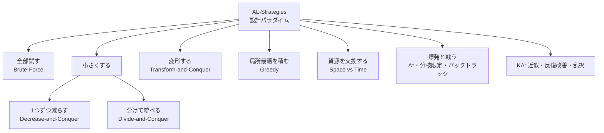
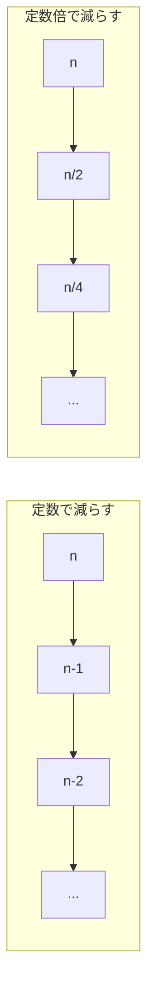
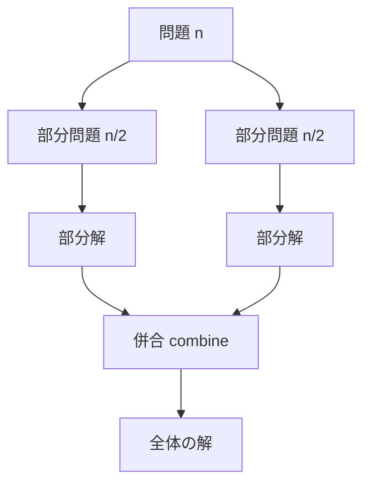
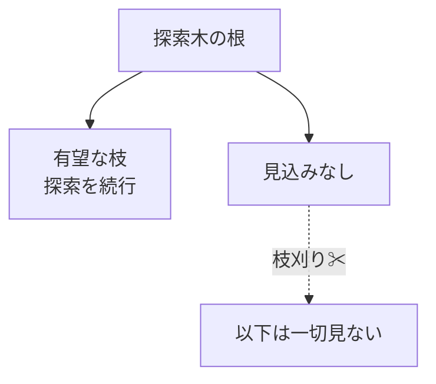
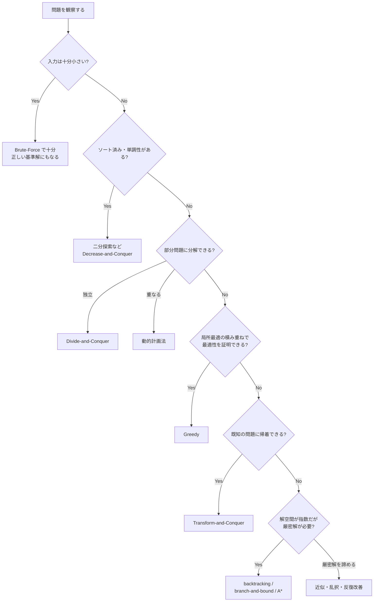

# AL-Strategies: アルゴリズム戦略

CS2023 / Algorithmic Foundations (AL) の2つ目の Knowledge Unit「**AL-Strategies**（Algorithmic Strategies）」を整理した学習メモ。個々のアルゴリズムではなく、その背後にある**設計パラダイム（考え方の型）**を学ぶユニット。

!!! info "出典・凡例"
    出典: `ComputerScienceCurricula2023.pdf` pp.90–91。
    **CS Core** = 全卒業生必須 / **KA Core** = 当該分野で必須 / **Non-core** = 発展。
    例に登場するアルゴリズムの多くは [AL-Foundational](AL-Foundational.md) で学んだもの。「あのアルゴリズムはどの型か」を当てはめ直すのがこのユニットの核心。

## 全体像

「問題をどう小さくするか・どう変形するか」でパラダイムを分類できる。

!!! note "パラダイムとは『問題への構え方』"
    料理に例えると、個々のアルゴリズムが「レシピ」なら、パラダイムは「煮る・焼く・蒸す」という調理法。新しい食材（未知の問題）に出会ったとき、レシピの暗記ではなく調理法を知っていれば応用が利く。

!!! quote "このユニットのゴール"
    各パラダイムについて「**これ、どういうときに使いたいんだっけ**」が分かり、未知の問題を前にしたとき**実際に使える**こと。
    暗記ではなく、**問題の特徴（シグナル）→ 試すパラダイム** という対応づけを自分の中に作るつもりで読む。
    各節の「使いどころ」と、終盤の[選択の思考フロー](#paradigm-selection)を往復すると定着しやすい。

---

## 1. Brute-Force / 力まかせ法

**候補を全部試す**最も素朴な戦略。定義に忠実で実装が簡単、必ず正解に到達するが、候補数が爆発すると破綻する。

- 例: **線形探索**（全要素を順に見る）、**選択ソート**（毎回全体から最小を探す）、**巡回セールスパーソン問題 (TSP)** の全順列試行 O(n!)、**ナップサック問題**の全部分集合試行 O(2ⁿ)。

!!! tip "使いどころ"
    - **入力が小さいことが保証されている**とき（目安: O(2ⁿ) なら n ≤ 20、O(n!) なら n ≤ 10 程度）。小さい入力に賢い解法を持ち込むのは過剰設計。
    - **正しさが最優先**のとき。「まず正しく動く基準解 (baseline)」になり、より賢い解法の正しさは力まかせ法との突き合わせで検証できる（賢い実装のテスト用リファレンスとして実務でも常用する）。
    - 問題に**特別な構造が見つからない**とき（ソート済みでも単調でもなく、部分構造も見えない）。構造が見えたら他のパラダイムに乗り換える。

---

## 2. Decrease-and-Conquer / 減治法

問題を**一回り小さい同じ問題に縮小**し、その解を拡張して元の解を得る戦略。縮小のしかたで3種に分かれる。

| 縮小のしかた | 意味 | 例 |
|---|---|---|
| **By a Constant**（定数だけ減らす） | n → n−1 | **挿入ソート**（n−1 要素が整列済みなら1つ挿入するだけ）、**トポロジカルソート**（入次数0の頂点を1つずつ除去） |
| **By a Constant Factor**（定数倍で減らす） | n → n/2 | **二分探索**（毎回半分を捨てる） |
| **By a Variable Size**（可変量減らす） | 減り方が入力依存 | **ユークリッドの互除法**（gcd(m, n) = gcd(n, m mod n)） |

!!! tip "使いどころ"
    シグナルは「**一回り小さい問題が解けていれば、残り1要素を取り込むのは簡単**」と言えること。
    - **ソート済み・単調性がある** → 半分を安全に捨てられる（二分探索）。「答えを x と仮定すると実現可能かの判定が単調になる」問題は、**答えそのものを二分探索**できる（応用範囲が非常に広い）。
    - **端から1つずつ確定できる要素が常にある**（入次数 0 の頂点、未処理の先頭要素）→ トポロジカルソート・挿入ソート型。
    - データが**ほぼ整列済み**と分かっている → 挿入ソートがほぼ O(n) で走る。「入力の性質を知っているなら、それに合った縮め方を選ぶ」の典型。

---

## 3. Divide-and-Conquer / 分割統治法

問題を**複数の部分問題に分割**し、それぞれを（通常は再帰で）解いて、**結果を併合 (combine)** する戦略。

- 例: **マージソート**（半分ずつソートして併合）、**クイックソート**（ピボットで分割）、**Strassen のアルゴリズム**（行列乗算を7回の部分乗算に分割し O(n^2.81) に）。

!!! tip "使いどころ"
    シグナルは「**半分に割っても部分問題どうしが干渉せず、併合 (combine) が安く書ける**」こと。
    - 部分問題が**互いに独立** — 重なり合うなら DP（§5d）の出番。
    - **併合が O(n) 以下**で書ける（マージソートの併合のように「両方の答えから全体の答えを安く作れる」）。併合が高くつくなら旨味が消える。
    - 部分問題を**並列に解ける**のも実務上の強み。マルチコア・分散処理（MapReduce はまさに分割統治の枠組み）と相性が良い。

!!! warning "減治法との違い：二分探索はどっち？"
    CS2023 では二分探索が両方の例に登場する。分割統治は「**複数の**部分問題を解いて併合する」、減治法は「**1つの**部分問題だけ残して他を捨てる」。二分探索は半分を**捨てる**（併合がない）ので、厳密には **decrease-by-a-constant-factor** に分類するのが Levitin 流。ただし「再帰的に小さくする」広義の分割統治と見る教科書も多い、と理解しておく。

---

## 4. Greedy / 貪欲法

各ステップで**その時点の最良（局所最適）を選び、後から決して取り消さない**戦略。高速だが、**最適解になるのは問題に特定の構造があるときだけ**。

- 例: **ダイクストラ法**（確定済み集合に最も近い頂点を確定）、**クラスカル法**（最も軽い辺から採用）、**ナップサック問題**（分割可能版では最適、0/1 版では最適にならない）。

!!! warning "貪欲が最適とは限らない"
    0/1 ナップサックで「価値/重さ比が良い順に詰める」と最適を外すことがある。貪欲法を使うときは「**局所最適の積み重ねが大域最適になるか**」（貪欲選択性・最適部分構造）の検証が必須。学習成果にも「Evaluate whether a greedy approach leads to an optimal solution」が明記されている。

!!! tip "使いどころ"
    シグナルは「**ソートして端から取っていけば良さそう**」という直感が湧くこと。ただし直感だけで使ってはいけない：
    - **証明が書けるとき**に使う。定石は交換論法（「最適解が貪欲と違う選択をしていたら、貪欲の選択に交換しても悪化しない」）。区間スケジューリング（終了時刻が早い順）、ハフマン符号、Dijkstra・Kruskal はすべて証明済みの代表例。
    - 証明できない・小さな反例が作れる → **DP に切り替える**のが定石コース（0/1 ナップサックがまさにこの分岐）。
    - 例外として、最適性を捨てて**速度優先の近似ヒューリスティック**として貪欲を使う判断もある（巨大入力で「そこそこの解がすぐ欲しい」とき）。

---

## 5. Transform-and-Conquer / 変換統治法

問題を**解きやすい形に変換してから**解く戦略。CS2023 は4つの変換を挙げる。

### 5a. Instance simplification / インスタンスの単純化

同じ問題の**扱いやすいインスタンス**に変える。
例: リストを**事前ソート (presort)** してから重複検出（隣同士の比較だけで済む）。

### 5b. Representation change / 表現の変更

同じ情報の**別のデータ表現**に変える。
例: **ヒープソート**（配列を「ヒープ」という表現に作り替えてから最大値を取り出し続ける）、**2-3木・AVL木・赤黒木**（同じ集合を平衡の取れた表現に保つ）。

### 5c. Problem reduction / 問題の帰着

**別の既知の問題**に変換して、その解法を流用する。
例: **最小公倍数** lcm(m, n) = m·n / gcd(m, n)（gcd に帰着）、**線形計画法**への定式化。

### 5d. Dynamic programming / 動的計画法

問題を**重なり合う部分問題**に分解し、各部分問題の解を**表に記録（メモ化）して再利用**する。
例: **Warshall**（推移閉包）、**Floyd**（全点対最短経路）、**Bellman-Ford**（負辺ありの単一始点最短経路）。

!!! note "DP は「変換統治」の一種？"
    CS2023 は DP を Transform-and-Conquer の下位項目に置く（問題を「部分問題の表を埋める問題」に変換すると見るため）。独立したパラダイムとして扱う教科書も多い。位置づけより「**重複部分問題 + 最適部分構造**があるとき表で再利用する」という本質を押さえる。

!!! tip "使いどころ"
    シグナルは「**この問題、既に解ける何かに化けないか？**」という問いに答えが出ること。
    - 同値判定・近傍比較を何度も行う → **presort**（単純化）してから一回の走査で済ませる（重複検出・最近接ペアの前処理）。
    - 同じ種類の操作（最大値の取り出し、順序つき検索）を繰り返す → 最初に**良い表現**（ヒープ・平衡木）へ作り替える（表現変更）。前処理コストは繰り返し回数で回収する発想。
    - ソート・最大フロー・線形計画のような**強力な既製ソルバがある問題に帰着**できないか考える。二部マッチング → 最大フロー が典型で、「自前で解かずに変換して任せる」発想は実務でも頻出（SAT ソルバや LP ソルバに投げる等）。
    - 素朴な再帰を書いたら**同じ引数の呼び出しが何度も現れた** → **DP** のサイン。「i 番目まで見て、状態 s のときの最適値」と日本語で言えたら、それがそのまま DP の状態定義になる（編集距離 = diff コマンド、経路数、区間 DP …）。

---

## 6. Space vs Time tradeoffs / 空間と時間のトレードオフ

**メモリを余分に使って時間を稼ぐ**（またはその逆）という資源交換の視点。

- 例: **ハッシュ表**（表という空間を使い検索を平均 O(1) に）、DP のメモ表、事前計算テーブル。

!!! tip "使いどころ"
    シグナルは「**同じ計算・同じ参照を何度も繰り返している**」こと。プロファイルして繰り返しが見えたら、結果を**キャッシュ・索引（インデックス）・事前計算テーブル**に置き換える。
    - 適用前に「メモリに余裕があり、時間がボトルネック」という状況確認とセットで使う。DB のインデックス、メモ化、CDN キャッシュまで、実務の高速化の大半はこの型。
    - 逆向きの取引もある：組み込みなどメモリが貴重な環境では、時間を払って空間を節約する側に倒す。

---

## 7. 指数的爆発への対処 (Handling Exponential Growth)

解空間が O(2ⁿ) や O(n!) で爆発する問題に対し、**全部は見ない**で済ませる技法群。

| 技法 | アイデア | 例 |
|---|---|---|
| **Backtracking / バックトラック** | 解を少しずつ構築し、**見込みがないと分かった瞬間に引き返す**（枝刈り） | N クイーン、数独 |
| **Branch-and-bound / 分枝限定法** | 部分問題ごとに**限界値 (bound) を見積もり**、最良解を超えられない枝を丸ごと捨てる | 0/1 ナップサック、TSP |
| **Heuristic A\* / ヒューリスティック探索** | 「ゴールまでの残り見積もり h(n)」を使って**有望な方向から**探索する | 経路探索（カーナビ、ゲーム AI） |

!!! note "3つの使い分け"
    バックトラックは「**制約を満たす解**を探す」、分枝限定法は「**最適解**を探す（boundで枝刈り）」、A* は「**良い順に**展開する（許容的ヒューリスティックなら最適保証）」。いずれも最悪計算量は指数のままだが、実用上は劇的に速くなる。

!!! tip "使いどころ"
    前提は「**解空間は指数だが、厳密解（または高品質な解）を諦めたくない**」という状況。そのうえで何が手元にあるかで選ぶ：
    - 制約充足問題で、**部分解の段階で矛盾を早期検出できる** → backtracking（SAT ソルバ、パズル、リソース割り当て）。
    - 最適化問題で、**部分解から限界値 (bound) を安く見積もれる** → branch-and-bound（0/1 ナップサック、中規模 TSP）。
    - 状態空間の経路探索で、**ゴールまでの楽観的な見積もり h(n) が作れる** → A*（地図経路、盤面ゲーム。「直線距離」のような自然な下界があると強い）。
    - それでも間に合わない規模なら、厳密解を諦めて**近似・乱択（→ §9）に降りる**。この「降りる判断」自体がアルゴリズム設計の一部。

---

## 8. Iteration vs Recursion / 反復と再帰

同じ問題をループでも再帰でも書ける（例: **階乗**、**木の探索**）。

| | 反復 (iteration) | 再帰 (recursion) |
|---|---|---|
| 状態管理 | ループ変数で明示 | 呼び出しスタックが暗黙に管理 |
| 向く問題 | 線形な繰り返し | 自己相似な構造（木・分割統治） |
| コスト | 関数呼び出しなしで軽い | スタック消費・オーバーフローのリスク |
| 可読性 | 単純な繰り返しは読みやすい | 構造が再帰的なら圧倒的に簡潔 |

!!! note "相互変換できる"
    再帰は明示的なスタックを使えば必ず反復に書き換えられる（末尾再帰なら単純ループに）。逆も可。「どちらが問題の構造を素直に表すか」で選ぶ。

!!! tip "使いどころ"
    迷ったらまず「**問題の構造が再帰的か**」で選ぶ。木・分割統治・DP の遷移は再帰が素直で、バグも入りにくい。
    そのうえで、**再帰の深さが入力依存で大きくなり得る**（要素数 10⁵ のリストを1要素ずつ再帰する等。深さ ≒ n になる再帰は危険）・**ホットループで呼び出しコストが効く**、と分かったら反復＋明示的スタックに書き換える。「再帰で正しく書いてから、必要なら機械的に反復へ変換する」が安全な順序。

---

## 9. KA Core のパラダイム

- **Approximation algorithms / 近似アルゴリズム**: 最適解の代わりに「**最適の α 倍以内**」を保証する解を多項式時間で返す。NP困難問題への現実的アプローチ。
- **Iterative improvement / 反復改善法**: 実行可能解から始め、**改善できる限り少しずつ改善**して最適に至る。例: **Ford-Fulkerson**（増加道がある限り流す、最大フロー）、**シンプレックス法**（隣の頂点へ移りながら線形計画の最適へ）。
- **Randomized / Stochastic algorithms / 乱択アルゴリズム**: 乱数を使い、**期待値として**良い性能や良い解を得る。例: **max-cut の乱択近似**（各頂点をコイン投げで振り分けると期待値で最適の 1/2）、**balls and bins**（ランダム配置の負荷解析、ハッシュの理論的基礎）。

!!! tip "使いどころ"
    CS Core のパラダイムで「厳密解は現実的でない」と分かった**後の受け皿**。
    - **品質保証つきで速く**解きたい → 近似アルゴリズム（「最適の α 倍以内」という保証が契約・SLA 的に効く）。
    - 「**今の解を少し改善する**」操作が自然に定義できる最適化 → 反復改善（フロー、LP、局所探索）。
    - **最悪ケースの入力を乱数で均したい**（クイックソートのランダムピボットが典型）、または**期待値で十分** → 乱択。実装が単純になることが多いのも利点。

## 10. 発展トピック (Non-core)

??? abstract "量子コンピューティング"
    量子の重ね合わせ・干渉を使う計算パラダイム。詳細は [AL-Foundational §8](AL-Foundational.md#8-non-core) の Shor / Grover を参照。

---

## 実戦: パラダイム選択の思考フロー {#paradigm-selection}

未知の問題を前にしたとき「どの型を試すか」の思考順序。上から順に問いかける。

シグナル → パラダイムの対応表：

| 問題に見えるシグナル | 試すパラダイム |
|---|---|
| n が小さい（O(2ⁿ) で n≤20 / O(n!) で n≤10 目安） | Brute-Force |
| ソート済み・判定関数が単調 | 二分探索（Decrease by constant factor） |
| 端から1つずつ確定できる要素が常にある | Decrease by a constant（挿入ソート・トポロジカル） |
| 半分に割っても干渉しない＋併合が安い | Divide-and-Conquer |
| 「i 番目まで・状態 s」で最適値が言える／同じ部分問題が再出する | 動的計画法 |
| 「ソートして端から取る」で交換論法の証明が書ける | Greedy |
| 既知の解法インフラ（ソート・フロー・LP・SAT）に乗りそう | Transform-and-Conquer |
| 同じ計算・参照を何度も繰り返している | 空間で時間を買う（キャッシュ・メモ化・索引） |
| NP困難だが厳密解が必要で、入力は中規模 | backtracking / branch-and-bound / A* |
| NP困難で大規模、解の品質保証つきなら近似で良い | 近似・乱択・反復改善 |

!!! warning "フローは「最初の仮説」を出す道具"
    実際の問題は複数パラダイムの**組み合わせ**で解けることが多い（例:「答えで二分探索 ＋ 判定は貪欲」「分割統治＋メモ化」）。フローの答えを鵜呑みにせず、**小さい入力で Brute-Force と突き合わせて検証する**癖をつける。これが「実際に使える」状態への最短ルート。

---

## まとめ：パラダイム早見表

| パラダイム | 一言で | 代表例 |
|---|---|---|
| Brute-Force | 全部試す | 線形探索、選択ソート、TSP全列挙 |
| Decrease-and-Conquer | 1つ残して小さくする | 挿入ソート、二分探索、互除法 |
| Divide-and-Conquer | 分けて解いて併合 | mergesort、quicksort、Strassen |
| Greedy | 局所最適を積み、取り消さない | Dijkstra、Kruskal |
| Transform-and-Conquer | 解きやすい形に変換 | presort、heapsort、帰着、**DP** |
| Space-Time tradeoff | 空間で時間を買う | ハッシュ表、メモ化 |
| 指数爆発対処 | 見込みのない枝を見ない | backtracking、branch-and-bound、A* |

!!! question "理解度チェック"
    - [ ] 分割統治と減治法の違いを「二分探索はどちらか」を例に説明できる
    - [ ] 貪欲法が最適解を保証しない例を1つ挙げられる
    - [ ] Transform-and-Conquer の4つの変換（単純化・表現変更・帰着・DP）に例を1つずつ対応づけられる
    - [ ] 分割統治と DP の使い分け（部分問題が独立か重なるか）を説明できる
    - [ ] backtracking・branch-and-bound・A* の違いを一言ずつで言える
    - [ ] AL-Foundational の各アルゴリズムがどのパラダイムに属するか言える（学習成果2）
    - [ ] 未知の問題を渡されたとき、「どのシグナルを見て、どのパラダイムから試すか」を口頭で説明できる（学習成果4）
