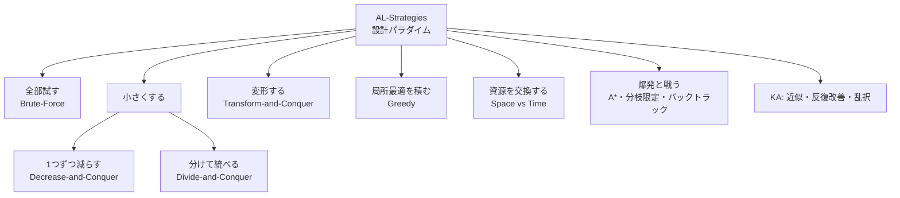
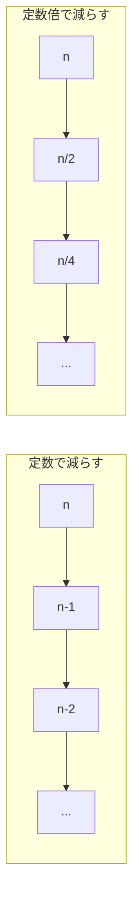
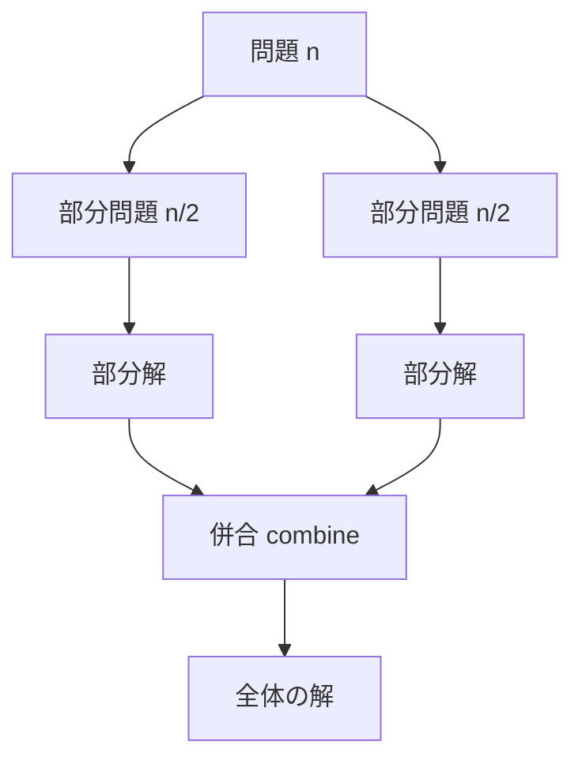
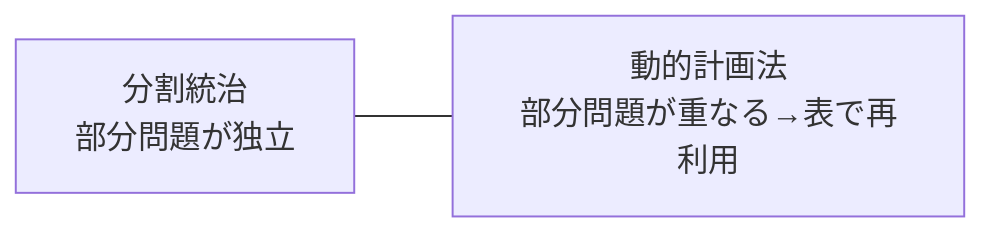
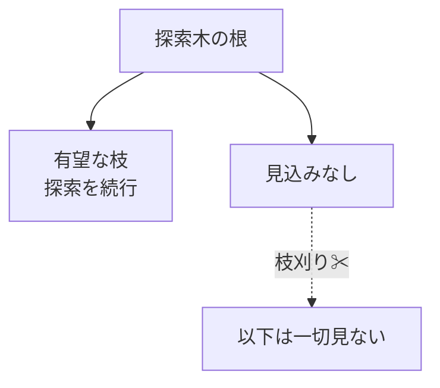

# AL-Strategies: アルゴリズム戦略

CS2023 / Algorithmic Foundations (AL) の2つ目の Knowledge Unit「**AL-Strategies**（Algorithmic Strategies）」を整理した学習メモ。個々のアルゴリズムではなく、その背後にある**設計パラダイム（考え方の型）**を学ぶユニット。

!!! info "出典・凡例"
    出典: `ComputerScienceCurricula2023.pdf` pp.90–91。
    **CS Core** = 全卒業生必須 / **KA Core** = 当該分野で必須 / **Non-core** = 発展。
    例に登場するアルゴリズムの多くは [AL-Foundational](AL-Foundational.md) で学んだもの。「あのアルゴリズムはどの型か」を当てはめ直すのがこのユニットの核心。

## 全体像

「問題をどう小さくするか・どう変形するか」でパラダイムを分類できる。

!!! note "パラダイムとは『問題への構え方』"
    料理に例えると、個々のアルゴリズムが「レシピ」なら、パラダイムは「煮る・焼く・蒸す」という調理法。新しい食材（未知の問題）に出会ったとき、レシピの暗記ではなく調理法を知っていれば応用が利く。

---

## 1. Brute-Force / 力まかせ法

**候補を全部試す**最も素朴な戦略。定義に忠実で実装が簡単、必ず正解に到達するが、候補数が爆発すると破綻する。

- 例: **線形探索**（全要素を順に見る）、**選択ソート**（毎回全体から最小を探す）、**巡回セールスパーソン問題 (TSP)** の全順列試行 O(n!)、**ナップサック問題**の全部分集合試行 O(2ⁿ)。

!!! tip "出発点としての価値"
    力まかせ法は「まず正しく動く基準解 (baseline)」になる。より賢いパラダイムの正しさ・速さは、力まかせ法との比較で確かめられる。

---

## 2. Decrease-and-Conquer / 減治法

問題を**一回り小さい同じ問題に縮小**し、その解を拡張して元の解を得る戦略。縮小のしかたで3種に分かれる。

| 縮小のしかた | 意味 | 例 |
|---|---|---|
| **By a Constant**（定数だけ減らす） | n → n−1 | **挿入ソート**（n−1 要素が整列済みなら1つ挿入するだけ）、**トポロジカルソート**（入次数0の頂点を1つずつ除去） |
| **By a Constant Factor**（定数倍で減らす） | n → n/2 | **二分探索**（毎回半分を捨てる） |
| **By a Variable Size**（可変量減らす） | 減り方が入力依存 | **ユークリッドの互除法**（gcd(m, n) = gcd(n, m mod n)） |

---

## 3. Divide-and-Conquer / 分割統治法

問題を**複数の部分問題に分割**し、それぞれを（通常は再帰で）解いて、**結果を併合 (combine)** する戦略。

- 例: **マージソート**（半分ずつソートして併合）、**クイックソート**（ピボットで分割）、**Strassen のアルゴリズム**（行列乗算を7回の部分乗算に分割し O(n^2.81) に）。

!!! warning "減治法との違い：二分探索はどっち？"
    CS2023 では二分探索が両方の例に登場する。分割統治は「**複数の**部分問題を解いて併合する」、減治法は「**1つの**部分問題だけ残して他を捨てる」。二分探索は半分を**捨てる**（併合がない）ので、厳密には **decrease-by-a-constant-factor** に分類するのが Levitin 流。ただし「再帰的に小さくする」広義の分割統治と見る教科書も多い、と理解しておく。

---

## 4. Greedy / 貪欲法

各ステップで**その時点の最良（局所最適）を選び、後から決して取り消さない**戦略。高速だが、**最適解になるのは問題に特定の構造があるときだけ**。

- 例: **ダイクストラ法**（確定済み集合に最も近い頂点を確定）、**クラスカル法**（最も軽い辺から採用）、**ナップサック問題**（分割可能版では最適、0/1 版では最適にならない）。

!!! warning "貪欲が最適とは限らない"
    0/1 ナップサックで「価値/重さ比が良い順に詰める」と最適を外すことがある。貪欲法を使うときは「**局所最適の積み重ねが大域最適になるか**」（貪欲選択性・最適部分構造）の検証が必須。学習成果にも「Evaluate whether a greedy approach leads to an optimal solution」が明記されている。

---

## 5. Transform-and-Conquer / 変換統治法

問題を**解きやすい形に変換してから**解く戦略。CS2023 は4つの変換を挙げる。

### 5a. Instance simplification / インスタンスの単純化

同じ問題の**扱いやすいインスタンス**に変える。
例: リストを**事前ソート (presort)** してから重複検出（隣同士の比較だけで済む）。

### 5b. Representation change / 表現の変更

同じ情報の**別のデータ表現**に変える。
例: **ヒープソート**（配列を「ヒープ」という表現に作り替えてから最大値を取り出し続ける）、**2-3木・AVL木・赤黒木**（同じ集合を平衡の取れた表現に保つ）。

### 5c. Problem reduction / 問題の帰着

**別の既知の問題**に変換して、その解法を流用する。
例: **最小公倍数** lcm(m, n) = m·n / gcd(m, n)（gcd に帰着）、**線形計画法**への定式化。

### 5d. Dynamic programming / 動的計画法

問題を**重なり合う部分問題**に分解し、各部分問題の解を**表に記録（メモ化）して再利用**する。
例: **Warshall**（推移閉包）、**Floyd**（全点対最短経路）、**Bellman-Ford**（負辺ありの単一始点最短経路）。

!!! note "DP は「変換統治」の一種？"
    CS2023 は DP を Transform-and-Conquer の下位項目に置く（問題を「部分問題の表を埋める問題」に変換すると見るため）。独立したパラダイムとして扱う教科書も多い。位置づけより「**重複部分問題 + 最適部分構造**があるとき表で再利用する」という本質を押さえる。

---

## 6. Space vs Time tradeoffs / 空間と時間のトレードオフ

**メモリを余分に使って時間を稼ぐ**（またはその逆）という資源交換の視点。

- 例: **ハッシュ表**（表という空間を使い検索を平均 O(1) に）、DP のメモ表、事前計算テーブル。

---

## 7. 指数的爆発への対処 (Handling Exponential Growth)

解空間が O(2ⁿ) や O(n!) で爆発する問題に対し、**全部は見ない**で済ませる技法群。

| 技法 | アイデア | 例 |
|---|---|---|
| **Backtracking / バックトラック** | 解を少しずつ構築し、**見込みがないと分かった瞬間に引き返す**（枝刈り） | N クイーン、数独 |
| **Branch-and-bound / 分枝限定法** | 部分問題ごとに**限界値 (bound) を見積もり**、最良解を超えられない枝を丸ごと捨てる | 0/1 ナップサック、TSP |
| **Heuristic A\* / ヒューリスティック探索** | 「ゴールまでの残り見積もり h(n)」を使って**有望な方向から**探索する | 経路探索（カーナビ、ゲーム AI） |

!!! note "3つの使い分け"
    バックトラックは「**制約を満たす解**を探す」、分枝限定法は「**最適解**を探す（boundで枝刈り）」、A* は「**良い順に**展開する（許容的ヒューリスティックなら最適保証）」。いずれも最悪計算量は指数のままだが、実用上は劇的に速くなる。

---

## 8. Iteration vs Recursion / 反復と再帰

同じ問題をループでも再帰でも書ける（例: **階乗**、**木の探索**）。

| | 反復 (iteration) | 再帰 (recursion) |
|---|---|---|
| 状態管理 | ループ変数で明示 | 呼び出しスタックが暗黙に管理 |
| 向く問題 | 線形な繰り返し | 自己相似な構造（木・分割統治） |
| コスト | 関数呼び出しなしで軽い | スタック消費・オーバーフローのリスク |
| 可読性 | 単純な繰り返しは読みやすい | 構造が再帰的なら圧倒的に簡潔 |

!!! note "相互変換できる"
    再帰は明示的なスタックを使えば必ず反復に書き換えられる（末尾再帰なら単純ループに）。逆も可。「どちらが問題の構造を素直に表すか」で選ぶ。

---

## 9. KA Core のパラダイム

- **Approximation algorithms / 近似アルゴリズム**: 最適解の代わりに「**最適の α 倍以内**」を保証する解を多項式時間で返す。NP困難問題への現実的アプローチ。
- **Iterative improvement / 反復改善法**: 実行可能解から始め、**改善できる限り少しずつ改善**して最適に至る。例: **Ford-Fulkerson**（増加道がある限り流す、最大フロー）、**シンプレックス法**（隣の頂点へ移りながら線形計画の最適へ）。
- **Randomized / Stochastic algorithms / 乱択アルゴリズム**: 乱数を使い、**期待値として**良い性能や良い解を得る。例: **max-cut の乱択近似**（各頂点をコイン投げで振り分けると期待値で最適の 1/2）、**balls and bins**（ランダム配置の負荷解析、ハッシュの理論的基礎）。

## 10. 発展トピック (Non-core)

??? abstract "量子コンピューティング"
    量子の重ね合わせ・干渉を使う計算パラダイム。詳細は [AL-Foundational §8](AL-Foundational.md#8-non-core) の Shor / Grover を参照。

---

## まとめ：パラダイム早見表

| パラダイム | 一言で | 代表例 |
|---|---|---|
| Brute-Force | 全部試す | 線形探索、選択ソート、TSP全列挙 |
| Decrease-and-Conquer | 1つ残して小さくする | 挿入ソート、二分探索、互除法 |
| Divide-and-Conquer | 分けて解いて併合 | mergesort、quicksort、Strassen |
| Greedy | 局所最適を積み、取り消さない | Dijkstra、Kruskal |
| Transform-and-Conquer | 解きやすい形に変換 | presort、heapsort、帰着、**DP** |
| Space-Time tradeoff | 空間で時間を買う | ハッシュ表、メモ化 |
| 指数爆発対処 | 見込みのない枝を見ない | backtracking、branch-and-bound、A* |

!!! question "理解度チェック"
    - [ ] 分割統治と減治法の違いを「二分探索はどちらか」を例に説明できる
    - [ ] 貪欲法が最適解を保証しない例を1つ挙げられる
    - [ ] Transform-and-Conquer の4つの変換（単純化・表現変更・帰着・DP）に例を1つずつ対応づけられる
    - [ ] 分割統治と DP の使い分け（部分問題が独立か重なるか）を説明できる
    - [ ] backtracking・branch-and-bound・A* の違いを一言ずつで言える
    - [ ] AL-Foundational の各アルゴリズムがどのパラダイムに属するか言える（学習成果2）
