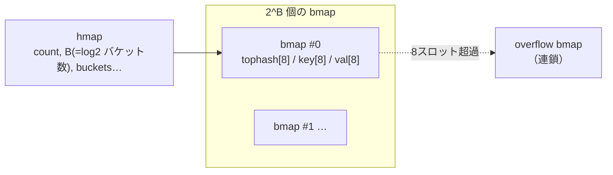

# Hash Table 実装サンプル

[AL-Foundational](AL-Foundational.md#assoc-set) のハッシュ表、および [Q6（衝突対処）](AL-Foundational-QA.md#q6) に対応する**動作確認済み**のコード。

- **C** … 連鎖法（separate chaining）。`insert`/`find`/`delete`/`rehash`。
- **Go** … オープンアドレス法（linear probing）＋**墓標（tombstone）**。Q6 の delete の話に対応。
- **Go 組み込み `map`** … 言語が内蔵するハッシュ表の内部構造を解説。

いずれも本リポジトリ環境（clang / go1.26）で `gcc`・`go run` 実行して出力を確認済み。

---

## 1. C 実装（連鎖法 / separate chaining）

各スロットが連結リストの先頭を指し、衝突した要素を鎖につなぐ。delete は鎖からノードを外すだけで**墓標は不要**。

```c
#include <stdio.h>
#include <stdlib.h>
#include <string.h>

typedef struct Entry {
    char *key;
    int   value;
    struct Entry *next;   /* 連鎖（separate chaining） */
} Entry;

typedef struct {
    Entry **buckets;      /* スロット配列（各要素は鎖の先頭） */
    size_t  cap;          /* スロット数 m */
    size_t  size;         /* 要素数 n */
} HashMap;

/* djb2 ハッシュ */
static unsigned long hash_str(const char *s) {
    unsigned long h = 5381;
    int c;
    while ((c = (unsigned char)*s++))
        h = ((h << 5) + h) + c;   /* h*33 + c */
    return h;
}

HashMap *hm_new(size_t cap) {
    HashMap *m = malloc(sizeof(HashMap));
    m->cap = cap; m->size = 0;
    m->buckets = calloc(cap, sizeof(Entry *)); /* 全部 NULL */
    return m;
}

static size_t index_of(const HashMap *m, const char *key) {
    return hash_str(key) % m->cap;
}

static void hm_rehash(HashMap *m, size_t new_cap) {
    Entry **old = m->buckets; size_t old_cap = m->cap;
    m->buckets = calloc(new_cap, sizeof(Entry *)); m->cap = new_cap;
    for (size_t i = 0; i < old_cap; i++) {          /* 全要素を再配置 */
        Entry *e = old[i];
        while (e) {
            Entry *next = e->next;
            size_t j = hash_str(e->key) % new_cap;
            e->next = m->buckets[j];                /* ノード再利用（再mallocなし）*/
            m->buckets[j] = e;
            e = next;
        }
    }
    free(old);
}

/* insert / update */
void hm_put(HashMap *m, const char *key, int value) {
    if ((double)(m->size + 1) / m->cap > 0.75)      /* load factor>0.75 で 2倍化 */
        hm_rehash(m, m->cap * 2);
    size_t i = index_of(m, key);
    for (Entry *e = m->buckets[i]; e; e = e->next)  /* 既存キーは更新（鎖を走査） */
        if (strcmp(e->key, key) == 0) { e->value = value; return; }
    Entry *e = malloc(sizeof(Entry));               /* 新規は鎖の先頭に prepend O(1) */
    e->key = strdup(key); e->value = value;
    e->next = m->buckets[i]; m->buckets[i] = e;
    m->size++;
}

/* find: 見つかれば1, *out に値 */
int hm_get(const HashMap *m, const char *key, int *out) {
    size_t i = index_of(m, key);
    for (Entry *e = m->buckets[i]; e; e = e->next)
        if (strcmp(e->key, key) == 0) { if (out) *out = e->value; return 1; }
    return 0;
}

/* delete: 鎖からノードを外す（chaining は墓標不要） */
int hm_del(HashMap *m, const char *key) {
    size_t i = index_of(m, key);
    Entry **pp = &m->buckets[i];                    /* 前ノードの next へのポインタ */
    while (*pp) {
        Entry *e = *pp;
        if (strcmp(e->key, key) == 0) {
            *pp = e->next;                          /* リンク繋ぎ替え */
            free(e->key); free(e); m->size--; return 1;
        }
        pp = &e->next;
    }
    return 0;
}

void hm_free(HashMap *m) {
    for (size_t i = 0; i < m->cap; i++) {
        Entry *e = m->buckets[i];
        while (e) { Entry *n = e->next; free(e->key); free(e); e = n; }
    }
    free(m->buckets); free(m);
}

int main(void) {
    HashMap *m = hm_new(4);
    hm_put(m, "apple", 100);
    hm_put(m, "banana", 200);
    hm_put(m, "cherry", 300);
    hm_put(m, "apple", 150);            /* 更新 */
    int v;
    if (hm_get(m, "apple", &v))  printf("apple = %d\n", v);    /* 150 */
    if (hm_get(m, "banana", &v)) printf("banana = %d\n", v);   /* 200 */
    hm_del(m, "banana");
    printf("banana found? %d\n", hm_get(m, "banana", NULL));   /* 0 */
    printf("size=%zu cap=%zu\n", m->size, m->cap);
    hm_free(m);
    return 0;
}
```

**実行**

```console
$ gcc -Wall -O2 -o htbl htbl.c && ./htbl
apple = 150
banana = 200
banana found? 0
size=2 cap=8
```

!!! note "学習用の簡略化"
    - `strdup` は POSIX。エラー処理（`malloc` 失敗）は省略。
    - 実務では `cap` を素数にする／より良いハッシュ（SipHash 等）を使う／キー比較を最適化する、などを行う。
    - `size=2`（apple・cherry が残存）、`cap=8`（初期4から要素追加で 0.75 超過し 8 へ rehash 済み）。

---

## 2. Go 実装（オープンアドレス法＋墓標）

要素を配列本体に置き、衝突したら次のスロットへ probe。**delete は空にせず墓標 (tombstone) を立てる**——空にすると probe 連鎖が切れて find が誤判定するため（[Q6](AL-Foundational-QA.md#q6) 参照）。容量は2の冪に保ち `& mask` で剰余を取る。

```go
package main

import "fmt"

type slotState uint8

const (
	empty   slotState = iota // 未使用（一度も使われていない）
	used                     // 使用中
	deleted                  // 墓標（tombstone）
)

type entry struct {
	key   string
	value int
	state slotState
}

// open addressing（linear probing）+ 墓標
type HashMap struct {
	slots []entry
	size  int // used の数（論理的な要素数）
	load  int // used + deleted（占有スロット数）
}

func New() *HashMap { return &HashMap{slots: make([]entry, 8)} }

func hashString(s string) uint64 { // FNV-1a
	var h uint64 = 1469598103934665603
	for i := 0; i < len(s); i++ {
		h ^= uint64(s[i])
		h *= 1099511628211
	}
	return h
}

func (m *HashMap) Put(key string, value int) {
	if float64(m.load+1)/float64(len(m.slots)) > 0.7 { // 墓標込み占有率で rehash
		m.rehash(len(m.slots) * 2)
	}
	mask := uint64(len(m.slots) - 1) // len は2の冪なので & で mod
	i := hashString(key) & mask
	firstTomb := -1
	for {
		s := &m.slots[i]
		switch s.state {
		case empty: // 未使用に到達 = キーは無かった
			if firstTomb >= 0 { // 墓標があれば再利用
				m.slots[firstTomb] = entry{key, value, used}
			} else {
				*s = entry{key, value, used}
				m.load++
			}
			m.size++
			return
		case deleted:
			if firstTomb < 0 {
				firstTomb = int(i)
			}
		case used:
			if s.key == key { // 既存キーは更新
				s.value = value
				return
			}
		}
		i = (i + 1) & mask // 次スロットへ probe
	}
}

func (m *HashMap) Get(key string) (int, bool) {
	mask := uint64(len(m.slots) - 1)
	i := hashString(key) & mask
	for {
		s := &m.slots[i]
		switch s.state {
		case empty:
			return 0, false // 未使用に当たったら「なし」
		case used:
			if s.key == key {
				return s.value, true
			}
		}
		i = (i + 1) & mask // deleted（墓標）は通過して継続
	}
}

func (m *HashMap) Delete(key string) bool {
	mask := uint64(len(m.slots) - 1)
	i := hashString(key) & mask
	for {
		s := &m.slots[i]
		switch s.state {
		case empty:
			return false
		case used:
			if s.key == key {
				s.state = deleted // 墓標に（空にしない！）
				s.key, s.value = "", 0
				m.size--
				return true
			}
		}
		i = (i + 1) & mask
	}
}

func (m *HashMap) rehash(newCap int) {
	old := m.slots
	m.slots = make([]entry, newCap)
	m.size, m.load = 0, 0
	for _, s := range old {
		if s.state == used { // 墓標は捨てて入れ直す
			m.Put(s.key, s.value)
		}
	}
}

func main() {
	m := New()
	m.Put("apple", 100)
	m.Put("banana", 200)
	m.Put("apple", 150) // 更新
	if v, ok := m.Get("apple"); ok {
		fmt.Println("apple =", v) // 150
	}
	m.Delete("banana")
	_, ok := m.Get("banana")
	fmt.Println("banana found?", ok) // false
	fmt.Println("size =", m.size)    // 1
}
```

**実行**

```console
$ go run main.go
apple = 150
banana found? false
size = 1
```

!!! tip "rehash が再帰しない理由"
    `rehash` は `Put` を呼び出すが、容量を2倍にしてから入れ直すので占有率は必ず 0.5 未満に収まり、再帰的な rehash は起きない（動的配列の倍化と同じ理屈）。

---

## 3. Go 組み込み `map` の内部実装

自作と違い、Go の `map[K]V` は**ランタイムが用意するハッシュ表**。実装は歴史的に2世代ある。

### 〜Go 1.23：バケット方式（bucketed + overflow chaining）



- **1バケットに8スロット**（key/value 8個分）。キーのハッシュの**下位ビットでバケットを選び**、**上位8ビット (`tophash`) をバケット内に保存**して比較を高速化。
- バケット内は8個を線形走査し、`tophash` 一致時にフルキー比較。
- 8個が埋まると **overflow バケットを連鎖**（＝バケット単位の chaining）。
- load factor 平均 **6.5 / バケット**超過、または overflow が増えすぎると**容量2倍**。このとき一気に作り直さず、**書き込みのたびに少しずつ移し替える（incremental evacuation）**ので、1回の挿入が大きく跳ねない。
- delete はスロットを空マークにする（墓標方式の open addressing とは異なる）。
- **反復順序は意図的にランダム化**（順序に依存させないため）。

### Go 1.24 以降（現行の go1.26 含む）：Swiss Tables

- Go 1.24 で `map` の内部が **Swiss Tables**（オープンアドレス系）に刷新。
- 各グループの**制御バイト (control word)** をまとめて比較し、**SIMD で複数スロットを一括 probe** することでキャッシュ効率と速度を改善。
- 利用者から見た `map` の API・意味（反復順ランダム、参照型として渡る等）は不変。実装だけが変わった。

!!! note "使い分け"
    実務では**自作せず組み込み `map` を使う**のが基本。自作実装は「中で何が起きているか」を理解するための学習用。`insert`/`find`/`delete`・衝突・rehash・墓標といった概念は、組み込み `map` の挙動（償却 O(1)、最悪 O(n)、反復順ランダム）を理解する土台になる。

関連: [ハッシュ表](AL-Foundational.md#assoc-set)、[Q6（衝突対処の挙動）](AL-Foundational-QA.md#q6)
