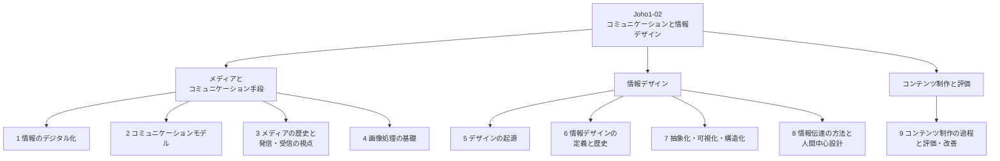

# Joho1-02: コミュニケーションと情報デザイン

第2章は、[Joho1-01](Joho1-01.md) で見た「情報社会の問題をどう捉え、どう解決していくか」という視点を踏まえ、その解決策を**他者に伝える**段階に焦点を当てる。情報をデジタルデータとして正しく扱う技術的な土台から、送り手と受け手の間でコミュニケーションが成立する仕組み、そして「伝わる」情報をどう設計（デザイン）するかまでを、一貫した流れとして扱う。教材本文では、情報デザインの考え方や方法は [Joho1-03](Joho1-03.md)（コンピュータとプログラミング）や [Joho1-04](Joho1-04.md)（情報通信ネットワークとデータの活用）でも扱うことを意識して授業を組み立てるよう述べられている。

!!! info "出典・凡例"
    出典: 文部科学省「高等学校情報科『情報Ⅰ』教員研修用教材」第2章 コミュニケーションと情報デザイン（`JohoI/03_第2章_コミュニケーションと情報デザイン.pdf`）。
    教材内では (ア) メディアの特性とコミュニケーション手段、(イ) 情報デザイン、(ウ) 効果的なコミュニケーション、の3本柱で構成される。本ページはこの区分を踏まえつつ、内容のまとまりに沿って章立てし直している。

## 全体像 {#overview}

---

## 1. 情報のデジタル化 {#digitalization}

情報には、温度や時間のように連続的に変化する**アナログデータ**と、連続する量を一定間隔で区切り数値で表す**デジタルデータ**がある（例: アナログ時計とデジタル時計、アナログメータとデジタルメータ）。コンピュータは直接アナログデータを扱えず、内部では複数の素子の電圧などの段階の組み合わせ——現在は主に0と1の2段階（2進法）——としてデータを表現している。

- **アナログの特性**: 連続した値であり瞬間的・直感的な情報処理に向く（人はデジタル時計よりアナログ時計の方が大まかな時間を捉えやすい）が、ノイズの影響を受けて波形自体が歪むと元のデータに復元しにくい。
- **デジタルの特性**: 値が連続していない離散値であり、0と1のパターンで表現する。ノイズの影響があっても、生じた誤差が一定量以内であれば元のデータを復元できるため劣化しにくく、送信データに誤りを訂正する仕組みを組み込むこともできる。

デジタル化は、①**標本化**（連続的に変化する量を一定の時間間隔で区切る）→②**量子化**（それぞれの値にあらかじめ定めた段階値を割り当てる）→③**符号化**（量子化した数値を2進法で表現する）という手順で行われる。

- **テキスト**: 文字ごとに固有の番号（文字コード）を割り当てて2進法のデータとして扱う。同じ文字であっても必要なビット数は文字の種類だけでなく**符号化方式**によって異なる——例えばASCIIは英数字を7bitで表現するが、UTF-8ではASCII範囲の文字を1バイト（8bit）、「漢」のような漢字を3バイト（24bit）で表現し、UTF-16では大半の漢字を16bitの符号単位1つで表す一方、一部の文字は16bitの符号単位を2つ組み合わせて表現する。
- **画像**: 大きく分けて**ラスタデータ**（色情報を持つ点＝画素の集合。ビットマップデータとも呼ぶ。写真・自然画向き。拡大・縮小・変形すると画質が粗くなる）と**ベクタデータ**（点とそれを結ぶ線や面を数式・計算処理で表現。イラスト・図面向き。拡大・縮小・変形しても画質が維持される）がある。画像の細かさに関わる**解像度**は、画素の総数（例: 1920×1080）を指す場合と、1インチあたりの画素数（画素密度、ppi）を指す場合があり、教材では後者の意味で1インチあたりの点の数（dpi、または ppi）として説明されている。両者とも印刷時などの1インチあたりのドット数を表す**dpi**とは別の概念であり、同じ画素データのままppiの設定値だけを上げても画素数自体は変わらず画像の細部が増えるわけではない。出力サイズなどの条件を揃えた場合に限り、解像度や画素密度が高いほど滑らかに見える。色の表現には、光の三原色（赤・緑・青）を組み合わせる**加法混色**（RGBカラー、赤+緑+青=白）と、塗料の三原色（シアン・マゼンタ・イエロー）を組み合わせる**減法混色**（CMYKカラー、シアン+マゼンタ+イエロー=黒。印刷では輪郭を表すK（Key Plate、黒）を加えることが多い）がある。ディスプレイなどではRGB各色8bit×3で24bit、約1,677万色（2の24乗）を表現できる。
- **動画**: 静止画（フレーム）を短い時間間隔で連続提示したもので、視覚系の運動知覚・仮現運動によって、それぞれ位置の異なる静止画が滑らかに動いているように見える。1秒あたりのフレーム数を**フレームレート**という。保存時にはデータ量を抑えるため圧縮（コーデック）を行うことが多く、再生環境が対応するコーデックを持たないと再生できない場合がある。

**ファイルの圧縮**: 記憶装置の容量には限りがあるため、ファイルを圧縮して格納し、必要に応じて解凍する。完全に元へ戻せる**可逆圧縮**（文書ファイルなど）と、完全には戻せないがより高い圧縮率を狙える**非可逆圧縮**（画像・音声・動画など）がある。

!!! note "可逆圧縮の具体例（教材の例に沿って）"
    - **ランレングス法**: 同じ文字・色が連続する部分を「文字＋連続個数」に置き換える（例: `AAAAABBBBB` は `A5B5` になり、10文字分が4文字分で表現される）。FAXのような白黒（モノクロ）画像は白や黒が連続する部分が多いため大きく圧縮できるが、`intelligence` のように同じ文字が連続しにくい一般的な文書では、かえってデータ量が増える場合がある（教材の例では12文字が22文字に膨らんだ）。
    - **ハフマン法**: 文字の出現回数を数え、出現回数の多い文字ほど短いビット列を割り当てる。教材は「ハフマン木」を組み立て、木の左右の枝に0と1を割り当てることで、どのビット列がどの文字に対応するかを一意に決める手順を示している（前の符号の続きとして別の文字の符号を誤読することがない）。`intelligence`（12文字、1文字3bit換算で36bit）を、符号表などの付加情報を除いた本文部分だけで比較すると、ハフマン符号化後は33bitとなり、本文部分は約92%のサイズになった（符号表を含めたファイル全体が92%になるわけではない）。こうした「出現頻度の高いものから短い符号を割り当てる」設計は、CS2023側では [AL-Strategies §4 Greedy / 貪欲法](../AL/AL-Strategies.md#greedy) の代表例として扱われている。

## 2. コミュニケーションモデルとコンテンツ {#communication-model}

コミュニケーションは、**送り手**（送信者：情報を伝える側）と**受け手**（受信者：情報を受け取る側）の間で情報をやり取りすることを指す。送り手は情報となるデータを収集し、受け手が理解できるように構造化して価値あるものに編集することで、コミュニケーションが実現される。

教材が紹介するネイサン・シェドロフのモデルでは、「データ」はコンテクスト（文脈）によって初めて「情報」になり、情報は個人的な経験を通して「知識」となり、さらに「知恵」に昇華していく連続的なプロセスにあるとされる。

コミュニケーションは対象規模によって3つのモデルに分けられる。

| モデル | 特徴 | 例 |
|---|---|---|
| 対人コミュニケーション | 特定相手を限定した個人対個人 | 電話・手紙 |
| 集団コミュニケーション | 限定された小集団レベル | 講演会・ミーティング |
| マスコミュニケーション | 不特定多数に対して行われる | 新聞・雑誌・テレビ |

どのモデルでも、送り手が意図したメッセージを受け手が正しく受け取れるよう、言語的コミュニケーション（活字など）や非言語的コミュニケーション（表情など）を工夫して伝えることが重要となる。

**誰から誰へ**: コミュニケーションの語源は、ラテン語で「共有する・伝える」を意味する communicare に遡るとされ、さらにその語源はラテン語 communis（共通の）に由来するとされる。コミュニケーションが成り立つには、まず「送り手」と「受け手」が存在する必要がある。両者は同じ文脈（コンテクスト）を共有しているとは限らないため、送り手はコンテクストを**記号化（encoding）**し、受け手はそれを**解読（decoding）**する。正しく変換するためには、両者の間で**コード体系**（言語＝自然言語・人工言語、視覚言語＝色・形・シンボル・手話など、非言語＝身振り・表情）が共有されていなければならない。コード体系を共有していても、文脈や解釈によって意味がずれることは避けられないため、相互に調整しながらコミュニケーションを構築していく必要がある。

**何を**: コンテンツ（伝える内容）はメディア（媒介するもの）に対応する中身を指す。調査・観察・実験などによって対象に直接アクセスして得られた加工前の情報である**一次情報**（自分自身が作成したものに限らず、他者が作成した実験記録・原資料・公式統計なども一次情報に含まれる）と、一次情報を分析・解説・編集した**二次情報**があり、同様に一次コンテンツ・二次コンテンツにも分類される。誰かが生み出した創造物を使うだけでなく、自分の創造性を発揮して独自性を生み出すことが大事だとされる。

**どのように**: コンテクスト（文脈）とは、送り手・受け手の間に生じる相互の関係性や、背景情報・出来事の前後関係のことである。同じ言葉であっても、背景となる出来事次第で意味が異なってくる（教材の例: 「ダメじゃない！」と言っているのか「ダメじゃない？」と聞いているのかは、タイミングや背景次第）。モバイル機器の普及によって、情報のやり取りは場面や状況に限りなく依存するようになっている。

## 3. メディアの歴史と発信・受信の視点 {#media-history-perspectives}

**メディアとは**: 情報を表現する形式を指す場合がある言葉で、情報の伝達・記録のために用いられ、媒体としての役割を担う。利用者の働きかけによって提示内容が変化するメディアを**インタラクティブ（双方向）メディア**という。一般には、少数の発信者が多数の受信者に情報発信を行う新聞・出版物・テレビ・ラジオなどの**マスメディア**を指すことが多い。

**メディアとコミュニケーションの歴史**: 旧石器時代の壁画 → 楔形文字やヒエログリフなどの文字の誕生 → 紙の普及による筆記のコミュニケーション → 15世紀グーテンベルクによる活版印刷術（情報の複製が大量にでき、同じ情報を同時に複数人に伝えることが容易になった）→ 産業革命をきっかけとした不特定多数への情報伝達需要の高まりによる**マスメディア**の誕生 → 20世紀後半の情報機器の登場による双方向コミュニケーションの実現、という流れで変化してきたと教材はまとめている。

**情報を発信する際の視点**: 送り手が伝えたいメッセージをコンテンツに変換すること自体はゴールではなく、受け手がそれを「伝わった」「解釈した」かを基準に考える必要がある。現代では、万人に届けることよりも対象者を絞った上での仮説検証が重視される。また、送り手の「立場」や（操作された意図的な）「わかりやすさ」が情報内容に大きな影響を与えることが分かってきており（例: ポジショントーク、記事広告）、送り手が伝えようとする内容が「真実」であるという前提はもはや機能しない。情報を発信する際には「どんな立場の人によって」「なぜ」その情報が伝えられているのかを明らかにする必要がある。

**情報を受け取る際の視点**: 一方的に情報を送るモデルでは受け手側の解釈の能動性が考慮されていない。近年では、コミュニケーションは一方的な「伝達」ではなく、対話のように相互に作り上げる創造的なものと捉える解釈が強まっている。

教材は、この「送り手から受け手へ」という前提そのものが時代とともに変化してきたことを、**情報デザイン1.0／2.0／3.0**という区分で説明している。

| バージョン | 時期 | 前提 |
|---|---|---|
| 情報デザイン1.0 | 2000年頃 | 「適切な方法をとれば情報は誰にでも効果的に伝わるはずだ」という、IT草創期の大きな期待 |
| 情報デザイン2.0 | 10年ほど前 | 人々の文脈はかなり異なる。必要とする人を考慮した上で、届いているかを仮説検証していく |
| 情報デザイン3.0 | いま／これから | 一次情報を自ら作り出すことを経験する必要がある。情報の洪水の中で真偽を見抜き切り抜ける知性・倫理観が必要 |

また、近年では検索アルゴリズムの発達によって利用者の思想・行動特性に合わせた情報だけが選別されて表示され、インターネット上の観測範囲が狭くなる現象（**フィルターバブル**）が指摘されている。人間の認知特性は均一でなく、視覚で理解するのが得意な人もいれば聴覚が得意な人もいるなど、情報を受け取る立場の人も、何を判断基準に情報を受け入れているのかを批判的に検証する責任が重くなっている。

## 4. 画像処理の基礎（ラスタ・ベクタとレイヤー） {#image-editing-basics}

出版・広告・Web用パーツ製作などで使われる画像処理ソフトには、**ベクタ系**と**ラスタ系**がある。

- **ベクタ系画像処理ソフト**: 円や長方形などの図形をオブジェクトという一つの塊として、数式で表現して描画する。そのため拡大・変形しても画質は劣化せず、オブジェクトごとに選択して重ねたり移動したりできる。
- **ラスタ系画像処理ソフト**: 画像を小さな点（ピクセル）で描画する。拡大や変形をすると画像が粗くなる場合があり、ベクタ系と異なり、一度統合されたラスタ画像には円や長方形といった図形オブジェクトとしての情報は通常残っていない。そのため一部分だけを移動・削除するには、図形オブジェクトを選択するのではなく、選択範囲やレイヤーを使って対象となる画素を選択して操作する必要がある。デジタルカメラで撮影した画像も、ラスタ系画像処理ソフトで作成した画像と同様にピクセルの集まりでできている。

編集の基本単位となるのが**レイヤー**の概念である。レイヤーは、透明なフィルムを重ねてひとつの画像を作る仕組みに例えられる。ベクタ系ソフトでは複数のオブジェクトをまとめて扱う単位として、ラスタ系ソフトではピクセル画像を扱う単位として、それぞれレイヤーの役割を果たす。レイヤーは作成・削除・コピーができ、ロックをかけて誤操作を防いだり、一時的に非表示にしたり、重なり順を入れ替えたりできる。

## 5. デザインとは何か・情報デザインの起源 {#design-origins}

**デザインとは**: デザインの語源は、ラテン語で「計画を記号で表す」という意味の Designare だとされる。デザインには、そこに込められた「**計画**」と、計画によって達成される「**目的**」が存在する。目的（例: 広告でどの属性の人に訴えかけるか）が変われば、デザインにおける「計画」（どんな素材・配色で表現するか）も変わる——目的によってデザインは変化していく。

**デザインの起源**: 19世紀末にウィリアム・モリスらが展開した**アーツ・アンド・クラフツ運動**が起源とされる。大量生産による安価で粗悪な工業製品ではなく、生活と芸術を融合した製品を生産することで市民の生活・製品の質や価値を向上させようという運動だったが、生産されるものは手作業による高価なものとなり、結果的に社会の一部にしか浸透しなかった。

**モダンデザイン**: 20世紀に入り、ドイツの美術・建築の学校**バウハウス**から生み出されたデザインをはじめとする**モダンデザイン**は、装飾によるデザインから製品が持つ本質的な機能美を追求することで、工業製品に取り入れられる合理的・機能的なデザインを指向し、良質な製品を社会のあらゆる階層の人々に行き渡らせようとした。同時期にオットー・ノイラートが考案した**アイソタイプ**は、文字が読めない社会的弱者を含めたあらゆる人々に向けて情報をグラフィカルに伝達しようとしたもので、言語の壁を越えて情報を伝えることで社会的な不平等を解消しようとしたものと言われている。

**デザインの役割**: 何かをデザインするという行為には、必ず達成したい目的が存在する。デザインの歴史的な流れから分かるように、デザインによって達成される目的は社会や身の回りの問題の解決であり、デザインには「**問題解決の手段**」という役割が与えられている。「良いデザイン」には、どのような問題を解決するかという目的が明確に設定され、設定された問題が適切に解決されているという結果が伴う。

## 6. 情報デザインの定義と歴史 {#information-design-definition}

**情報デザインの定義**: 学習指導要領解説では、情報デザインについて「効果的なコミュニケーションや問題解決のために、情報を整理したり、目的や意図を持った情報を受け手に対して分かりやすく伝達したり、操作性を高めたりするためのデザインの基礎知識や表現方法及びその技術のこと」と述べている。具体的には「物事の関係性を図解で表現する」「数値データの比較のためにグラフを使う」「論理構造を整えて文章を書く」といったことがある。教材はあわせて、ロバート・ホーンによる「情報を人が効率的かつ効果的に使えるような形で準備する技と知識」という定義も紹介しており、この定義では視覚的なデザインだけでなく、コミュニケーションにおける相互の関係をデザインすることも含まれるとしている。

**情報デザインの歴史**: 「情報をいかに分かりやすく伝えるか」について、人々は昔から工夫を重ねてきた。「近代看護教育の生みの親」とも言われる**フローレンス・ナイチンゲール**は、クリミア戦争の看護師団として派遣された際、野戦病院の衛生状態を改善することで死亡率を引き下げ、後に兵士の死因の多くが衛生状態の悪さによるものであることを統計的に示した。このことを基に病院の衛生状態の改善について政府を説得するために、月ごとの兵士の死因の割合をグラフによって表現することを考えた（教材が紹介する「クリミア戦争の兵士の死因を表したグラフ」）。前述のアイソタイプは、図記号を用いた情報デザインのはしりとされる。その後、オリンピックなどの国際的なイベントや駅などの公共施設の案内に**ピクトグラム**を中心としたサインシステムが用いられるようになり、**インフォグラフィックス**による情報の表現も多く見られるようになっている。

## 7. 情報の抽象化・可視化・構造化 {#abstraction-and-structuring}

情報を整理し、伝わりやすい形に加工していくための考え方をまとめる。

**具体化と抽象化**: 抽象的で掴みにくい物事を具体的で目に見える物事に変換すること（**具体化**）と、個別の具体的な事象から注目すべき部分を取り出してモデルにしていくこと（**抽象化**）という2つの方向性があり、それぞれ目的に沿って使い分けられる（例: 「飲み物」を具体化すると「麦茶・緑茶・ウーロン茶」、「からあげを作る」「野菜炒めを作る」を抽象化すると「料理をする」）。

**「足す」力、「引く」力**: 現実世界の情報は元々複雑で、受け手にそのまま全部届けると処理の負荷が大きい。地図を例にとると、まず受け手が見る方向・縮尺で切り取り、地名や記号などの情報を「足し」、移動に優先度の低い情報を「引いて」減らしていくことで、初めて「わかりやすい」地図に近づく。デザインは足し算（必要な要件を満たす）の後に、引き算（どれだけシンプルにできるか）が重要になる。何を載せて何を載せないかの判断には、提供する側の倫理感も必要になる。

**ストーリー（物語）の力**: 人間は「意味」を感じないと情報を自分の中に取り込みにくく、バラバラな情報にもストーリーを読んでしまうものである。よいストーリーを持つ情報は共感され広く共有されるため、重要な情報は物語の力を使うことで知識化を促し、世代を超えて伝承されてきた（例: いろは歌、神話）。物語の型には漢詩由来の「起承転結」、舞楽由来の「序破急」、映画で構築された「三幕構成」などがある。

**制約の力**: デザインには紙のサイズ・色数・時間・予算・依頼主の条件などさまざまな制約が伴う。制約は可能性を狭めるものと思われがちだが、逆手に取ることで新鮮な発想につながることも多く、発想に優れた人ほど制約を上手に活用する。

**喩え（たとえ）の力**: 人間はよくわからない物事を、すでに知っている似たものに重ね合わせて推し量ろうとする（類推・アナロジー）。この仕組みを使って違う分野の言葉を喩えに使うこと（メタファー）も効果的である。例えば、HTML の head 要素は「見えないが全部を司る」という意味で「頭（の中）」の喩え、body 要素は「体全体」の喩えであり、パソコンのデスクトップやファイル・フォルダも我々のよく知る事務作業を模した喩えである。重ね合わせが近いほど「わかりやすい」となるため、受け手にとって馴染みのない情報を伝える際には喩えの力が効果的である。

**視覚情報と文字情報の使い分け**: 「分かりやすくする＝視覚化する」と短絡的に解釈されがちだが、視覚情報・文字情報にはそれぞれ長所と短所があり、送り手・受け手の立場でも異なる。

| | 視覚情報 | 文字情報 |
|---|---|---|
| 長所 | 自分の頭も整理されやすい／一瞬で全体を見渡せる／（おおよそ）国際的に通じる | メモは取りやすい／抽象的な概念には強い／読み書きのルールが明確 |
| 短所 | 抽象的な概念は表しにくい／使いこなすには空間思考のトレーニングが必要／地図が読めない人もいる | 使いこなすには言語の膨大なトレーニングが必要／想像力がないと楽しめない／冗長になりがち |

情報の特性を使い分けるには、そもそもの「目的」をよく考慮した上で方針を決めることが大事である（例: 多国籍の人々が集まるイベントでは言語バリアを超える視覚言語——オリンピックのピクトグラムなど——が有効。正確な記録が求められる議事録は文書の方が有効な場合がある）。

**要素を画面に配置する際のルール**: 画面内に画像や文章を配置する際に重要なのは目の特性（ゲシュタルトの法則）を理解することで、デザイン原則として「近接（Proximity）」「整列（Alignment）」「反復（Repetition）」「対比／強弱（Contrast）」がよく知られている。

| 原則 | 内容 |
|---|---|
| 近接 | 距離が近いものをまとまりとして捉える人間の目の特性を使い、同じまとまりの情報は近づけ、違う要素は離す |
| 整列 | 要素が揃っていると安定して見える特性を使い、左揃え・中央揃え・右揃えなどを意識する |
| 反復 | 同じ要素が繰り返されると統一感を感じる特性を使い、見出しやフォーマットを揃える |
| 対比／強弱 | 要素ごとの差分を認識する特性を使い、大小や強弱を明確にする（見出しは本文より太くする等） |

**情報の構造化**: 情報デザインを行う上で欠かせないのが、情報をある基準で整理し、整理された情報同士を結び付けていく**情報の構造化**である。情報の整理の基準として、リチャード・ソール・ワーマンが提唱した「**究極の5個の帽子掛け**」が用いられる——情報を整理する基準は「位置」「アルファベット」「時間」「カテゴリ」「連続量」の5つしかないという考え方である。

| 基準 | 内容 | 例 |
|---|---|---|
| 位置（Location） | 物理的な位置を基準にする | 国別、都道府県別での分類 |
| アルファベット（Alphabet） | 言語的な順番を基準にする | 辞書、電話帳 |
| 時間（Time） | 時間の前後関係を基準にする | スケジューラ |
| カテゴリ（Category） | 物事の差異により区別された領域を基準にする | 図書館の本棚 |
| 連続量（Hierarchy） | 数量的な変化を基準にする | 口コミサイトの評価の数値 |

整理された情報同士の結び付きは、「並列」「順序」「分岐」「因果」「階層」の5つに分類でき、それぞれ表現の仕方に反映される（並列＝箇条書き、順序＝番号付きリストのように文字だけでも比較的簡潔に表現できるが、分岐・因果・階層は文字だけだと冗長になりがちで図解が適する）。教材はこれをWebサイトの構造にも対応づけている——並列の構造（条件を並べた検索画面）、順序の構造（ページ送りする画面）、分岐の構造（「はい／いいえ」で行き先を変える画面）、階層の構造（カテゴリの中にさらにカテゴリがある画面）。

## 8. 情報伝達の方法と人間中心設計 {#delivery-human-centered-design}

**情報デザインの活用**: 今の社会では、様々な機器のデザインが情報デザインの考え方に基づいている。機器にコンピュータが組み込まれ汎用性を得たことと深く関係しており、代表例がスマートフォンである。機能が増えるにつれ、使いたい機能を容易に呼び出せるユーザインタフェースの必要性が高まってきた。椅子やベッドのように、物の存在自体が人間の働きかけ方を想起させる場合があるのと同様に、ユーザインタフェースは「機器の操作」を利用者に想起させる。情報デザインの考え方には、「情報の視覚的な表現」という「情報の見せ方」だけでなく、階層化されたメニューのように「情報を表示する順序」といった「情報の出し方」のデザインも含まれる。利用者に適切な行動を誘導する役割を持たせたデザインを**シグニファイア**という。適切なシグニファイアがデザインされたユーザインタフェースは、利用者が得られる体験（ユーザエクスペリエンス）の向上をもたらす。

**人間中心設計**: サインシステム・インフォグラフィックス・ユーザインタフェースなどのデザインにおいて、情報デザインとして優れているものは、利用者の立場に立った「**人間中心設計**」がなされている。この設計プロセスはISO（国際標準化機構）で規定されており、利用者のニーズを把握し、そのニーズに基づいたデザインを行い、利用者の評価を受けて改善を行う——利用者のニーズを完全に満たすまで評価と改善を繰り返すプロセスである。

**デザインのプロセス**: デザインのプロセスも人間中心設計のプロセスに基づいており、利用者のニーズを満たすまで評価と改善を繰り返す。教材は具体的に次の7段階を示している（§9で各段階を詳しく扱う）。

| # | プロセス | 具体的な活動の例 |
|---|---|---|
| 1 | デザインの対象を見つける | ブレーンストーミング、KJ法 |
| 2 | デザインのための情報を収集・整理する | アンケート、インタビュー、フィールドワーク |
| 3 | 要件を定義する | ペルソナ手法、シナリオ手法 |
| 4 | プロトタイプを作成する | 情報の構造化、ペーパープロトタイピング |
| 5 | 評価・検証する | 対話法、観察法などの評価手法 |
| 6 | 改善・運用する | 評価結果の分析、プロトタイプの修正 |
| 7 | アーカイブする | アーカイブ先、活用法の検討 |

このプロセスでは、発散思考によって広く考えてアイデアを積み上げ、収束思考によって一つの解決案に絞り込んでいく。このようなプロセスは**デザイン思考**とも呼ばれ、分析的に考える分析思考とともに問題の発見・解決への重要なアプローチ法とされる。デザインの対象は、インタフェース・アルゴリズム・プログラミング・ネットワーク・データベース・データ分析など、コンテンツ以外にも多岐にわたる。

## 9. コンテンツ制作の過程と評価・改善 {#content-creation-and-evaluation}

§8で示した7段階を、教材はさらに具体的な技法とともに説明している。

**① デザインの対象を見つける**: 情報デザインの目的は「情報伝達についての問題の解決」なので、デザインの対象は「情報伝達について何らかの問題を抱えているもの」になる。しかし人は置かれた状況に上手く対応しながら生活しているため、問題を問題として認識しにくい。そこで各種の**発想法**が用いられる。

| 分類 | 概要 | 主な発想法 |
|---|---|---|
| 発散技法 | 多くの視点から多様な発想を生み出す | ブレーンストーミング、ブレーンライティング（635法）、マンダラート、マインドマップ |
| 収束技法 | 集めたデータをまとめて有効な情報を形成する | KJ法、特性要因図（フィッシュボーン図）、系統図、PERT法 |
| 統合技法 | 発散と収束を繰り返す | ワークデザイン法、インプットアウトプット法 |
| 態度技法 | 創造的態度を身に付ける | ロールプレイング、ワールドカフェ |

ブレーンライティング（635法）は、6人程度のグループで6×3のマス目があるシートにそれぞれの意見・アイデアを書き込んでいく発想法で、1人1枚シートを配布→1行目に5分以内で3つの意見を記入→左手のメンバーにシートを渡し右手のメンバーから受け取る→上の行の意見から連想する意見を5分以内で3つ記入する、という手順を、最初に書いたシートが戻ってくるまで繰り返す。他者の意見・アイデアの批判はしないようにする。

**② デザインのための情報を収集する**: 集める情報には、結果を数値で得られ量的な比較・検証に向く**定量的な情報**（代表例: アンケート調査）と、主に文字情報によって新たな気付きや詳細な状況を探るのに向く**定性的な情報**（代表例: インタビュー）がある。その他、実際に対象となる場に行って現地の様子を観察する**フィールドワーク**があり、現地でアンケートやインタビューも行えるためより多面的な情報が手に入るが、観察者の力量によって情報の質が変わってしまう場合もある。

**③ 要件を定義する**: 収集した情報に基づいて「何をすれば問題が解決されるのか」を探り、デザインの要件を定義する。

- **ペルソナ手法**: デザインされた情報の利用者の人物像（ペルソナ）を設定し、その人物に向けて何が必要かを検討する手法。年齢・性別・職業・家族構成・趣味・スキルといった基本情報だけでなく、利用者の会社・学校・社会での役割（ユーザロール）や、利用者が達成したいこと（ユーザゴール）も具体的に設定する。
- **シナリオ手法**: デザインしたものが利用される場面を具体的に想定して要件を定義する手法。その一種である**構造化シナリオ法**は、利用者にもたらす価値を記述した「バリューシナリオ」、利用者の活動の様子を記述した「アクティビティシナリオ」、利用者の具体的な行動・操作を記述した「インタラクションシナリオ」の3つから構成される。

**④ プロトタイプを作成する**: プロトタイプは、デザインを検討していく過程で検証のために作成される試作物である。何を検証したいかという目的に応じて、紙に描いた簡単なスケッチから、完成品に近い動作を確認できる動くモデルまで様々な形のものが作られるが、検討の初期段階では、時間をかけて完成品に近いものを1つ作るよりも、簡単に作成できるものを多数作って素早く検証することが多い。Webページやアプリケーションのユーザインタフェースの検討では、画面のレイアウトだけでなく利用者の操作による画面遷移の様子も紙の上に再現する**ペーパープロトタイピング**という手法が用いられる。紙とペンだけで作成できるため導入は簡単だが、画面遷移の再現には紙の差し替えが必要で実際の操作感をイメージしにくいところがあり、最近ではペーパープロトタイピングの画面レイアウトを取り込んで画面遷移を情報端末上で再現するプロトタイピングツールも利用されている。

**⑤ 評価・検証する**: 情報デザインの評価は「利用者の視点で情報伝達の問題が解決されているか」がポイントになる。教材は主な評価法として、プロトコル分析（発話思考法）・対話法・観察法・生理指標測定法・パフォーマンス評価・官能評価・インタビュー・質問紙法（アンケート）・各種分析法（コンジョイント・多変量解析など）を挙げ、それぞれのメリット・利用場面・デメリットを整理している。インタビューは「一問一答式のクローズドクエスチョンではなく、回答者が多様な回答ができるオープンクエスチョンで行う」、アンケートは「自由意見に記入された内容に注目する」といった工夫で新たな知見を得やすくなるとされる。

**⑥ 改善・運用する**: 評価によって明らかになった改善点を一度に全て解決することは現実的には不可能なので、最終的な問題解決にどの程度支障になるかで改善点の重要度をランク付けしたり、Webページやアプリケーションのようなインタラクティブなメディアではどのくらいの頻度で支障が発生するかを計測したりして、どの改善点から手を付けるかを考えていく。技術的・コスト的に改善が難しいときは、代替の手段を用意したり、場合によっては問題解決そのものを諦めたりすることもある。当初の目的である問題解決ができているデザインが完成したら利用者に向けた運用を開始するが、運用開始後も新たな問題が浮上することがあるため、適宜改善を続けていく必要がある。

**⑦ アーカイブする**: 作成したものは、次に似たデザイン案件が出てきたときに一連のデザインプロセスを効率よく進められるよう、アーカイブとして保存しておく。ファイルにタグを付けたり、案件ごと・時系列でディレクトリを分けたりして、必要なときにすぐ取り出せるよう工夫する。

教材は最後に、この一連の技法を「問題の発見」から始まり、情報の収集と分析・対象の設定・デザインの立案・要件の定義・プロトタイプ作成・評価と改善・運用・振り返りを経て「次の問題解決へ」とつながる、循環する学習活動の流れとしてまとめている。

---

## 学習目標 {#learning-outcomes}

教材冒頭の「学習目標」を整理する。

- 目的や状況に応じて受け手に分かりやすく情報を伝える活動を通じて、情報の科学的な見方・考え方を働かせることで、メディアの特性やコミュニケーション手段の特徴について科学的に理解できるようにする。
- 効果的なコミュニケーションを行うために、情報デザインの考え方や方法を身に付ける。
- コンテンツを表現し、評価し改善する力を身に付ける。
- 情報と情報技術を活用して効果的なコミュニケーションを行う態度を身に付ける。

## 前後のユニット {#related-units}

- 前: [Joho1-01](Joho1-01.md) — 情報社会の問題解決
- 次: [Joho1-03](Joho1-03.md) — コンピュータとプログラミング
- 関連: [AL-Strategies §4 Greedy / 貪欲法](../AL/AL-Strategies.md#greedy) — ハフマン符号（出現頻度の高い文字に短い符号を割り当てる）は、CS2023側では貪欲法（Greedy）の代表例として扱われている。

疑問が出たら [Joho1-02 Q&A](Joho1-02-QA.md) に記録する。
