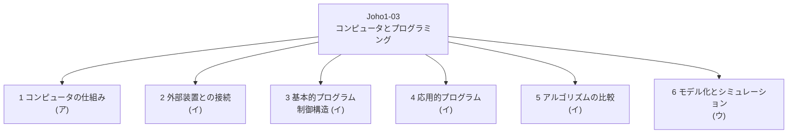
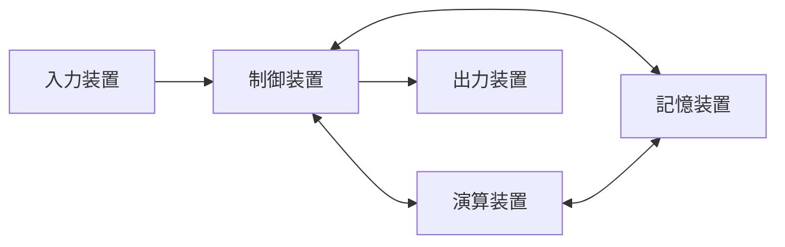
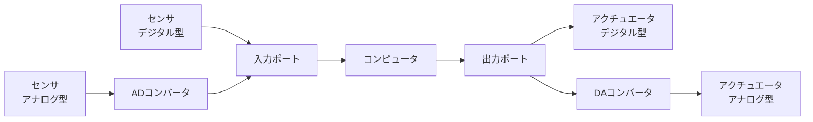
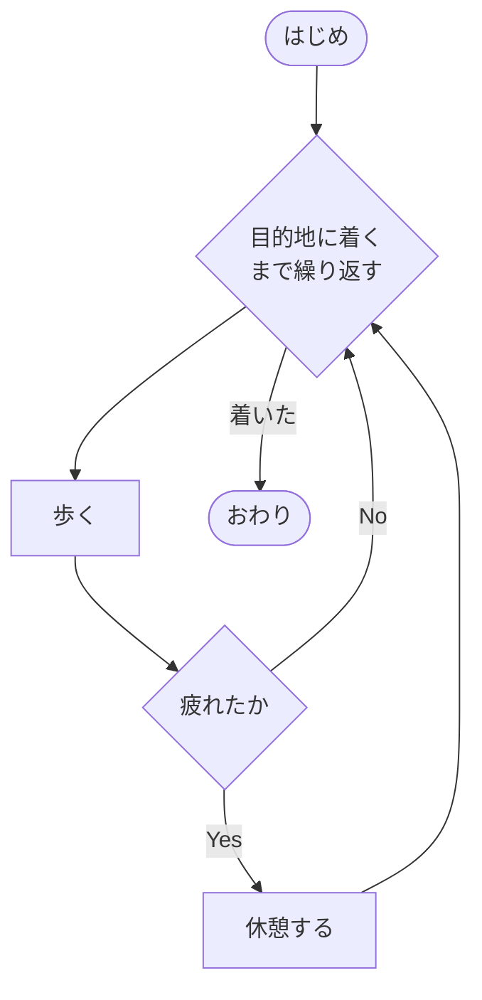
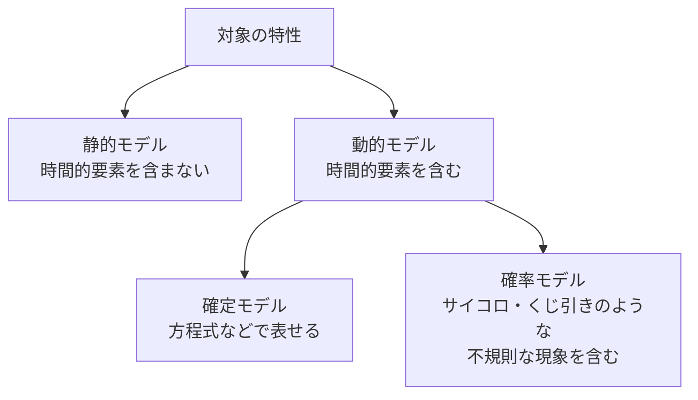

# Joho1-03: コンピュータとプログラミング

[Joho1-02](Joho1-02.md) がコミュニケーションと情報デザイン（人と人、人と情報の間をどう設計するか）を扱ったのに対し、本章は「コンピュータそのものが情報をどう処理するか」に踏み込む。コンピュータの内部構成・論理演算という土台から、外部装置との接続、アルゴリズムとプログラミングの基礎（順次・分岐・反復）、リストや関数などの応用的なプログラム、探索・整列アルゴリズムの比較、モデル化とシミュレーションまでを扱う、情報Ⅰの中でも分量の多い章である。章全体のねらいは「自然現象や社会現象の問題点を発見し、コンピュータやプログラミングを活用して解決策を考えられるようにする」ことにある。

!!! info "出典・凡例"
    出典: 文部科学省「高等学校情報科『情報Ⅰ』教員研修用教材」第3章 コンピュータとプログラミング（`JohoI/04_第3章_コンピュータとプログラミング.pdf`）。
    CS2023との対応: 探索・整列アルゴリズムやデータ構造の基礎は [AL-Foundational](../AL/AL-Foundational.md) と重なる領域を含む。

## 全体像 {#overview}

教材自身は本章を「(ア) コンピュータの仕組み」「(イ) アルゴリズムとプログラミング」「(ウ) モデル化とシミュレーション」の3つの柱で示している。本ページではこれをもう少し細分化し、6つの節に整理する。



---

## 1. コンピュータの仕組み {#computer-structure}

### 構成要素

ブラウザのアイコンをクリックして検索する場面を考えると、キーボードやマウスなどの**入力装置**でコンピュータに指示を与え、コンピュータが処理した結果が**出力装置**（ディスプレイ・プリンタなど）に表示される。

コンピュータの内部はさらに、**制御装置・演算装置・記憶装置・入力装置・出力装置**の5つで構成される。制御装置と演算装置をあわせて **CPU（Central Processing Unit）** と呼び、CPUは記憶装置から命令やデータを取り出して処理する。



制御装置と演算装置をあわせて CPU と呼ぶ。

- 入力装置・出力装置を含め、すべてを制御するのが制御装置、様々な演算を行うのが演算装置である。
- CPUの動作速度が速いほど、1動作あたりに実行する命令や処理するデータが多いほど性能が良いCPUとなる。
- **メモリ**はCPUにとっての作業領域。十分な広さが必要で、特に複数の仕事を同時に進行する場合は広くする必要がある。せまいとコンピュータ全体の処理速度が落ちる。
- **ハードディスク**は情報を保存しておく引き出しにたとえられる。大量の情報を保存できるが読み書きに時間がかかる。メモリが少ない場合、あふれたデータをハードディスクに保存するため、ハードディスクとのデータのやり取りにほとんどの時間がとられ、CPUが高速でも実行速度は上がらない。データの読み書きの速い **SSD（Solid State Drive）** をハードディスクの代わりに使うと、コンピュータの実質的な動作速度を上げることができる。

### 論理演算

現在のコンピュータの演算装置は、0か1のみで表現される2進数を扱うように設計されている。2進数を大きな桁で高速に演算することによりすべての演算を行う。その基本的な演算は四則演算とは異なり、**AND・OR・NOT** の3つである。0を「なし」、1を「あり」と考え、ベン図と表（真理値表）で表すと以下のようになる。

| 演算 | 意味 | 真理値表 | たとえ |
|---|---|---|---|
| **A and B**（論理積） | AとBの両方を含む | `0 and 0=0`／`0 and 1=0`／`1 and 0=0`／`1 and 1=1` | かけ算に似ている |
| **A or B**（論理和） | AとBのどちらかを含む | `0 or 0=0`／`0 or 1=1`／`1 or 0=1`／`1 or 1=1` | 足し算に似ている |
| **not A**（否定） | Aではない | `not 0=1`／`not 1=0` | — |

### 論理演算を用いた二進数の足し算

AND・OR・NOTの3つがあれば基本的にどんな計算も表すことができる。2進数の足し算を考えると、

```text
0 + 0 = 0
0 + 1 = 1    （or で対応できる）
1 + 0 = 1
1 + 1 = 10   （or では対応できない）
```

`A + B = CF` と表すと、C は繰り上がり、F は1桁目の値になる。A も B も 1 のときだけ `C = 1, F = 0` になる。

教材の演習では、OR ゲートが1つ与えられた論理回路の残りの部分（AND・NOTなど）を埋めて、この足し算（C と F）を成立させる問題が出題されている。

!!! tip "Fの並びに気づく"
    C と F の真理値表を並べてみると、F の列は「A と B が異なるときだけ 1」という並びになっている。これは一般に**排他的論理和（XOR）**と呼ばれる働きと同じパターンで、後続の学習で名前が出てきたときに思い出せるとよい。

### 四則演算の考え方

(3) では論理演算を用いた2進数の足し算を紹介したが、他の演算は以下のように考える。

- **引き算**: 教材は `5 - 3 = 2` を例に、「5 に 7 を足して1桁目の数字を用いる」という考え方を示している。ここで 7 は「3 に足すと10になる数（1桁あがる数）」であり、これを**補数**と呼ぶ。つまり**引き算は補数を使った足し算**として実現できる。
- **掛け算・割り算**: 2進数の掛け算は左シフトと足し算、割り算は右シフトと引き算を組み合わせて、筆算と同じように行う。シフト演算とは、2進数で書かれたビット列を左または右にずらす操作である。

### 計算誤差について

コンピュータで変数は、指定されたビット数の「箱」に入っていると考えるとわかりやすい。この箱に収まるものであれば誤差は生じないが、収まらないものは誤差が生じる。

教材はこれを魚の比喩で説明する。15ビットの箱を用意したとき、13ビットの魚Aは箱に収まる（誤差なし）が、20ビットの魚Bは箱に入らず、失われた5ビットが計算誤差の原因になる。コンピュータに計算させる際は、必要な精度に見合った箱を用意するとともに、計算の途中でその箱からはみ出さないよう注意する必要がある。

実際にプログラムでこれを体験する例が示されている。

```python
import sys
x = sys.float_info.max   # float型で表せる最大値をxに代入
print(x)                 # 画面にxの値を表示
x = 1.7976931348623157...e+308  # float型の最大値の小数点以下に5桁「9」を追加した値
print(x)                 # 画面にxの値を表示
x = 1.8e+308              # float型の最大値より大きな値
print(x)                 # 画面にxの値を表示
```

実行結果は `1.7976931348623157e+308` → `1.7976931348623157e+308`（扱える桁数を超えた分は切り捨て）→ `Inf`（オーバーフロー）となる。

さらに、整数同士の減算と小数同士の減算を比較すると計算誤差の存在がわかりやすい。

```python
x = 28 - 27     # 整数同士の減算
print(x)        # 1
y = 0.28 - 0.27  # 小数同士の減算
print(y)        # 0.010000000000000009
```

小数の `0.28` から `0.27` を引くと、本来なら `0.01` になるはずだが、実行結果は `0.01` ちょうどにはならない。これは数値が決められた桁数（ビット数）の有限のデータとして扱われることによる計算誤差である。

---

## 2. 外部装置との接続 {#external-devices}

### 計測・制御の仕組み

センサなどの装置を使って自然現象などの量を測ることを**計測**、ある目的の状態にするためにアクチュエータなどの装置を操作することを**制御**という。

コンピュータを使った計測は、センサなどの外部装置から得た計測データを**入力ポート**経由でコンピュータに入力する。制御は、コンピュータから**出力ポート**経由でアクチュエータなどの外部装置を操作するデータを出力する。

二値的に動作する**デジタル型**のセンサ・アクチュエータは入出力ポートに直接つながるが、連続的に動作する**アナログ型**の場合は、アナログをデジタルに変換する **AD コンバータ**や、デジタルをアナログに変換する **DA コンバータ**を経由する構成になる。



### センサとアクチュエータの例

**センサ**は自然現象の情報を人間や装置が扱いやすい信号に置き換える装置である。

| 使用例 | センサの種類 | 役割 |
|---|---|---|
| 冷蔵庫 | 温度センサ | 冷蔵庫内の温度を検知 |
| エアコン | 温度・湿度センサ | 室内の気温・湿度を検知 |
| 煙感知器 | 煙センサ | 煙を検知 |
| リモコン | 赤外線センサ | 赤外線による信号を検知 |
| 自動車 | 超音波・レーザー・レーダー等 | 前方や後方の障害物を検知 |
| スマートフォン | 加速度センサ | 傾きや動きを検知 |

**アクチュエータ**はコンピュータが制御した情報を物理的に伝える装置で、各種モータなどが使われる。動きは直進運動と回転運動に分けられ、動力源として電気・油圧・空気圧がある。DCモータは車輪のように連続して回転させ、サーボモータはロボットの腕の関節のように角度を指定して回転させる目的で使用する。

センサの値を取得するには、ポートから入力した生のデータをセンサの特性に合わせて計算式で物理量に変換する必要がある（教育用プログラミング言語では、この変換が不要な命令が用意されている場合もある）。アクチュエータの制御も同様に、物理量を出力データに変換する計算式が必要になることがある。

!!! note "中学校までの学習内容との関連"
    中学校の技術・家庭科技術分野「D情報の技術」では、計測・制御のプログラミングを扱う。高等学校「情報Ⅰ」では、この中学校での学習を踏まえて指導することになる。

### micro:bit を使ったプログラム例

教材は、教育用に作られイギリスで実践例が豊富な外部機器 **micro:bit** を用いて、加速度センサで得たデータに応じてLEDを制御するプログラミングを紹介している。

**① 順次**（LEDに丸を1秒点灯したあと消灯する）

```python
from microbit import *       # マイクロビット用モジュールの読み込み
maru = Image("09990:"
             "90009:"
             "90009:"
             "90009:"
             "09990:")
display.show(maru)           # LEDにmaruで設定したものを表示させる
sleep(1000)                  # 1秒停止
display.clear()              # LEDの表示を消す
```

**② 分岐**（加速度センサのX軸が右に傾いていれば「R」、そうでなければ「-」を表示）

```python
from microbit import *
while True:                          # ずっと繰り返す
    reading = accelerometer.get_x()  # 加速度センサのX軸の傾きを読む
    if reading > 100:                # X軸の傾きが100より大きいなら
        display.show("R")            # LEDに「R」を表示
    else:                            # そうでなければ
        display.show("-")            # LEDに「-」を表示
```

**③ 反復**（0から9までの数字を順に表示）

```python
from microbit import *
for i in range(10):     # i=0,1,…9とカウントを進めながら以下の処理を繰り返す
    display.show(i)     # LEDにiの値を表示
    sleep(1000)          # 1秒停止
    display.clear()      # LEDを消す
    sleep(1000)           # 1秒停止
```

---

## 3. 基本的プログラム（制御構造） {#control-structures}

問題を解決するための方法や手順を**アルゴリズム**といい、アルゴリズムをコンピュータが実行できる形式であらわしたものを**プログラム**という。アルゴリズムは流れ図（フローチャート）などを用いて図式化するとわかりやすい。

### 制御構造

どのようなアルゴリズムでも、処理の流れは**順次・分岐・反復**の3つの構造の組み合わせで構成される。このような処理の流れを**制御構造**という。

- **順次**: 1つ1つの処理を順番に行う。
- **分岐**: ある条件に応じて異なる処理を実行する。
- **反復**: ある条件が満たされている間はその処理を繰り返し実行する。

### 流れ図（フローチャート）

流れ図を使うと、処理の流れを視覚的に表現できる。「目的地に着くまで歩く。疲れたら休憩する」という例を分岐と反復の組み合わせで表すと、次のようになる。



アルゴリズムを表現する方法は流れ図だけではない。教材は、給湯ポット（ロック解除ボタン・給湯ボタンを持つ）を例に、「ロック状態」「ロック解除状態」「給湯」という状態とイベント（ボタン操作や時間経過）の関係を**状態遷移図・状態遷移表**でも表現できることを示している。また、UML（Unified Modeling Language）に含まれるアクティビティ図やシーケンス図のように、複数の処理が互いに通信しながら動作する様子を表現できる表記法も利用されている、と補足している。目的や内容に応じて表現方法を使い分けるとよい。

### 制御構造のプログラム例

**順次の例**（「おはよう」「こんにちは」「おやすみ」の順にメッセージを表示）

```python
print("おはよう")    # 「おはよう」と画面表示する
print("こんにちは")  # 「こんにちは」と画面表示する
print("おやすみ")    # 「おやすみ」と画面表示する
```

**分岐の例**（点数 x が60点以上なら「合格」、そうでなければ「不合格」を表示。x = 80とする）

```python
x = 80          # x=80とする
if x >= 60:      # xが60以上のときの処理
    print("合格")
else:            # xが60以上でないときの処理
    print("不合格")
```

**反復の例**（変数xに10を5回加算しながら、その都度xの値を表示。初期値は0）

```python
x = 0
print("x = ", x)
for i in range(1, 6, 1):  # 1から6未満の間、1ずつカウントを増やしながら繰り返す
    x = x + 10
    print("x = ", x)
```

`range(1, 6, 1)` の値は `1 <= i < 6` となる点に注意が必要である。カウント用の変数 `i` をプログラム内で使うことも可能で、「繰り返している回数をその都度表示する」といった処理もできる。

**分岐と反復を組み合わせた例**（変数xに10を5回加算するが、繰り返している回数が奇数回のときだけxの値を表示。奇数判定は `i % 2 == 1`）

```python
x = 0
print("x = ", x)
for i in range(1, 6, 1):
    x = x + 10
    if i % 2 == 1:      # iを2で割ったときの余りが1のとき
        print("x = ", x)
```

分岐と反復を組み合わせると、「繰り返していく中である条件を満たす場合だけ特定の処理を行う」ことが可能になり、アルゴリズムの表現の幅を広げることができる。

---

## 4. 応用的プログラム {#applied-programs}

### リスト

複雑なプログラムになるほど、変数名の異なる変数が多くなり取り扱いが困難になる。そこで、複数の値を1つの名前（変数名）と番号（添字）によって管理する仕組みである**リスト**が使われる。1つ1つの変数を**要素**、要素に付けられた番号を**添字**という。リストの値の参照や代入は「リスト名 `[` 添字 `]`」として扱うことが多い。

Pythonではリストは0番目から始まる点に注意が必要である。10個の数値からなるリストの合計を求めるプログラムは以下のようになる。

```python
a = [56, 3, 62, 17, 87, 22, 36, 83, 21, 12]
goukei = 0
for i in range(0, 10, 1):
    goukei = goukei + a[i]   # a[0]からa[9]まで全て加えていく
print(goukei)                # 399
```

### 乱数

ある一定の範囲内で、すべての数が同じ確率で現れるような数を**乱数**という。コンピュータは計算によって値を生成するため、正確には計算による擬似的な乱数（擬似乱数）しか生成できない。乱数をプログラム内で用いることで、実行するたびに処理内容が変わる変則的なプログラムを作成でき、現実世界のシミュレーションなどに活用できる。

Pythonでは `random` モジュールをインポートし、`random.randrange(10)` で0〜9の整数をランダムに発生させる乱数として扱うことができる。範囲を「1から」にしたい場合は、発生させた乱数に1を加える（`random.randrange(10) + 1` で「1〜10」になる）。

### 関数

一般にシステム開発で作られるプログラムは大規模でコードも長くなるため、文章の章・節・段落のような適切な構造を作らないと可読性が著しく低くなる。そこでプログラムの機能ごとにメインコードから切り離し、**関数**という単位で分割することで、プログラムを機能ごとに整理・構造化できる。作成した関数はメインコード内で何度でも呼び出せるため、機能の再利用も可能になる。

数学の関数が `y = f(x)` のように表現されるのと同様、プログラムの関数では x を**引数**（処理に必要なデータ）、y を**戻り値**（処理結果のデータ）と呼ぶ。関数で分割するときは「どのような処理を行っているか」と同時に、引数・戻り値が何であるかを把握する必要がある。

Pythonで関数を扱う場合は `def` 文を使う。リストの合計を求める処理を関数に分割した例:

```python
def listgoukei(a):            # 合計を求める関数listgoukeiを作成
    goukei = 0
    for i in range(0, len(a), 1):
        goukei = goukei + a[i]
    return goukei

a = [56, 3, 62, 17, 87, 22, 36, 83, 21, 12]
goukei = listgoukei(a)   # 作った関数listgoukeiを呼び出し
print(goukei)
```

`len(a)` によってリストaの大きさ（要素数）を事前にわからなくても調べることができ、戻り値は `return` で指定する。

### WebAPI

多くのシステムでは「ボタンを押したらウィンドウが開く」のように共通する処理が多い。共通する処理について、**API（Application Program Interface）**として関数に近い形で提供されていることがあり、これを使って開発することで開発期間の短縮につながる。インターネット上のサービスやビッグデータへのWebの通信を利用したアクセス機能を提供しているAPIを**WebAPI**といい、現在のシステム開発において利用されている。

教材は、WebAPIを利用して郵便番号からそれに対応する住所を表示するプログラムを示している（`requests` モジュールと `json` モジュールをインポートして使う）。

```python
import requests
import json

url = "http://zipcloud.ibsnet.co.jp/api/search"   # 使用するWebAPIのURL
param = {"zipcode": "100-0013"}                     # WebAPIの引数

res = requests.get(url, params=param)               # WebAPIの戻り値がresへ
response = json.loads(res.text)
address = response["results"][0]

print(address["address1"] + address["address2"] + address["address3"])
```

---

## 5. アルゴリズムの比較 {#algorithm-comparison}

リストなどの中から必要なデータを探し出すことを**探索**、リストの中を昇順・降順に並べ替えることを**ソート**という。

### 探索アルゴリズム: 線形探索と二分探索

- **線形探索**: リストを先頭から順に比較しながら探索値に一致するデータを探し出す方法。探索値とリスト内のデータを先頭から順番に比較していき、一致したデータがあればその場所（添字）を表示する。

    ```python
    def linsearch(a, p):
        for i in range(0, len(a), 1):
            if a[i] == p:
                print("見つかりました")
                break
    ```

- **二分探索**: リストの中から探索範囲を半分ずつ狭めながら目的のデータを探し出す方法。あらかじめ昇順（または降順）にソートされたリストが対象になる。下限添字・上限添字から中央添字を求め、中央値と探索値を比較して探索範囲を半分に絞り込む処理を繰り返す。

    ```python
    def binsearch(a, p):
        i = 0
        j = len(a) - 1
        while i <= j:
            m = int((i + j) / 2)
            if a[m] == p:
                print("見つかりました")
                break
            else:
                if a[m] > p:
                    j = m - 1
                else:
                    i = m + 1
    ```

- **比較**: 左側から探索を行う線形探索は、探索値が左端にあるか右端にあるかで探索回数が大きく変わり、データ数が多い場合は時間がかかることが多い。二分探索は1回の探索で見つからなくても探索範囲をデータ数の半分に絞れるため、データ数が大きくなっても探索にかかる時間はそれほど増加しない場合が多い。ただし二分探索には事前にデータを並べ替えておく必要があり、「事前にデータが並べ替えられている保証がない場合」や「データの数がそれほど多くなくシンプルなアルゴリズムの方が望ましい場合」などは、一概に二分探索が優れたアルゴリズムとは言い切れない。

### ソートアルゴリズム: 選択ソートとクイックソート

- **選択ソート**: リスト内のデータから最小値を探索し、最小値から順に取り出すことで並べ替えを実現する。

    ```python
    def selectionsort(a):
        for i in range(0, len(a), 1):
            for j in range(i + 1, len(a), 1):
                if a[j] < a[i]:
                    temp = a[i]
                    a[i] = a[j]
                    a[j] = temp
    ```

- **クイックソート**: リスト内の1つのデータを軸として大小2つに分割したあと、分割したデータに対して同じ処理を再度行うことで並べ替えを実現する。

- **比較**: データ数がN個の場合、選択ソートは「複数の要素から最小値を探す」処理をN-1回行うことになり、データ数が大きくなるほどこの処理回数が膨大になり、処理に必要な時間が多くなりやすい。クイックソートは基準値をもとに2分割しながら並べ替えの処理を行うので、二分探索と同じようにデータ数が大きくなっても処理の回数が膨大になりにくい。しかし、クイックソートでは逆順に並べ替えられている場合など、ある条件下では比較を行う回数が膨大になり、選択ソートよりも処理に必要な時間が多くなることもある。ソートアルゴリズムの場合においても、必ずしもクイックソートの方が優れたアルゴリズムであるとは言い切れない。

!!! tip "同じ問題でも複数の解決方法がある"
    探索・ソートいずれの比較でも教材が繰り返し伝えているのは、「一見高性能に見えるアルゴリズム（二分探索・クイックソート）が常に最善とは限らず、データの状態や規模によって適切な方法は変わる」という点である。問題の解決には様々な方法があり、それらを比較検討して最善の方法を見つけることが重要になる。

---

## 6. モデル化とシミュレーション {#modeling-simulation}

### モデル化とシミュレーション

**モデル**とは、事物や現象の本質的な形状や法則性を抽象化して、より単純化したものを指す言葉であり、事物や現象のモデルを作ることを**モデル化**と呼ぶ。モデルを使って実際にどのような現象が起こるのかを予測することを一般に**シミュレーション**と呼ぶ。

モデルは表現形式や対象の特徴によって分類できる。表現形式では**縮尺モデル**（建築模型のように実物を縮小したもの）・**数式モデル**（数式で表したもの）・**図的モデル**（図で表したもの）に分けられる。



対象の特性による分類では、静的モデルはプラスチックモデルや建築図面などのように時間的要素を含まないもの、動的モデルはレジの待ち行列や気象予測、生物の成長など時間的要素を含んだ事象のモデルである。動的モデルはさらに、確定モデル（不規則な現象を含まず方程式などで表せるモデル）と確率モデル（サイコロやくじ引きのような不規則な現象を含んだモデル）に分かれる。

### 確定モデルのシミュレーション（複利計算）

確定モデルの例として、複利法による預金金額の時間的変化を考える。複利法は元金に利息を加算し、それを次の期間の元金として利息を計算していく方法である。法則が一定のものは数式に表すことができ、数式に表すこともモデル化の一種である。

```text
次期の金額 = 現在の金額 + 利息
利息 = 現在の金額 × 利率 × 時間間隔
```

この数式モデルをプログラムに置き換えて計算し、`matplotlib` を使ってグラフで表示すると、預金額が年を追うごとに指数関数的に増えていく様子を視覚的に確認できる。

### 確率モデルのシミュレーション（サイコロとモンテカルロ法）

サイコロの目の出方について考える。6面体のサイコロは各面積が等しく、振り方に偏りがなければ、目の出方は各面が6分の1の確率で出現するはずである。コンピュータ言語には、このような一様乱数を発生させるための関数が標準的な機能として提供されており、`randint()` のような関数で整数の乱数を発生させ、サイコロのモデルをプログラミングできる。

確率モデルを使ったシミュレーション手法に**モンテカルロ法**がある。モンテカルロ法の特徴は、対象のモデルに乱数を大量に生成して入力し、近似解を得ようとする手法である。教材はこの方法を使って円周率を求める例を示している。平面の第1象限部分（X方向・Y方向とも1の長さをもつ正方形内）にランダムに点を打ち、単位円（`r*r = x*x + y*y`）の内側に入った点の数と全ての点の数との割合は、点の数が多ければ多いほど円の第1象限部分の面積（π/4）に確率的に近づいてくる、という考え方である。

```python
import numpy.random as rd
totalcount = 1000    # ランダムに打つ点の総数
incount = 0           # 円に入った点の数
for i in range(totalcount):
    x = rd.random()   # 0-1の範囲の値
    y = rd.random()   # 0-1の範囲の値
    if x**2 + y**2 < 1.0:   # 単位円の中に入ったら
        incount += 1         # 入ったカウンターに1を加える
print("円周率:", incount * 4.0 / totalcount)
```

点の総数を増やすほど、結果は円周率に近づいていく。

### 自然現象のモデル化とシミュレーション

**物体の放物運動**をモデル化し、初速度と投げ上げる角度によって物体がどのような軌跡を描いて飛んでいくのかをシミュレーションする例が示されている。単純化のため空気抵抗は省く。物体の移動する軌跡は水平（X）方向と鉛直（Y）方向の移動に分けて考え、鉛直方向には重力加速度を受ける。

- **水平方向**: 摩擦を受けない条件から等速運動であり、水平方向の初速度は「初速度 × cos(投げ上げる角度)」で求まる。
- **鉛直方向**: 重力加速度によって速度が変化していく。鉛直方向の初速度は「初速度 × sin(投げ上げる角度)」で求まり、微小時間が経過するごとに速度・位置を少しずつ更新していく。

角度の指定には**弧度法（ラジアン）**を使う（0度=0ラジアン、90度=π/2ラジアン、180度=πラジアン、360度=2πラジアン）。このモデルをプログラムで実行し、投げ上げる角度を変えながら実行すれば、どの角度が最も遠くまで、あるいは高く飛ぶのかをシミュレーションによって調べることができる。

**生命体の増加シミュレーション**では、自然界における生物の個体数がある一定の環境内で一気に繁殖する性質をモデル化する。個体数が増加する数は「個体数 × 増加率」、個体が減少する数は「個体数 × (現在の個体数 / 環境収容力) × 増加率」と定義する。生存しうる個体数の上限（**環境収容力**）を超えて増えようとすると減少数が増加数を上回るように設計されているため、シミュレーション結果は環境収容力に収束する**S字曲線（ロジスティック曲線）**を描く。

**ランダムウォークのシミュレーション**は、ブラウン運動や株価の変動など不確実な現象を表すモデルとして用いられる。ある物体が次の時間変化後にどの方向へ行くか予測できない状況で、動く方向が一様な乱数に従う場合、現在位置 `(x0, y0)` と次の時間変化後の位置 `(x, y)` の関係は、0〜1の乱数を発生させる関数 `random()` を用いて次のように表せる。

```text
x = x0 + random() - 0.5
y = y0 + random() - 0.5
```

この処理を繰り返すことで、でたらめに行動する生物や人間の行動などを分析するための、様々な分野のシミュレーションの基礎として利用されており、近年では機械学習にもよく用いられている。

### 章全体を貫く問題解決の流れ

章末では、本章全体を通じた学習活動の流れとして、「問題の発見 → 分析・問題の定義 → 情報の収集とプログラミング → 計画の立案 → プログラミングの実行 → 振り返り → 次の問題解決へ」という一連のサイクルが示されている。コンピュータやプログラミングを活用した授業を計画するうえでの留意点として、効果的なプログラミングの活用、プログラミングの習熟度に合わせた対応、モデルベースで現象の問題点を発見させること、体験的な活動の活用、シミュレーションにおける具体的なデータの活用の5点が挙げられている。

---

## 学習目標 {#learning-outcomes}

教材の【学習目標】より（教員研修用教材としての記載を、学習内容に即して整理）:

- 問題解決にコンピュータや外部装置を活用する活動を通して情報の科学的な見方・考え方を働かせ、**コンピュータの仕組みとコンピュータでの情報の内部表現、計算に関する限界**（計算誤差など）について理解する。
- アルゴリズムを表現しプログラミングによってコンピュータや情報通信ネットワークの機能を使う方法や技能を身に付け、生活の中で使われているプログラムを見いだして改善しようとするなど、情報社会に主体的に参画しようとする態度を育成する。
- **モデル化やシミュレーション**の考え方を様々な場面で活用できるようにし、問題発見や解決に役立て、問題の適切な解決方法を考える力を育成する。

## 前後のユニット {#related-units}

- 前: [Joho1-02](Joho1-02.md) — コミュニケーションと情報デザイン
- 次: [Joho1-04](Joho1-04.md) — 情報通信ネットワークとデータの活用
- 関連: [AL-Foundational](../AL/AL-Foundational.md) — アルゴリズム・データ構造の基礎（探索・ソートの考え方が重なる）
- 関連: [OS-Purpose](../OS/OS-Purpose.md) — OSの役割と目的（CPU・メモリなどコンピュータの基本構成と重なる領域を含む）

疑問が出たら [Joho1-03 Q&A](Joho1-03-QA.md) に記録する。
