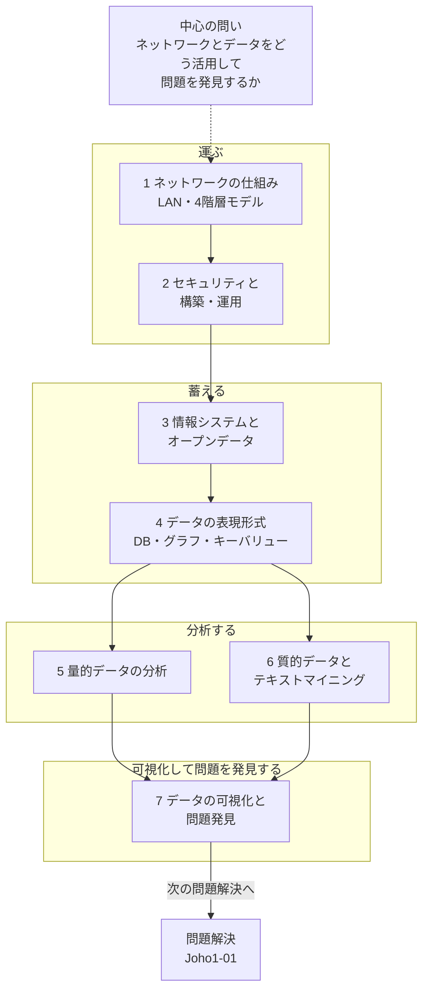

# Joho1-04: 情報通信ネットワークとデータの活用

[Joho1-03](Joho1-03.md) では1台のコンピュータの中の仕組み（ハードウェア・アルゴリズム・プログラミング）を扱った。本章はその視野を1台の外に広げ、**複数のコンピュータをつなぐ情報通信ネットワークの仕組み**と、そこでやり取りされる**データをどう蓄積・表現・分析・可視化するか**を扱う、情報Ⅰの最終章（第4章）である。教材は「(ア) 情報通信ネットワークの仕組みと役割」「(イ) 情報システムとデータの管理」「(ウ) データの収集・整理・分析」という3本の柱から構成され、学習18〜24の7つの「学習」に分かれている。

!!! info "出典・凡例"
    出典: 文部科学省「高等学校情報科『情報Ⅰ』教員研修用教材」第4章 情報通信ネットワークとデータの活用（`JohoI/05_第4章_情報通信ネットワークとデータの活用-巻末.pdf`）。ファイル名の「巻末」は、教材全体の巻末（有識者名簿・学会連絡先・奥付）がこのPDFの末尾に含まれていることを指す。本ページでは章末コラム程度の軽い言及に留める。
    ネットワークの基礎（LAN・プロトコル・階層モデル）は CS2023 の [NC-Fundamentals](../NC/NC-Fundamentals.md) と重なる領域を含むが、本教材は高校生向けに家庭内LANの構築・運用という実践的な切り口から説明しており、CS2023のような層構造・カプセル化の理論的整理までは踏み込んでいない。

## 全体像 {#overview}

**図の読み方**

- 中心の問い「ネットワークとデータをどう活用して問題を発見するか」を軸に、データが運ばれ・蓄えられ・分析され・可視化されるまでの一本のパイプラインとして読む。
- 運ぶ: [1. 情報通信ネットワークの仕組み](#network-fundamentals) → [2. 無線LANのセキュリティと構築・運用](#network-security-operation)。CS2023側の [NC-Fundamentals §4](../NC/NC-Fundamentals.md#layers) の階層モデルと対応する。
- 蓄える: [3. 情報システムとオープンデータ](#information-systems) → [4. データの表現形式](#data-representation)。
- 分析する: [5. 量的データの分析](#quantitative-analysis) と [6. 質的データとテキストマイニング](#qualitative-analysis-textmining)。
- 可視化して問題を発見する: [7. データの可視化と問題発見](#data-visualization)。ここで見つかった問題は [Joho1-01 §1](Joho1-01.md#info-media-problem-solving) の問題解決の手順に戻ってつながっていく。

---

## 1. 情報通信ネットワークの仕組み {#network-fundamentals}

**（学習18: 情報通信ネットワークの仕組み）**

家庭・コンビニエンスストア・歯科医院のような**小規模LAN**、学校や企業の営業所のような**中規模LAN**、大企業の本社ビルのような**大規模LAN**というように、LAN (Local Area Network) には接続機器数に応じた規模の違いがある。なお、都道府県内の各学校のように地理的に離れた拠点をつなぐ場合は、単一の大規模LANではなく、各校のLANを広域ネットワーク（WAN）で接続する構成として説明されるのが一般的である。家庭内LANには、パソコン・タブレット・スマートフォン・プリンタだけでなく、テレビや録画用HDD、電子レンジなど**IoT (Internet of Things)** に連なる多様な機器が接続され得る。

教材は通信の手順を**プロトコル**（通信する際の規定）と呼び、インターネットの通信を上位から**アプリケーション層・トランスポート層・インターネット層・ネットワークインタフェース層**の**4階層**に分けて説明する（TCP, IPv4, IPv6, DHCP, HTTP, SMTP, POP などが各層に対応するプロトコルの例として挙げられている）。通信は上位のアプリケーション層から下位の層へ移動するたびに、各層のプロトコルに従って宛先や制御情報を示す**ヘッダ**が付加され、最下層のネットワークインタフェース層で実際の物理的な通信（電気信号や電波）が行われる。

!!! note "CS2023の5層モデルとの違い"
    CS2023 [NC-Fundamentals §4](../NC/NC-Fundamentals.md#layers) は「データリンク層」と「物理層」を分けた**5層モデル**を採る。本教材の4階層は、この2つを「ネットワークインタフェース層」としてまとめた呼び方に相当する。どちらも「アプリ寄りほど抽象的・媒体寄りほど具体的」という階層の考え方は共通している。

有線LANと無線LANの違いは、外見上は Ethernet（IEEE802.3）に従った電気信号を使うか、電波を使うかという**物理的な違い**である。無線LANは IEEE802.11 で規格化されている。

| | メリット | デメリット |
|---|---|---|
| 無線LAN | 設置工事がほとんど不要、ハブやLANケーブルが不要 | 通信速度が有線より遅い傾向、接続機器の特定が困難、電波干渉を受けやすい、通信内容を傍受されやすい |

## 2. 無線LANのセキュリティと構築・運用 {#network-security-operation}

**（学習18(2)(3)・学習19: 情報通信ネットワークの構築）**

無線LANでは空気中を電波でデータを伝送するため、有線LANに比べて**傍受が容易**というデメリットがある。無線LANのセキュリティ規格は、**認証・鍵交換の方式**（接続を許可する相手を確認し暗号鍵を共有する仕組み）と、**データ暗号化の方式・アルゴリズム**（実際の通信内容を暗号化する仕組み）に分けて整理できる。

| 規格 | 認証・鍵交換 | データ暗号化 |
|---|---|---|
| WEP | 共有キー認証 | WEP（RC4） |
| WPA | PSK認証 | TKIP（RC4） |
| WPA2 | PSK認証／802.1X認証 | CCMP（AES） |
| WPA3-Personal | **SAE**（Simultaneous Authentication of Equals） | CCMP（AES） |

WPA3-Enterpriseにはさらに**192-bitセキュリティモード**があり、政府機関などの高いセキュリティ要求に応えるため**CNSA (Commercial National Security Algorithm) スイート**に準拠したより強力な暗号アルゴリズム群（AES-256等）を用いる。

- **WEP** は現在ではフリーウェアで暗号化キーが数秒で解読されるほど脆弱であることが知られ、ほとんど使われていない。
- 安全性を高めるために **WPA-TKIP**、さらに **WPA2-CCMP(AES)** が用いられてきたが、2017年10月に WPA2 の脆弱性（KRACK Attacks）が複数報告され、新たな規格 **WPA3** が検討されるに至った。
- 公衆無線LANの中には暗号化方式を設定していないアクセスポイントも多く、接続の容易さとセキュリティはトレードオフの関係にある。

小規模LANを実際に構築する際は、SSID・暗号化キー・暗号化方式・**DHCP** (Dynamic Host Configuration Protocol、IPアドレスの自動配布)・フィルタ設定など様々な項目を理解して適切に設定する必要がある。SSIDを一覧に表示されないよう設定する（ステルスSSID）ことはできるが、SSIDは通信そのものから検出され得るため単独では十分なセキュリティ対策にはならず、あくまで**強固な認証・暗号化方式の設定**と組み合わせる補助的な対策として位置づけるべきである。暗号化キーを推測されにくくすることも含め、**接続の容易さとセキュリティのトレードオフ**は家庭・学校・公衆無線LANのそれぞれで異なる基準になる。

ネットワークにトラブルが生じた場合（例: プリンタに印刷できない）は、電源・ケーブル接続・LANへの参加設定・アプリの設定など考えられる原因を洗い出し、**どの部分を点検すればどこの障害が切り分けられるか**を考えながら順序立てて点検することで、原因を特定できる。

## 3. 情報システムとオープンデータ {#information-systems}

**（学習20: 情報システムが提供するサービス）**

私たちの生活は POS システム（Point Of Sales System、店舗経営の効率化・売上分析・在庫管理）、電子決済システム、SNS、高度道路交通システム (ITS)、緊急地震速報システム、eラーニングシステム、住民基本台帳システムなど、様々な**情報システム**に支えられている。これらは情報通信ネットワークを通じてデータを送受信して運用され、蓄積された膨大なデータ（**ビッグデータ**）を課題解決に活用することが重視されている。

国・地方公共団体・事業者が保有するデータのうち、次の3条件を満たす形で公開されたものは**オープンデータ**と呼ばれる（総務省「オープンデータ基本指針」）。

1. 営利・非営利を問わず二次利用可能なルールが適用されたもの
2. 機械判読に適したもの
3. 無償で利用できるもの

オープンデータの公開は、国民参加・官民共同による課題解決、行政の高度化・効率化、透明性・信頼の向上につながるとされる。教材は、地理情報データを **GIS (Geographic Information System)** で可視化する例として、政府統計の総合窓口（e-Stat）の **jSTAT MAP** を使い、川越市の AED 設置場所データと町丁・字等別人口密度データを重ねて表示し、「人口密度が高いのにAEDが少ない場所」のような問題発見につなげる手順を紹介している。

## 4. データの表現形式 {#data-representation}

**（学習21: さまざまな形式のデータとその表現形式）**

データを一定の形式で整理・蓄積する仕組みが**データベース**であり、特に**リレーショナルデータベース（関係データベース）**が広く使われている。表形式の**テーブル**として管理し、列を**フィールド**、1件分のデータを1行の**レコード**と呼ぶ。複数のテーブルを関連付けて結合利用することもできる。操作には **SQL (Structured Query Language)** を用いる。

| 関係演算 | 内容 |
|---|---|
| 選択 | テーブルから条件を満たすレコードを抽出する |
| 射影 | テーブルから一部のフィールドを取り出す |
| 結合 | 複数のテーブルを1つの表にする |

同じ作者名を全レコードに重複して持たせず、テーブルを書籍用・作者用に分けて更新漏れを防ぐような設計の工夫を**テーブルの正規化**という。

つながりを表すデータ（SNSの人間関係、鉄道の路線など）は表形式より**離散グラフ**で表現する方が扱いやすい場合がある。頂点（ノード）と辺（エッジ）から成り、方向性を考えない**無向グラフ**と、方向性を持つ**有向グラフ**がある。コンピュータ上での表現方法には次の2つがある。

- **隣接行列**: 頂点同士がつながっていれば1、いなければ0を並べた2次元配列。辺が少ないと0だらけの**疎行列**になる。
- **隣接リスト**: 各頂点について接続している頂点のリストを持たせる表現（例: `{a: [b,c,d], b: [a,d], ...}`）。項目（キー）と値（バリュー）の組で表すこの形式を**キー・バリュー形式**という。

インターネット上のサービスは、プログラムからデータを扱えるよう **Web API (Application Programming Interface)** を通じて **XML形式**や**JSON形式**でデータを提供していることが多く、いずれも項目と値をセットにして表現する。Python の**辞書**のようにキー・バリュー形式のデータを直接扱えるプログラミング言語もある。リレーショナルデータベース以外にキー・バリュー形式などに対応したデータベース（Amazon DynamoDB など）もあり、これらは総称して **NoSQL** と呼ばれ、ビッグデータの活用と関連して注目されている。

## 5. 量的データの分析 {#quantitative-analysis}

**（学習22: 量的データの分析）**

データは測定される尺度（モノサシ）の違いで4種類に分類できる。

| 分類 | 尺度 | 例 | 特徴 |
|---|---|---|---|
| 質的データ | 名義尺度 | 性別 | 分類のみ、順序なし |
| 質的データ | 順序尺度 | 成績評価（優・良・可） | 順序はあるが差の大きさは保証されない |
| 量的データ | 間隔尺度 | 気温 | 差は意味を持つが比は意味を持たない（絶対的な0がない） |
| 量的データ | 比例尺度 | 身長・体重 | 絶対的な0を持ち、差も比も意味を持つ |

行が観測対象・列が観測項目に対応する表形式は**構造化データ**の代表的な観測形式の一つであり、観測の仕方によって、時点に沿って得られる**時系列データ**、同時点で同質の対象を複数観測する**クロスセクションデータ**、さらに同じ対象を複数時点にわたって観測する**パネルデータ**のような形式に分けられる。分析の前処理として、記録のない**欠測値**の扱い、名義・順序尺度でグループ分けする**層別**、人口あたりに換算するなどの**変数変換**、量的データを区切って順序尺度に変換する**水準化**がある。

代表値（平均値・中央値・最頻値）に加え、データを4等分する境界値である**四分位数**（第1〜第3四分位数）を最小値・最大値とあわせて図示する**箱ひげ図**で分布のばらつきを比較できる。2変量の関係は**散布図**と**相関係数**（-1〜1、絶対値が1に近いほど直線的な関係が強い）で捉え、相関があれば**単回帰分析**で予測モデル `y = αx + β`（単回帰直線）を作れる。実際の値と直線上の値との差を**残差**といい、残差の2乗和が最小になるように直線を決める方法を**最小二乗法**、モデルの当てはまりの良さを表す指標を**決定係数 R²**（0〜1）という。

標本データから母集団の性質（母数）を推測する**統計的仮説検定**では、検証したい仮説を**対立仮説**、その逆を**帰無仮説**とし、帰無仮説の下で観測された値と同程度以上に極端な検定統計量が得られる確率（**有意確率・p値**）があらかじめ定めた**有意水準**（多くは5%）を下回れば帰無仮説を棄却して対立仮説を採択する。帰無仮説が正しいのに棄却する誤りを**第1種の過誤**、対立仮説が正しいのに棄却できない誤りを**第2種の過誤**という。

## 6. 質的データとテキストマイニング {#qualitative-analysis-textmining}

**（学習23: 質的データの分析）**

質的データ（名義尺度・順序尺度）は、量的データと同じ演算（平均値の計算など）や可視化をそのまま適用できないことがある点に注意が必要である。例えば学年番号のように名義尺度に任意に割り当てた番号に総和や平均を取っても、多くの場合意味を持たない。ただし例外もあり、男性=1・女性=0のような**0/1の指示変数**の平均は、`[1,0,1,0,1]`の平均が0.6になるように該当する側（この例では男性）の**割合**をそのまま表すため、意味を持つ数値になる。

日本語のテキストデータは英語と異なり単語の間に空白がないため、単語や品詞に基づく分析を行う際には、文章を意味のある最小単位に分解する**形態素解析**（代表的なソフトウェアに MeCab・茶筅）がよく用いられる（単なる保存・検索や、文字単位・サブワード単位で処理する場合には必須ではない）。教材は Web ベースの「ユーザーローカルテキストマイニングツール」で太宰治『走れメロス』を分析し、出現頻度に応じて文字の大きさを変えて単語を並べる**ワードクラウド**や出現頻度グラフを作る例、統計解析ソフトウェア R と MeCab（RMeCab パッケージ）で形態素解析を行う例を示している。**テキストマイニング**はアンケートの自由記述分析、小説の作品・作者分析、SNSの発言・トレンド分析などに応用され、スマートフォンの AI アシスタント（Siri・Cortana・Alexa など）の音声認識・意味解釈にも関連する技術である。

## 7. データの可視化と問題発見 {#data-visualization}

**（学習24: データの形式と可視化）**

質的データ×質的データの関係は、量的データ向けの散布図では適切に表現できないことが多い。**分割表（クロス集計表）**や、モザイク図・マリメッコチャートのような専用の可視化手法が用いられる。質的データ×量的データの分布比較には、箱ひげ図に加えて分布の形状まで表せる**ヴァイオリンプロット**が使える。表計算ソフトウェアやRのほか、**Tableau** のような可視化専用ソフトウェア（BIツール）も紹介されている。

可視化は問題発見につながる一方、誤読を招く落とし穴もある。教材は米国のダイヤモンド取引データを例に、**カットの質が上がるほど価格が下がる**という一見不思議な現象を示し、その背景に対象2変数の両方に相関する隠れた変数である**交絡因子**が存在しうることを指摘している。また、立体グラフや円グラフが誤解を招く表現になりやすいことにも触れ、可視化を批判的に評価する態度の必要性を述べている。

!!! note "章末コラム: 全体を通じた学習活動の進め方"
    教材の章末には、(ア)ネットワークの仕組み・(イ)データの蓄積管理・(ウ)データの分析という3項目を「問題の発見 → 問題の明確化 → データの収集と整理・変換 → データの分析と可視化 → 分析結果の発表と解釈 → 分析の評価 → 次の問題解決へ」という一連の流れで**2つ以上を有機的に接続して**扱う総合的な実習を推奨するまとめが置かれている。またPDF末尾には教材制作に関わった有識者名簿・関連学会の連絡先・奥付（発行: 文部科学省、制作: エヌ・ティ・ティラーニングシステムズ株式会社、平成31年3月29日発行）が付されている。

---

## 学習目標 {#learning-outcomes}

教材冒頭の「学習目標」より：

- 情報通信ネットワークや情報システムにより提供されるサービスを活用する活動を通して、情報の科学的な見方・考え方を働かせて、情報通信ネットワークや情報システムの仕組みを理解する。
- データを蓄積・管理・提供する方法、データを収集・整理・分析する方法、情報セキュリティを確保する方法を身に付け、目的に応じて情報通信ネットワークや情報システムにより提供されるサービスを安全かつ効率的に活用する力や、データを問題の発見・解決に活用する力を身に付ける。
- 情報技術を適切かつ効果的に活用しようとする態度、データを多面的に精査しようとする態度、情報セキュリティなどに配慮して情報社会に主体的に参画しようとする態度を身に付ける。

## 前後のユニット {#related-units}

- 前: [Joho1-03](Joho1-03.md) — コンピュータとプログラミング
- 関連: [NC-Fundamentals](../NC/NC-Fundamentals.md) — ネットワークの基礎（重なる内容がある場合のみ）

疑問が出たら [Joho1-04 Q&A](Joho1-04-QA.md) に記録する。
