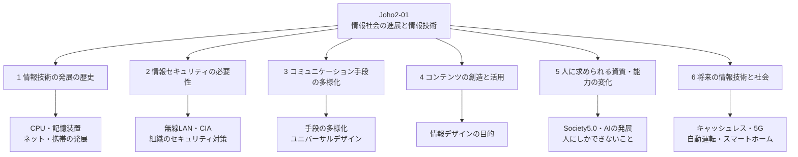

# Joho2-01: 情報社会の進展と情報技術

文部科学省「高等学校情報科『情報Ⅱ』教員研修用教材」の第1章。情報Ⅱの導入にあたる単元で、情報Ⅰの内容を土台にしつつ、情報技術の発展の歴史・情報セキュリティ・コミュニケーション手段の多様化・コンテンツの創造と活用・AIの発展に伴う人の資質能力の変化・将来の情報技術と社会という6つの学習項目を通しで扱う。個別の技術を深掘りするというより、**情報技術がどう発展し、それが社会や人にどう影響してきたか（そしてこれからも影響していくか）**という大きな流れを掴むことに重点がある章になっている。

!!! info "出典・凡例"
    出典: 文部科学省「高等学校情報科『情報Ⅱ』教員研修用教材」第1章 情報社会の進展と情報技術（`JohoII/01_第1章_情報社会の進展と情報技術.pdf`）。

## 全体像 {#overview}

---

## 1. 情報技術の発展の歴史 {#technology-development}

### コンピュータの処理能力の向上

1947年に半導体の基本素子である**トランジスタ**が発明され、1960年代には複数の素子を1つの回路にまとめた**IC**、1970年代には大規模集積回路の**LSI**へと進化した。CPUの性能は回路をどれだけ細かく作れるか（製造プロセス）に大きく左右され、微細化が進むほど単位面積あたりのトランジスタ数が増え、動作速度が上がり消費電力も下がる。世界初のマイクロプロセッサは1971年に登場した4ビットCPUで、トランジスタ数は約2,300個だったが、2017年には64ビット・約10億個以上にまで増加した。

1965年、CPU製造会社の創業者の一人ゴードン・ムーア氏は「半導体素子に集積されるトランジスタ数は1年に2倍の割合で増加する」という予測を発表し、以後「18〜24カ月で倍増する」という形で40年以上にわたり裏付けられ続けたことから**ムーアの法則**と呼ばれるようになった。2000年代後半になると半導体の微細化が限界に近づき周波数を上げにくくなったため、1チップに複数コアを積んで並列動作させる方法や、量子コンピュータなど従来と異なる動作原理の技術によって性能を向上させる研究が進んでいる。

こうした処理能力の向上・小型化・省電力化・低価格化により、コンピュータは特定の業務のための高価な機材から、個人が身に付けて持ち歩く手軽なツールへと変化してきた。

### 記憶装置やモニタ画面の高性能化・微細化

外部記憶装置は、1970年代のフロッピーディスク（FDD、8インチ→5.25インチ→3.5インチ1.44MBの順に主流が変化）から、安価になったハードディスクへ、そして2010年代には非常に高速で軽く衝撃にも比較的強い半導体記憶素子SSDへと移り変わった。CPUの高性能化やOSのGUI化・マルチタスク化に伴い、主記憶容量や画像表示用メモリ（VRAM）、モニタ画面も高性能化・微細化が進み、画像・音声・動画のデジタル編集や保存が現実的になった。

### インターネットと携帯電話の発達

| | 1980年代 | 1990年代 | 2000年代 | 2010年代 |
|---|---|---|---|---|
| 特徴 | 主にパソコン通信 | 商用インターネット開始・普及初期 | ブロードバンドの普及 | パソコンからモバイル端末へ |
| 接続方法 | 従量制アナログ回線 | 常時接続が始まる（ISDN、CATV） | 常時接続（FTTH） | 常時接続（FTTH、LTE） |
| 主な利用者 | 専門知識を持つ一部の個人 | 一部の個人・家庭・一部の企業 | 多くの家庭・企業 | 広く一般の個人・家庭・企業・機関 |
| 利用メディア | 文字中心 | 文字中心・画像 | 文字・画像・音楽・動画 | 文字・高精細な画像や音楽・動画 |

インターネット以前は電話回線を使ったダイヤルアップの「パソコン通信」が中心で、費用の面から必要なときにのみ接続することが多かった。移動通信は1G（アナログ）から始まり、2Gでデジタル化・インターネット接続機能が追加され、2000年代の3Gでカメラ機能や電子決済機能を伴う多機能化が進み、2000年代後半のスマートフォン登場とLTE（4G）の普及でモバイル端末中心の利用へ移行した。ブロードバンドや高速モバイル通信の普及に伴い、個人の情報発信（ブログ・SNS）や常時接続を前提としたプッシュ型通知、動画配信、電子商取引が一般化し、インターネットは重要な社会インフラの一つになった。

### 情報システムの変化と将来

企業のコンピュータ活用は、1960年代の専用端末＋汎用機、1980年代からのクライアント・サーバ型を経て、2000年代にはインターネット上の共有サーバやサービスをネットワーク経由で使う**クラウドコンピューティング**が普及した。近年は、必要な処理の一部を端末や端末に近いネットワークで行う**エッジコンピューティング**の取り組みも進んでいる。また、あらゆるモノがインターネットにつながる**IoT**が広がり、ネット上のデータ量は日々増加し続けている。

### 情報セキュリティ技術と法

社会の変化に伴い、コンピュータウイルス対策・ファイアウォール・暗号化やデジタル署名といった技術的対策の必要性が高まってきた。同時に、インターネットが社会インフラの一部になったことで、不正アクセス禁止法・著作権法（デジタルコピー等への対応）・電磁的記録に対応した刑法・電子消費者契約法・特定商取引法・サイバーセキュリティ基本法など、法や規則の整備も進められてきた。これらの法律は同じ名称のものであっても社会の要請に合わせて改正が続けられており、自動運転車の事故など今まで想定されていなかった事態についても、今後の法整備が必要になる。

---

## 2. 情報セキュリティの必要性 {#information-security}

### 無線LANのリスク

家庭・コンビニ・飲食店などで無線LANの利用が広がっている一方、暗号化されていない、あるいは脆弱性が発見されている方式（例: WEP）を使ったアクセスポイントに接続すると、通信内容を読み取られる危険がある。公衆無線LANには行政機関や企業が提供する信頼できるものがある反面、悪意を持つ者が設置したアクセスポイントも存在しうるため、信頼できないアクセスポイントに接続しない・端末のセキュリティを最新に保つといった注意が必要になる。無線LANと相性がよいIoT家電（スマートスピーカーなど）も、手軽さゆえにセキュリティへの注意が必要とされる。

### 情報セキュリティとは（3要素・7要素）

情報セキュリティとは、情報の**機密性（Confidentiality）**・**完全性（Integrity）**・**可用性（Availability）**（情報セキュリティの3要素、頭文字を取って**CIAトライアド**とも呼ばれる）を確保することをいう。2006年制定のJIS Q 13335-1では、これに**真正性**（本人であることを認証できる）・**責任追跡性**（ログなどから操作を追跡できる）・**信頼性**（意図したことが確実に実行できる）・**否認防止**（後で否認されないよう証明する機能をつける）の4つを加えた7要素として整理している（このJIS規格はのちにJIS Q 27000シリーズへ置き換えられた）。これらを実現するには生体認証・二要素認証・二段階認証といった認証技術が不可欠だが、技術だけに頼らず利用者個人が知識を持って対応することも重要だとされる。

令和元年版警察白書はサイバー犯罪を「不正アクセス禁止法違反」「コンピュータ・電磁的記録対象犯罪等」「その他」の3類型に区別している。

### 組織におけるセキュリティ対策

企業・組織にとって情報システムやネットワークの停止・顧客情報の漏洩は経営上の重大なリスクであり、責任者を明確にした**情報セキュリティポリシー**の策定・施行が必要になる。策定にあたっては情報セキュリティ委員会のような組織を立ち上げ、外部コンサルタントなど適切な人材を確保することが挙げられている。

情報セキュリティポリシーは一般に「基本方針」「対策基準」「実施手順」の3階層で構成される。代表的な策定手順は次の通り。

1. 策定の組織決定（責任者・担当者の選出）
2. 目的、情報資産の対象範囲、期間、役割分担などの決定
3. 策定スケジュールの決定
4. 基本方針の策定
5. 情報資産の洗い出し、リスク分析とその対策
6. 対策基準と実施内容の策定

ポリシーは一度策定して終わりではなく、企業や組織の状況・新しい法律の施行などの変化に応じて見直し続ける必要があるとされる。

---

## 3. コミュニケーション手段の多様化 {#communication-diversification}

### コミュニケーションとは

コミュニケーションは「人間が互いに意思・感情・思考を伝達し合うこと」とされ、語源はラテン語の communis（共通の）と munitare（通行可能にする）に由来するといわれる。成立には情報を伝える**送り手**と受け取る**受け手**が必要であり、送り手・受け手の間の背景情報や関係性を**コンテクスト（文脈）**と呼ぶ。対象規模によって、特定の相手を限定した**対人コミュニケーション**、小集団レベルの**集団コミュニケーション**、不特定多数向けの**マスコミュニケーション**という3つのモデルに整理される。

### 情報技術の発展に伴う多様化

遠くの者とのコミュニケーションは、のろしや口伝えから、文字の誕生による書簡（楔形文字・木簡・竹簡など）、飛脚、郵便（日本では1800年代後半に開始）、電話（1900年代）、携帯電話（1980年代後半に個人がどこでも持ち歩けるように）、コンピュータのメール、携帯電話のメール、カメラ付き携帯、スマートフォンによるSNS利用へと変遷してきた。特にインターネットの普及と、2000年代のSNS・ブログサービスの登場、スマートフォンの普及は、コミュニケーション手段の多様化に大きな影響を与えた。

### 日本全体・青少年におけるコミュニケーション手段の現状

総務省の調査によると、世帯の情報通信機器保有率は2008年時点で固定電話90.9%・パソコン85.9%が中心だったが、スマートフォンが急速に普及し、2017年にはスマートフォン（75.1%）がパソコン（72.5%）を上回り、2018年には固定電話64.5%・パソコン74.0%・スマートフォン79.2%となった。青少年でも、内閣府（2019）の調査によればインターネット利用率は小学生85.6%・中学生95.1%・高校生99.0%に達し、学校種が上がるほど利用時間も長くなる（平均利用時間は小学生118.2分・中学生163.9分・高校生217.2分）傾向が見られる。年齢が上がるとインターネットの利用内容に占める「コミュニケーション」の割合も増える傾向がある。

### コミュニケーションが多様化する社会

コミュニケーションの多様化は、(1) ICTの発展によるソーシャルメディアなど手段・形態の多様化、(2) 情報の送り手と受け手の違い（外国人との言語を介さないやり取り、障害のある人に合わせたやり取りなど）による多様化、という2つの視点から捉えられる。この文脈で重要な考え方が**ユニバーサルデザイン**（あらかじめ障害の有無・年齢・性別・人種等にかかわらず多様な人々が利用しやすいよう都市や生活環境をデザインする考え方。例: ピクトグラム、車いすマーク、非常口マーク、マタニティマークなど）であり、関連する概念として「情報へのたどり着きやすさ」を指す**アクセシビリティ**、「使いやすさ」を指す**ユーザビリティ**という用語も使われる。

---

## 4. コンテンツの創造と活用 {#content-creation}

**情報デザイン**は「目的」を持って作られるもので、一定のルール（論理）を元に、情報を「伝えやすく」「理解しやすく」整理・表現するものである。見た目の美しさだけを指すのではなく、機能性を高めることも情報デザインの重要な役割になる。教材は、ユニバーサルデザインとの応用として**バリアフリー**との違いにも触れている。ユニバーサルデザインは全ての人を対象に、できる限り多くの人が使いやすいデザイン手法を指すのに対し、バリアフリーは今あるものを高齢者や障害のある人が使いやすいようにするという考え方であり、両者はどちらか一方でよいのではなく、ユニバーサルデザインで足りない部分をバリアフリーで補うという補完的な関係として説明されている。

今後、AI（人工知能）がどれだけ発達しても、様々な問題に対して情報をもとに最終的な意思決定をするのは人間であり続けるだろうとされ、情報を人間にとって分かりやすく誤解が生じないように表現し伝達性を高めるという情報デザインの考え方、およびその表現方法を考え創造し活用場面を創り出すことは、引き続き人間の役割として重要だと位置づけられている。

---

## 5. 人に求められる資質・能力の変化 {#skills-for-ai-era}

### 情報システムの連携とSociety5.0

POSシステムや災害情報共有システム（Lアラート）のように、複数の情報システムが連携することで新しいサービスが生まれるようになってきた。内閣府が第5期科学技術基本計画で示した**Society5.0**は、1.0（狩猟社会）・2.0（農耕社会）・3.0（工業社会）・4.0（情報社会）に続く第5の社会として、「サイバー空間とフィジカル空間（現実社会）が高度に融合した『超スマート社会』」を描いている。これまでの情報社会では人が情報を集め分析し操作してきたのに対し、Society5.0ではセンサ情報が自動収集されAIが解析し、最終的に人間に提案する、あるいは工場のロボットが自ら操作を学習して生産する、といった姿が示されている。

### 人工知能（AI）の機能や性能の向上

AIの研究は1950年代から続いており、総務省の資料によれば3つの大きなブームに区分されるとされる。第一次ブーム（探索と推論、1950〜60年代）はチェスのようなルールが明確な問題以外への応用が難しく「冬の時代」を迎え、第二次ブーム（知識表現・エキスパートシステム、1980年代）は専門知識以外の常識や抽象的な表現を体系化する難しさ（「知識のボトルネック」）から再び停滞した。現在も続く第三次ブーム（機械学習、2010年代〜）は、AI自身が知識を獲得する機械学習と、大量データ（ビッグデータ）を扱うディープラーニングの実用化により、囲碁のトップ棋士にAIが勝つといった成果も現実のものとなった。AI戦略2019（統合イノベーション戦略推進会議決定）では、AIは「知的とされる機能を実現しているシステムを前提とする」といった解説がなされているが、2019年時点で厳密な定義はなく、研究者によって考え方は様々だとされる。AIが実際のサービスで果たす役割は「識別」（音声認識・画像認識・言語解析など）「予測」（数値予測・ニーズ予測など）「実行」（作業最適化・作業の自動化など）の3種類に大別されるとされる。

### 情報技術の発達と求められる能力の変化

コンピュータの演算速度は指数関数的に向上してきたとされ、総務省の資料をもとにした推計では、この速度で向上が続くと仮定した場合、2025年ごろに人間1人の脳を完全にシミュレーション可能な性能に達する（2013年の「人間に近い知的処理を実現可能な性能」からおよそ1,000倍の性能差）という試算が紹介されている。ただし、この仮定がどこまで妥当かは議論が分かれるところであり、AIの定義自体が定まっていないため、何をもって技術的特異点（シンギュラリティ）の到来とするかの判断も難しいとされる。

オックスフォード大学のマイケル・A・オズボーン准教授らが2013年に発表した「雇用の未来（The Future of Employment）」は、702の職種を検討した結果、10〜20年のうちにアメリカの総雇用の47%が高リスクカテゴリ（潜在的に自動化可能）であると指摘し、大きな反響を呼んだ。日本でも2015年、同氏らとの共同研究で、国内601の職業について労働人口の49%が同様に機械に代替可能という試算が示された。ただし教材は、これらはあくまで予測であり、定型業務が機械化される一方でAIを運用するための新たな仕事が生まれる可能性もあるため、「人の仕事がなくなる」と一概には言い切れないとも述べている。

こうした中で、AIによる自動化が難しい職業には次の3つの特徴があるとされる。

| 特徴 | 内容 |
|---|---|
| **創造的思考力** | 抽象的な概念を整理・創出する能力（例: 芸術、歴史学・考古学、哲学・神学など）。コンテクストを理解した上で、自らの目的意識に沿って方向性や解を提示する能力 |
| **ソーシャル・インテリジェンス** | 理解・説得・交渉といった高度なコミュニケーションやサービス指向性のある対応。自分と異なる他者とコラボレーションできる能力 |
| **非定型** | 役割が体系化されておらず、多種多様な状況に対応することが求められるか。あらかじめ用意されたマニュアル等ではなく、自分自身で何が適切か判断できる能力 |

AIはあくまで人間の命令に基づくコンピュータであり、AIにどのような振る舞いをさせるかという手順を決め、AIが出したデータのまとめを解釈しながら最終決定を下すのは人間である、という位置づけが強調されている。

---

## 6. 将来の情報技術と社会 {#future-technology}

### キャッシュレス決済の普及

ICカードやスマートフォンの普及により、交通系電子マネーや二次元バーコード決済等が浸透してきた。日本ではセルフレジが大型スーパーを中心に普及しており、利用者自身が商品のバーコード読み取りから支払いまで行う完全セルフレジや、商品形状をAIが認識する画像認識AIレジも一部で導入されている。多くの二次元バーコード決済アプリでは個人間の電子マネー送受信もでき、グループでの「割り勘」を代表者への送金で済ませられるようになった。

### 5Gによる新たなサービス

2019年9月にプレサービスが開始された5G（第5世代移動通信システム）は、4Gを発展させた「超高速」（最高伝送速度10Gbps、現行4Gの10倍）に加え、「超低遅延」（1ミリ秒程度の遅延、現行4Gの10倍の精度）・「多数同時接続」（100万台/km²の接続機器数、現行4Gの30〜40倍）という新たな性能を持つ次世代の移動通信システムとされる。高精細映像やAR/VRの伝送、遠隔地のロボットのリアルタイム操作、遠隔による自動運転のサポートや遠隔医療など、遅延の少なさを生かしたサービスの実現を支える技術として位置づけられている。

### 自動運転とスマートホーム

国土交通省はG7交通大臣会合等を通じて自動運転の早期実用化に向けた取り組みを進めている。内閣府「平成29年版交通安全白書」によれば、平成28年の法令違反別死亡事故発生件数の97%が運転者の違反となっており、地域の人手不足や移動弱者の解消に加えて交通事故の低減が自動運転普及の狙いの一つとされる。秋田県上小阿仁村では自動運転技術を使った電動カートの実証実験を経て、2019年11月30日から全国初の本格運行が始まった。

インターネットにつながり遠隔操作ができる家電製品を**スマート家電**と呼び、それらによって多様なライフスタイルに合ったサービスをIoTで実現する新しい暮らしを**スマートホーム**という。スマートスピーカーが最も普及しているほか、自動掃除機、警報機能付き宅内IoTカメラによるホームセキュリティなどが挙げられている。一方で、外部からアクセスできるということは外部の第三者による不正操作のリスクも意味しており、実際にスマートテレビがランサムウェアに感染した例や、音声メッセージ機能付きぬいぐるみからユーザー情報が流出した事例も紹介されている。家庭でスマート家電を安全に活用するための対策として、教材は次の点を挙げている。

- 情報セキュリティの設定の見直し（脆弱性のある暗号方式を避ける、Wi-Fiルータの管理画面パスワードを初期設定のまま使わない など）
- OSやファームウェアを最新に保つ
- 機器の仕組みを知る（何のための機器か、どんな情報がやり取りされるかを理解する）
- 情報資産の把握（利用しているアカウントやパスワードなどを把握しておく）

---

## 学習目標 {#learning-outcomes}

教材が示す本単元の学習目標を整理すると、次の3点になる。

1. 情報技術の発達の歴史を踏まえて情報社会の進展について理解するとともに、将来の情報技術と情報社会の在り方について考察する。
2. 情報技術の発達によるコミュニケーションの多様化について理解するとともに、そのような社会におけるコンテンツの創造と活用の意義について考察する。
3. 情報技術の発達によるコミュニケーションの多様化について理解するとともに、人の知的活動が変化する社会における情報システムの創造やデータ活用の意義について考察する。

## 前後のユニット {#related-units}

- 前: なし（第1ユニット）
- 次: [Joho2-02](Joho2-02.md) — コミュニケーションとコンテンツ
- 関連: [NC-Security §1](../NC/NC-Security.md#threats-vulnerabilities-countermeasures) — 情報セキュリティの3要素（CIAトライアド）は、NC-Securityが整理する「脅威・脆弱性・対策」の語彙と同じ枠組みを扱っている

疑問が出たら [Joho2-01 Q&A](Joho2-01-QA.md) に記録する。
