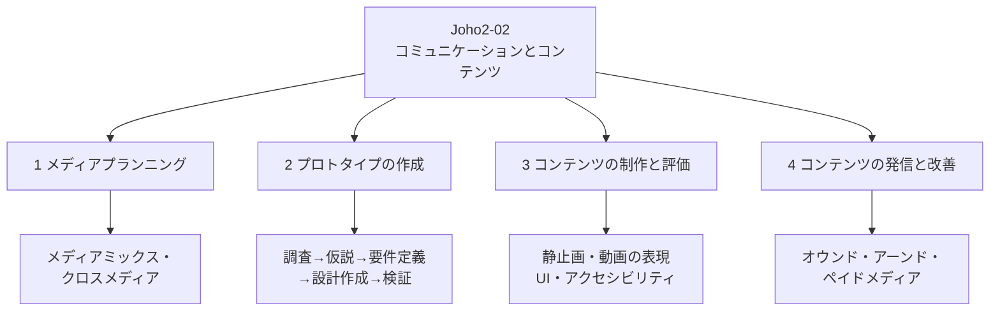

# Joho2-02: コミュニケーションとコンテンツ

情報Ⅱ第2章は、情報Ⅰの「効果的なコミュニケーションの実現」「コミュニケーションと情報デザイン」で培った基礎の上に立つ。目的や状況に応じてコンテンツを制作し発信する一連の学習活動を通じて、多様なメディア（文字・音声・静止画・動画）を組み合わせてコンテンツを制作する方法、コンテンツを発信する方法を理解し、必要な技能を身に付けること、そして情報デザインに配慮してコンテンツを制作し評価・改善する力を養うことをねらいとする章である。

!!! info "出典・凡例"
    出典: 文部科学省「高等学校情報科『情報Ⅱ』教員研修用教材」第2章 コミュニケーションとコンテンツ（`JohoII/02_第2章_コミュニケーションとコンテンツ.pdf`）。
    章は「学習7 コンテンツの分析とメディアの組み合わせ」「学習8 プロトタイプの作成」「学習9 コンテンツの制作と改善」「学習10 コンテンツの発信と改善」の4本の研修単元からなる。このページでは通し番号を振って統合して整理する。

## 全体像 {#overview}

---

## 1. メディアプランニング {#media-planning}

コミュニケーションを適切に行うためには、目的や状況に応じてコンテンツを制作することが重要である。教材はまず、書店の新刊告知POPやタクシー広告（配車アプリ、ラッピング広告、車内デジタルサイネージなど）を例に、現場で様々なコンテンツが多様なメディアを使って制作されていることを示す。

### メディアプランニングとは {#media-planning-stages}

「他校の生徒に自分の学校の文化祭で自分のクラス企画を楽しんでもらいたい」のような目標を実現するには、対象が目標に到達するまでにいくつかの段階があると考える。教材が示す段階の例は次の流れである。

> 知る → **興味を持つ** → 調べる → **行こうと思う** → 学校に到着 → クラスに向かう → クラスに入る → 楽しむ

段階ごとに適した情報が対象に届くように計画を立て、対象の年齢・性別・趣味嗜好によって細かくメディアの組み合わせを調整することを**メディアプランニング**という。重視すべきは「興味を持つ」という心を動かす段階と、「行こうと思う」という行動を起こす段階の2つであり、メディアプランニングの目標はこの2段階を実現することといってよい。

- **(1) 心を動かす**：「文化祭がある」より「楽しそうな文化祭がある」という情報の方が効果的である。どのメディアが効果的かは目的・内容・受け手・利用環境によって異なり一概にはいえないが、文化祭の雰囲気を伝える場面では、文字だけよりも画像や映像の方が効果的な場合があり、組み合わせることでさらに効果が高まることもある。また、情報が「誰からどのように伝えられるか」も重要である。街で見かけたポスターに書いてある情報と、自分がSNSでフォローしている人が「面白そうな文化祭がある」とつぶやいた情報とでは、心の動き方が異なりうる。SNSで多数の人に影響を与える個人を**インフルエンサー**といい、多くのフォロワーやメッセージの再転載などで情報を広く拡散する効果が期待できる。
- **(2) 行動を起こす**：興味を持っただけでは人は動かない。行動には強い動機と、納得できる理由が必要である。ポスターや新聞などの告知文に二次元バーコードを付けてスマートフォンですぐ調べられるようにする、SNSでつぶやく際に案内のURLを付けるなど、心が動いた瞬間にすぐ調べられるようにしておくことで「行動を起こす」ことにつなげられる。
- **(3) 目標を達成する**：「行動を起こす」だけでは目標（例：クラス企画を楽しんでもらう）は達成されない。事前の案内掲示、誘導の仕掛け、到着後のチラシ配布など、目標達成にあらゆる手段を準備し、対象の反応に応じて即座に展開を変更できる柔軟性も必要である。

### メディアの重複と補完 {#media-overlap-complement}

メディアプランニングでは、複数のメディアを用いて不特定の対象に広く伝えること（Web・TV・ラジオ・新聞等）、SNSなど特定の対象に強く心を動かすように伝えること、地域を限定してポスター等で伝えることを、複合的に展開するようにしたい。同じ情報が重複して何度も対象に届く**メディアの重複**と、複数のメディアを使うことで対象を広くカバーする**メディアの補完**の両方を意識して計画する。

### メディアミックスとクロスメディア {#media-mix-cross-media}

メディアプランニングでは、広く伝えることと、段階を追って伝えることの両方を計画する必要がある。

- **メディアミックス**：新聞・雑誌・テレビなど複数のメディアを活用して対象を広くカバーする考え方。新聞を読んでいる人が雑誌も見ているとは限らず、テレビしか見ない人もいるかもしれない——対象がどのメディアに触れても完全な情報が得られるようにすることを目指す。
- **クロスメディア**：コマーシャルで「続きはWebで」、ポスターに二次元バーコードを載せて詳しい内容はスマートフォンで見るなど、対象が複数のメディアで情報を補いながら、それらの情報を相互に補完することによって相乗効果を発揮することを目指す考え方。

メディアプランニングでは、これらの特性を踏まえた上で、メディアミックスで広く対象をカバーし、クロスメディアで強く対象の心をつかむといった、効果的なメディアの使い方を考える必要がある。

---

## 2. プロトタイプの作成 {#prototyping}

### プロトタイプとは {#what-is-prototype}

頭の中のアイデアを人に表現するには、言葉や図などを利用して伝達する。アイデアを、後で改善することを前提に人に伝えることが可能な形で明示したものを**プロトタイプ**という。prototype の意味は「原型」で、語源は protos（最初）と typos（型）に由来する。あらゆる人に分かりやすい形にデザインすることをプロトタイプデザインといい、その実践を**プロトタイピング**という。

プロトタイプを作るメリットとして教材は次を挙げる。

- デザイン設計の初期段階から使い勝手を確認できる
- 設計の修正・追加・変更に時間がかからない
- 見落としを見つけやすい
- 多様なパターンを検証できる
- 設計段階から多くのフィードバックが得られる

最初から完璧な高精度のプロトタイプを作成するのではなく、**低精度のプロトタイプをたくさん作り、検討や修正を重ねる上でその数を少なくし高精度のものにブラッシュアップする**、という段階的な進め方が基本になる。

### プロトタイプの種類 {#prototype-types}

| 種類 | どのようなものか |
|---|---|
| **ペーパープロトタイプ** | 紙と鉛筆で画面レイアウトを表現したもの。メニューやボタンの形状、ページからページへの遷移など細かい動作を確認できる |
| **ワイヤーフレーム** | Webページ全体の大まかなコンテンツやレイアウトを配置した設計図。全体を俯瞰したい場合に役立つ |
| **ストーリーボード** | 四コマ漫画のように一つの体験を複数のコマに分割して時系列で表現する。各コマは、そのシーンを象徴する「イラスト」と、状況や心境を説明する「ナレーション」や「セリフ」によって構成される。ユーザーの利用体験をイメージできる |
| **ムードボード** | アイデアやコンセプトを紙面やスクリーン上に複数の写真やイラスト、映像を集めて組み合わせ、世界観を目に見える形にしたもの |

精度の低いプロトタイプは、多くは手軽で素早くでき柔軟性が高く、付箋や筆記用具、定規があれば実行でき、共同作業しやすい。精度が高くなり完成版に近づくにつれ、専用のプロトタイピングツールが必要になり、共同作業のためには参加者全員がそのツールを使える環境が必要になる。

### プロトタイプを作るためのプロセス {#prototype-process}

すぐれたデザインは、次の5工程を繰り返したり、問題のある工程まで戻ってやり直したりするプロセスを経て作られる。

1. **調査（ユーザーの観察・共感）**：どのような情報伝達を行うのか、日常生活の中で情報を送受信するときにどのような不便さがあるかを中心に問題点を調査する。
2. **問題解決のための仮説の作成**：調査をもとに情報を精査し問題点を整理する。問題点を解決するための仮説を立てる。ここでいう仮説とは、ペルソナ（人物像）と利用する状況を考えることである。
3. **要件定義**：仮説に基づき、実装する機能、情報について検討する。
4. **プロトタイプの設計・作成**：プロトタイプの作成に必要な要素をどのように実装するか設計する。実際にプロトタイプを作成する。
5. **検証**：プロトタイプを使って仮説を検証する。

以下、各工程を詳しく見る。

**① 調査（ユーザーの観察・共感）**：デザインの対象となるユーザーが何に不便を感じているか、制作物をどのような状況で使うのか、ユーザーのニーズを深く把握するために事前に情報を収集する。ユーザーを観察し関わりを深く得るために欠かせない調査方法が**フィールドリサーチ（現地調査）**である。実際にその場所に行き、ユーザーの環境を見る、実際に利用する・その様子を観察する、利用者にインタビューするといった内容について情報を得る。「なぜそれを使っているのか」を追究することで、ユーザーの本当に必要なニーズを探り出すことができる。

**② 問題解決のための仮説の作成**：集めた情報を精査し、問題点を整理して、問題の解決策を探るための仮説を立てる。ここでは**ペルソナ（人物像）**を作成し、そのユーザーが利用する流れや様子を**シナリオ**としてまとめる。

まず、どのようなユーザーがどのような状況で使うのかを**5W1H**をベースに考える：who（対象となるユーザー）、what（目的・ゴール）、when/where（ユーザーが利用するタイミングや場所）、how（手段）、why（理由・ニーズ・要求）。

次に、ターゲットとなるユーザーについてペルソナを作成する。ペルソナを作るために必要な情報として、年齢・性別・職業・家族構成・収入、住居・生活環境、ライフスタイル・価値観・趣味嗜好、インターネットやスマートフォンの習熟度、サービスの利用状況・頻度などが挙げられる。これらをもとに、ペルソナが利用するケースや状況（どんなときに使いたいか、利用する場所・環境、利用する時間帯・使用時間・頻度など）を具体的に想定して文章等にまとめたものを**シナリオ**という。

この段階では具体的な画面構成や機能、表示データは考えないようにする。具体的な機能を考え始めると柔軟なアイデアが浮かばない可能性があるためである。

**③ 要件定義**：利用するケースや状況をまとめたら、アプリに実装する機能や表示情報を整理して検討する。ユーザーが迷うことなく機能を利用し、目的の情報を得られるかどうかに視点を置いて検討する必要がある。ここで重要なのは、**機能として必要なものと不要なものを分類する**ことである。最低限実装しておかないとユーザーが困るものは何か、なくても問題ないものは何かという視点から考えるようにするとよい。

**④ プロトタイプの設計・作成**：ペルソナの最終目標や利用状況に合わせて、プロトタイプの具体的なメニューやユーザインタフェースを決める。

まず「機能の整理」を、リスト化→グルーピング→構造化の3ステップで行う。

1. **リスト化**：必要な機能をリストアップする。
2. **グルーピング**：要素同士の関係性を明確にし、同じ種類の機能をグループとしてまとめる。
3. **構造化**：グルーピングした要素群を構造化する。シナリオの各ステップでどのような機能が必要なのか、上位の機能と下位のどの機能がひもづくのか、要素群や要素間の関係を構造化する。この構造化した情報をもとに、プロトタイプモデルを組み立てる。

続けて「プロトタイプを作る」段階では、まず紙とペンのみで次の内容を書き出していく。

- **画面の流れを決める**：全体のレイアウトを検討し、決定したら画面の流れを図にまとめる。一つの画面に機能や情報を持たせ過ぎると使い勝手の悪さにつながり、遷移が複雑になっているとユーザーが迷う原因になる。ユーザーが求める情報を円滑に適切なタイミングで提供できているかにも注意する（提供できていなければユーザーのストレスになる）。
- **個別プロトタイプの作成**：アプリの主軸となる画面から優先的に、個別にプロトタイプを設計する。
- **実物大模型（動作モック）の作成**：作成したペーパープロトタイプを、プロトタイプ作成ツールを使って動作モックとして作成し、実際に端末で動作させ、大まかなレイアウト感、画面遷移などの動作や使い勝手を確認する。詳細なデザインにこだわり過ぎないことがポイントである。

**⑤ 検証**：プロトタイプができたら検証を実施する。検証では、プロジェクトチームによる検証とユーザーによる検証の2つのステップを繰り返し、あらゆる機能の使い勝手を確認する。検証は声に出しながらアプリを実行する**発話思考法**で行う。

- **ユーザーによる検証**：仮説のときに作成したペルソナと利用状況に基づきテストシナリオを作成し、それに基づき検証する。
- **プロジェクトチームによる検証**：ペルソナの要望を満たしているか、機能・情報の漏れや画面遷移に矛盾がないかを検証する。

実際のユーザビリティ評価の場ではビデオなども使って記録するが、授業の中では、時間の経過とともにユーザーの発話や行動を記録する**プロトコル分析シート**のみで記録することも考えられる（§3で詳しく扱う）。

---

## 3. コンテンツの制作と評価・改善 {#content-creation}

コンテンツにより伝える情報の表現の幅を広げるためには、文字だけでなく静止画や動画など複数のメディアを組み合わせる必要がある。伝える情報の内容によって適切なメディアを選択する。Webサイトのような双方向性のあるコンテンツでは、ユーザインタフェースやアクセシビリティについて検討した上で作成し、評価、改善という手順を踏む必要がある。

> メディアの検討と選択 → 文字・静止画・動画等の素材の作成 → ユーザインタフェース・アクセシビリティについての検討 → コンテンツとして統合 → 評価 → 改善

### 静止画の表現 {#still-image-expression}

写真をはじめとする静止画は、その構図や表現の仕方によって撮影者の意図を伝えることができる。

- **横位置／縦位置**：横位置で撮影された写真は人間の視野に近い見え方になるため、見る人に自然で安定した感じを与え、空間の広がりを表現するのにも向いている。縦位置で撮影された写真は人間の視野とは異なる見え方になるため、見る人に非日常性を感じさせ、奥行きや高さを表現するのに向いている。
- **カメラの高さ**：人の目の高さでカメラを水平に構えることを**アイレベル**といい、普段のものの見え方に近いため自然な感じになる。カメラを上向きに構えることを**ローアングル**といい、被写体を下から見上げる形になるため迫力や力強さを表現できる。カメラを下向きに構えることを**ハイアングル**といい、被写体を上から俯瞰する形になるため客観的な状況説明をするときによく用いられる。
- **ピント**：被写体にも背景にも全体にピントが合っている写真は状況説明を意図して撮られていることが多い。対して、被写体のみにピントが合い背景がぼけている写真は被写体の存在を強調している。

### 動画の表現 {#video-expression}

動画による表現は構図などについて静止画と共通する部分が多い。動画特有の表現方法は、カメラの動きに伴った映像の見せ方や編集によるカットのつなぎ方によるところが大きい。

- **パン**：横方向にカメラを動かす最も基本的な動かし方で、広い風景の表現をするときに用いられる。
- **ティルト**：縦方向にカメラを動かす動かし方で、高さを表現するときに用いられる。
- **モンタージュ理論**：カットのつなぎ方による表現の基本となる理論で、「前の映像の影響を受けて後の映像に新たな意味が与えられる」というもの。例えば①子供が泣いているカット、②子供が何かを食べているカット、③子供の笑顔のカットの3つがあるとき、①→②→③の順につなげば「ぐずっている子供が好きなものを食べて機嫌が直った」というストーリーが生まれるが、③→②→①の順につなげば「機嫌がよかった子供が嫌いなものを食べてぐずり始めた」という別のストーリーに変わる。
- 動画の作成においては、実際に撮影する前に**絵コンテ**によって、撮影する対象やカメラの動かし方、カットのつなぎ方などを検討する。

### メディアを統合したコンテンツの制作 {#integrated-content}

様々なメディアにより作成された素材を統合することで、情報伝達の手段としてまとまりのあるコンテンツとなる。このようなコンテンツの一つがWebサイトである。Webサイトを作成するにはHTMLやCSSをテキストエディタで作成することも可能だが、Webオーサリングツールやコンテンツ管理システムを使うことで効率的に作成できる。Webサイト全体の構造や、各ページのレイアウトや配色について検討し、ユーザインタフェースの使いやすさやアクセシビリティに配慮したWebサイトを作成する必要がある。

### ユーザインタフェース {#user-interface}

人間が機器を操作するための操作方法や情報の提示を**ユーザインタフェース**と呼ぶ。タイプは大きく3つに分けられる。

- **手続き型インタフェース**：操作手順の中に時間や温度などの数値の設定が含まれる。ユーザーの意図を細かく反映できるが、設定した値が結果にどのように影響するかについてユーザーに知識が求められる。
- **目的型インタフェース**：ユーザーが目的とする動作に関連する項目を選択していくことで目的を果たすタイプ。駅の券売機で「切符の購入」「定期券の購入」「ICカードへの入金」などを選択するのがこの例。Webサイトなどでは目的型インタフェースが用いられることが多い。項目の選択でユーザーに迷いを生じさせないよう、提示する情報の内容や操作手順などを詳細に検討する必要がある。
- **自動型インタフェース**：ユーザーが目的とする動作を1つの操作ステップで実現するタイプ。家電製品によくある「おまかせ」ボタンなどがその例。

### アクセシビリティ {#accessibility}

**アクセシビリティ**とは、JIS X 8341-1（高齢者・障害者等配慮設計指針）において「様々な能力をもつ最も幅広い層の人々に対する製品、サービス、環境又は施設（のインタラクティブシステム）のユーザビリティ」と定義されている。障害者や高齢者を含む社会のあらゆる人々にとって使いやすい製品やサービスを作っていくことがアクセシビリティを高めることになる。

Webページにおける例として、音声読み上げ機能の提供と画像への代替テキストの適用（HTMLのimgタグにおけるalt属性の設定）、文字サイズの変更機能の提供、サイト内の位置を明示する「パンくずリスト」などがある。その他にも、色覚障害に配慮した配色の設定などがある。実際にコンテンツを制作する際には、Webページの代替テキストや配色のコントラスト比など、アクセシビリティをチェックするツールを活用して改善することができる。

### インタビューによる評価 {#interview-evaluation}

コンテンツの制作過程における評価法の一つがインタビューである。手法には次のものがある。

| インタビュー手法 | 調査目的 | 場所 | 要する時間 |
|---|---|---|---|
| 構造化インタビュー | 統計的集計 | 会場 | 短 |
| 半構造化インタビュー | 統計的集計または質的調査 | 会場または現地 | 中 |
| 非構造化インタビュー（デプスインタビュー） | 質的調査 | 会場 | 長 |
| 非構造化インタビュー（エスノグラフィックインタビュー） | 質的調査 | 現地 | 長 |
| グループインタビュー | 統計的集計または質的調査 | 会場 | 中 |

**構造化インタビュー**は事前に決められた質問のみを聞くので、複数の人の回答を同じ基準で比較して評価を行うことができるが、事前に決められた質問しか聞けないため追加の質問などでより詳細な情報を得ることは難しい。**半構造化インタビュー**は評価項目と質問の内容を決めておくが、話の流れで必要があれば追加の質問をしていくことで、より詳細な情報を得ることができる。**非構造化インタビュー**は大まかなテーマだけを決め、その場の状況で聞き出せることを聞いていくため、評価の対象となるものやインタビューの相手を観察する力が求められる（デプスインタビューは1対1でユーザーの思考を深く掘り下げて聞くインタビュー、エスノグラフィックインタビューは現地で評価の対象を使用している様子を観察しながら行うインタビュー）。

### ユーザビリティの評価 {#usability-evaluation}

アンケートやインタビューによる評価は事後評価になるため、ユーザーがコンテンツに触れているときに何を思い何を考えたのかを捉えることが難しい。特にWebサイトやアプリケーションなど双方向性が高いコンテンツでは、使用中の評価が重要になる。

比較的授業で取り入れやすい手法として教材が紹介するのが**プロトコル分析**である。ユーザーに実際にWebサイトやアプリケーションを使ってもらい、同時にそのとき思ったことや考えたことを話してもらうことで、ユーザーの感覚や認知を言葉で捉えようとする手法である。

- 分析の対象について、利用状況と達成すべき課題を記述したものを**タスクシナリオ**という。クリックの順番などの操作手順まで示してしまうと、ユーザーが操作方法を自力で発見できるかという観点を観測できなくなるため、手順ではなく状況と課題を示すことが重要である。
- ユーザーがタスクを実行している間の動作や発話をもれなく記録する必要がある。授業では時間の経過とともにユーザーの発話や行動を記録する**プロトコル分析シート**（時間・行動・発話・表示画面の列）で記録する。
- 進行役はユーザーの思考を言葉として話してもらうよう促す役割を持つ。ユーザーの行動を観察し、必要があれば適宜問いかけを行う。
- タスク完了後、記録をもとに分析を行う。ユーザーの「あれ？」「何？」といった発話や操作に迷っている様子などを拾い上げ、ユーザーに迷いを生じさせている部分を洗い出して改善策を検討する。

### インターネットを利用した協働作業 {#online-collaboration}

マルチメディアコンテンツの制作には文章、静止画、動画、音声など様々なメディアを駆使する必要があり、相当な労力を要するため1人で全ての作業を行うことは現実的ではない。それぞれが得意とするものを分担し協働して制作していくことが必要となる。インターネット上にコンテンツを制作する場合、コンテンツ管理システムやファイル共有サービス、グループウェアといったサービスを活用することで、時間的・空間的制約を離れて協働作業を行うことができる。

---

## 4. コンテンツの発信と改善 {#content-distribution}

### コンテンツの発信 {#content-publishing}

旧来のコンテンツ発信は専ら放送局、新聞社、出版社などのマスメディアが行うものであり、そこで発信されるコンテンツは多くの人々に共通するニーズをくみ上げて制作されたものが一方的に送られるだけであった。インターネットの普及とともに、企業や個人などがコンテンツ発信の手段を持つことになり、発信されるコンテンツもより細かいニーズに対応したものを個々に送ることが可能になった。このような社会では、ユーザーの側もマスメディアから発信されるコンテンツを受け取るだけでなく、自分のニーズに合ったコンテンツを自ら探すようになる。

コンテンツ発信の手段の選択においては、このようなユーザーの行動を想定することが必要になる。対象となるユーザーがどのようなメディアやサービスを利用しているのかを探り、適した発信の手段を選択することになる。その際、ユーザーのペルソナを設定し、利用場面のシナリオを考えることは有効な手段である。また、制作したコンテンツへの興味をユーザーに継続して持ってもらうためには、ユーザーからの反応を得て分析、改善する必要がある。

### コンテンツの発信手段の組み合わせ {#publishing-methods-combination}

効果的にコンテンツを発信するためには、発信手段ごとのユーザー層を把握し、適切なアプローチをして、ユーザーをコンテンツが目的とするところまで誘導しなくてはならない。教材が示す組み合わせの例：

- **広告**：まだ認知されていない人たちに対して、マスメディアを使った広告などで興味を引き、URLや検索キーワードを紹介して自社のWebサイトへ誘導する。
- **SNS**：公式アカウント等において既存のユーザーとの関係を構築し、そのユーザーに自社のコンテンツを拡散してもらう。
- **Webサイト**：検索サイトで検索されやすくなるような工夫をしておき、継続的にコンテンツを提供することで流入してきたユーザーの興味を引き留める。

このように、広告からの誘導、SNSでの拡散、検索からの流入という形でコンテンツの発信手段を組み合わせている。

### Webサイトによる発信 {#website-publishing}

Webサイトやブログによる発信は、発信者がコンテンツの内容を自らコントロールできることが特徴である。これらの発信の手段は発信者となる個人や企業などが自ら所有することが多いため、**オウンドメディア（Owned Media）**とも呼ばれる。一般的にWebサイトやブログで発信されるコンテンツは継続されたコンセプトに基づいたものを作りやすいといわれ、特定のテーマに絞って記事が書かれているブログなどはその一例である。そのため興味を持ったユーザーが継続して利用する傾向が強いのが特徴である。反面、そのWebサイトやブログの存在を知らないユーザーに見つけてもらうことが難しい。

Webサイトの存在をユーザーに知ってもらうための手段として用いられてきたのが**SEO（Search Engine Optimization）**と呼ばれる、検索サイトの上位に表示されるようにする工夫である。SEOについては、当初は他のWebサイトからどれだけリンクを張られているかが重視されていたが、教材が引用する検索サイトの公式ブログによれば、最近ではコンテンツの質が重視されるようになってきている——ユーザーにとって価値のないサイト、利便性の低いサイト、他のサイトからのコピーで構成されているようなサイトの掲載順位は下がり、独自の研究や報告、分析など、ユーザーにとって重要な情報を提供しているサイトの掲載順位はより適切に評価されるようになる、とされている。

### SNSによる発信 {#sns-publishing}

SNSによる発信の特徴は、ユーザーが情報を受け取るだけでなく、ユーザー自身が情報を発信することもできるところである。SNS上でユーザーが自発的に行う口コミや評判の広がりは、企業の公式投稿（オウンドメディア）や有料広告（ペイドメディア）とは性質が異なり、ユーザーの発信力によって信頼や評判が獲得されるという意味で**アーンドメディア（Earned Media）**と呼ばれる。ユーザーが発信力を持つということは、好みや利用状況が似ている他のユーザーの共感を得やすいため、情報の拡散力は高いといえる。特にSNS上で非常に高い拡散力を持つユーザーである**インフルエンサー**の評判を獲得することは、SNSによる発信において大きな力となる。

発信されるメッセージがユーザーの共感を呼べば、好印象とともに他のユーザーへ拡散されることになるため、コンテンツの拡散の好循環が生まれる。しかし、ユーザーも発信力を持つということは、コンテンツに対するユーザーの評価も拡散することになる。ユーザーの評価はコンテンツを発信する側からコントロールすることができない。そのため悪い評価がつくと、その評価も拡散されることになり、いわゆる「**炎上**」と呼ばれる状態に陥る可能性もある。

### 広告による発信 {#ad-publishing}

主にマスメディアを使った広告も大きな発信力を持っている。マスメディアを使った広告による発信は基本的に金銭の支払いが伴うため、**ペイドメディア（Paid Media）**とも呼ばれる。マスメディアを使った広告による発信の特徴は不特定多数に対する発信力を持つことである。そのため、コンテンツの存在を認知していない潜在的なユーザーへの発信に向いている。しかし、マスメディアを使った広告は基本的に一方的にコンテンツを送り出すだけなので、ユーザーの反応を得てコンテンツの改善に役立てるという部分に弱い面がある。

最近ではマスメディアで展開される広告からWebサイトへ誘導するために、画面やポスターにURLを記録した二次元バーコードを載せたり、テレビコマーシャルの最後に検索キーワードを紹介したりするなど、オウンドメディアへの入り口としての役割も担っている。

### ユーザーの反応を得る手段 {#measuring-user-response}

コンテンツの発信を行いユーザーの興味を引き続けるためには、ユーザーの反応を得て分析を行い、それをもとに改善をしていく必要がある。

- **Webサイトのアクセス解析**：有料・無料の様々なツールがある。年齢、性別、地域ごとのユーザー層、ユーザーがサイトを訪れたのは検索結果からなのか外部のリンクからなのか、ユーザーが最初に見たページは何か、一番見られているページは何か、ユーザーがサイトから離れたページは何か、といった情報が得られる。時系列での変化を見ることができるものもあり、曜日や時刻ごとの傾向を分析することもできる。
- **SNSの分析ツール**：SNSの機能として用意されているものや外部の分析ツールがある。投稿が表示された回数（インプレッション）、投稿へのいいね・返信・再投稿などの反応の件数（エンゲージメント）、リンクのクリック数、再投稿による拡散の回数などが指標ごとに定量的に得られ、発信したコンテンツごとにユーザーの反応の違いを比較することが可能となる。
- **投稿フォームやSNSの返信**：得られる情報は定性的なものであり、コンテンツごとの比較は難しいが、ユーザーの感情的な反応を知るためには大事な情報となる。

### 分析と改善 {#analysis-and-improvement}

ユーザーの反応を分析しコンテンツの改善を行うときに最も大事なことは、コンテンツの発信の目的を明確にすることである。ユーザーの認知を広げたいだけなのか、コンテンツに触れたユーザーに何らかの行動を起こしてほしいのか、自分たちが知らない新たなニーズを掘り起こしたいのかによって、アクセス解析で見なければならない指標も変わってくる。

Webサイトにおいて、ユーザーに到達してほしい最終的な成果のことを**コンバージョン（Conversion）**という。例えば、通販サイトにおけるコンバージョンは商品の購入であり、新製品の広告サイトであれば資料請求である。ユーザーの反応の分析とコンテンツの改善は、コンテンツに触れた人のコンバージョン率を高めることが目的となる。コンバージョン率が高いのにあまり見られていないコンテンツがあれば、そこに誘導するような改善が必要となる。一方、よく見られているのにコンバージョン率が低いコンテンツがあれば、コンバージョン率を高めるような改善をするか、コンテンツ自体を廃止してしまうことも考えられる。

!!! note "全体を通じた学習活動の進め方"
    教材は本章全体を貫く学習活動の流れを、**問題の発見 → 情報の収集と分析 → メディアプランの検討 → コンテンツの制作と改善 → コンテンツの発信 → コンテンツの分析と改善**の6ステップとして示している。これは§1〜§4で見てきた各学習内容（メディアプランニング／プロトタイプの作成／コンテンツの制作と評価／コンテンツの発信と改善）を、実際の授業では一続きの探究サイクルとして経験させる構成になっていることを表す。

---

## 学習目標 {#learning-outcomes}

- 多様なコミュニケーションの特徴とメディアの特性との関係について理解するとともに、目的や状況に応じてコミュニケーションの形態を考え、文字・音声・静止画・動画などを選択し組み合わせを考える。
- 文字・音声・静止画・動画などを組み合わせたコンテンツを制作する技能を身に付けるとともに、情報デザインに配慮してコンテンツを制作し、評価し改善する。
- コンテンツを様々な手段で適切かつ効果的に社会に発信する方法を理解するとともに、その際の効果や影響を考え、発信の手段やコンテンツを評価し改善する。

## 前後のユニット {#related-units}

- 前: [Joho2-01](Joho2-01.md) — 情報社会の進展と情報技術
- 次: [Joho2-03](Joho2-03.md) — 情報とデータサイエンス

疑問が出たら [Joho2-02 Q&A](Joho2-02-QA.md) に記録する。
