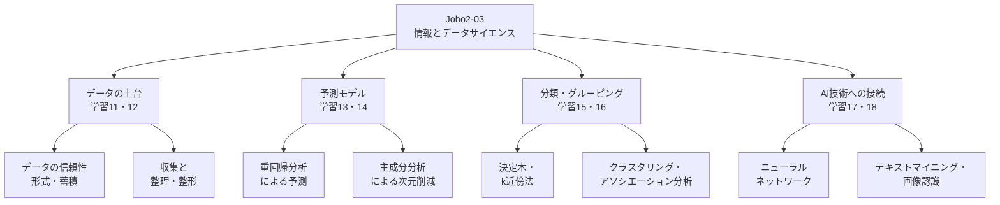

# Joho2-03: 情報とデータサイエンス

情報Ⅱ第3章は、表形式データの信頼性・蓄積方法という基礎から出発し、重回帰分析・主成分分析・分類・クラスタリングといった統計的な分析手法、そしてニューラルネットワークによるテキストマイニング・画像認識までを一続きの流れとして扱う章である。元教材では「予測のための重回帰モデル」（学習13）までを前半、「主成分分析」（学習14）以降を後半の冊子に分けているが、これは印刷上の都合であり、内容としては学習11〜18の8つの学習項目が1つの章を構成する。本ページもその1章としての通し番号でまとめる。

!!! info "出典・凡例"
    出典: 文部科学省「高等学校情報科『情報Ⅱ』教員研修用教材」第3章 情報とデータサイエンス（`JohoII/03_第3章_情報とデータサイエンス_前半.pdf`〔学習11〜14〕、`JohoII/04_第3章_情報とデータサイエンス_後半.pdf`〔学習15〜18〕）。

## 全体像 {#overview}

---

## 1. データの信頼性とデータの形式・蓄積 {#data-credibility-and-formats}

データ分析とは、データの傾向や性質を数量で捉えることをいう。データは様々な方法で収集でき、集まったデータの形式も多様であるため、信頼できるデータ収集・分析には注意すべき点が多い。

- **データの信憑性 (credibility)**: 示されたデータが信じるに値する科学的根拠となり得るかどうか。同じ元データでも、ヒストグラムの目盛りの取り方や階級の幅（ビン幅）、外れ値の扱いによって、見え方が大きく変わりうる。教材では、同一の「世帯ごとの野菜の漬物購入額」データを縦軸のスケールを変えて描いた2つのグラフを比較し、印象操作が起こりうることを確認している。データを受け取る側は、提供者の視点も含めてこうした偏りの可能性を確認する必要がある。
- **表形式データ**: 表計算ソフトのように行（ロウ）と列（カラム）からなる形式で、コンピュータでも人間でも扱いやすい。表形式データを蓄積する代表的な仕組みが**関係データベース**（リレーショナルデータベース、RDB）である。RDBでは表形式データを**テーブル**と呼ぶ単位で格納し、列の意味を示す**ヘッダー**、テーブル構造を定義する**スキーマ**、各列の値の種類を示す**型**（Char/String/Int/Real/Objectなど）を指定する。行は**レコード（タプル）**、列は**属性（カラム）**と呼ばれ、RDBの操作には**SQL**（Structured Query Language）を用いる。
- **RDBとNoSQL**: 伝統的なRDBMSの多くは1台のハードウェアでの処理を前提に設計されており、そうした構成では大量データを複数のハードウェアで分散処理することが課題になりやすい（ただし、これはリレーショナルモデル自体が分散処理に不向きという意味ではなく、分散SQLシステムのように複数ハードウェアでの処理に対応したRDB製品も存在する）。表形式に整理しにくい大量データを扱う用途では、**NoSQL**（Not only SQL）と呼ばれる、キー・バリュー型／カラム型／ドキュメント型／グラフ型などの形式が使われることが多いが、NoSQLであること自体が高速・高拡張性を保証するわけではなく、目的に応じてRDBとNoSQLを使い分ける、あるいは併用する手法が広がっている。
- **JSON形式**: NoSQLのドキュメント型でよく使われる形式の一つ。`{ }` で囲んだキーとバリューの組（`"キー": バリュー`）でデータを表し、`[ ]` で配列を、`{ }` の入れ子で階層構造を表現できる。表形式では保持しにくいデータ（項目ごとに構造が異なるデータなど）に向いている。

## 2. データの収集と整理・整形 {#data-collection-and-cleaning}

- **データの収集方法**: アンケートのような調査、計測機器からの取得、Web APIからの取得などがある。教材では、アメリカ地質調査所（USGS）が公開するWeb APIから地震データをGeoJSON形式で取得する例を扱っている。
- **Webスクレイピング**: Webサイトを自動的に巡回してデータをかき集めることを**クローリング**、集めたデータを解析して必要な部分を抽出することを**スクレイピング**という。両者を合わせてWebスクレイピングと呼ぶ。Pythonでは`requests`と`Beautiful Soup4`、Rでは`rvest`のようなライブラリ／パッケージが使われる。
- **データフレームでの操作**: Pythonの`pandas`のようなパッケージを使うと、CSVファイルの読み込みや列同士の演算、並べ替え（`sort_values`）などをまとめて行える。
- **ロングフォーマットとワイドフォーマット**: 表形式データには、1つの観測対象の全属性を横に並べた列として1行で保持する**ワイドフォーマット（横持ち形式）**と、属性ごとに行を縦に増やして保持する**ロングフォーマット（縦持ち形式）**の2つの形式がある。ワイドフォーマットは散布図・分類・クラスタリングのように1行を1つの観測値として扱う場合に、ロングフォーマットは属性ごとの積み上げ棒グラフや折れ線グラフを描く場合に向く。属性数が多く欠測の多いデータでは、欠損している組み合わせの行自体を省略して保存する場合にロングフォーマットの方が省メモリになることがある（ただしロング化そのものが欠損行を消すわけではなく、IDや属性名を行ごとに繰り返し持つ分だけかえってメモリが増えることもある）。`pandas`の`melt`（ワイド→ロング）・`pivot_table`（ロング→ワイド）で変換できるが、`pivot_table`は既定で同じキーに対応する複数の値を平均するなどの集約を行うため単純な逆変換とは限らず、集約を伴わずに変換するには行のキー（観測対象と属性の組）が一意である必要がある。
- **欠損値の取扱い**: 計測機器の故障やアンケートの無回答などにより値が記録されないことを**欠損値**という（`pandas`ではNaN、RではNAと表示される）。ロングフォーマットからワイドフォーマットへ変換した際に表が埋まりきらないことでも欠損値が生じうる。対処法には、欠損のある行・列を除外する、0で埋める、前の値で埋める（前方補完）、平均値で埋めるなどがあり、どの方法を選ぶかによってバイアスが生じる可能性があるため慎重な判断が必要である。
- **異常値・外れ値の取扱い**: 他の多くのデータからかけ離れた値を**外れ値**といい、その中でも測定機器の誤作動やデータ入力ミスなど何らかの誤りによって生じたと判断できるものを**異常値**と呼ぶことが多い。ただし、原因を特定できることと、それが測定・入力の誤りであることは同じではない。原因が分かっていても、正しく観測された珍しい事象である場合もあるため、両者を安易に同一視しないよう注意する必要がある。外れ値は、四分位範囲のような統計量、データ間の距離、あるいは [§6](#clustering) のクラスタリングを用いて検出できる。外れ値には有益な情報が含まれる可能性もあるため、除外する前にその原因を考察することが望ましい。

## 3. 重回帰分析による予測 {#multiple-regression}

データに基づく問題解決では、まず解くべき課題を発見し、現実と理想のギャップを明確にする。その上で、状態を表す客観的なデータ指標である**目的変数**Y（ターゲット変数・応答変数・従属変数・被説明変数とも呼ばれる）を定め、その値に影響すると考えられる**説明変数**（要因変数、予測子）を、特性要因図（フィッシュボーンダイアグラム）のような図を使ったブレーンストーミングで洗い出す。これらのデータ指標を対象ごとに記録したものが**構造化データ（行列データ）**である。回帰モデルをデータから推測（学習）し、そのモデルを使って目的変数の値を**予測**したり、説明変数側を操作して目的変数を望む方向に近づける**制御**の方策を検討したりする（ただし、説明変数を実際に操作すれば目的変数が意図どおり変化すると言うには、モデルがデータによく当てはまっていることに加えて、交絡がないことや介入効果を推定できることなど、因果関係の推定に関わる追加の条件が必要である）。

- **重回帰モデル**: 目的変数Yを$p$個の説明変数$X_1, \ldots, X_p$の重み付き合計で説明する数学モデルで、次の式で表される。

$$\hat{y}_i = a + b_1 x_{1i} + \cdots + b_p x_{pi}$$

  ここで$a$は定数項、$b_1, \ldots, b_p$は各説明変数に係る**回帰係数**で、これらを合わせて回帰モデルの**パラメータ**という。説明変数を1つしか使わない場合（$p=1$）を**単回帰モデル**といい、直線の式になる。
- **最小二乗法**: 実際の観測値$y_i$と予測値$\hat{y}_i$の差である**残差**$e_i = y_i - \hat{y}_i$の2乗和（残差平方和）を最小にするようにパラメータを求める方法。
- **適合度の指標**: 推定されたモデルが実測データにどの程度当てはまっているかを表す指標として、以下が使われる。
    - **重相関係数R**: 予測値と実測値の相関係数（0以上1以下の値）。
    - **寄与率（決定係数）R²**: 目的変数Yの変動のうち、回帰モデルで説明できた割合。Yの平均値まわりの全変動を$S_T$、回帰による変動を$S_R$、残差変動を$S_E$とすると、$S_T = S_R + S_E$が成り立ち、$R^2 = S_R / S_T = 1 - S_E / S_T$（0以上1以下）と定義される。100%に近いほどモデルがデータに適合していることになる（R・R²がこの範囲に収まるのは、切片ありの通常の最小二乗回帰を非退化なデータに当てはめ、それを学習に使ったデータ自身で評価する場合の性質であり、学習に使っていないテストデータ上で計算したR²は負の値になることもある）。
    - **自由度**: 各平方和に対応する、独立した成分の数。全変動の自由度は$f_T = n-1$、回帰による変動の自由度は$f_R = p$、残差変動の自由度は$f_E = n-1-p$となる（$n$は観測数）。
    - **残差標準誤差**: 残差の自由度を調整した標準偏差（$\sqrt{S_E / f_E}$）で、目的変数と同じ単位を持つ。ここでいう標準誤差は残差のばらつきを表すものであり、各回帰係数の推定値のばらつきを表す「回帰係数の標準誤差」とは別の量である点に注意する。
    - 説明変数を増やすほど寄与率R²は単純に大きくなる傾向があり、これだけを基準にモデルを複雑にすると**過剰適合（過学習）**に陥る。残差の自由度を考慮した**自由度調整済み寄与率（自由度調整済み決定係数）**を参考にする方が望ましいとされる。
    - 各回帰係数について、母集団上で0であるかどうかを検定する統計的仮説検定（帰無仮説 $H_0: b_j = 0$）を行い、有意確率（**P値**）が1%または5%以下であれば帰無仮説は棄却され、モデルの仮定の下で、他の説明変数を一定に調整した場合のその説明変数と目的変数の条件付きの関連が統計的に有意であると判断する。P値が小さいことは、その説明変数を変化させれば目的変数が変化するという因果関係を直接意味するものではなく、交絡（他の未観測要因の影響）や逆の因果関係の可能性も考慮する必要がある。
- **モデル選択（モデリング）**: 説明変数の中には目的変数の予測に役立たないものが含まれている可能性があるため、説明変数の取捨選択（**変数選択**）が重要になる。方法として、総当法（すべての組み合わせを尽くす）、変数増加法、変数減少法、変数増減法（**ステップワイズ法**）などがあり、どの方法を選ぶかによって最終的に選択されるモデルは異なりうる。モデルの良し悪しを測る指標として**AIC**（赤池の情報量規準、値が小さいほど良いモデルとされる）などもある。説明変数に質的な属性を用いる場合は0と1で表す**ダミー変数**に変換し、目的変数が質的変数の場合はロジスティック回帰分析を用いる。
- 実行環境としては、表計算ソフト（Excelの「データ分析」アドインの回帰分析など）や統計ソフトR（`lm`関数で分析し`summary`で結果を確認、`step`関数で変数増減法を実行）が用いられる。

## 4. 主成分分析による次元削減 {#pca}

対象を特徴づける多数の変数（高次元のプロファイルデータ）から、少数の**主成分**（特徴量）にまとめる手法が**主成分分析**である。各主成分は、係数ベクトルの長さ（ノルム）を1に固定するという制約の下で分散が最大になるように求められ、第2主成分以降はそれより前の主成分と直交するという制約のもとで、同様に分散が最大になるように定められる。元のデータはこうして得られた主成分の値（主成分得点）に変換される。ここで保存されるのはあくまでデータの分散であり、後の予測や分析にとって重要な情報が必ずすべて残るとは限らない点に注意する。

- 出力には、各主成分の標準偏差、**寄与率**（Proportion of Variance、その主成分が説明する分散の割合）、**累積寄与率**（Cumulative Proportion）、**主成分負荷量**（各主成分と元の変数との対応関係）などが含まれる。
- **採用する主成分数の基準**として、教材では次の3つが挙げられている。
    - 累積寄与率が70%や80%以上になる程度までを採用する。
    - 固有値（分散）が1以上の主成分を採用する（**カイザー基準**。相関行列を分析した場合の基準）。
    - 固有値を大きい順に結んだ折れ線グラフ（**スクリープロット**）で、分散の減少量がなだらかになる手前までを採用する。
- 統計ソフトRでは、相関行列に基づく主成分分析を`prcomp(データ, scale=T)`のように実行する。

## 5. 分類による予測：決定木とk近傍法 {#classification}

**分類**とは、人間が与える正解（ラベル）をもとにデータの特徴から新しいデータを予測する、**教師あり学習**の一種である。

- **決定木（分類木）**: 説明変数の条件で枝分かれしながら木構造でデータを分類していく手法。全ての訓練データに当てはまるように木を成長させると**過学習（オーバーフィッティング）**が生じ、訓練に使っていないデータでの予測精度が下がる可能性がある。そこで、複雑度パラメータ（CP）などを基準に木を適度に**剪定（pruning）**し、汎用性のあるモデルに調整する。教材では、タイタニック号の乗客データ（性別・年齢・客室等級）から生存の有無を予測する分類木を構築し、性別がそのデータにおける生死の分類に最も役立つ変数であったことなどを読み取っている（これはそのデータ上での分類における有用性を示すものであり、生死を左右する因果的な要因を特定したものではない点に注意する）。
- **k近傍法（k-nearest neighbor method、kNN）**: 予測したい対象に最も距離が近い$k$個のデータを選び、その中で多数決をとって多い値を予測値とする手法。教材では、手書き数字画像（MNISTデータ）の分類を例に、訓練データとテストデータを分けてkNNで学習・予測を行い、実際のラベルと比較した**正答率**や、予測と正解の対応関係を表にした**混同行列（Confusion Matrix）**で評価している。$k$の値や訓練データの件数を変えることで正答率が変化する。

## 6. クラスタリングとアソシエーション分析 {#clustering}

分類が教師あり学習であるのに対し、正解を与えずに似ているデータをまとめて**クラスタ**と呼ばれるグループに分割する手法を**クラスタリング**（**教師なし学習**の一種）という。

- **階層的クラスタリング**: 1つ1つのデータを1つのクラスタとして扱い、距離が最も近いクラスタ同士を順次まとめていく（凝集型階層的クラスタリング）。まとめる過程を木構造で図示したものを**デンドログラム（樹状図・樹形図）**といい、任意の高さで水平線を引いたときの交点の数がクラスタ数に対応するため、あらかじめクラスタ数を決めておく必要がない。クラスタ同士の非類似度（クラスタ間の距離）を定める方法（**連結法**）には、両クラスタで最も近い点同士の距離を使う最短距離法、最も遠い点同士の距離を使う最長距離法、全ペアの距離の平均を使う群平均法、併合によってクラスタ内の平方和がどれだけ増加するかを基準にするウォード法などがあり、比較的良好な結果が得られやすいとして群平均法やウォード法が使われることが多い。個々のデータ間の距離には通常ユークリッド距離を用いるが、マンハッタン距離のほか、ジャッカード係数やコサイン類似度も使われる（これらは値が大きいほど類似していることを示す指標のため、距離として用いるには1から引く、符号を反転するなどの変換が必要になる）。
- **k-means法（k平均法）**: 非階層的なクラスタリング手法で、次の手順を繰り返す。
    1. クラスタ数をあらかじめ決め、ランダムに代表点（セントロイド）を決める。
    2. 各データと各代表点の距離を求め、最も近い代表点のクラスタに分類する。
    3. クラスタごとの平均を新しい代表点とする。
    4. 代表点の位置が変化しなくなるまで2〜3を繰り返す。

    初期の代表点をランダムに選ぶため結果が安定しないことがあり、複数回の試行や、初期値の選び方を工夫した**k-means++法**で改善できる。適切なクラスタ数の推定には、クラスタ数とクラスタ内誤差平方和（SSE）の関係を折れ線グラフに表し折れ曲がる点を読み取る**エルボー法**や、**シルエット分析**が使われる。
- **アソシエーション分析**: 購買履歴などのデータから、商品同士の結び付きの強さを求める分析（マーケットバスケット分析）。分析の単位は購入者ではなく、1回ごとの取引（買い物かご）である。「商品Xを買うと商品Yも買われやすい」というルールX⇒Yについて、評価指標として、全取引のうちXとYの両方を含む取引の割合を表す**支持度（support）**、Xを含む取引のうちYも含む取引の割合（条件付き確率P(Y|X)に相当）を表す**確信度（confidence）**、確信度をYの支持度で割った値（P(Y|X)/P(Y)に相当）である**リフト値（lift）**の3つがよく使われる。リフト値が1を上回ることは、XとYが互いに独立に買われる場合と比べてXとYが共起しやすいことを示すのであって、XとYが共起する取引の絶対数が多いことを意味するとは限らない。商品数が多いと全組み合わせの計算量が膨大になるため、「あるアイテム集合の支持度が基準に満たなければ、それを含むより大きなアイテム集合の支持度も基準に満たない」という性質を利用して、支持度不足になると分かる候補をあらかじめ計算対象から除外し（枝刈り）、計算量を減らす工夫（**アプリオリアルゴリズム**）が使われる。

## 7. ニューラルネットワークの仕組み {#neural-networks}

**人工知能（AI）**には明確な単一の定義はないが、キーワードとして**自律性（Autonomy）**（人の判断なしに状況に応じて動作する能力）と**適応性（Adaptivity）**（大量のデータから特徴を見つけ出す、あるいは正解データと新たなデータを照合して自らの精度を上げる〔学習する〕能力）が挙げられる。

- **ニューラルネットワーク**は、人間の神経細胞（ニューロン。樹状突起・軸索・シナプスなどで構成される）の仕組みを模したコンピュータの処理であり、1943年にそのモデルの原形が発表された。AI・**機械学習**・ニューラルネットワーク・**ディープラーニング（深層学習）**は包含関係にあり、機械学習はAIの一部、ニューラルネットワークは機械学習の一部、隠れ層を複数重ねた多層のニューラルネットワークがディープラーニングにあたる。
- **構造**: 「入力」「隠れ層（中間層）」「出力層」からなる。各ニューロンでは、`(入力) × (重み付け) + (バイアス)` を計算し、その結果を**活性化関数**に入れて出力（発火という）とする。
- **活性化関数**: 隠れ層にはステップ関数やシグモイド関数、ReLU（ランプ）関数（$\mathrm{ReLU}(x) = \max(0, x)$、正の入力はそのまま出力するため1を超える値も返しうる）などが用いられる。出力層は分類の種類に応じて選び、2値分類の確率を出力する場合はシグモイド関数、互いに排他的な多クラス（3クラス以上）分類にはソフトマックス関数が多く用いられる（ソフトマックス関数は2クラスの分類にも使用できる）。ReLUのように隠れ層で使われる活性化関数は二値分類専用ではなく、そのままでは確率としての出力にもならない点に注意する。
- **学習**: ニューラルネットワークの性能を測る指標を**損失関数**といい、予測データと教師データとの誤差を表す（2乗和誤差や交差エントロピー誤差などが使われ、値が0に近いほど良い）。学習とは、この損失関数の値ができるだけ小さくなるような重みとバイアスを探す作業である。**バックプロパゲーション（誤差逆伝播法）**は、連鎖律（chain rule）を用いて、損失関数の各重み・バイアスに対する勾配を出力層側から入力層側へ向かって効率よく計算する手法である。**勾配降下法（最急降下法）**は、こうして求めた勾配を使って、損失関数の値が減る方向へ重みとバイアスを少しずつ更新していく最適化手法であり、バックプロパゲーションが計算した勾配を実際の重み・バイアスの更新に用いるという役割分担になっている。勾配が0になる点には損失関数が最小となる点（極小値）だけでなく鞍点（サドルポイント）も含まれるため、勾配が0であることは必ずしも最小値を意味しない。また局所的な極小値が損失関数全体の最小値とは限らないため、初期値を変えて複数回学習するなどの工夫が併用されることもある。学習の際は、特定のデータにだけ過剰に対応してしまう**オーバーフィッティング（過学習）**を防ぐことにも注意が必要である。
- 教材では、Neural Network ConsoleというWebサービスを使い、手書き数字（MNIST）の分類をニューラルネットワークで学習させ、Confusion Matrixで正答率を確認する演習を扱っている。

## 8. テキストマイニングと画像認識 {#text-mining-and-image-recognition}

機械学習やニューラルネットワークの応用として、あらかじめ大量のデータで学習させた**学習済みモデル**を再利用する仕組みが広く使われている。人間であることを確認する仕組みである**reCAPTCHA**の入力結果が、OCR（Optical Character Reader）の読み取り精度向上に利用されている例のように、学習結果を蓄積・共有する取り組みも進んでいる。

- **テキストマイニング**: 文章を単語に分割する**形態素解析**（教材では`MeCab`を利用）を行った上で、**Word2vec**（テキスト処理のためのニューラルネットワークの応用技術）を用いて、周辺の単語との関係を手がかりに各単語のベクトル表現（分散表現）を学習させる。単語同士の類似度は、こうして学習されたベクトルをもとにコサイン類似度などを計算することで求められる。教材では、青空文庫の夏目漱石「坊っちゃん」を題材に、特定の単語と類似度の高い単語を探す演習を行っている。あわせて、あらかじめ用意された**感情辞書**（極性辞書。教材では東京工業大学のPN Tableを利用）を使い、文章中の単語にポジティブ／ネガティブの傾向を表すスコアを付与して分析する**感情分析**にも触れている。
- **画像認識・物体検出**: **YOLO（You Only Look Once）**は、2016年にJoseph Redmonらによって発表されたリアルタイム物体検出・認識アルゴリズムである。画像を複数の領域に区切って個別に検出処理を繰り返すスライディングウィンドウ方式のような従来の手法と異なり、画像全体を単一のニューラルネットワークに1回だけ順伝播させることで物体の位置とクラスを同時に予測する点が特徴である。教材では、YOLOを軽量化した**TinyYOLO**を使い、写真上の物体（自動車など）を検出する演習を行っている。

---

## 学習目標 {#learning-outcomes}

各学習項目の「研修の目的」を踏まえると、この章を通じて次のような力を身に付けることがねらいとなる。

- データの信憑性・信頼性を意識し、目的に応じてデータを収集・蓄積・整理・整形できる（[§1](#data-credibility-and-formats)・[§2](#data-collection-and-cleaning)）。
- 課題発見からデータに基づく問題解決のフレームを理解し、重回帰分析・主成分分析で量的データを予測・次元削減できる（[§3](#multiple-regression)・[§4](#pca)）。
- 決定木・k近傍法による分類、階層的クラスタリング・k-means法・アソシエーション分析によるグルーピングを行い、その結果を解釈・評価できる（[§5](#classification)・[§6](#clustering)）。
- ニューラルネットワークの概念と学習の仕組み（活性化関数・損失関数・勾配降下法・バックプロパゲーション）を理解し、過学習などの限界も踏まえて説明できる（[§7](#neural-networks)）。
- テキストマイニングや画像認識といった応用技術を体験し、データサイエンスの技術が社会にどう活かされうるかを考えられる（[§8](#text-mining-and-image-recognition)）。

## 前後のユニット {#related-units}

- 前: [Joho2-02](Joho2-02.md) — コミュニケーションとコンテンツ
- 次: [Joho2-04](Joho2-04.md) — 情報システムとプログラミング

疑問が出たら [Joho2-03 Q&A](Joho2-03-QA.md) に記録する。
