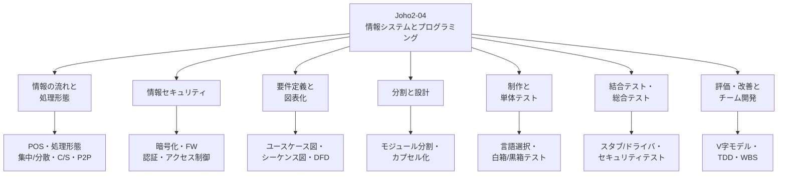
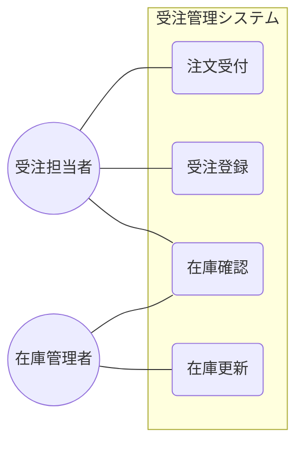
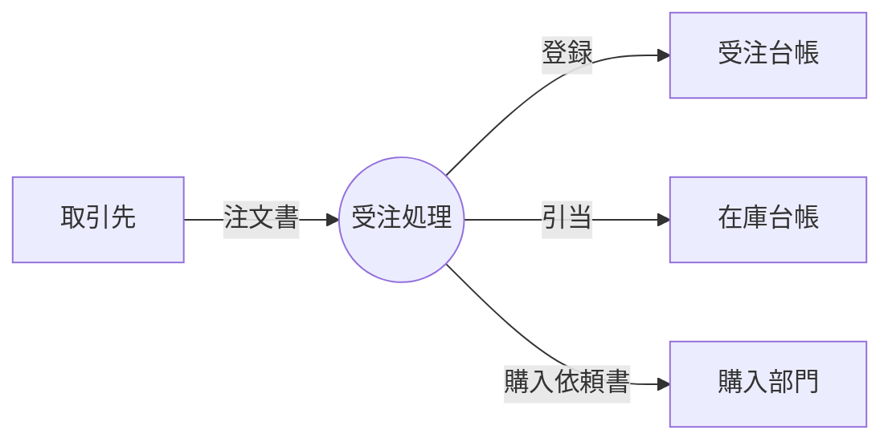

# Joho2-04: 情報システムとプログラミング

情報Ⅱ第4章「情報システムとプログラミング」の学習メモ。POS システムのような身近な情報システムが**どのように情報をやり取りし**、**どうセキュリティを確保し**、それを**どう設計・分割してプログラムに落とし込み**、**どうテストして評価・改善するか**という、情報システム開発の一連の流れを扱う。情報Ⅰの「コンピュータとプログラミング」「情報通信ネットワークとデータの活用」の内容を土台に、個人の情報セキュリティ（情報Ⅰ）から**組織・情報システムとしての情報セキュリティ対策**（本章）へと視点を広げる点が特徴。

!!! info "出典・凡例"
    出典: 文部科学省「高等学校情報科『情報Ⅱ』教員研修用教材」第4章 情報システムとプログラミング（`JohoII/05_第4章_情報システムとプログラミング.pdf`）。
    本章の演習で使用するプログラミング言語は Python（本ページのコード例も Python）。

## 全体像 {#overview}



情報システム開発は「要件定義 → 設計 → 制作 → 評価 → 開発（運用）」という一連の流れで進む（本章末尾「全体を通じた学習活動の進め方」より）。本ページもおおむねこの流れに沿って、①情報の流れと処理形態 → ②情報セキュリティ → ③要件定義と図表化（設計の準備） → ④分割と設計 → ⑤制作と単体テスト → ⑥結合テスト・総合テスト → ⑦評価・改善とチーム開発、の順に整理する。

---

## 1. 情報システムの情報の流れと処理形態 {#info-flow}

### 情報システムが集める情報と生み出す利便性

情報システムとは、情報通信ネットワークを活用し、様々なデータを収集・共有・伝達することで運用されているシステム。コンビニの POS システム（Point Of Sales System）が代表例で、顧客が提供する情報（商品コード・購入時間・年齢層・性別など）を集め、それを在庫管理・売上分析・顧客分析といった利便性に変換する。

| 情報システム | 集める情報 | 提供する利便性 |
|---|---|---|
| 電子決済システム | 購入商品・店舗情報・購入日時 | 支払いの簡略化 |
| SNS | 投稿された文字・写真・動画 | ユーザー間交流の促進 |
| ITS（Intelligent Transport Systems） | 位置情報・目的地 | 最適な交通ルートの提供 |
| e ラーニング | 学習履歴・学習習熟度 | 次に学習する内容の提案 |

集まるデータの量が膨大になり**ビッグデータ**として活用される一方、どう分析するか・どう情報セキュリティを確保するかという課題も生じる（→ [§2](#security)）。

### 図解化によるデータの流れの表現

情報システムの情報の流れや処理の仕組みは、データフロー図（DFD、→ [§3](#modeling)）や UML（→ [§3](#modeling)）といった専用の表記法で正確に表せるが、まず「概念を図形の組み合わせで表す」**図解化**で大まかに掴むと理解しやすい。図解化のポイントは次の3点。

1. 対象からキーワードを抽出し、図解の要素として枠で囲む。
2. 要素同士の関係を矢印で書く。
3. 必要に応じて矢印の上にどのような関係なのか書く。

### 情報システムの処理形態

情報の処理のタイミングなどによって、情報システムの処理形態は次のように分類できる。

| 処理形態 | 利用例 | 処理内容 |
|---|---|---|
| バッチ処理 | 給与計算システム | 一定期間・一定量のデータをためてから一括処理する。処理手順が確立している。 |
| オンライントランザクション処理 | 座席予約システム、預金システム | データ発生と同時に即時処理する。高い信頼性・即時性、多数端末からの同時要求への応答が要求される。 |
| リアルタイム制御処理 | 自動運転システム | 極めて厳しい即時性を要求される。カメラ・センサで常に状態を監視する。 |
| 対話型処理 | プログラム開発 | 人の判断を加えながら進める。アイコン選択やコマンド入力でコンピュータとやり取りする。 |

### 集中処理と分散処理

- **集中処理**: 1台のホストコンピュータに複数端末を接続し、処理を集中させる方式。保守・運用管理・セキュリティ管理は容易だが、ホストが故障するとシステム全体が停止する。
- **分散処理**: 複数台のコンピュータで処理を分担する方式。1台が故障しても処理を継続できるため信頼性が高く、機能拡張も容易だが、保守・セキュリティ・運用管理は複雑になる。

近年はインターネット経由で利用するクラウドコンピューティングが普及し、集中処理か分散処理かを区別する意義自体が薄れつつある。

### 組み込みシステム

パソコンのような汎用システムと異なり、特定の機能を実現するために専用化されたハードウェアと、それを制御するソフトウェアから構成されるシステム。ソフトウェアを変更するだけで低コストに製品を改良できる利点がある。

| 機器 | ハードウェアの例 |
|---|---|
| 通信機器 | 携帯電話・スマートフォン・FAX |
| 運輸機器 | 自動車 |
| 家電機器 | テレビ・洗濯機・冷蔵庫・電子レンジ |
| 医療機器 | X 線断層撮影装置・磁気共鳴画像診断装置 |
| 産業機器 | エレベーター・信号機・ATM |

### 情報システムの効果的な活用

ハードウェア（コンピュータ・センサ・組み込みシステム）、ネットワーク（クライアントサーバ・P2P、→ [§2](#client-server)）、ソフトウェア（処理形態）という3つの情報技術を理解した上で情報の流れを図解化すると、情報システムが社会に与える影響が見えてくる。GPS（Global Positioning System）と GIS（Geographic Information System）のように、**2つ以上の情報システムを組み合わせる**ことで、より高度な情報システムを生み出せる。

---

## 2. クライアントサーバシステムと P2P システム {#client-server}

情報システムの分散型システムの代表が**クライアントサーバシステム**。サービスを要求する**クライアント**と、要求されたサービスを提供する**サーバ**で構成される。


- **2層クライアントサーバ**: クライアントがサーバのデータベースに直接アクセスする構成。検索結果が全てネットワークを通じて送られるため、クライアント・サーバ間の通信負荷が課題になる。
- **3層クライアントサーバ**: クライアントには画面表示などの機能（プレゼンテーション層）だけを残し、利用頻度の高い処理をアプリケーションサーバ（ファンクション層）に置いてデータベース（データ層）にアクセスする構成。通信負荷を抑えられるため現在の主流。

サーバの役割には、ファイルサーバ・Web サーバ・データベースサーバ・コミュニケーションサーバ・プリントサーバ・メールサーバなどがある。1つのサーバに複数の役割を持たせることも、1つの役割を複数のサーバに分散させることもできる。

**P2P（Peer-to-Peer）システム**は、サーバを介さずに端末同士が直接情報をやり取りする形態。暗号資産のブロックチェーンや一部の SNS アプリ、IoT 分野などで利用される。クライアントサーバシステムに比べて低コストで拡張性の高いネットワークを構築でき、サービス提供までの時間も短縮できる一方、データが端末に分散して置かれるため流出時にくい止めることが容易ではないというデメリットがある。

---

## 3. 情報システムの情報セキュリティ {#security}

情報Ⅰでは個人の情報セキュリティ対策を扱ったが、情報Ⅱでは**組織・情報システムとしての情報セキュリティ対策**を扱う。情報システムのトラブル（機密情報の漏洩・個人情報の流出・Web ページ改ざん・システム停止・ウイルス感染）は、企業や組織の社会的信頼を大きく損なう可能性がある。

これらを防ぐために確保すべきなのが情報セキュリティの3要素。

| 要素 | 内容 |
|---|---|
| 機密性 (confidentiality) | 認められた者だけがアクセスできること |
| 完全性 (integrity) | 情報や処理方法が正確であること |
| 可用性 (availability) | 必要なときに情報にアクセスできること |

3要素は最大限確保すればよいものではなく、運用コスト・導入コストとのバランスで検討する。

### データの暗号化

**暗号化**とは元のデータ（平文）を容易に内容が分からない別のビット列（暗号文）に変換する技術、**復号**は暗号文を平文に戻すこと。盗聴・なりすまし・改ざんといった脅威やデータ流出への対策になる。

| 暗号方式 | 内容 |
|---|---|
| 共通鍵暗号方式 | 暗号化と復号に同じ鍵を使う。鍵の管理が重要。代表例 AES。盗聴対策に効果的。 |
| 公開鍵暗号方式 | 暗号化する公開鍵と復号する秘密鍵の2種類を使う。公開鍵は公開し秘密鍵は非公開。代表例 RSA・楕円曲線暗号。盗聴対策に効果的。 |
| デジタル署名 | 送信者の秘密鍵で署名データを生成し、送信者の公開鍵で検証する。改ざん対策に効果的。 |
| SSL/TLS | インターネット上で個人情報・パスワード・クレジットカード情報を暗号化して送受信するプロトコル。共通鍵方式と公開鍵方式双方の利点を生かす。SSL の仕組みは TLS に引き継がれている。 |

### ファイアウォール

情報システムがある組織内ネットワークとインターネットの接続点で、外部からの不正アクセスを防止する仕組み。

- **パケットフィルタリング方式**: パケットのヘッダー（送信元/宛先の IP アドレスとポート番号）を見て、定めたルールに従って通過を許可するか判断する。ルータに実装されることが多い。
- **アプリケーションゲートウェイ方式**: プロキシプログラムが組織内ネットワークとインターネットを切り離し、クライアントからの要求・サーバからの応答を中継することで、アプリケーションレベルでフィルタリングを行う。

ポート番号（0〜65535）は通信ホスト上のアプリケーションを識別する番号で、0〜1023 は特定用途に予約された**ウェルノウンポート**と呼ばれる（例: SSH=22、DNS=53、HTTP=80、NTP=123、HTTPS=443）。ファイアウォールでは通過を許可するポート番号を設定することで機密性を保持する。

内部インターネットと外部インターネットの両方から隔離された区域を**DMZ（DeMilitarized Zone）**といい、外部から不正なアクセスがあっても内部ネットワークに被害が及ばないようにする。

### 個人認証・アクセス制御

| ユーザ認証 | 内容 |
|---|---|
| パスワード認証 | ID とパスワードで認証 |
| ワンタイムパスワード | 一度しか使えない使い捨てパスワードをその都度発行 |
| コールバック | 回線をいったん切り、システム側から再発信して通信を開始 |
| バイオメトリクス認証 | 指紋・静脈などの身体的特徴、署名の速度・筆圧などの行動的特徴で認証 |
| 多要素認証 | 知識情報・所持情報・生体情報のうち2つ以上を組み合わせる |

アクセス制御は「**認証・認可・監査**」の3モデルで成り立つ。認証は対象の正当性を確かめる（＝ユーザ認証）、認可は管理者が定めた条件（アクセスコントロール、ACL）を満たしたユーザのみアクセスを許可する、監査は認証・認可で発生したログを記録・検証し条件を見直す。

アクセス制御方式には、ユーザー自身が制御を行う**任意アクセス制御**（自由度は高いがセキュリティ面で課題）、管理者だけがルールを変更できる**強制アクセス制御**（一般に任意アクセス制御より安全）、管理者の権限の一部を特定ユーザーに与える**役割ベースのアクセス制御**がある。フォルダ・ファイル単位でも「読み取り」「追加」「修正」「削除」などのアクセス権を、ユーザーごと・グループごとに設定できる。

### ネットワークのセグメント化

機密性の度合いが異なる情報ごとにネットワークをセグメント（区画）分けすること。物理的な接続形態と独立して仮想的な LAN セグメントを作る技術が **VLAN（Virtual LAN）**で、LAN スイッチの設定によって1つの物理ネットワークを複数の仮想ネットワークに分割し、組織内の情報セキュリティの機密性を高められる。教育現場では校務系ネットワークと学習系ネットワークを分けるといった形で使われる。

---

## 4. 情報システムの表し方：要件定義と図表化 {#modeling}

### 要件定義

情報システムを作る前に「どのような機能が必要か」「利用者にはどのような人がいるのか」を整理することを**要件定義**という。

| 業務要件定義 | 機能要件定義 |
|---|---|
| 利用者がシステムを使う目的・得られる利益・利益を得るためのプロセスを明確にする | 目的を達成するために利用者がシステムで行う仕事、システムが何を行うべきかを定義する |

### 利用者とシステムのやり取りの図表化（UML）

要件定義を言語のみで整理すると意図が正しく伝わらないことがある。そこで **UML（Unified Modeling Language、統一モデリング言語）**などの図表化を使う。

**ユースケース図**は利用者（アクター）とシステムのやり取りを表す図で、「システムの使用例」を示す。



| 記号 | 意味 |
|---|---|
| アクター | システムを操作する対象。人型で描き、システム境界の外部に記述する |
| ユースケース | システムの機能。丸で囲み、システム境界の内部に記述する |
| システム | 複数のユースケースから構成される。境界を線で囲む |

**シーケンス図**もユースケース図と同じく利用者とシステムのやり取りを表すが、**時間軸に沿って**（縦軸を時系列として）応答の順序を表現する点が異なる。**メッセージ**と呼ばれる矢印で各要素間の応答を表す。

### データの流れに着目した図表化（DFD・アクティビティ図）

**DFD（Data Flow Diagram）**は「データがどこから発生し、どのように処理され、どこで吸収されるか」を視覚的に表す。

| 記号 | 名称 | 意味 |
|---|---|---|
| → | データフロー | データの流れ |
| ○ | プロセス（処理） | データの処理 |
| ═ | データストア（ファイル） | ファイル |
| □ | データの源泉と吸収 | データの始まりと終わり |



**アクティビティ図**は実行の順序・条件分岐・並行処理など制御の流れを記述する図。DFD と異なり**処理の分岐を明確に記述できる**点が特徴で、「在庫があれば発送、なければ購買依頼」のような分岐を表せる。

DFD が「データがどう流れるか」に着目するのに対し、アクティビティ図は「処理がどう分岐・並行するか」に着目する、という役割分担で理解すると両者を混同しにくい。

---

## 5. 情報システムの分割と設計 {#design}

要件定義（[§4](#modeling)）で「利用者から何が求められるか」を整理する工程を**外部設計**、それをどうプログラムとして記述するかを考える工程を**内部設計**と呼ぶ。

### ソフトウェア方式設計とソフトウェア詳細設計

- **ソフトウェア方式設計**: システムをプログラム単位に分割する（例: 「本の貸し出し」→「管理画面プログラム」「蔵書リストにアクセスするプログラム」「検索結果を印刷するプログラム」）。
- **ソフトウェア詳細設計**: プログラムを更に細かく**モジュール**単位に分割・階層化し、モジュール間のインタフェースを明確にする。モジュールはある機能を実現するソフトウェアの部品で、ソフトウェアユニットとも呼ばれる。上位モジュールが下位モジュールを呼び出す階層構造をとる。

モジュール単位に分割すると、①モジュールごとに設計・作成・テストができ作業を分担・並行できる、②問題が起きてもモジュール単位でデバッグできる、③1つのモジュールを複数箇所で再利用できる、というメリットがある。

### モジュール分割技法

見通しを持たずにモジュールに分割すると開発が難しくなるため、分割技法が使われる。代表的なのは、データの流れ（入力→処理→出力）に着目する**プロセス中心設計**と、データ構造に着目する**データ中心設計**。一般的な分割手順は、①最上位モジュールの定義 → ②機能分析 → ③分割技法の選択 → ④モジュールの分割 → ⑤インタフェースの定義 → ⑥ほかのモジュールの検討、という流れをとる。

モジュール分割の留意点として、一つのモジュールの大きさを適切にする、呼び出す他モジュールの数を制限する、階層構造を深くしすぎない、モジュール間のインタフェースを単純にする、といった点が挙げられる。

### モジュール結合とカプセル化

モジュール同士の結び付きをできるだけ弱くし、独立性を高めるほど、分業やモジュールの再利用がしやすくなる。独立性の低いモジュールでは、内部の変数（データ）が他のモジュールから直接読み書きでき、他モジュールの不具合でデータの整合性が壊れる危険がある。

オブジェクト指向の考え方では、プログラムを「処理の流れとデータを1つのまとまりにしたオブジェクト」として捉える。モジュールの内部情報（変数）を外部から直接アクセスできないよう隠蔽し、公開したインタフェース（設定用・読み出し用の関数など）を通してのみアクセスさせることを**カプセル化**という。カプセル化によって、内部データ構造や実装を変更しても他モジュールへの影響を抑えられ、独立性が高まり再利用しやすくなる。教材が挙げる言語には Python・JavaScript・Swift・ドリトル・C#・Ruby・Java などがある。

---

## 6. 分割したシステムの制作と単体テスト {#implementation-testing}

### プログラミング言語の選択

プログラミング言語にはデータの扱いに適したもの、機械の制御に適したもの、グラフィックスに強いものなど特性があり、作ろうとするものに合った言語を選ぶことが大切。

| 実行方式 | 特徴 | 該当言語（教材の例） |
|---|---|---|
| コンパイル方式 | 実行可能な形式を事前に生成する。動作は速いが開発中はその都度コンパイルが必要 | C、C#、Java、Swift |
| インタプリタ方式 | 記述したプログラムを実行時に逐次翻訳する。コンパイル不要だが実行環境にインタプリタが必要 | JavaScript、PHP、Python、R、Ruby |

### 単体プログラムの作成

単体プログラムの作成のゴールは、機能ごとに分割されたシステムをプログラミング言語で表現すること。入力・出力のデータ形式を、関数の引数・戻り値として渡すか、ネットワーク通信のメッセージとして渡すかをまず定める。教材では Web API（インターネットで公開されている関数）を利用してデータを取得するプログラムを例に、入力（検索条件）→処理（Web API 呼び出し）→出力（結果の表示）という単体プログラムの流れを学ぶ。

### 単体テスト

作成したプログラムが内部設計の仕様を満たすか、正常に動作するかを確かめるテストを**単体テスト**という。代表的な考え方が次の2つ。

- **ホワイトボックステスト**: ソフトウェアの内部構造・関数の内容を見ながら、論理的な構造が正しいかを確認する。「全ての命令を少なくとも1回は実行する」**命令網羅**、「全ての条件分岐を少なくとも1回は通る」**分岐網羅**（条件網羅）という考え方がある。
- **ブラックボックステスト**: ソースコードを見ずに、仕様書の機能を満たしているかを考えながらテストする。**同値分割**（入力データをいくつかの領域＝同値クラスに分割し、同じ領域内ならどの値をテストしても同じと考える）と**境界値分割**（同値クラスの上限・下限やその隣接値、つまり範囲の境界をテストする）という考え方がある。

例えば 100 点満点の成績を3段階で評価する関数 `hyouka()` は次のように書ける。比較演算子の前後に空白を入れるのがこの教材（および一般的な Python のコーディングスタイル、[§7](#evaluation) 参照）の書き方。

```python
def hyouka(score):
    if score < 60 and score >= 0:
        grade = "C"
    elif score < 80 and score >= 60:
        grade = "B"
    elif score <= 100 and score >= 80:
        grade = "A"
    return grade

# 単体テストのためのコード（命令網羅の考え方）
print(hyouka(85))  # -> A
print(hyouka(70))  # -> B
print(hyouka(40))  # -> C
```

命令網羅だけでは「0〜100 の範囲外の値」を入力した場合にどの条件にも当てはまらずテストが行われないままになる。分岐網羅の考え方を取り入れることで、こうした仕様の曖昧な点やプログラム作成時に検討していない条件も確認できる。

### デバッグ

「仕様通りに動作しないが原因がすぐには分からない」不具合を**バグ**、それを取り除く作業を**デバッグ**という。デバッグは①エラーの性質と場所を特定する、②エラーを修正する、という2工程からなる。エラーの場所を特定する手法として、デバッグ用メッセージの出力やデバッガでの情報表示に加え、次のような考え方がある。

- **帰納法**: 正常終了・異常終了双方のデータを集め、エラーのパターンや矛盾を見つけるためにデータを構造化し、エラー発生の仮説を立てる。
- **逆戻りで考える**: 正しくない結果を返している箇所から、逆順にプログラムをたどり、各箇所で変数が持つべきだった値と実際の値を比べながらソースコードを読む。
- **テストケースの利用**: バグの疑いが強い箇所を突き止めるためのテストケースを新たに設計する。

例えば合計値を求める関数で `total = num`（代入）と書くべきところを誤って書いてしまうと、最後の要素しか返らないバグになる。

```python
def calc_sum(ary):
    total = 0
    for num in ary:
        total = num  # total += num の書き間違い（典型的なバグ）
    return total

data = [2, 3, 3, 5, 6, 6, 7, 8, 8, 9]
print(calc_sum(data))  # -> 9（最後の要素のみが返ってしまう）
```

```python
def calc_sum(ary):
    total = 0
    for num in ary:
        total += num  # 累積するよう修正
    return total

print(calc_sum(data))  # -> 57（正しい合計）
```

---

## 7. 結合テストと総合テスト {#integration-testing}

### 結合テスト

単体テストを終えた関数（サブモジュール）を組み合わせて動作するモジュールに結合し、仕様書通りの動作をするかテストする工程が**結合テスト**。ここで明らかになる不具合は、主にモジュール間のインタフェースの不備（引数の対応間違い・渡す値の異常など）。

他のモジュールを呼び出す側を**上位モジュール**、呼び出される側を**下位モジュール**という。

| 結合テストの方式 | 特徴 | 欠点 |
|---|---|---|
| トップダウンテスト | 上位モジュールから順に結合。インタフェースエラーなど重大な欠陥を早期検出。テストドライバ不要 | 作業の分散が難しい。下位モジュールが未完成なら**スタブ**（ダミーの下位モジュール）が必要 |
| ボトムアップテスト | 下位モジュールから順に結合。分担しての並行作業が容易、共通モジュールの品質を先行して高められる。スタブ不要 | 重要な欠陥が後になって検出される。上位モジュールが未完成なら**テストドライバ**（ダミーの上位モジュール）が必要 |

実際の開発では両方式を同時に進める**サンドイッチテスト**が一般的。比較的小規模なプログラムでは全モジュールを一度に連結してテストする**ビッグバンテスト**も行われる。

システムを利用する側の視点でテストする方法として、ユースケース（システムの使用事例）を列挙し、「どの項目を」「どのキーワードで」「検索件数は」のように利用の視点からテストする**ユースケーステスト**もある。

### 総合テスト

単体テスト・結合テストを経て、システム全体として要求仕様を満たすかどうかを確認するのが**総合テスト**。実際にシステムを利用する場面を想定した試験手順書を作り、一連の流れに沿って動作を確認する。総合テストは大きく機能テストと非機能テストに分けられる。

- **機能テスト**: 要求仕様に規定された機能がシステムに盛り込まれているかを確認する。利用シナリオに沿ったテストケースを作成して実施する。
- **非機能テスト**: 処理時間・負荷が高まったときの動作など、機能以外の要件（性能テストなど）を確認する。無停電電源装置（UPS）による停電対策や、ネットワーク構成の二重化（主回線が使えないとき自動的に副回線へ切り替える仕組み）といった**回復性**の確認もここに含まれる。

### セキュリティテスト

情報システムの脆弱性を利用した攻撃手法を理解し、対策をテストしておくことも重要。

| 攻撃 | 特徴 |
|---|---|
| ブルートフォース攻撃 | 1つのユーザ ID に対してパスワードを変えながら連続して認証を試す。一定時間内の連続失敗でアカウントを一時凍結するなどの対策 |
| リバースブルートフォース攻撃 | 弱いパスワード1つを固定し、ユーザ ID を変えながらログインを試す。1つの ID あたりの失敗回数が少ないためブルートフォース対策を回避しやすい |
| リスト型攻撃 | 他サービスから入手した ID・パスワードの組でログインを試す |
| XSS（クロスサイトスクリプティング） | HTML ページにスクリプトタグを注入し、正規のページであるかのように振る舞わせる。クライアント側への攻撃 |
| CSRF（クロスサイトリクエストフォージェリ） | Web ブラウザからの情報を詐称し、意図しない不正なリクエストをサーバに実行させる |

通信が平文で暗号化されていない場合は盗聴・改ざんの可能性があるため、重要な通信には SSL/TLS（[§3](#security)）による暗号化が必要。

---

## 8. 情報システムの評価・改善とチーム開発 {#evaluation}

### 情報システムの評価（V字モデル）

ウォーターフォール型のシステム開発では、開発工程とテスト工程を対応させた**V字モデル**という考え方がある。「要求定義 ⇔ 総合テスト」「基本設計 ⇔ 結合テスト」「詳細設計 ⇔ 単体テスト」のように各設計工程が対応するテスト工程で検証される。ウォーターフォール型は「時間をかけて仕様を設計し、その通りに実装してテストする」方式で、仕様変更が難しい銀行系システムなどに従来から使われてきた。近年は、大まかに動く試作品を短期間で作り動作を確認しながら仕様を修正する**プロトタイプ型**や、機能を限定したシステムの作成と評価を繰り返しながら徐々に機能を追加していく**スパイラル型**の開発も使われている。

### プログラムの改善・改良

- **構造化**: 「ここからここまでを繰り返す」「条件が成り立つときはこの処理を実行する」のように、章や節の見出しのように関数を定義し名前を付けることで、プログラム全体を把握しやすくする。
- **テスト駆動開発（TDD, Test Driven Development）**: 通常はプログラム作成後にテストを作るが、TDD では仕様を確定した直後にまずテストを設計・実施（この時点では不合格）し、テストに全て合格するまでプログラムの作成とテストを繰り返す。Python の標準ライブラリには `unittest` モジュールが用意されている。
- **リファクタリング**: 「外部から見た振る舞いを保ちつつ、理解や修正が簡単になるようにソフトウェアの内部構造を変化させること」。代表的なパターンに、繰り返し現れる処理を新しい関数として抽出する**関数の抽出**、戻り値を渡すためだけの一時変数をなくす**変数のインライン化**、役割に合わない変数名を付け直す**変数名の変更**がある。

### チームでの開発の進め方

複数人のチームで開発する場合、変数名や関数名の規則、コメントの書き方などを統一した**コーディングスタイル**が必要になる。Python には PEP8（Python Enhancement Proposal 8）という推奨コーディング規約があり、関数名・変数名は小文字のみとする、単語の区切りはアンダースコア `_` で表す、といったルールが示されている。

プロジェクトの進行管理には**プロジェクト・マネジメント**の手法が使われる。

- **WBS（Work Breakdown Structure）**: 作業を分解して構造化する手法。プロジェクトのゴールから必要な作業を列挙し、細分化していく。
- **ガントチャート（Gantt chart）**: 作業工程を分割し担当者を振り、時間軸で進捗を可視化するツール。先行作業との関係を確認しながら進捗を管理できる。
- **コミュニケーションツールの活用**: ビジネスチャットツールなどで作成物やソースコードを共有しながらコミュニケーションを取ることで、対面以外でもプロジェクトを進めやすくなる。ただしセキュリティ上・規約上の問題がないか事前検討が必要。

### 全体を通じた学習活動の流れ

本章全体は、**問題の発見 → 情報システムの要件定義 → 情報システムの設計 → 情報システムの制作 → 情報システムの評価 → 情報システムの開発**、という一連の流れで構成されている。実際の情報システム開発は一人で行うものではないため、複数人でモジュールを分担して開発し、結合してシステムとして稼働させる経験を通して学ぶことが意図されている。

---

## 学習目標 {#learning-outcomes}

章冒頭の「学習目標」を整理すると、次の3点に集約できる。

- 情報システムにおける情報の流れや処理の仕組み、情報セキュリティを確保する方法や技術について理解するとともに、それらによって提供されるサービスの在り方や社会に果たす役割・及ぼす影響について考察する。（→ [§1](#info-flow)・[§2](#client-server)・[§3](#security)）
- 情報システムの設計を表記する方法、設計・実装・テスト・運用等のソフトウェア開発のプロセスとプロジェクト・マネジメントについて理解するとともに、情報システムをいくつかの機能単位に分割して制作し統合するなど、開発の効率や運用の利便性に配慮して設計する。（→ [§4](#modeling)・[§5](#design)・[§8](#evaluation)）
- 情報システムを構成するプログラムを制作する方法について理解し技能を身に付けるとともに、これを制作し、その過程を評価し改善する。（→ [§6](#implementation-testing)・[§7](#integration-testing)・[§8](#evaluation)）

## 前後のユニット {#related-units}

- 前: [Joho2-03](Joho2-03.md) — 情報とデータサイエンス
- 次: [Joho2-05](Joho2-05.md) — 情報と情報技術を活用した問題発見解決の探究
- 関連: [AL-Foundational](../AL/AL-Foundational.md) — モジュールをカプセル化する発想（[§5](#design)）は、ADT が「仕様（インタフェース）」と「実装」を分離する考え方と重なる。

疑問が出たら [Joho2-04 Q&A](Joho2-04-QA.md) に記録する。
