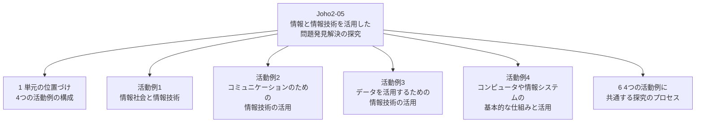

# Joho2-05: 情報と情報技術を活用した問題発見解決の探究

文部科学省「高等学校情報科『情報Ⅱ』教員研修用教材」第5章の学習メモ。この章は第1〜4章のような知識・技能の解説章ではなく、**「情報Ⅱ」全体のまとめ**として位置づけられた探究活動の章であり、教員が生徒の探究活動（課題設定→情報技術を活用した問題発見・解決→評価・改善）をどう指導するかを、4つの活動例（テーマ・生徒の活動・指導のポイント）で具体的に示す教員研修用の指導案集になっている。4つの活動例はそれぞれ第1〜4章の内容に対応しており、生徒はそこで学んだ知識・技能を総動員して探究に取り組む想定である。

!!! info "出典・凡例"
    出典: 文部科学省「高等学校情報科『情報Ⅱ』教員研修用教材」第5章 情報と情報技術を活用した問題発見・解決の探究（`JohoII/06_第5章_情報と情報技術を活用した問題発見解決の探究-巻末.pdf`、本文 pp.242–259）。

## 全体像 {#overview}



---

## 1. 単元の位置づけと学習内容 {#unit-overview}

学習指導要領解説の「(3) 情報と情報技術を活用した問題発見・解決の探究」に対応する単元。教材は、次の4つの項目のうち**1つまたは複数**に関わる課題を生徒に設定させることを想定している。

| 項目 | 内容1 | 内容2 |
|---|---|---|
| ア 情報社会と情報技術 | 現在使われている情報技術により情報社会が受ける効果や影響（情報システムによる個人情報収集の利便性と危険性など） | 将来予測される情報技術により情報社会が受ける効果や影響（AIの発達、人間に求められる能力の変化、新たな職業など） |
| イ コミュニケーションのための情報技術の活用 | コンテンツの編集（文字、音・音声、静止画、動画など） | 新しい技術を含めたコンテンツの制作（仮想現実・拡張現実・複合現実、仮想世界を探検する中での情報提供作品） |
| ウ データを活用するための情報技術の活用 | 問題の発見や解決（インターネット上で公開されたデータなどの活用） | 今後の方向性の予測（データマイニング、ビッグデータを含むデータの解析） |
| エ コンピュータや情報システムの基本的な仕組みと活用 | 問題の発見と解決（コンピュータの仕組み・情報システムの活用、物理現象や数学的事象のシミュレーション） | 機能追加、ユーザビリティやアクセシビリティの向上（画像認識・音声認識、外部機器の活用、機械学習などの外部プログラムの活用） |

!!! note "ア〜エの順序について"
    教材はア〜エを「本教材の1章〜4章の内容の順番に合わせた」と明記しており、**学習指導要領本体の記載順とは異なる**（本文中の※注記）。本ページの活動例1〜4もこの教材の並び（ア→イ→ウ→エ）に従う。

単元全体のねらいは、「地域や学校の実態及び生徒の状況に応じて情報と情報技術を活用した問題発見・解決の探究を通して、情報の科学的な見方・考え方を働かせて、情報と情報技術を適切かつ効果的に活用するための知識及び技能の深化・総合化、思考力、判断力、表現力等の向上を図る」こと。数学科など他教科との積極的な連携も挙げられている。

**本単元の取扱い**として、教材は次の点を述べる。

- この科目（情報Ⅱ）の**まとめ**として位置付ける。
- 生徒の興味・関心や学校の実態に応じて、4項目の中から一つ又は複数の項目に関わる課題を設定して問題の発見・解決に取り組ませる。
- 学習上の必要があり、かつ効果的と認められる場合は、指導の時期を分割することもできる。

**「情報Ⅰ」の学習内容との関連**としては、「情報Ⅰ」で身に付けた資質・能力を活用すること、また「情報Ⅰ」だけでなく数学科や公民科をはじめ他教科等で学習したことも踏まえて探究を行うことが述べられている。

---

## 2. 活動例1: 情報社会と情報技術 {#activity-1-society}

[Joho2-01](Joho2-01.md)（第1章 情報社会の進展と情報技術）に対応する活動例。テーマ例は「AIなんて怖くない〜AIと上手に付き合う方法」。

**テーマの設定**: 生徒のテーマ決め背景の例として、情報の授業でAIを学習したにもかかわらず、クラスの中で「将来、ロボットやAIが人間の仕事を奪ってしまう」「人類はAIに支配され不幸になってしまう」という話が友人から多く聞かれた、という状況が挙げられている。そこで、ロボットやAIが本当に人間の仕事をすべて奪うのか、AIに人間は支配されてしまうのかについてより深く研究するとともに、なぜクラスメートが否定的に考えるのかを明らかにし、誤解を解いてロボットやAIと上手に向き合ってもらうための方策を考え提案したい、というテーマ設定の例が示される。

**予備調査の実施**: 教科書・書籍でAIの仕組みを再確認する、インターネットの情報から最新のAIの機能やできることを確認する、実際にAIを用いたソフトウェアなどを操作してみる、友人数人に「なぜ『AIが仕事を奪う』と考えたのか」を簡単にインタビューする、といった例が挙げられている。

**予備調査から得られた仮説や知見**: 予備調査の結果から、クラスメートが否定的に考える原因についての仮説の例として、

- AIについての知識が十分ではないのではないか。知識が十分でない人ほど否定的な考えを強く持っているのではないか。誤解を解くための知識を身に付ければ否定的な考えが薄まるのではないか。
- コンピュータやプログラミング自体に興味関心が低く、あまり活用していないのではないか。コンピュータやAI自体に親しみを持ってもらえれば否定的な考えが薄まるのではないか。

が示されている。

**解決策（目標到達点）の決定と解決に向けての手順**: 仮説の検証例として、「M1: 将来、ロボットやAIが人間の仕事を全て奪ってしまうとどの程度考えているか」「M2: 人類はロボットやAIに支配され不幸になってしまうとどの程度考えているか」「A: 知識に関する簡単なチェックテスト」「B: コンピュータやプログラムに対する好き嫌い度」についてクラス全員にアンケートをとり、相関関係やクロス集計、仮説検定の考え方を用いて有意差を確認する、という手順が示される。目標到達点の例は、(1) AIに対する分かりやすいオリジナル説明資料（リーフレット）の作成、(2) WebAPI等を用いてAIを扱うプログラムを作成し、実際に体験してもらって親しみを持ってもらうイベントの実施、の2つ。

**解決策の実行**: プロジェクトマネジメントの考え方も意識させ、作業内容や手順・工程、かけられる時間、納期などを適切に管理させる。目標到達点に向けての活動の例として、アンケート結果や情報デザインの知識を活用したA4サイズ1枚のリーフレット作成、APIなどを使ってPythonのプログラムにAIを組み込み実際に動作させて理解を深める活動（状況によっては大学の教員や先輩にも協力してもらう）が挙げられている。

**評価と改善、今後の課題**: リーフレットを見てもらった上で改めて考えてもらう、リーフレット自体の見やすさ・分かりやすさを確認し色使いやデザインを改良する、といった評価と改善の例。今後の課題の例としては、「AIに関する法的なトラブルが発生した場合、誰が責任を負うのか」という疑問や、「あたかも人間のように表情を持ち、反応・応答し、人を和ませる『人型AI』が出現したとき、『人格』をどのように考えるか」という疑問が挙げられている。

**より広く深く学習したい生徒のために**: 情報社会を切り口とした探究は、情報科学だけでなく倫理的な側面や社会学的な側面、心理学的な側面にも及ぶことが十分に想定されるため、技術だけを学ぶのではなく、他教科で学ぶことも含めて幅広いものの見方を学ぶようアドバイスするとよい、とされている。

## 3. 活動例2: コミュニケーションのための情報技術の活用 {#activity-2-communication}

[Joho2-02](Joho2-02.md)（第2章 コミュニケーションとコンテンツ）に対応する活動例。テーマ例は「学校紹介」。

**学校紹介を行う／予備調査**: どのように学校紹介をすることが一番学校の良さが伝わるかを検討し、学校の魅力を伝えるために必要なコミュニケーションとは何かを考える。文化祭をアピールする場合でも、対象が入学を考えている中学生か、保護者か、中学時代の同級生かによって、アピールするポイントや素材、使用するメディアが異なる。対象に対して適切なメディアを選択できるようにする。インタビュー調査やアンケート調査によって、自分たちが見落としている魅力や別の切り口を発見できることもある。

**プロトタイプの作成**: 予備調査に基づいてコンテンツを作成する場合、プロトタイプの作成が重要となる。教材は次のプロセスを示している。


対象・目的によって、Webページ・ポスター・動画のどれを作成すべきかが決まる。

- **ポスター**: 多くの人の目に触れやすい一方、人が動き回る場所に掲示されるため目を向けさせるのが容易ではない。人目につく魅力的なイラストや写真・色使い・デザイン・キャッチコピーなどの工夫が必要。
- **Webページ**: 見る人の環境（パソコン・タブレット・スマートフォンなど、どのような端末か）に配慮する必要がある。一つのHTMLファイルを複数のCSSファイルで制御することで、複数の情報端末に対応しつつ制作後のメンテナンスも容易になる（レスポンシブなWebページ）が、その分ページ全体の設計・デザインに時間やコストがかかるというデメリットもある。
- **動画**: 情報量が多く、視覚と聴覚から情報を与えられるため短時間で多くの情報を伝えられる。動画のURLをメッセージに入れることで拡散も容易で、SNSとの相性もよい。一方で制作コストが大きく、肖像権や著作権など内容面での注意も必要。

**コンテンツの制作と改善／発信と改善**: コンテンツを制作する上では、「このコンテンツは誰に何を伝えるために作るのか」というペルソナを意識することが重要。制作したコンテンツは第三者の目で内容や誤字脱字をチェックし、必要に応じて編集・校正を行う。発信する場合は、受け手側が必要な情報を理解し行動に移すことにつながるか、送り手側は紹介したい内容が分かりやすく伝わり何らかの反応があることが理想となる。発信したコンテンツの成果によっては改良・更新も必要になる。

**新しい技術を含めたコンテンツの制作**: 文字・音・音声・静止画・動画の編集に加えて、必要に応じて仮想現実（Virtual Reality）・拡張現実（Augmented Reality）・複合現実（Mixed Reality）などの技術を含めてコンテンツを制作することが考えられる。例として、仮想現実の技術を使いヘッドマウントディスプレイなどを用いて360度の視点で現実世界にいるような感覚を与えるコンテンツの製作、拡張現実を使ってCGで作られた3D映像やキャラクターなどを現実の風景と重ねて投影するコンテンツでの学校紹介、複合現実を用いて複数人が同時に体験するコンテンツの制作可能性、文化祭や学校説明会でのインタラクティブなプロジェクションマッピングの導入などが挙げられている。

## 4. 活動例3: データを活用するための情報技術の活用 {#activity-3-data}

[Joho2-03](Joho2-03.md)（第3章 情報とデータサイエンス）に対応する活動例。テーマ例は「学校における教育の情報化の実態等に関する調査」。教材は、この単元の内容が第3章「情報とデータサイエンス」と一部重複すること、学習指導要領解説では情報Ⅱの(3)のア・イ・ウの中でデータ収集・整理・整形・処理・解釈・表現・評価という分析過程が分割して記載されているが実際の分析では一連の過程を実施することになる、と述べている。**この学習項目で使用するプログラミング言語はR**。

**データを収集、整理、整形する**: 文部科学省が毎年実施している「学校における教育の情報化の実態等に関する調査」の結果は政府統計ポータルサイト e-Stat に掲載されている。平成30年度（2019年12月公開）の「都道府県別『コンピュータの設置状況』及び『インターネット接続状況』の実態（高等学校）」のExcelデータを使用する。Rで分析する前に、不要なヘッダー・フッターの削除、不要な項目の削除、CSV形式にするための桁区切りカンマの除去、項目名を英字に変更、文字エンコーディングの変更といったデータクリーニングを表計算ソフトウェア上で行う。

| 変数名 | 内容 |
|---|---|
| `pref` | 都道府県別 |
| `school` | 学校数 |
| `student` | 児童生徒数 |
| `room` | 普通教室数 |
| `pc` | 学習者用PC総台数 |
| `spp` | 学習者用PC1台当たりの児童生徒数 |
| `prj` | 普通教室の大型提示装置整備率 |
| `lan` | 普通教室の校内LAN整備率 |
| `wlan` | 普通教室の無線LAN整備率 |

```r
pc <- read.csv("c:/Users/shinya/Desktop/pc/pc_sjis.csv", fileEncoding = "Shift_JIS")
head(pc)
```

**データを眺める、そして分析、可視化する**: 分析したい問題が明確でない場合には、まず `plot(pc)` で散布図行列を表示してみる。生徒数と教室数のように直線傾向が明確に見えるものは、「情報Ⅰ」で学んだ相関係数や単回帰分析の対象になる。教材はここで、直線傾向を見るのではなく `wlan`（無線LAN整備率）と `spp`（PC1台当たりの生徒数）を対象に、二つのクラスタに分割して考える例を示す。クラスタリングで k-means法（k平均法）などを用いる際は距離が重要になるため、対象とする値のみを取り出してスケーリングする。

```r
pcs <- scale(pc[, c("wlan", "spp")])
head(pcs)
```

k-means法でクラスタリングし、クラスタリングした値を元のファイルの列に追加する。

```r
km <- kmeans(pcs, centers = 2)
pc$cluster <- factor(km$cluster)
```

ggplot2パッケージを呼び出し、グラフを色分けして描く。

```r
library(ggplot2)
ggplot(pc, aes(x = wlan, y = spp, color = cluster)) +
  geom_text(aes(label = pref))
```

**データを解釈、評価して、更に分析する**: 教材は、この結果が「ほぼ無線LANの導入数を基準に分割されているようである。佐賀県と千葉県は極端な値である。これは何を意味しているのだろうか」と読者に問いかけ、明確な解釈は示していない（本ページでも断定しない）。続けて、明らかに正の相関関係が読み取れる生徒数（`student`）と学習用PCの台数（`pc`）を、先ほどのクラスタで色分けしてグラフに描く例が示される。

```r
ggplot(pc, aes(x = student, y = pc, color = cluster)) +
  geom_text(aes(label = pref))
```

!!! note "変数名の重なりに注意"
    この2つ目のグラフでは、データフレームの変数名も `pc`、列の一つも `pc`（学習者用PC総台数）という同名になっている。教材のコードはこのまま動作するが、変数名として紛らわしいので、自分でコードを書く際は列名とオブジェクト名を分けておくと読みやすい。

教材は「直線傾向だけに目を奪われていてはいけない。これを見て何が読み取れるだろうか」と締めくくり、データ収集・整理・整形・分析・可視化・解釈・評価という一連の流れを、データの内容に応じて手順を調整しながら試行することの重要性を述べている。

## 5. 活動例4: コンピュータや情報システムの基本的な仕組みと活用 {#activity-4-system}

[Joho2-04](Joho2-04.md)（第4章 情報システムとプログラミング）に対応する活動例。テーマ例は「学校デジタルサイネージの作成」。

**問題解決のステップとシステム作成のステップ**: 教材は、情報システムの作成をとおした問題解決を次の対応関係で示している。

| 問題解決のステップ | システム作成のステップ |
|---|---|
| 解決したい課題（現実と理想の差）を挙げる | 情報の収集、整理、課題の設定 |
| その課題を実現するシステム要件を決める | 要件定義 |
| 決定した要件からシステムを作成する | システム設計、システム作成 |
| そのシステムで課題解決したかを評価 | システムの評価 |

**テーマの設定と背景**: 初めてシステム作成を行う生徒にとってはウォーターフォールモデルの考え方が取り組みやすいだろうが、現実的に情報システムの作成をする場合はアジャイル的な手法を利用して開発していくことになるだろう、と述べられている。解決したい課題を情報システムで解決するという視点を持たせる際には、自分だけが便利なものではなく社会に役立つものという視点を持たせたい、として、ここでは「マイコンボードやPCを組み合わせた学校デジタルサイネージの作成」が例に挙げられている。

**課題の整理（要求定義）と基本設計**: 教室で利用するシステムの場合、自分が欲しい機能だけでなくクラスメートが利用するという視点に立つことが必要。インタビューやアンケート、ヒアリングなどを経て必要な機能をリストアップし、重要な機能に絞り込んで作成していく。教材が示す情報の整理の例は次の通り。

| 扱う情報 | 情報の登録 | 情報の表示 |
|---|---|---|
| その日の連絡事項／部活動や委員会からの告知／その日の予想最高気温／夕方までの天気予報や週間予報 | 朝のホームルームの時間までに、教員または担当生徒が表示させたい連絡事項を入力画面から入力する | ホームルームや休み時間など、授業以外の時間にサイネージの画面にクラスへの情報を表示する。表示内容が多いときはスクロールや画面切り替えを一定時間ごとに行い、連絡の徹底をはかる |

構成例として、校舎の各階にマイコンボード＋モニタを設置し、有線LANでルータ／スイッチに接続、ルータ側にデータ登録サーバを置く構成図が示されている。

**情報の収集と整理**: 作成するシステムの要件が固まったら、必要な機能についても既存のAPIやライブラリの活用が推奨される。天気予報や最高気温は、利用登録が必要だが観測地点単位でWebAPIとして提供されているものがあり、教材はYahoo!デベロッパーネットワーク気象情報APIとOpenWeatherMap APIを例として挙げている。APIから取得した情報と、生徒や教員が入力した情報を組み合わせて表示するイメージ（今日の天気・今日の最高気温・降水確率・「今日の一言」のような連絡事項を並べた画面）が示されている。

**システムの稼働と評価**: 実際に稼働させると、ネットワーク上のセキュリティの不備、よりよいデータ構造や効率的な通信の必要性、マニュアル等のドキュメントの不備・未整備、システムを停止させたメンテナンスの必要性など、設計から作成まででは気付いていなかった問題点が分かる、とされている。

**システムの改善や機能の追加**: プロジェクトを振り返り、教員やクラスメートからの意見を利用するユーザーの感覚として反映していく。機能の追加例として、音声で操作・案内する音声認識機能（VUI: Voice User Interface を基本とするスマートスピーカー向けAPIの活用）、生徒個人の予定につながるリマインダー機能、部活動や委員会活動・選択科目などの属性を入力するクライアントアプリケーションでの強調表示、ネットワーク経由やQRコード・非接触ICカード通信を介した各自のスマートフォンへの情報伝達などが挙げられている。

**更なる活動に向けて**: さらに高度なことをしてみたい生徒、深く学んでみたい生徒に向けて、ハッカソンやプログラミングコンテストなどの大会、インターネット上で開催される競技プログラミングコンテスト、企業インターンシップへの参加、各種学会イベントへの参加や学会での研究発表などを検討するとよい、とされている。学習指導要領では第5章の内容について「学習上の必要があり、かつ効果的と認められる場合は、指導の時期を分割することもできる」としており、検討の際は留意したいと締めくくられている。

## 6. 4つの活動例に共通する探究のプロセス {#common-process}

教材が明示的に示しているプロセスは、活動例2の「プロトタイプ作成のプロセス」（調査→問題解決のための仮説作成→要件定義→プロトタイプの設計・作成→検証、§3）と、活動例4の「問題解決のステップ／システム作成のステップ」対応表（課題を挙げる→要件を決める→システムを作成する→評価する、§5）の2つである。

!!! note "4つの活動例を並べて見えるパターン（教材が明言しているわけではない）"
    上記の2つに加えて活動例1・活動例3の章立てを並べると、いずれも大まかに「テーマ・課題の設定 → 予備調査・情報収集 → 仮説や要件の設定 → 解決策の設計・実行 → 評価・改善 → さらなる発展」という似た流れをたどっていることに気づく。ただしこれは教材が「4例に共通する型だ」と明言しているわけではなく、各章の構成を比較して読み取れる**筆者の観察**である点に注意。データ分析（活動例3）は性質上「評価」が「解釈」に近い開かれた問い（例: 佐賀県・千葉県の外れ値は何を意味するか）で終わる一方、システム作成（活動例4）は「稼働と評価」という運用寄りの評価になるなど、同じ大枠の中でも分野ごとに評価の中身は異なる。

---

## 学習目標 {#learning-outcomes}

章冒頭の「学習目標」として教材が挙げるのは次の3点。

1. 情報と情報技術を活用した問題発見・解決の探究を通して、情報の科学的な見方・考え方を働かせて情報と情報技術を適切かつ効果的に活用するための知識及び技能を深化・総合化させる。
2. 同様に、情報と情報技術を適切かつ効果的に活用するための思考力、判断力、表現力等の向上を図る。
3. 同様に、情報社会における問題の発見・解決に情報と情報技術を適切かつ効果的に活用しようとする態度、新たな価値を創造しようとする態度、情報社会に参画しその発展に寄与しようとする態度を養う。

!!! note "巻末付録について"
    このPDFの末尾（pp.260–261）には、教材作成に関わった有識者名簿と、研修講師の依頼窓口となる学会等の連絡先一覧が収録されている（p.262 奥付: 発行日 令和2年3月、発行 文部科学省、制作 株式会社学研プラス）。教員向けの参考情報であるため、本ページでは概要のみに留める。

## 前後のユニット {#related-units}

- 前: [Joho2-04](Joho2-04.md) — 情報システムとプログラミング
- 関連: [Joho2-01](Joho2-01.md)（活動例1: 情報社会と情報技術）・[Joho2-02](Joho2-02.md)（活動例2: コミュニケーションのための情報技術の活用）・[Joho2-03](Joho2-03.md)（活動例3: データを活用するための情報技術の活用）・[Joho2-04](Joho2-04.md)（活動例4: コンピュータや情報システムの基本的な仕組みと活用）— 本ページの4つの活動例はそれぞれこれらの章に対応する探究活動の指導案例。

疑問が出たら [Joho2-05 Q&A](Joho2-05-QA.md) に記録する。
