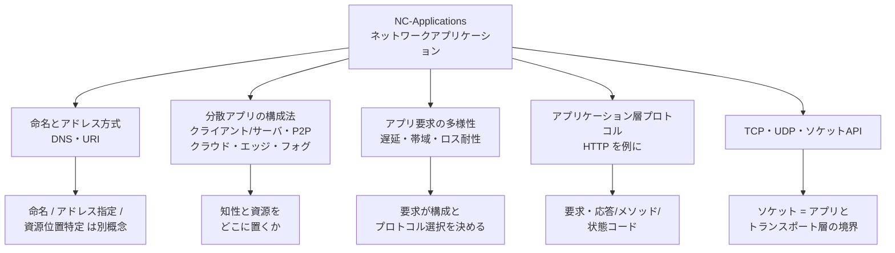
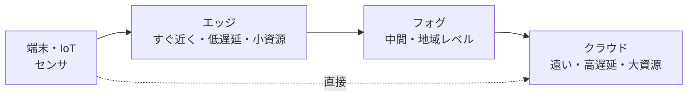
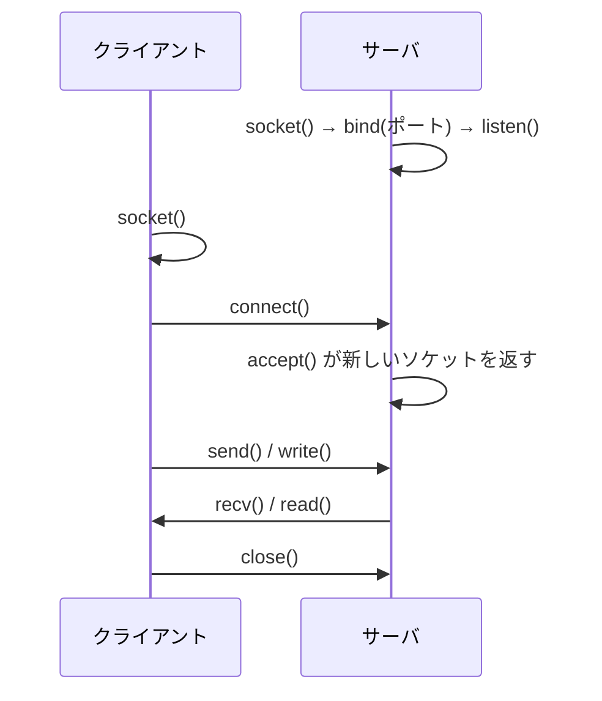

# NC-Applications: ネットワークアプリケーション

CS2023 / Networking and Communication (NC) の Knowledge Unit「**NC-Applications**（Networked Applications）」を整理した学習メモ。[NC-Fundamentals §4](NC-Fundamentals.md#layers) では、アプリケーション層から物理層までの5層の骨格を上から下まで概観した。本ユニットはその**最上層——アプリケーション層そのもの**に踏み込む。すなわち「**相手をどう指し示すか**（名前とアドレス）」「**アプリをどういう形に組むか**（クライアント/サーバ・P2P・クラウド/エッジ/フォグ）」「**どんな性能を必要とするか**（遅延・帯域・ロス耐性）」、そして「**実際にどうやってバイトを送るか**（HTTP・TCP/UDP・ソケット）」である。

[NC-Fundamentals §1](NC-Fundamentals.md#importance-challenges) の「ネットワーク特有の困難」の表で、**相手を指し示す必要がある**という行が本ユニットに割り当てられていた。その回収がここから始まる。

!!! info "出典・凡例"
    出典: `ComputerScienceCurricula2023.pdf` p.199。
    **CS Core** = 全卒業生必須 / **KA Core** = 当該分野で必須 / **Non-core** = 発展。
    このユニットは **CS Core 4時間**。NC KA 全8ユニットのうち CS Core が割り当てられているのは NC-Fundamentals（3時間）と本ユニットの2つだけで（CS Core 合計7時間）、残り6ユニットは KA Core（合計24時間）。**KA Core / Non-core の項目はなく、5項目すべてが CS Core** である。
    `See also: PDC-Communication, PDC-Coordination, PDC-Programs, SEP-Sustainability, SEP-Context` への参照を持つ——分散アプリの構成法は PDC（並列分散計算）と、アプリ要求の多様性は SEP（社会的・倫理的・専門的実践）と接続している。

## 全体像



---

## 1. 命名とアドレス方式——DNS と URI {#naming-addressing}

ネットワークで何かをするには、まず**相手を指し示せなければならない**。CS2023 が挙げる第1項目がこれであり、学習成果1は「**命名・アドレス指定・資源位置特定** (naming, addressing, resource location) の原理を定義せよ」と、あえて**3つを並べて**問う。この3つは日常語では混ざりやすいが、別の概念である。

| 概念 | 問い | 例 |
|---|---|---|
| **命名 (naming)** | その対象を**人間や上位層が呼ぶための識別子**は何か。場所を含まない、安定した名前 | `www.example.com`、ファイル名 |
| **アドレス指定 (addressing)** | その対象は**網のどこにいるか**。転送機構が直接使える、場所を表す識別子 | `93.184.216.34`（IP アドレス）、MAC アドレス |
| **資源位置特定 (resource location)** | 名前から**どうやってアドレスに辿り着くか**、そして「対象そのもの」ではなく「**その中のどの資源か**」をどう指すか | DNS による名前解決、URI のパス部分 |

- 名前とアドレスを分けておく利点は**間接参照 (indirection)** にある。サーバを別のデータセンターに移せば IP アドレスは変わるが、名前は変わらない。利用者は名前だけを知っていればよく、**名前とアドレスの対応表だけを更新すれば移転が完了する**。

!!! note "名前とアドレスの分離は OS で既に見た形"
    「安定した名前 → 場所を表す実体」という間接参照は、[OS-Files §4](../OS/OS-Files.md#directory-structures) のディレクトリ構造そのものである。ディレクトリは**ファイル名 → inode 番号**の対応表であり、DNS は**ドメイン名 → IP アドレス**の対応表。どちらも「名前で呼べば、実体がどこに移っても追随できる」という同じ利益を得ている。**規模が地球大になっただけで、仕掛けは同型**である。

### DNS——分散した名前解決 {#dns}

**DNS (Domain Name System)** は、ドメイン名を IP アドレスに変換する仕組み。設計上の要点は「**中央に1つの巨大な表を置かない**」ことにある。

- **階層的な名前空間**：`www.example.com` は右から `.`（ルート）→ `com`（TLD）→ `example`（権威）→ `www`（ホスト）と読む。名前の階層が、そのまま**管理権限の委譲の階層**になっている。`example.com` の中身をどう名付けるかは、`example.com` の管理者だけが決めてよい。
- **分散したサーバ群**：ルートサーバ・TLD サーバ・権威サーバに役割が分かれ、クライアント側の**リゾルバ**が順に問い合わせて名前を解決する。単一障害点も単一のボトルネックもない。
- **キャッシュ**：一度解いた対応は TTL の間キャッシュされる。実際の問い合わせの大半はキャッシュで済み、これが DNS を実用的な速度に保っている。裏返せば、**変更が全世界に反映されるまで TTL 分の遅れがある**。

### URI——資源を指す名前 {#uri}

**URI (Uniform Resource Identifier)** は、ホストではなく**資源**を指すための統一された書式である。

```
https://www.example.com:443/docs/nc/index.html?q=socket#section3
└─┬─┘   └───────┬───────┘└┬┘└────────┬───────┘└──┬──┘└──┬──┘
scheme        host      port       path        query  fragment
（どう話すか）（誰と）        （その中のどれか）
```

- **scheme** が「どのプロトコルで話すか」、**host（＋port）** が「どのホストのどのプロセスか」、**path 以降**が「そのホストの中のどの資源か」を表す。つまり URI 1本の中に、**命名・アドレス指定・資源位置特定の3つがすべて畳み込まれている**。
- URI のうち、**位置を示して取得方法まで含むもの**を特に **URL (Uniform Resource Locator)** と呼ぶ。一方、位置に依らず**名前だけを与える** URN（`urn:isbn:...` など）もある。「URI が上位概念、URL はその一種」と押さえる。

## 2. 分散アプリケーションの構成法 {#app-paradigms}

同じ「ネットワークアプリケーション」でも、**処理と資源をどこに置くか**で構成が大きく変わる（`See also: PDC-Communication, PDC-Coordination`）。CS2023 が挙げるのは次の5つ。

| 構成法 | 役割の配置 | 強み | 弱み |
|---|---|---|---|
| **クライアント/サーバ** | 常時稼働の**サーバ**が要求を待ち、**クライアント**が要求を出す。役割が非対称 | 管理・一貫性・アクセス制御が容易。設計が単純 | サーバが単一障害点かつボトルネック。規模拡大にコストがかかる |
| **ピアツーピア (P2P)** | 全ノードが**対等**で、互いにクライアントでもサーバでもある | 参加者が増えるほど**資源も増える**（自己スケール）。中央がないため頑健 | 一貫性・探索・信頼・可用性の管理が難しい |
| **クラウド** | 処理と保存を**遠方の大規模データセンター**に集約する | 事実上無限の計算・保存資源。需要に応じた伸縮 | 端末からの**距離＝遅延**。上流帯域を消費する |
| **エッジ** | 処理を**端末のすぐ近く**（基地局・アクセス網の縁）に置く | 遅延が小さい。生データを外に出さずに済む（プライバシー） | 各拠点の資源は限られる。多数拠点の管理が複雑 |
| **フォグ** | 端末とクラウドの**中間層**に処理を分散して置く（エッジとクラウドの間を埋める） | 遅延と資源量のバランスを取れる | 階層が増え、配置・調整の設計が難しい |



- **クラウド／エッジ／フォグは対立する選択肢というより1本の軸**である。「近いほど遅延は小さいが資源は乏しく、遠いほど資源は潤沢だが遅延は大きい」という連続体のどこに処理を置くかの問題。自動運転の緊急ブレーキ判断はエッジに、月次の統計処理はクラウドに置く——**要求（§3）が置き場所を決める**。
- CDN（[NC-Fundamentals §2](NC-Fundamentals.md#internet-organization)）は、この「近くに置く」発想を**コンテンツの複製**に適用したもの。エッジコンピューティングは、複製の対象をデータから**計算**へ広げたと見ればよい。

!!! tip "P2P の「自己スケール」が本質"
    クライアント/サーバでは、利用者が N 倍になるとサーバの負荷も N 倍になる。P2P では、利用者が N 倍になると**同時に供給側の資源（回線・ディスク・CPU）も N 倍になる**。この非対称性が、大規模なファイル配布や分散台帳で P2P が選ばれる理由である。設問で「なぜ P2P か」と問われたら、**「中央がないから」ではなく「需要と供給が同時に増えるから」**と答えるほうが本質を突いている。

## 3. アプリケーション要求の多様性——遅延・帯域・ロス耐性 {#app-demands}

「ネットワークが速い」は一枚岩の性質ではない。アプリケーションによって**何を要求するかが違う**、というのが CS2023 の第3項目である（学習成果2、`See also: PDC-Communication, SEP-Sustainability, SEP-Context`）。要求は主に3つの軸で表される。

| 軸 | 意味 | 敏感なアプリ | 鈍感なアプリ |
|---|---|---|---|
| **遅延 (latency)** | 送ってから届くまでの時間。**ばらつき（ジッタ）**も含む | 対戦ゲーム、音声・ビデオ会議、遠隔操作 | メール、バックアップ |
| **帯域 (bandwidth)** | 単位時間あたりに運べる量 | 動画ストリーミング、大規模データ転送 | テキストチャット、IoT センサ |
| **ロス耐性 (loss tolerance)** | 一部のデータが失われても成立するか | （耐えられない）ファイル転送、送金、Web ページ | （耐えられる）ライブ音声・映像 |

- **3軸は独立**である。音声通話は「**帯域は小さくてよいが遅延に厳しく、ロスには耐えられる**」——数十 ms 分の音が欠けても会話は続くが、1秒遅れると会話にならない。逆にファイルバックアップは「**帯域は欲しいが遅延はどうでもよく、ロスは1バイトも許されない**」。この2つを「どちらが速い回線を必要とするか」という1本の物差しで比べても意味がない。
- 遅延の中身と、なぜ混雑すると遅延が跳ね上がるのかは [NC-Fundamentals §7](NC-Fundamentals.md#queueing) のキューイングで扱った。**伝播遅延は帯域を増やしても縮まない**という事実が、低遅延を要求するアプリを物理的に近く（エッジ、CDN）に置かせる根本理由である。

!!! note "要求の違いがそのまま設計の分岐点になる"
    この3軸は「アプリの性質を分類するラベル」ではなく、**設計上の決定を導く入力**である。ロスに耐えられないなら TCP（§5）、遅延に厳しくロスに耐えられるなら UDP。遅延に厳しいなら処理をエッジへ（§2）。帯域が支配的ならキャッシュと CDN へ。学習成果2「特定のアプリの要求を分析せよ」に答えるときは、**3軸で測る → その測定値から構成とプロトコルを導く**という順で述べると筋が通る。

!!! tip "持続可能性と文脈という第4・第5の軸"
    `See also: SEP-Sustainability, SEP-Context` が付いているのは偶然ではない。データを遠方のクラウドまで運ぶか手元で処理するかは**消費電力**を左右し（動画配信はインターネット全体のトラフィックとエネルギーの大部分を占める）、通信が高価・低速・断続的な地域を想定するかどうかは**誰がそのアプリを使えるか**を決める。**要求の分析は技術的な性能だけの話ではない**。

## 4. アプリケーション層プロトコル——HTTP を例に {#app-layer-protocols}

**アプリケーション層プロトコル**とは、アプリ同士が交わす**メッセージの種類・書式・順序・意味**、そしてそれぞれのメッセージに対して何をするかの取り決めである。トランスポート層より下が「バイト列を届けること」だけを担うのに対し、アプリケーション層は「**そのバイト列が何を意味するか**」を定める（学習成果3）。

代表的なものに **HTTP**（Web）、**DNS**（名前解決、§1）、**SMTP/IMAP**（メール）、**SSH**（遠隔ログイン）などがある。以下は CS2023 が例に挙げる HTTP を、1つのプロトコルを詳しく説明する練習として見る。

### HTTP——要求と応答 {#http}

HTTP (HyperText Transfer Protocol) は **要求・応答 (request/response) 型**のプロトコルである。クライアントが1つの要求を送り、サーバが1つの応答を返す——これが基本単位。

```
[クライアント] GET /docs/index.html HTTP/1.1     →  [サーバ]
               Host: example.com

[クライアント] ←  HTTP/1.1 200 OK                    [サーバ]
                  Content-Type: text/html
                  (空行) (本文)
```

要求メッセージは **開始行（メソッド + パス + バージョン）／ヘッダ群／空行／本文** という構造を持ち、応答メッセージは **開始行（バージョン + 状態コード）／ヘッダ群／空行／本文** となる。**テキストで書かれた行指向の書式**であるため、人間が読めるのが HTTP/1.1 の特徴だった。

| メソッド | 意味 |
|---|---|
| **GET** | 資源を取得する。副作用を持たない（安全） |
| **POST** | 資源にデータを送り、サーバ側の状態を変える |
| **PUT** | 指定した URI に資源を作成・置換する |
| **DELETE** | 資源を削除する |

| 状態コードの類 | 意味 | 代表例 |
|---|---|---|
| **2xx** | 成功 | 200 OK |
| **3xx** | リダイレクト（別の場所を見よ） | 301 Moved Permanently, 304 Not Modified |
| **4xx** | クライアント側の誤り | 404 Not Found, 403 Forbidden |
| **5xx** | サーバ側の誤り | 500 Internal Server Error, 503 Service Unavailable |

- **ステートレス (stateless)** であることが HTTP の設計上の中心的な選択である。サーバは要求と要求の間に**クライアントの状態を保持しない**。おかげでサーバを何台にでも並べられ（どのサーバが応答してもよい）、障害からの回復も単純になる。代償として、ログイン状態のような**セッションはプロトコルの外**（Cookie やトークン）で作らねばならない。
- 進化の方向も要求（§3）で説明できる。HTTP/1.1 の**持続的接続**は接続確立のたびの往復遅延を削るため、HTTP/2 の**多重化**は1本の接続で並行に要求を出して待ち時間を隠すため、HTTP/3 が UDP ベースの QUIC に移ったのは TCP の Head-of-Line ブロッキングを避けて**遅延**をさらに削るため。**どれも「遅延を減らす」という一貫した動機**から出ている。

!!! tip "学習成果3「1つのプロトコルを詳細に説明せよ」の答え方"
    メソッドや状態コードの暗記を並べても「詳細に説明した」ことにはならない。**(1) メッセージの構造、(2) やり取りの手順、(3) その設計を選んだ理由と代償**の3点で語るのが要点。HTTP なら「要求・応答型で、テキストのヘッダと本文からなり、**ステートレスにしたことでスケールを得た代わりにセッションを外部化した**」まで言えれば、規格の暗記ではなく設計の理解を示せる。

## 5. TCP・UDP とソケット API {#transport-socket}

アプリケーション層プロトコルは「何を書くか」を決めるが、それを**実際に運ぶ**のはトランスポート層である。その境界に立つのが**ソケット (socket)** という抽象である（`See also: PDC-Programs`、学習成果4）。

### ソケット——アプリとトランスポート層の境界 {#sockets}

ソケットは、アプリケーションがネットワークを使うための **API 上の入口**であり、多くの OS で**ファイル記述子と同じもの**として扱われる。つまりアプリから見れば、ネットワーク通信は「**開いて、読み書きして、閉じる**」という既知の操作に還元される。

- 通信の相手は **(IP アドレス, ポート番号)** の組で特定される。IP アドレスが「どのホストか」を、**ポート番号が「そのホストの中のどのプロセスか」**を指す。両端の組を合わせた4つ組（＋プロトコル）が1本の接続を一意に決める。
- ポート番号こそが、[NC-Fundamentals §4](NC-Fundamentals.md#layers) で「トランスポート層は**プロセスからプロセスまで**を担当する」と述べたことの実装である。ネットワーク層はホストまでしか運べず、そこから先の「どのアプリへ渡すか」はポート番号が決める（**多重化・逆多重化**）。

典型的な TCP の通信手順：



- サーバ側は **bind** で「このポートで待つ」と宣言し、**listen** で待ち受け状態に入り、**accept** で接続ごとに**新しいソケットを1つ**得る。待ち受け用のソケットと、通信用のソケットが別物である点が最初のつまずきどころ。
- UDP には接続がないため手順はずっと短く、`socket() → bind()` の後は **sendto / recvfrom** で毎回宛先を指定して送受信するだけになる。

!!! note "ソケットが「ファイルに見える」ことの意味"
    ソケットが読み書き可能なファイル記述子として現れるのは、[OS-Principles §2](../OS/OS-Principles.md#abstractions) の「抽象化で複雑さを隔離する」という原則の適用である。同じ `read`/`write` で、ローカルのファイルにも、パイプにも、地球の裏側のサーバにも書ける。[OS-Process §5](../OS/OS-Process.md#ipc) のプロセス間通信を**ホストの境界を越えて延長したもの**がソケットだ、と捉えると位置づけが定まる。実際、同一ホスト内の IPC 手段としても Unix ドメインソケットが使われる。

### TCP と UDP——どちらを選ぶか {#tcp-vs-udp}

| | **TCP** | **UDP** |
|---|---|---|
| **接続** | 接続指向（通信前に確立が必要） | コネクションレス（いきなり送れる） |
| **信頼性** | 再送により**確実に届ける** | 届く保証なし。落ちたら落ちたまま |
| **順序** | 送った順に届く | 順序は保証されない |
| **データの単位** | **バイトストリーム**（境界がない） | **データグラム**（メッセージ境界が保たれる） |
| **輻輳制御** | あり（混雑を検知して自ら送信を絞る） | なし（アプリが自分で面倒を見る） |
| **オーバヘッド** | ヘッダも手順も大きい | 極小 |

- 選択の基準は §3 の要求そのものである。**ロスが許されないなら TCP、遅延が最優先でロスに耐えられるなら UDP**。ファイル転送・Web・メールは TCP、ライブ音声/映像・ゲーム・DNS の問い合わせは UDP という分かれ方になる。
- **UDP を選ぶことは「信頼性を捨てる」ことではなく、「信頼性を自分で設計する」ことである**。リアルタイム映像なら、遅れて届いた1フレームを再送で待つより捨てて次に進むほうが正しい。TCP の一律の再送・順序保証は、そういうアプリには**かえって害になる**。QUIC（HTTP/3、§4）が UDP の上に自前の信頼性と輻輳制御を作り直したのは、まさにこの「必要な保証だけを自分で選ぶ」という発想の徹底である。
- TCP がどうやって信頼性と輻輳制御を実現しているのか——確認応答、タイムアウトと再送、ウィンドウ、輻輳ウィンドウの制御——は本ユニットの範囲を超え、**NC-Reliability（未作成）**の主題になる。本ユニットでは「**アプリから見て何が保証されるか**」までを押さえておけばよい。

---

## 学習成果（Illustrative Learning Outcomes）

CS Core:

1. **命名・アドレス指定・資源位置特定**の原理を定義できる。→ [§1](#naming-addressing)
2. 特定のネットワークアプリケーションの**要求を分析**できる。→ [§3](#app-demands)（構成の選択は [§2](#app-paradigms)、プロトコルの選択は [§5](#tcp-vs-udp)）
3. **1つのアプリケーション層プロトコル**の詳細を説明できる。→ [§4](#app-layer-protocols)（HTTP は [§4-HTTP](#http)）
4. 単純な**クライアント・サーバ型のソケットアプリケーション**を実装できる。→ [§5](#sockets)（構成の理解は [§2](#app-paradigms)）

!!! tip "混同しやすい組"
    | 混同しやすい組 | 区別の軸 |
    |---|---|
    | 名前 / アドレス | 場所を含まない安定した識別子 か 網の中の位置か（§1） |
    | URI / URL | 上位概念（識別子一般） か その一種（位置と取得法を示すもの）か（§1） |
    | クラウド / エッジ / フォグ | 対立する3択ではなく「端末からの距離」という1本の軸（§2） |
    | 帯域が要る / 遅延に厳しい | 独立した別の要求（音声は前者は低く後者は高い）（§3） |
    | TCP のストリーム / UDP のデータグラム | メッセージ境界が消える か 保たれるか（§5） |

## 前後のユニット

- 前: [NC-Fundamentals](NC-Fundamentals.md) — ネットワークの基礎（5層の骨格。本ユニットはその最上層を深掘りする）
- 次: [NC-Reliability](NC-Reliability.md) — 信頼性のある通信（TCP等。本ユニットで「TCP は確実に届ける」と述べた、その中身）
- 関連: [NC-Routing](NC-Routing.md)（アドレスから経路へ） / NC-Security（未作成） / NC-Mobility（未作成） / NC-Emerging（未作成）
- なお実際の学習順は CS2023 の並びと前後している。NC-Fundamentals の次に [NC-SingleHop](NC-SingleHop.md) を先に読んでおり、本来その手前にある NC-Applications・NC-Reliability・NC-Routing は後から埋めた（今はいずれも埋まっている）。**本ユニットは NC-SingleHop より前に置かれるべき内容**なので、通読の際は NC-Fundamentals → 本ユニット → NC-Reliability → NC-Routing → NC-SingleHop の順に読むとよい。

疑問が出たら [NC-Applications Q&A](NC-Applications-QA.md) に記録する。
