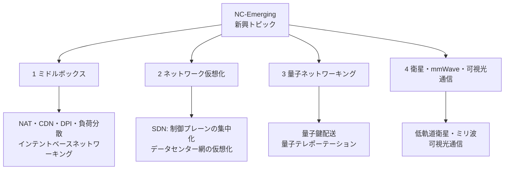

# NC-Emerging: 新興トピック

CS2023 / Networking and Communication (NC) の Knowledge Unit「**NC-Emerging**（Emerging Topics）」を整理した学習メモ。NC の他7ユニットはいずれも数十年かけて標準化・安定化した技術（Ethernet、BGP、TLS など）を扱ってきたが、本ユニットは**まだ発展途上、あるいは今まさに実用化が進んでいる領域**を扱う。これまでのユニットで積み上げた語彙——制御プレーンとデータプレーンの分離、仮想化、暗号、多重化——が、**新しい制約条件のもとでどう組み替えられているか**を見るのが本ユニットの読み方になる。

!!! info "出典・凡例"
    出典: `ComputerScienceCurricula2023.pdf` p.201。
    **CS Core** = 全卒業生必須 / **KA Core** = 当該分野で必須 / **Non-core** = 発展。
    このユニットは **KA Core 4時間**（CS Core の割り当てはなし）。4項目すべてが KA Core。CS2023 の並びでは NC KA 最後のユニットであり、Introductory Course の時間配分（2時間）から Advanced Course（5時間）へ**+3時間**と、KA Core 6ユニット中もっとも大きく増える（他は+1〜+2時間）。**発展的な内容という位置づけ**が時間配分にも表れている。

## 全体像

---

## 1. ミドルボックス {#middleboxes}

**ミドルボックス**とは、[NC-Fundamentals §5](NC-Fundamentals.md#hourglass) の end-to-end 原則が想定する「網の中身は単純な転送に徹する」という範囲を超えて、**通常の IP ルーティングにとどまらない処理**（内容の書き換え・検査・振り分け等）をパケットに対して行う機器の総称（学習成果1）。

- 代表例はすでに個別のユニットで登場している：[NC-Routing §3](NC-Routing.md#nat) の **NAT**（アドレスの書き換え）、[NC-Fundamentals §2](NC-Fundamentals.md#internet-organization) の **CDN**（コンテンツをエッジに複製して配信）、[NC-Security §3c](NC-Security.md#monitoring-detection) の**ファイアウォール・IDS**（トラフィックの検査とフィルタリング）。本ユニットはこれらを**「end-to-end 原則からの逸脱」という共通の型**で捉え直す。
- **DPI (Deep Packet Inspection)**：パケットのヘッダだけでなくペイロードまで解析し、アプリケーションの種類や内容に応じてトラフィックを識別・制御する。
- **負荷分散 (load balancing)**：1つの宛先アドレス宛てのトラフィックを、背後の複数のサーバへ振り分ける。利用者からは単一のサービスに見えるが、内部は水平に拡張された複数台という、[OS-Virtualization](../OS/OS-Virtualization.md) の仮想化と同じ「1つに見せて実は複数」という発想がネットワーク越しに現れたもの。
- **インテントベースネットワーキング (intent-based networking)**：「このアプリのトラフィックは優先せよ」のような**目的（インテント）を宣言**すると、ネットワークが具体的な設定に自動で翻訳する。設定の記述を「どうやるか」から「何を達成したいか」へ引き上げる試みで、AI・機械学習が異常検知や自動最適化に使われる**ネットワーク運用へのAI活用**とも結びつく。

!!! warning "ミドルボックスは end-to-end 原則と緊張関係を生じうる"
    [NC-Routing §3](NC-Routing.md#nat) で NAT について述べた「end-to-end 原則が壊れる」という指摘は、パケットの中身を書き換えたり接続ごとの状態を持ったりするミドルボックス（NAT・DPI・一部のロードバランサ等）には当てはまるが、**すべてのミドルボックスがそうとは限らない**——受動的に観測するだけの監視機器は、通信そのものを妨げない。書き換え・状態保持を伴うミドルボックスは、**網の中身が単純である**という設計の大前提を崩すたびに、新しい暗号化技術（DPI を無効化する）や新しいアドレス方式（NAT を不要にする IPv6）との綱引きを生む。この緊張を理解しておくと、なぜ同じ問題（アドレス枯渇、トラフィック管理）に対して「ミドルボックスで対処する」派と「端点・プロトコルの側で解決する」派の両方が常に存在するのかが見えてくる。

## 2. ネットワーク仮想化 {#network-virtualization}

「1つの物理資源を複数の論理資源に見せる」、あるいはその逆に「複数の物理資源を1つの論理資源に見せる」という仮想化の発想を、ネットワーク全体に適用する（学習成果2）。

### SDN (Software-Defined Networking) {#sdn}

[NC-Routing §1](NC-Routing.md#centralized-decentralized) で触れた**集中型経路制御**の実用形。

- 伝統的なルータは制御プレーンとデータプレーンを1台の機器内に閉じて持つ（[NC-Routing §2](NC-Routing.md#control-data-plane)）。SDN は**制御プレーンを機器から切り離し、ネットワーク全体を見渡す単一のコントローラ（論理的な意味で1つ）に集約**する。各スイッチ・ルータは単純な「言われた通りに転送するだけ」のデータプレーンだけを残す。コントローラ自体は複数台に物理的に分散して実装されることも多いが、**ネットワークからは1つの意思決定主体として見える**という点が「集中」の意味である。
- **利点**：網全体の状態を1箇所で把握できるため大域最適化がしやすく、インテントベースネットワーキング（§1）のような高水準な制御も実装しやすい。ネットワークの振る舞いをハードウェアの入れ替えなしに**ソフトウェアの変更だけ**で更新できる。
- **代償**：[NC-Routing §1](NC-Routing.md#centralized-decentralized) の表で見た集中型の弱み——コントローラが単一障害点になりうること、制御路の遅延が致命的になりうること——がそのまま当てはまる。実運用ではコントローラを冗長化し、コントローラ障害時にもデータプレーンが直前の状態で動き続けられるよう設計する。

### データセンターネットワークの仮想化 {#dc-virtualization}

[NC-SingleHop §6](NC-SingleHop.md#datacenter-network) の leaf-spine トポロジの上に、**論理的な網を複数重ねる**仕組み。

- 1つの物理データセンター網の上に、テナント（利用組織）ごとに独立した仮想網を作る。[NC-SingleHop §5](NC-SingleHop.md#vlan) の VLAN がこの発想の最も素朴な形だったが、VLAN ID は12ビット（4096通りのうち予約分を除き実際に使えるのは1〜4094の4094個）しかなく、クラウド規模のマルチテナント環境には数が足りない。**VXLAN** のような技術は、既存の IP 網の上に仮想 L2 網を**トンネリング**でカプセル化して運び、識別子の空間を大幅に広げる。
- SDN とデータセンター仮想化は補完関係にある：SDN が「網の振る舞いを集中制御する仕組み」を提供し、その上でテナントごとの仮想網を動的に作成・破棄するオーケストレーションが実装される。

## 3. 量子ネットワーキング {#quantum-networking}

まだ研究段階にある技術だが、**古典的な通信とは異なる保証**を原理的に提供しうる領域として位置づけられている（学習成果3）。

- **何が違うのか**：量子ビットは観測すると状態が乱されるという量子力学的性質（観測による擾乱）を持つ。これを利用すると、盗聴の試みが**通信路の統計的な異常として現れる**通信が原理的に作れる——[NC-Security §3a](NC-Security.md#cryptography) の古典公開鍵暗号の多くが「解読に計算量的に時間がかかるから安全」という前提に立つのに対し、量子暗号は物理法則に基づいて**盗聴の痕跡を統計的に検出可能にする**という、質的に異なる根拠の安全性を目指す（ワンタイムパッドのように計算量に依存しない古典暗号も別途存在する）。
- **量子鍵配送 (QKD)**：この性質を使い、盗聴によって生じる誤り率の増加を測定しながら暗号鍵を共有する技術。測定された誤り率が閾値を超えれば鍵を破棄し、超えなければ誤り訂正と秘匿性増強を経て安全な鍵を確定する。鍵の交換自体に**改ざんされていない古典的な通信チャネル**（正当な相手であることの事前確認）も別途必要になる。配送された鍵自体は従来の対称鍵暗号（[NC-Security §3a](NC-Security.md#cryptography)）でそのまま使える。
- **量子テレポーテーション**：量子もつれを利用して、量子状態を**物理的な媒体でその状態を運ぶことなく**別の場所に転送する技術。「テレポーテーション」という名前だが物質やエネルギーが瞬間移動するわけではなく、事前に共有した量子もつれと古典的な通信チャネルを組み合わせて量子状態の情報を再現する。
- **量子インターネット**：以上の要素技術を組み合わせ、量子コンピュータ同士や量子センサー同士を結ぶネットワークを構築する構想。現時点では短距離・実験室規模の実証が中心で、[NC-Fundamentals](NC-Fundamentals.md) が扱ったような「世界規模での階層化・経路制御」を量子の世界でどう実現するかは、なお研究課題として残っている。

## 4. 衛星・ミリ波・可視光通信 {#satellite-mmwave-vlc}

「電波をどう飛ばすか」という物理層に立ち返り、新しい周波数帯・新しい配置でアクセスを広げる試み（学習成果1の延長線上にある実装例として、§1〜3 とは異なる角度からネットワークの到達範囲を広げる）。

- **低軌道衛星 (LEO satellite) 網**：数百〜数千km 上空を周回する多数の小型衛星群で地球全体を覆い、地上インフラの薄い地域にも [NC-Mobility §1](NC-Mobility.md#cellular) のセルラー網に似た発想で通信を届ける。低軌道ゆえ静止衛星より遅延が小さい一方、**衛星自体が高速で移動する**ため、[NC-Mobility §1](NC-Mobility.md#cellular) のハンドオフに相当する**衛星間の切り替え**が地上の基地局切り替えよりずっと頻繁に必要になる。
- **ミリ波 (mmWave)**：数十GHz 帯という非常に高い周波数を使い、広い帯域幅（＝高い通信速度）を確保する。5G の高速化の柱の1つ。代償として**直進性が強く障害物に弱い**——壁1枚で大きく減衰するため、[NC-Mobility §1](NC-Mobility.md#cellular) のセル分割をさらに細かくした**極小セル**を高密度に配置する必要がある。
- **可視光通信 (VLC, Visible Light Communication)**：照明用 LED の点滅を高速に制御して通信路として使う。電波を使わないため、電波が禁止・制限される環境（病院、航空機内、電波干渉に敏感な工場）でも使え、**光が届く範囲だけに通信を閉じ込められる**（盗聴が壁の外まで届きにくい）という NC-Security 的な副次的利点もある。

---

## 学習成果（Illustrative Learning Outcomes）

KA Core:

1. **ミドルボックスの進歩が持つ価値**を説明できる。→ [§1](#middleboxes)
2. **ソフトウェア定義ネットワークの重要性**を説明できる。→ [§2](#network-virtualization)
3. **量子ネットワーキングで得られる付加価値**を説明できる。→ [§3](#quantum-networking)

!!! tip "混同しやすい組"
    | 混同しやすい組 | 区別の軸 |
    |---|---|
    | VLAN / VXLAN | 12ビットの ID 空間で LAN 内を分割 か トンネリングで IP 網越しに大規模テナントを分離するか（[§2](#dc-virtualization)） |
    | SDN / 従来の分散型経路制御 | 制御プレーンを1箇所に集約する か 各ルータが自律的に計算するか（[§2](#sdn)・[NC-Routing §1](NC-Routing.md#centralized-decentralized)） |
    | 量子鍵配送 / 従来の公開鍵暗号 | 盗聴を物理法則で検出可能にする か 計算量的な困難さに依存するか（[§3](#quantum-networking)） |
    | 低軌道衛星 / 静止衛星 | 低遅延だが高頻度なハンドオフが要る か 遅延は大きいが1機で広域を静的にカバーするか（[§4](#satellite-mmwave-vlc)） |

## 前後のユニット

- 前: [NC-Mobility](NC-Mobility.md) — モビリティ
- 次: なし（NC Knowledge Area 最後のユニット）
- 関連: [NC-Routing §3](NC-Routing.md#nat) — NAT（ミドルボックスの代表例）
- 関連: [NC-SingleHop §5](NC-SingleHop.md#vlan)・[§6](NC-SingleHop.md#datacenter-network) — VLAN とデータセンター網（ネットワーク仮想化の土台）
- 関連: [NC-Security §3a](NC-Security.md#cryptography) — 古典暗号との対比としての量子鍵配送
- これで NC (Networking and Communication) の全8ユニットが揃った。KA 全体の見取り図は [NC-Fundamentals](NC-Fundamentals.md) から辿り直すとよい。

疑問が出たら [NC-Emerging Q&A](NC-Emerging-QA.md) に記録する。
