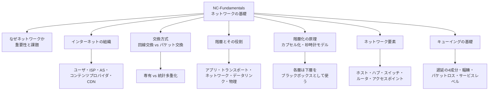
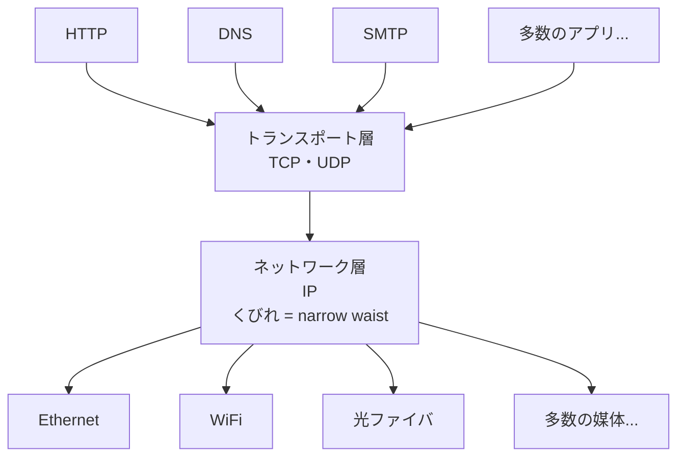

# NC-Fundamentals: ネットワークの基礎

CS2023 / Networking and Communication (NC) の Knowledge Unit「**NC-Fundamentals**（Fundamentals）」を整理した学習メモ。OS Knowledge Area では1台の計算機の中で資源をどう仮想化・保護するかを見てきた。本ユニットからは視野を**計算機と計算機の間**に広げ、「離れた2つのプログラムが会話できるのはなぜか」を支える骨格——**交換方式・階層化・ネットワーク要素・キューイング**——を扱う。

!!! info "出典・凡例"
    出典: `ComputerScienceCurricula2023.pdf` pp.198–199。
    **CS Core** = 全卒業生必須 / **KA Core** = 当該分野で必須 / **Non-core** = 発展。
    このユニットは **CS Core 2.5時間 + 0.25 (SEP) + 0.25 (SF) = 計3時間**。NC KA 全8ユニットのうち CS Core が割り当てられているのは本ユニットと NC-Applications の2つだけで（CS Core 合計7時間）、残り6ユニットは KA Core（合計24時間）。つまり**「全卒業生が必ず知っておくべきネットワーク知識」の半分が本ユニット**にある。`See also: SEP-Context, SEP-Privacy, SF-Foundations` への参照を持つ。

## 全体像

---

## 1. なぜネットワークなのか——重要性と課題 {#importance-challenges}

ネットワークは今や「計算機の付属機能」ではなく、**計算機システムそのものの前提**になっている（`See also: SEP-Context, SEP-Privacy`）。CS2023 の前文が挙げる背景は4つ：

- **公衆インターネット**が世界中の個人・組織にネットワークアプリケーションを届けている。
- 大手事業者の**専有ネットワーク**（Google・Meta・Amazon 等の自社バックボーン）が、分散計算・ストレージ・コンテンツ配信を安価に支えている。
- **衛星ネットワーク**の進歩が地方・僻地への接続性を広げている。
- **デバイス間通信**が IoT（Internet of Things）を成立させている。

同時に、ネットワークは**単体の計算機にはなかった困難**を持ち込む。この「困難のリスト」が NC KA 全体の目次にほぼそのまま対応している：

| 困難 | どういう問題か | 扱うユニット |
|---|---|---|
| **通信路は信頼できない** | パケットは落ちる・重複する・順序が入れ替わる | [NC-Reliability](NC-Reliability.md#unreliable-delivery) |
| **相手を指し示す必要がある** | 名前とアドレスをどう決め、どう解決するか | [NC-Applications](NC-Applications.md#naming-addressing) |
| **経路を決めなければならない** | 世界中のどこへでも届く道をどう見つけるか | [NC-Routing](NC-Routing.md#routing-paradigms) |
| **媒体を共有している** | 同じ電波・同じケーブルを複数の送信者が使う | [NC-SingleHop](NC-SingleHop.md) |
| **敵対者がいる** | 盗聴・なりすまし・サービス妨害 | NC-Security（未作成） |
| **端末が動く** | 移動しながら接続を維持する | NC-Mobility（未作成） |

!!! note "「信頼できない部品から信頼できるサービスを作る」という反復テーマ"
    通信路が壊れることを前提に、その上で信頼性のあるサービスを組み立てる——という構図は [OS-Faults](../OS/OS-Faults.md#reliability-availability) で見た耐故障性の議論と同型である。実際、[OS-Faults §3](../OS/OS-Faults.md#redundancy-types) の**時間的冗長性**（同じ処理を時間をずらして繰り返す）は、ネットワークでは**再送**という名前で中心的な道具になる。OS で学んだ考え方が、そのまま距離を隔てた世界に持ち込まれると考えてよい。

**社会的・倫理的な側面**（`See also: SEP-Context, SEP-Privacy`）も CS Core に明示的に含まれている：通信内容やメタデータが第三者を通過するというネットワークの構造そのものがプライバシーの問題を生み、接続性の地理的・経済的な偏り（デジタルデバイド）は誰がネットワークの恩恵を受けられるかを左右する。

## 2. インターネットの組織——ユーザからCDNまで {#internet-organization}

インターネットは**単一の組織が運営するネットワークではなく**、独立に管理された多数のネットワークが相互接続した「ネットワークのネットワーク」である（学習成果1）。登場人物は次の通り：

| 登場人物 | 役割 |
|---|---|
| **ユーザ／ホスト (host, end system)** | 通信の端点。PC・スマートフォン・サーバ・IoT デバイス |
| **ISP (Internet Service Provider)** | 接続性を売る事業者。階層があり、末端の**アクセス ISP**、それを束ねる**地域 ISP**、世界規模で相互接続する**Tier 1（トランジット）ISP** |
| **AS (Autonomous System / 自律システム)** | 単一の管理主体が運用し、**統一された経路制御方針**を持つネットワークの単位。AS 番号 (ASN) で識別され、AS 間の経路交換が BGP（NC-Routing で扱う） |
| **IXP (Internet eXchange Point)** | 複数の AS が集まって相互接続する物理的な拠点。ここで**ピアリング**（対等な相互接続、原則無償）が行われる |
| **コンテンツプロバイダ** | コンテンツを供給する事業者。近年は自前のグローバルバックボーンを持ち、Tier 1 を経由せず直接ピアリングすることも多い |
| **CDN (Content Delivery Network)** | コンテンツの複製をユーザの**近く**に配置し、距離を短くして遅延と上流帯域の消費を減らす仕組み |

- AS 間の関係は大きく **トランジット**（お金を払って上流に運んでもらう）と **ピアリング**（対等に相互のトラフィックを交換する）の2種類。この経済的関係が、経路制御の結果（どの道を通るか）を実質的に決める——**インターネットの形は技術だけでなくビジネス関係でも決まっている**。

!!! tip "学習成果4「複雑さの種類（エッジ・コア）」の捉え方"
    インターネットの複雑さは一様ではなく、**エッジ (edge)** と **コア (core)** で性質が違う。

    - **エッジ**：ホストとアクセスネットワーク。**種類の多様性**が複雑さの源（有線・無線・モバイル・IoT、性能も要求もばらばら）。アプリケーションの知性はここに集中する。
    - **コア**：ルータの網。**規模と速度**が複雑さの源（膨大な経路数、高速な転送）。だが機能は意図的に単純に保たれている（§5 の砂時計モデル・end-to-end 原則）。

    「賢い端、単純な芯」——これがインターネットの設計思想の要約。電話網が逆（単純な端末、賢い交換機）だったことと対比すると理解しやすい。

## 3. 交換方式——回線交換とパケット交換 {#switching-techniques}

離れた2者のデータを中継網でどう運ぶか。方式は大きく2つ（学習成果2）：

| | **回線交換 (circuit switching)** | **パケット交換 (packet switching)** |
|---|---|---|
| **仕組み** | 通信開始前に**経路上の帯域を予約**し、通信の間ずっと専有する | データを**パケット**に区切り、各パケットが独立に中継される |
| **代表例** | 従来の電話網、光波長パス | インターネット |
| **資源の使い方** | 使っていなくても確保され続ける（**専有**） | 空いている瞬間を他の通信が使える（**統計多重化**） |
| **性能の予測** | 通信中の帯域・遅延は**保証**される | 混雑具合によって**変動**する |
| **混雑時の挙動** | 新規の呼が**拒否される**（ブロッキング） | 全員が受け入れられ、代わりに**遅くなる／落ちる**（輻輳） |
| **セットアップ** | 通信前の接続確立が必要 | 不要（最初のパケットをいきなり送れる） |

- パケット交換が勝った理由は**バースト性**にある。データ通信は「送るときは一気に、そうでないときは何も送らない」という性質を持つため、専有すると大半の時間が無駄になる。パケット交換は**多数の利用者が同じ資源を統計的に共有**することで、同じ設備でずっと多くの利用者を収容できる。
- 代償が「保証がないこと」——遅延も帯域もその時々の混雑次第。これが §7 のキューイング、そして NC-Reliability の輻輳制御が必要になる理由。

!!! note "統計多重化とスケジューリングの相似"
    「専有すれば予測可能だが無駄が多い／共有すれば効率的だが干渉しあう」というトレードオフは、[OS-Scheduling](../OS/OS-Scheduling.md) で CPU 時間について見た構図とまったく同じである。リアルタイム系が CPU を予約するのは回線交換に、汎用 OS のタイムシェアリングはパケット交換に対応する。**資源共有の設計問題は、資源が CPU でも通信路でも同じ形で現れる**。

!!! warning "「スイッチング」は2つの意味で使われる"
    本節の「交換方式（circuit / packet switching）」は**網全体のパラダイム**の話。一方 [NC-SingleHop §5](NC-SingleHop.md#l2-switching) に出てくる「スイッチング」は、LAN の中で**L2 スイッチという機器**がフレームを転送する仕組みの話。**同じ語だが抽象度が違う**。「パケット交換網の中で、L2 スイッチがフレームをスイッチングする」という入れ子になっていると理解すればよい。

## 4. 階層とその役割 {#layers}

ネットワーク機能は**層 (layer)** に分けて設計される。CS2023 が挙げるのは**5層モデル**（インターネットの実務的なモデル）：

| 層 | 責務 | 扱うデータ単位 (PDU) | 代表例 |
|---|---|---|---|
| **アプリケーション層** | アプリ固有のやり取り。何を送るか | メッセージ | HTTP, DNS, SMTP |
| **トランスポート層** | プロセス間の論理通信。信頼性・順序・多重化 | セグメント | TCP, UDP |
| **ネットワーク層** | 送信元ホストから宛先ホストへ、**網を越えて**届ける | データグラム／パケット | IP, ルーティング |
| **データリンク層** | **隣接ノード間**（1ホップ）でフレームを届ける | フレーム | Ethernet, WiFi |
| **物理層** | ビットを物理的な信号として送る | ビット | 電気信号・光・電波 |

- 層の分かれ目を押さえる鍵は**「どこからどこまでを担当するか」**：
    - **データリンク層は1ホップ**（隣の機器まで）。ここが [NC-SingleHop](NC-SingleHop.md) の主題。
    - **ネットワーク層は端から端まで**（多数のホップを越えて）。NC-Routing の主題。
    - **トランスポート層はプロセスからプロセスまで**（ホスト内のどのアプリかまで特定する）。
- OSI 参照モデルは7層で、上記の**アプリケーション層をさらに「アプリケーション／プレゼンテーション／セッション」に分ける**。実際のインターネットではこの3層の区別が曖昧なため、CS2023 は5層モデルを採る。

!!! tip "各層を「誰と会話しているか」で覚える"
    郵便の比喩：手紙の**中身**（アプリケーション層）は差出人と受取人の会話。**封筒の宛名**（ネットワーク層）は郵便網全体が読む。**「次はこの集配所へ」という仕分けの札**（データリンク層）は隣の拠点までしか意味を持たず、拠点ごとに貼り替えられる。**トラックの荷台での運搬**（物理層）が実際の移動。手紙の中身は途中で開封されないが、仕分け札は毎回書き換わる——これがそのまま「IP ヘッダは端から端まで残るが、リンク層のヘッダはホップごとに付け替えられる」という事実に対応する。

## 5. 階層化の原理——カプセル化と砂時計モデル {#layering-principles}

層に分けること自体が**設計原則**であり、その中身は2つの考え方に集約される（学習成果3、`See also: SF-Foundations`）。

### カプセル化 (encapsulation) {#encapsulation}

上位層のデータを、下位層が**中身を解釈せずに**自分のヘッダで包んで運ぶ仕組み。

- 各層は下位層を**ブラックボックス**として使い、上位層のデータを**不透明なペイロード**として扱う。IP は TCP セグメントの中身を見ないし、Ethernet は IP パケットの中身を見ない。
- この「見ない」約束があるからこそ、**ある層の実装を差し替えても他の層を変えずに済む**。無線 LAN が普及したときアプリケーションを書き直さずに済んだのは、データリンク層の交換がネットワーク層より上に影響しなかったから。
- 受信側では逆に、各層が自分のヘッダを剥がして上位層に渡す（**デカプセル化**）。

!!! note "抽象化とインタフェースという同じ道具"
    層とカプセル化は、[OS-Principles §2](../OS/OS-Principles.md#abstractions) で見た「抽象化によって複雑さを隔離する」という OS の原則そのもの。OS がハードウェアの違いをシステムコールの背後に隠したように、ネットワークは媒体の違いをリンク層の背後に隠す。**モジュール化の力学は、どの分野でも同じ形をしている**。

### 砂時計モデル (hourglass model) {#hourglass}

インターネットのプロトコル群を層ごとの「種類の多さ」で描くと、**真ん中が細い砂時計**の形になる。

- **上は多様**（無数のアプリケーションプロトコル）、**下も多様**（無数の物理媒体）、しかし**中央の IP は1つだけ**。この細いくびれ (narrow waist) が「**IP over everything, everything over IP**」を可能にした。
- くびれが細いことの効果：新しいアプリを作る人は**下の媒体を知らなくてよく**、新しい媒体を作る人は**上のアプリを知らなくてよい**。両側が独立に爆発的に増やせる。
- 代償として、**くびれ自体は変えにくい**——IPv4 から IPv6 への移行が何十年もかかっているのは、まさにここが全員の共通の前提だから。

!!! tip "学習成果3の答え方"
    「階層構造を説明せよ」に対しては、**層の列挙だけで終わらせない**のが要点。(1) 各層の責務と担当範囲（1ホップか端から端か）、(2) カプセル化によって層間が疎結合になること、(3) 砂時計モデルが示す「くびれの共有規約」という3点をセットで述べると、構造とその狙いの両方に答えられる。

## 6. ネットワーク要素——ホスト・ハブ・スイッチ・ルータ・AP {#network-elements}

網を構成する機器は、**どの層まで見て動作するか**で整理すると混乱しない（学習成果2）：

| 要素 | 動作する層 | 何を見て何をするか |
|---|---|---|
| **ホスト (host)** | 全層 | 通信の端点。アプリケーションが動く |
| **ハブ (hub) / リピータ** | 物理層 | 受け取った**信号をそのまま全ポートに複製**する。中身を一切解釈しない |
| **スイッチ (switch) / ブリッジ** | データリンク層 | **MAC アドレス**を見て、宛先のいるポートだけにフレームを転送する |
| **アクセスポイント (AP)** | データリンク層 | 無線の端末と有線 LAN を橋渡しする。無線側の媒体アクセス制御を担う |
| **ルータ (router)** | ネットワーク層 | **IP アドレス**を見て、経路表に従って次のネットワークへパケットを転送する |

- **ハブとスイッチの決定的な違いは衝突ドメイン**：ハブは全ポートが1本の共有媒体になるため、同時に送ると**衝突**する。スイッチはポートごとに独立した回線とバッファを持ち、宛先が異なるフレームを**同時に**転送できる。この違いが [NC-SingleHop §3](NC-SingleHop.md#mac) の媒体アクセス制御が現代の有線 LAN でほぼ不要になった理由に直結する。
- **スイッチとルータの違いは扱うアドレスと範囲**：スイッチは同じ LAN 内（同一ブロードキャストドメイン）でのフレーム転送、ルータは異なるネットワーク間のパケット転送。**スイッチは「建物内の内線交換」、ルータは「建物と建物をつなぐ道路網の交差点」**。
- 各要素の詳しい動作は、L2 側が [NC-SingleHop](NC-SingleHop.md)、L3 側が NC-Routing（未作成）で扱う。

## 7. キューイングの基礎——遅延・輻輳・サービスレベル {#queueing}

パケット交換網は資源を統計的に共有するため、**同じ出力リンクに同時にパケットが集まる**ことが必然的に起きる。その受け皿が**キュー（バッファ）**であり、キューの振る舞いがネットワークの体感性能を決める。

### 遅延の4成分 {#delay-components}

1つのルータを通過するときの遅延は4つに分解できる：

| 成分 | 何で決まるか | 目安 |
|---|---|---|
| **処理遅延 (processing)** | ヘッダ検査・経路表引き | マイクロ秒オーダー |
| **キューイング遅延 (queuing)** | **前に何個パケットが並んでいるか** | 混雑次第で0〜大きく変動 |
| **伝送遅延 (transmission)** | パケット長 L ÷ リンク速度 R | L/R |
| **伝播遅延 (propagation)** | 距離 d ÷ 信号の伝播速度 s | d/s（光速の 2/3 程度） |

- **伝送遅延と伝播遅延の混同は定番の落とし穴**。伝送遅延は「パケットをリンクに**押し出す**のにかかる時間」でリンク速度に依存し、伝播遅延は「押し出されたビットが**相手に届く**までの時間」で距離に依存する。回線を10倍速くしても伝播遅延は1ミリ秒も縮まない——**帯域を増やしても物理的距離は縮まらない**というのが、CDN（§2）が存在する理由でもある。

### トラフィック強度と輻輳 {#congestion}

キューへの到着レートを λ（パケット/秒）、パケット長を L、リンク速度を R とすると、**トラフィック強度 = Lλ/R**。

- **Lλ/R ≪ 1**: キューはほとんど空で、キューイング遅延は小さい。
- **Lλ/R → 1 に近づく**: キューイング遅延が**急激に増大**する（線形ではなく発散的に増える）。
- **Lλ/R > 1**: キューが伸び続け、やがてバッファが溢れて**パケットロス**が起きる。

この「利用率を上げるほど待ち時間が跳ね上がる」性質は待ち行列理論の基本結果であり、**「リンクを100%使い切るように設計してはいけない」**という実務的な指針の根拠になる。

- **輻輳 (congestion)** とは、需要が容量を超えてキューが溢れ、遅延とロスが増大する状態。回線交換ならブロッキング（新規接続の拒否）で現れる混雑が、パケット交換では輻輳として現れる（§3）。輻輳への対処——輻輳制御——は NC-Reliability（未作成）の主題。
- **サービスレベル / QoS (Quality of Service)**: すべてのトラフィックを平等に扱うのではなく、遅延に敏感なトラフィック（音声・ビデオ会議）を優先するなど、**キューの扱いに差をつける**仕組み。優先度付きキューイング、公平キューイング (fair queueing)、帯域予約などがある。

!!! note "キューイングとスケジューリングは同じ問題"
    「複数の要求が1つの資源を待ち、どの順で処理するかを決める」——これは [OS-Scheduling §2](../OS/OS-Scheduling.md#policies) のスケジューリングポリシーそのもの。FIFO キューは FCFS、優先度付きキューイングは優先度スケジューリング、公平キューイングはラウンドロビン／公平配分に対応する。[OS-Scheduling §5](../OS/OS-Scheduling.md#fairness-starvation) で見た**飢餓 (starvation)** の問題も、優先度の低いトラフィックが永遠に送れないという形でそのまま再現する。**ネットワークのキュー管理は、ルータの中で動くスケジューラだと思ってよい**。

!!! tip "バッファの役割も既出の考え方"
    キューは要するにバッファであり、その目的は[OS-Devices §2](../OS/OS-Devices.md#buffering)で見た**速度差と到着の不規則性の吸収**とまったく同じ。ただしネットワークでは「バッファを大きくすればよい」わけではない——大きすぎるバッファは、パケットを捨てる代わりに**延々と待たせる**ことで遅延を悪化させる（**バッファブロート**と呼ばれる現象）。捨てることも制御のうち、という点が I/O バッファとの違い。

---

## 学習成果（Illustrative Learning Outcomes）

CS Core:

1. **インターネットの組織**を明確に説明できる。
2. 適切な**ネットワーク用語**を列挙し、定義できる。
3. 典型的なネットワークアーキテクチャの**階層構造**を説明できる。
4. ネットワークにおける**複雑さの種類**（エッジ、コア等）を識別できる。

!!! tip "学習成果2「用語の列挙と定義」への備え"
    このユニットは用語の密度が高く、**似た語の取り違え**が失点源になりやすい。特に次の4組は定義とセットで区別しておく。

    | 混同しやすい組 | 区別の軸 |
    |---|---|
    | 回線交換のスイッチング / L2 スイッチのスイッチング | 網のパラダイム か 機器の動作か（§3 の警告） |
    | ハブ / スイッチ / ルータ | 見る層（物理 / MAC / IP）と衝突ドメインの分離（§6） |
    | 伝送遅延 / 伝播遅延 | リンク速度で決まる か 距離で決まるか（§7） |
    | ブロッキング / 輻輳 | 回線交換の混雑 か パケット交換の混雑か（§3・§7） |

## 前後のユニット

- 前: なし（NC Knowledge Area の最初のユニット）
- 次: [NC-Applications](NC-Applications.md) — ネットワークアプリケーション（名前とアドレス、分散アプリの構成法、HTTP・TCP/UDP・ソケット）
- 関連（未作成）: NC-Security / NC-Mobility / NC-Emerging
- なお実際の学習順は CS2023 の並びと前後している。本ユニットの次に [NC-SingleHop](NC-SingleHop.md) を先に読んでおり、本来その手前にある NC-Applications・NC-Reliability・NC-Routing は後から埋めた。

疑問が出たら [NC-Fundamentals Q&A](NC-Fundamentals-QA.md) に記録する。
