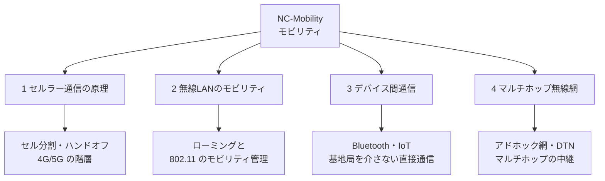

# NC-Mobility: モビリティ

CS2023 / Networking and Communication (NC) の Knowledge Unit「**NC-Mobility**（Mobility）」を整理した学習メモ。[NC-SingleHop](NC-SingleHop.md) までは、**移動中の通信継続そのものを主題にはしていなかった**——WiFi のアソシエーションの説明も Ethernet の MAC 学習の説明も、端末がどのポート・どの AP にいるかが変わる場合の挙動には踏み込まなかった。本ユニットは [NC-Fundamentals §1](NC-Fundamentals.md#importance-challenges) が挙げたもう1つの困難、「**端末が動く**」に答える：**端末が物理的に移動し、電波状況やネットワークへの接続点が刻々と変わる中で、通信をどう継続させるか**。

!!! info "出典・凡例"
    出典: `ComputerScienceCurricula2023.pdf` p.201。
    **CS Core** = 全卒業生必須 / **KA Core** = 当該分野で必須 / **Non-core** = 発展。
    このユニットは **KA Core 4時間**（CS Core の割り当てはなし）。4項目すべてが KA Core。

## 全体像

---

## 1. セルラー通信の原理 {#cellular}

携帯電話網（4G/5G）は、[NC-SingleHop §1](NC-SingleHop.md#modulation-media) の無線通信の話に、**広い地理範囲を継ぎ目なく覆う**という要求が加わったものと見ることができる（学習成果1）。

- **セル分割 (cellular concept)**：1つの基地局が届く範囲を**セル**という単位に区切り、同じ周波数を離れたセルで**再利用**する。1つの巨大な送信機で全域を覆う代わりに、小さなセルを敷き詰めることで、**限られた周波数資源を面積に応じて増やせる**（セルを小さくするほど、単位面積あたりに再利用できる回数が増える）。これは周波数という有限資源に対する分割統治であり、[AL-Strategies](../AL/AL-Strategies.md) の分割統治アルゴリズムと発想の型が同じ。
- **登録 (registration)**：待受中の端末は、セル1つ1つではなく**複数のセルをまとめた位置登録エリア**（トラッキングエリア）の単位で網に**自分の現在位置を登録**する。同じエリア内でセルを移るだけなら再登録は不要——着信があったときは、網はそのエリア内の全基地局から一斉に呼び出し（**ページング**）をかけ、応答した端末の正確なセルを特定する。「常に1セル単位で追跡する」のではなく、**待受中は粗く、必要になったら細かく特定する**という段階的な設計になっている。
- **ハンドオフ / ハンドオーバー**：これは登録・ページングとは別の話で、**通話・通信が確立された接続状態**にある端末が**セルをまたいで移動**した際に、接続先の基地局を切り替える処理を指す。信号強度を継続的に測定し、より強い隣接セルが見つかったタイミングで、**通信を途切れさせずに**（またはごく短い中断で）切り替える制御が中核となる。
- **4G/5G の階層**：コア網（電話網・インターネットへの接続、認証、課金）と無線アクセス網（基地局と端末の間の無線区間）に分かれる。世代が進むにつれ**周波数利用効率と遅延**が改善され、5G では**大容量（eMBB）・高信頼低遅延（URLLC）・大量接続（mMTC）**という異なる要求に応じてネットワークの振る舞いを切り替える設計（ネットワークスライシング）が導入されている。

!!! note "セル分割とスケーラビリティ"
    [NC-Routing §3](NC-Routing.md#cidr) で見た「アドレスやリソースを階層的に分割してスケールさせる」という発想が、ここでは周波数という物理資源に対して現れている。**同じ問題（有限の資源をどう多数の利用者に配るか）が層によって異なる形で繰り返し出てくる**ことに気づくと、NC 全体の見通しがよくなる。

## 2. 無線LANのモビリティ {#wlan-mobility}

[NC-SingleHop §4](NC-SingleHop.md#wifi) で見た WiFi のアソシエーションを、**端末が動く**という前提のもとで見直す（学習成果2）。

- **ローミング**：同一組織内に複数の AP が設置されている場合、端末は信号強度が弱くなった AP から、より強い信号の別の AP へ**アソシエーションを移す**。セルラーのハンドオフと目的は同じだが、無線LANでは網側の管理主体が単一組織であることが多く、標準化の度合いはセルラーより緩やかで、実装依存の最適化（高速ローミング規格など）が使われる。
- **IP アドレスとの整合**：端末が別の AP、ときに別のサブネットへ移ると、それまで使っていた IP アドレスが**その場所では意味をなさなくなる**問題が生じる。[NC-Fundamentals §5](NC-Fundamentals.md#hourglass) で見た通り IP アドレスは階層的でトポロジに紐づくため、**位置が変わればアドレスも変わるのが自然**——しかし進行中の TCP コネクション（[NC-Reliability](NC-Reliability.md) 参照）はアドレスの変更に弱い。モバイル IP のような仕組みは、**恒久的なホームアドレス**を維持しつつ、実際の転送は現在地の**気付アドレス**へ中継することでこの矛盾を緩和する。
- **セルラーとの対比**：セルラーは広域網として最初から位置登録・ページング・ハンドオフの仕組みを組み込んで設計された（§1）。無線 LAN の 802.11 規格自体は初版からローミング（再アソシエーション）を含んでいるが、**単一組織が運用する比較的狭い範囲**を前提にしている分、広域をまたぐ移動性管理はセルラーほど標準化されておらず、実装依存の最適化に委ねられている部分が大きい——「範囲の広さと管理主体の数」が両者の設計の重さの違いを生んでいる。

## 3. デバイス間通信 {#device-to-device}

基地局やアクセスポイントという**仲介者を介さず**、端末同士が直接通信する形態（学習成果3）。

- **代表例**：Bluetooth（近距離・低消費電力）、NFC（数センチの至近距離）、Wi-Fi Direct（AP なしで端末同士が直接 WiFi 接続）、D2D（セルラー網の中で基地局を経由せず端末同士が直接通信する規格上の拡張）。
- **IoT (Internet of Things) 通信**：多数の小型・低消費電力デバイスが少量のデータをやり取りする通信の総称で、その中身は一様ではない。**D2D・メッシュ型**（Zigbee のような、端末同士が近距離で直接ないし数ホップで中継し合う PAN 技術）と、**ゲートウェイ経由型**（LoRa/LoRaWAN のような低消費電力広域無線 (LPWAN) で、多くの場合は端末からゲートウェイ、ゲートウェイからネットワークサーバへと**インフラを経由する**）の両方が「IoT 通信」に含まれる。
- **なぜ D2D を選ぶ場合があるのか**：(1) **遅延**——基地局までの往復を省ける。(2) **電力**——遠くの基地局に届く強い電波を出すより、近くの端末に届く弱い電波の方が消費電力が小さい。(3) **可用性**——基地局の範囲外や災害時など、インフラが使えない状況でも通信を続けられる。ただしこれは IoT 全体に当てはまる前提ではなく、**D2D を選ぶ場合の理由**である点に注意——ゲートウェイ経由型は、その代わりに広い到達範囲や集中管理のしやすさを得ている。D2D の発想をさらに推し進めたのが§4のマルチホップ無線網になる。

## 4. マルチホップ無線網 {#multihop-wireless}

§3 の D2D をさらに一般化し、**端末自身が中継局を兼ねる**ネットワーク（学習成果4）。[NC-Routing](NC-Routing.md) までの経路制御は「固定されたルータの網」を前提にしていたが、ここでは**経路そのものが端末の移動とともに変化し続ける**。

- **アドホックネットワーク (ad hoc network)**：固定インフラを一切使わず、参加する端末同士が互いにパケットを中継し合って網を構成する。各端末は送信元・宛先であると同時に**ルータでもある**。
- **日和見的ネットワーク (opportunistic networking)**：常時接続された経路が存在しない前提で、**端末同士がすれ違ったタイミングだけ**通信の機会として使う。「今この瞬間に届けられる相手にだけ渡す」という発想。
- **遅延耐性ネットワーク (DTN, Delay/Disruption Tolerant Networking)**：接続が恒常的に途切れることを前提に、メッセージを**蓄積・運搬・転送 (store-carry-forward)** する。次の中継相手に出会うまでメッセージを端末内に保持し続け、出会った時点で転送する——[NC-Fundamentals §3](NC-Fundamentals.md#switching-techniques) のパケット交換がリンクの**空き**を前提にしていたのに対し、DTN はリンクの**存在**すら常時は前提にしない、一段極端な設計になる。

!!! warning "固定網の前提が崩れる場所"
    NC-Routing までの経路制御（[NC-Routing §1](NC-Routing.md#routing-paradigms)）は「グラフのトポロジは比較的安定している」ことを前提に、収束にかかる時間を評価軸にしていた。マルチホップ無線網では**トポロジ自体が常に変化する**ため、同じ距離ベクトル型・リンク状態型のアルゴリズムを使うにしても、変化への追従の速さと、変化のたびに発生するオーバーヘッドのトレードオフが一段と厳しくなる。DTN はこのトレードオフが極端になった先に「リンクの継続的な存在を諦める」という選択をしたものと理解できる。

---

## 学習成果（Illustrative Learning Outcomes）

KA Core:

1. **セルラー通信**の側面（登録など）を説明できる。→ [§1](#cellular)
2. **802.11 がどのようにモバイル利用者を支えるか**を説明できる。→ [§2](#wlan-mobility)
3. **デバイス間通信とマルチホップの実用例**を説明できる。→ [§3](#device-to-device)・[§4](#multihop-wireless)
4. **アドホック網などのモバイルネットワークの一種**を説明できる。→ [§4](#multihop-wireless)

!!! tip "混同しやすい組"
    | 混同しやすい組 | 区別の軸 |
    |---|---|
    | ハンドオフ（セルラー）/ ローミング（無線LAN） | 網が主体的にハンドオフを管理 か 端末側の判断で AP を切り替えるか（[§1](#cellular)・[§2](#wlan-mobility)） |
    | D2D / マルチホップ無線網 | 端末同士が**直接**話す か 端末が**中継局として**他者の通信を運ぶか（[§3](#device-to-device)・[§4](#multihop-wireless)） |
    | アドホック網 / DTN | 経路は変化するが**同時に存在**する か リンクが**常には存在しない**ことまで前提にするか（[§4](#multihop-wireless)） |

## 前後のユニット

- 前: [NC-Security](NC-Security.md) — ネットワークセキュリティ
- 次: [NC-Emerging](NC-Emerging.md) — 新興トピック
- 関連: [NC-SingleHop §4](NC-SingleHop.md#wifi) — WiFi のアソシエーション・CSMA/CA（無線 LAN の土台）
- 関連: [NC-Routing §1](NC-Routing.md#routing-paradigms) — 経路制御のパラダイム（マルチホップ無線網の経路制御との対比）
- 関連: [NC-Emerging §4](NC-Emerging.md#satellite-mmwave-vlc)（衛星通信・mmWave はモビリティの延長にある新興のアクセス技術）

疑問が出たら [NC-Mobility Q&A](NC-Mobility-QA.md) に記録する。
