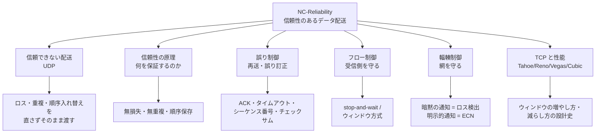
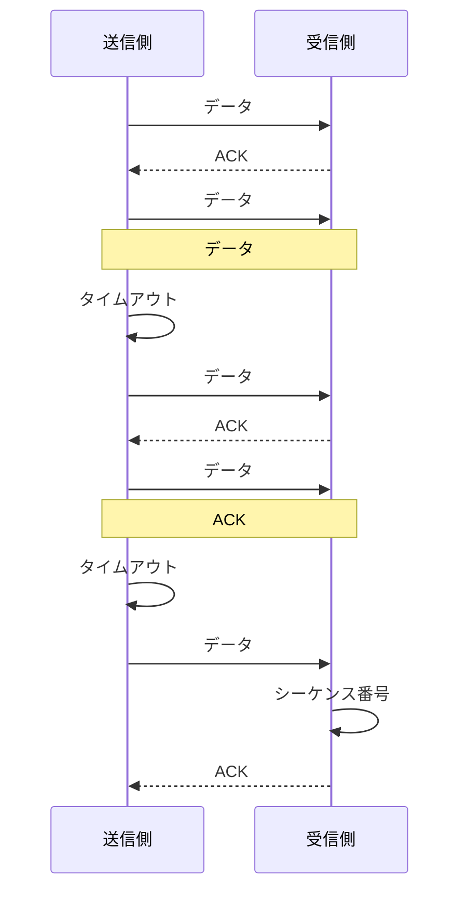

# NC-Reliability: 信頼性のあるデータ配送

CS2023 / Networking and Communication (NC) の Knowledge Unit「**NC-Reliability**（Reliability Support）」を整理した学習メモ。[NC-Fundamentals §3](NC-Fundamentals.md#switching-techniques) で見たとおり、パケット交換網は**何ひとつ保証しない**——パケットは落ちるし、重複するし、順序も入れ替わる。そのうえ [NC-Fundamentals §7](NC-Fundamentals.md#queueing) のキューは混雑すれば溢れる。本ユニットの主題は、**この信頼できない土台の上に、信頼できる配送サービスをどう組み立てるか**である。中心にいるのは TCP だが、TCP は答えの一例にすぎず、押さえるべきは**誤り制御・フロー制御・輻輳制御という3つの制御ループ**の役割分担である。

!!! info "出典・凡例"
    出典: `ComputerScienceCurricula2023.pdf` p.199。
    **CS Core** = 全卒業生必須 / **KA Core** = 当該分野で必須 / **Non-core** = 発展。
    このユニットは **KA Core 6時間**（CS Core の割り当てはなし）。NC KA の KA Core 合計24時間のうち**最大の6時間**が本ユニットに充てられており、KA Core の中では最も重い。`See also: SF-Reliability` への参照を持つ。

## 全体像

---

## 1. 信頼できない配送——UDP という基準点 {#unreliable-delivery}

信頼性の話は、**まず「信頼性がない」とは具体的に何が起きることなのか**を確定させるところから始まる（CS2023 項目1）。

パケット交換網（[NC-Fundamentals §3](NC-Fundamentals.md#switching-techniques)）で実際に起きる異常は3種類ある：

| 異常 | 何が起きるか | なぜ起きるか |
|---|---|---|
| **損失 (loss)** | 送ったパケットが届かない | ルータのバッファ溢れ（輻輳）、ビット化けを検出したリンク層による破棄 |
| **重複 (duplication)** | 同じデータが2回以上届く | 再送したのに元のパケットも遅れて到着した、経路の分岐 |
| **順序入れ替え (reordering)** | 送った順と違う順で届く | パケットごとに独立に経路が選ばれ、経路の遅延が違う |

- 加えて **ビット化け (corruption)** と**遅延の変動 (jitter)** がある。ビット化けの多くはリンク層の CRC（[NC-SingleHop §2](NC-SingleHop.md#framing)）で検出されるが、検出後の扱いは「**黙って捨てる**」——つまり**ビット化けは損失として上位層に現れる**。

**UDP (User Datagram Protocol)** は、この状態を**何も直さずにそのままアプリケーションへ渡す**トランスポート層プロトコルである。UDP が IP に付け加えるのは実質2つだけ：

- **ポート番号による多重化・逆多重化**（どのプロセス宛かを識別する）
- **チェックサム**（ヘッダとデータの誤り**検出**。訂正も再送もしない）

!!! tip "「信頼性がない」ことが利点になる場面"
    UDP は TCP の劣化版ではなく、**別の設計点**である。信頼性を諦めることで得られるものがある：

    - **接続確立の往復が不要**——1往復目からデータを送れる（DNS の問い合わせが典型）。
    - **再送による遅延の山がない**——リアルタイム音声・ビデオでは、**遅れて届いた正しい音声より、欠けたまま進む音声のほうが価値が高い**。
    - **輻輳制御に縛られない送信レート**——用途に応じてアプリ側で速度を決められる（その代わり、網に対する責任もアプリが負う）。
    - **必要な信頼性だけをアプリ側で実装できる**——順序は要るがロス回復は要らない、といった中間的な要求に応えられる。QUIC が UDP の上に独自の信頼性機構を載せているのはこの発想の現代的な例。

    要するに **UDP は「信頼性の材料だけ渡すので、必要なものは自分で組み立てよ」というインタフェース**である。以降の節で見る機構は、TCP がその組み立てを代行しているものだと考えるとよい。

## 2. 信頼性の原理——何を保証するのか {#reliability-principles}

では「信頼できる配送 (reliable delivery)」とは、正確には**どんな性質を約束すること**か（CS2023 項目2、`See also: SF-Reliability`）。仕組みの話に入る前に、**目標そのもの**を定義しておく。

| 保証する性質 | 意味 | 破れると何が起きるか |
|---|---|---|
| **無損失 (without loss)** | 送ったバイトはすべて届く | ファイルが途中で欠ける |
| **無重複 (without duplication)** | 同じデータが2回渡されない | 送金が二重に実行される |
| **順序保存 (in order)** | 送った順にアプリへ渡される | データが混ざり、意味が壊れる |
| **完全性 (integrity)** | 中身が化けていない | 静かに誤ったデータを使う |

- これらは**メカニズムから独立した仕様**である点が重要。「TCP が信頼性を提供する」ではなく、「**信頼性とはこの4性質であり、TCP はその一実装**」という順で理解する。
- 実現手段は次節以降の**誤り制御**（無損失・完全性）と、**シーケンス番号による並べ替えと重複除去**（無重複・順序保存）に対応する。

!!! warning "信頼性が保証しないもの"
    「信頼できる配送」は**届くこと**の保証であって、**いつ届くか**の保証ではない。TCP は帯域も遅延も約束しない——再送を繰り返せば数秒かかることもある。**リアルタイム性（時間保証）は信頼性とは別の要求**であり、そちらは QoS／サービスレベル（[NC-Fundamentals §7](NC-Fundamentals.md#queueing)）の領域である。「TCP を使えば安心」ではなく「**TCP は正しさを買い、応答時間を売っている**」と捉える。

!!! note "エンドツーエンド原則——どの層で信頼性を作るか"
    誤り検出はリンク層にも（CRC）、トランスポート層にも（チェックサム）ある。二重に見えるが、これは冗長ではない。リンク層が守れるのは**そのリンクの上だけ**で、ルータのメモリ内での化けや、リンクをまたいだ損失は守れない。**端点で確認しなければ端から端までの正しさは言えない**——これがエンドツーエンド原則であり、[NC-Fundamentals §5](NC-Fundamentals.md#layering-principles) の砂時計モデル（コアは単純に、知性は端に）と表裏一体の主張である。リンク層の誤り制御は「**性能のための最適化**」であって、正しさの根拠ではない。

## 3. 誤り制御——再送と誤り訂正 {#error-control}

損失と化けにどう対処するか（CS2023 項目3）。手段は大きく2系統ある。

### 再送 (ARQ: Automatic Repeat reQuest) {#retransmission}

[NC-Fundamentals §1](NC-Fundamentals.md#importance-challenges) で予告したとおり、**再送は [OS-Faults §3](../OS/OS-Faults.md#redundancy-types) の時間的冗長性がネットワークに現れたもの**である。ここではその具体的な部品を見る。必要な道具は3つ：

| 部品 | 役割 |
|---|---|
| **ACK (肯定応答)** | 受信側が「ここまで受け取った」と送り返す。これがなければ送信側は成功を知りようがない |
| **タイムアウトタイマ** | ACK が一定時間来なければ**失われたとみなして**再送する |
| **シーケンス番号** | 各データに通し番号を付ける。**重複の検出**と**順序の復元**の両方に使う |

送受信の基本形（stop-and-wait の場合）：

- **ACK の消失と、データの消失は送信側から区別できない**。どちらもタイムアウトとして現れるので、送信側は同じ対処（再送）をするしかない。その結果**重複が必ず発生する**——だからシーケンス番号による重複除去が不可欠になる。**再送という手段そのものが、重複という新たな問題を生む**という因果関係を押さえておく。
- **タイムアウト値の設定が難所**。短すぎれば不要な再送で網を無駄に混雑させ、長すぎれば損失からの回復が遅れる。実際には **RTT (Round Trip Time) を継続的に測り、その平均と変動幅から推定する**（TCP では平滑化 RTT ＋ 変動の数倍を余裕として加える）。RTT が測定値であり、しかも輻輳とともに変化するという点が、この問題を難しくしている。
- **累積 ACK と選択的 ACK**：TCP の基本は「N 番まで連続して受け取った」という**累積 ACK** で、簡潔だが、飛び飛びに届いた場合に何が欠けているかを伝えられない。これを補うのが **SACK (Selective ACK)** で、受信済みの断片を明示し、**本当に失われた分だけ**を再送させる。

### 誤り訂正 (FEC) と誤り検出 {#error-correction}

再送せずに**受信側だけで直す**方法が **FEC (Forward Error Correction)**：あらかじめ冗長な符号を付けて送り、化けたビットを受信側で復元する。

| 方式 | 仕組み | 向く場面 |
|---|---|---|
| **誤り検出 + 再送 (ARQ)** | チェックサム/CRC で気づいて送り直す | RTT が短く、再送のコストが低い場面（有線・LAN・一般の TCP 通信） |
| **誤り訂正 (FEC)** | 冗長符号で受信側が復元する | **再送が間に合わない／できない**場面（衛星通信、ライブ配信、放送、深宇宙通信） |

- 判断軸は **RTT と許容遅延の比**。RTT が 500ms の衛星回線で 100ms 以内に再生したい音声を運ぶなら、再送は原理的に間に合わない——**帯域を先払いして冗長符号を送るほうが安い**。逆に LAN では、めったに起きない損失のために常時冗長符号を払うのは無駄で、起きたときだけ再送するほうが効率がよい。
- **チェックサム**は誤り検出の最も基本的な道具で、[OS-Faults §5](../OS/OS-Faults.md#error-detection-correction) で見たメモリやディスクのチェックサム・ECC と考え方は同じ。**ECC メモリが訂正まで行うのが FEC 型、Ethernet が捨てて上位層に任せるのが ARQ 型**——同じ「誤りへの備え」でも、回復をどこで行うかの設計判断が分かれている（[NC-SingleHop §2](NC-SingleHop.md#framing)）。

## 4. フロー制御——受信側を溢れさせない {#flow-control}

損失が直せるようになっても、まだ問題が残る。**速い送信者が遅い受信者を溺れさせる**と、受信バッファが溢れて捨てられ、再送が発生し、また溢れる——という悪循環になる。これを防ぐのが**フロー制御**（CS2023 項目4）である。

### stop-and-wait {#stop-and-wait}

最も素朴な方式：**1つ送って、ACK が返るまで次を送らない**。

- 正しさは明白で、実装も単純。受信側は一度に1個分のバッファがあれば足りる。
- 致命的なのは**性能**。1つの往復ごとに RTT だけ待つので、実効スループットは
  `スループット = パケット長 / RTT` で頭打ちになる。**リンクをいくら速くしても改善しない**。
- 例：1Gbps・RTT 50ms の回線で 1500 バイトを stop-and-wait で送ると、実効速度は約 0.24Mbps ——**リンク容量の 0.02% しか使えない**。パイプが太くて長いほど、この無駄は大きくなる。

### ウィンドウ方式（スライディングウィンドウ） {#sliding-window}

**ACK を待たずに、W 個までは連続して送ってよい**とする方式。ACK が返るたびにウィンドウが前へ滑る（スライドする）。

- 実効スループットは `W × パケット長 / RTT` になり、**W を大きくすれば RTT の待ち時間を埋められる**。
- 埋めるべき量が**帯域遅延積 (BDP: Bandwidth-Delay Product) = 帯域 × RTT**——「回線の中に同時に入っていられるデータ量」であり、**ウィンドウがこれ以上あれば回線を使い切れる**。上の例なら 1Gbps × 50ms = 約 6.25MB がそれにあたる。
- **受信側がウィンドウの上限を通知する**のがフロー制御の実体。TCP では ACK に **受信ウィンドウ (rwnd)** ——「あと何バイト受け取れるか」——を書いて返し、送信側はそれを超えて送らない。受信バッファが埋まれば `rwnd = 0` となり、送信側は待つ。
- 損失時の再送戦略には2系統ある：**Go-Back-N**（失われた番号以降を全部送り直す。受信側は単純だが無駄が多い）と **選択的再送 (Selective Repeat)**（失われた分だけ送り直す。受信側にバッファと並べ替えが要る）。SACK 付き TCP は後者に近い動作をする。

!!! note "フロー制御は生産者・消費者問題である"
    「速い生産者と遅い消費者を、有界バッファを介して協調させる」——これは [OS-Concurrency](../OS/OS-Concurrency.md) の生産者・消費者問題そのもの。違いは**バッファの空き状況を知る手段**にある。OS では同じメモリ空間の中でセマフォを見ればよいが、ネットワークでは**空き容量の情報自体が RTT だけ古い**。つまり送信側が見ている `rwnd` は常に過去の値で、**遅れた情報に基づいて制御する**という難しさが加わる。以降の輻輳制御も、まさにこの「遅れた観測でフィードバック制御する」という問題として理解できる。

## 5. 輻輳制御——網を溢れさせない {#congestion-control}

フロー制御は受信側を守るが、**その途中にあるルータのバッファ**は誰も守っていない。[NC-Fundamentals §7](NC-Fundamentals.md#queueing) で見たとおり、需要が容量を超えるとキューが伸び、遅延が発散し、やがてパケットが捨てられる。これが**輻輳**であり、その回避が**輻輳制御**（CS2023 項目5）である。

!!! warning "フロー制御と輻輳制御は別物——最頻出の混同"
    どちらも「送信レートを抑える」点は同じだが、**守っている相手が違う**。

    | | **フロー制御 (§4)** | **輻輳制御 (§5)** |
    |---|---|---|
    | **守る対象** | **受信側ホスト**のバッファ | **網（経路上のルータ）**のバッファ |
    | **関係者** | 送信側と受信側の**2者間** | その経路を共有する**全員** |
    | **情報源** | 受信側が**明示的に通知**する（rwnd） | 網は普通は教えてくれない → **推測**するしかない |
    | **TCP の変数** | 受信ウィンドウ `rwnd` | 輻輳ウィンドウ `cwnd` |
    | **破ると何が起きるか** | 相手のバッファが溢れる（局所的） | **網全体が巻き添え**（輻輳崩壊） |

    TCP は実際には両方を同時に満たす：**送信可能量 = min(rwnd, cwnd)**。「受信側も網も、**より厳しいほうに従う**」という形で1本にまとめている。

- **輻輳崩壊 (congestion collapse)** が輻輳制御の存在理由：混雑すると損失が増える → 各送信者が再送する → **さらにトラフィックが増える**という正のフィードバックにより、有用なスループットがほぼゼロまで落ちる現象。1986年に実際にインターネットで起き、TCP の輻輳制御（Tahoe）が導入される契機となった。**各自が自分の利益だけで送り続けると全員が損をする**——共有資源の悲劇そのものの構図であり、だからこそ**送信側が自発的に遠慮する**仕組みが必要になる。

### 暗黙の輻輳通知 (implicit) {#implicit-notification}

網が何も教えてくれない前提で、**観測から輻輳を推測する**方式。

| 手がかり | 何を意味すると解釈するか | 限界 |
|---|---|---|
| **パケット損失**（タイムアウト・重複 ACK） | バッファが溢れた＝輻輳している | **すでにキューが満杯になってから**気づく（＝遅い）。無線の電波状況による損失を輻輳と誤解する |
| **RTT の増加** | キューが伸び始めた＝輻輳の兆し | 損失より**早く**気づけるが、RTT の変動が大きいと誤検知しやすい |

- 損失を手がかりにする方式が**ロスベース**（Tahoe/Reno/Cubic）、RTT を手がかりにする方式が**遅延ベース**（Vegas）。§6 の系譜の主要な分岐点がここにある。

### 明示的輻輳通知 (explicit) {#explicit-notification}

**網が自分から「混んでいる」と伝える**方式。

- **ECN (Explicit Congestion Notification)**：ルータはキューが伸びてきたら、**パケットを捨てる代わりに IP ヘッダに印を付ける**。受信側はその印を ACK で送信側へ伝え、送信側は損失と同様にレートを下げる。
- 利点は明快で、**パケットを1つも失わずに輻輳を知らせられる**——再送も、それに伴う遅延の山も起きない。しかも損失より早く伝わる。
- 代償は**網側の協力が要る**こと。経路上のルータと両端のホストがすべて対応していなければ機能せず、これが普及の障壁になってきた。**端だけで完結する暗黙方式のほうが配備しやすい**という、砂時計モデル（[NC-Fundamentals §5](NC-Fundamentals.md#hourglass)）が示す「くびれは変えにくい」性質がここでも効いている。
- 関連する網側の仕組みが **AQM (Active Queue Management)**：キューが満杯になってから捨てる（テールドロップ）のではなく、**混み始めた段階で確率的に捨てる／印を付ける**（RED、CoDel など）。[NC-Fundamentals §7](NC-Fundamentals.md#queueing) で触れたバッファブロートへの対処でもある。

## 6. TCP と性能——Tahoe・Reno・Vegas・Cubic {#tcp-performance}

以上の機構を実際に組み合わせたのが **TCP** である（CS2023 項目6）。TCP の輻輳制御は結局のところ **`cwnd` をどう増やし、どう減らすか**という1つの設計問題であり、その答えの変遷が各版の名前になっている。

### 共通の骨格 {#tcp-mechanisms}

| 局面 | 動作 |
|---|---|
| **スロースタート (slow start)** | 接続開始直後、`cwnd` を **ACK ごとに倍**にしていく（RTT あたり2倍＝指数的）。「スロー」は初期値が1と小さいことを指し、増え方はむしろ速い |
| **輻輳回避 (congestion avoidance)** | 閾値 `ssthresh` を超えたら、**RTT あたり1セグメントずつ**の線形増加に切り替える（慎重に上限を探る） |
| **AIMD** | 増やすときは**加算的 (Additive Increase)**、減らすときは**乗算的 (Multiplicative Decrease)**。「じわじわ増やし、まずければ一気に引く」という非対称性が、**公平性と安定性の両方をもたらす**ことが知られている |
| **高速再送 (fast retransmit)** | 同じ番号の **ACK が3回重複**したら、タイムアウトを待たずに再送する（後続が届いている＝1個だけ欠けたと判断できる） |

### 各版の比較 {#tcp-variants}

| 版 | 何を変えたか | 輻輳の判断 | 位置づけ |
|---|---|---|---|
| **Tahoe** (1988) | **輻輳制御の原型**。スロースタート・輻輳回避・高速再送を導入。損失を検出したら `cwnd` を**1に戻して**スロースタートからやり直す | 損失 | 輻輳崩壊への最初の答え |
| **Reno** (1990) | **高速回復 (fast recovery)** を追加。重複 ACK による損失は「1個欠けただけで流れは続いている」と判断し、`cwnd` を**半分にするだけ**でスロースタートには戻らない | 損失 | AIMD の標準形。タイムアウト時のみ 1 に戻す |
| **Vegas** (1994) | 損失ではなく **RTT の増加**から輻輳を予測し、キューが伸びる**前に**レートを調整する | **遅延** | ロスを起こさず低遅延。ただしロスベースと共存すると**遠慮しすぎて負ける**ため広くは普及せず |
| **Cubic** (2008) | ウィンドウを時間の**3次関数**で増やす。損失点の近くでは平坦にゆっくり探り、そこを超えると急速に伸ばす。増加が **RTT に依存しない** | 損失 | **高帯域・長距離 (high BDP) 回線**向け。現在の **Linux の既定値** |

- **Reno の弱点が Cubic を生んだ**：Reno の線形増加は「RTT あたり1セグメント」なので、10Gbps・RTT 100ms のような**帯域遅延積の巨大な回線**では、一度損失で半減すると回復に数十分かかる。Cubic は増加量を**経過時間**の関数にすることで RTT の長短に左右されず、大きなウィンドウへ速やかに戻れる。
- **Vegas の教訓**は技術的正しさと配備可能性の乖離：遅延ベースは原理的に優れているが、**同じボトルネックでロスベースと競合すると、遠慮した側が帯域を取られる**。混在環境では「行儀のよさ」が不利益になるため、単独では置き換わらなかった。近年の BBR も遅延・帯域推定に基づく系譜にある。

!!! tip "学習成果2「性能に影響する要因」の整理"
    信頼性プロトコルの性能を決める要因は、次の5つに整理して覚えるとよい。

    | 要因 | 効き方 |
    |---|---|
    | **RTT** | ウィンドウ方式のスループットの分母。長いほど遅く、回復も遅い（§4） |
    | **ウィンドウサイズ** | `min(rwnd, cwnd)`。**帯域遅延積 (BDP) 未満なら回線を使い切れない**（§4） |
    | **パケット損失率** | 再送のコストに加え、`cwnd` の減少を招く。高 BDP では致命的（§6） |
    | **タイムアウト値** | 短すぎれば不要な再送、長すぎれば回復の遅延（§3） |
    | **バッファ量（両端・網内）** | 小さすぎれば損失、大きすぎればバッファブロートで遅延増（§5） |

!!! note "「壊れる部品から信頼できるサービスを作る」の完成形"
    ここまでの機構を並べると、[OS-Faults](../OS/OS-Faults.md#reliability-availability) の耐故障性の議論と同じ構図が見える。**誤りを検出し（チェックサム）、冗長性で回復し（再送＝時間的冗長性、[OS-Faults §3](../OS/OS-Faults.md#redundancy-types)）、過負荷を自ら抑える（フロー制御・輻輳制御）**——TCP は、この3つを1つのプロトコルに束ねた**耐故障システムの一例**である。異なるのは、故障が単一マシン内ではなく**距離を隔てた先で起き、しかも観測が RTT だけ古い**という条件のもとで、それをやってのけている点である。

---

## 学習成果（Illustrative Learning Outcomes）

KA Core:

1. **信頼性のある配送プロトコルの動作**を説明できる。→ [§2](#reliability-principles) の4つの保証と、[§3](#error-control) の ACK・タイムアウト・シーケンス番号、[§4](#sliding-window) のウィンドウ動作。
2. 信頼性のある配送プロトコルの**性能に影響する要因**を列挙できる。→ [§4](#flow-control)（RTT・ウィンドウ・帯域遅延積）と [§6](#tcp-performance) の要因表。
3. **TCP の信頼性に関する設計上の論点**をいくつか説明できる。→ [§5](#congestion-control)（フロー制御との役割分担、暗黙 vs 明示の通知）と [§6](#tcp-variants)（Tahoe/Reno/Vegas/Cubic が何を変えたか）。
4. 単純な**信頼性プロトコルを設計・実装**できる。→ [§1](#unreliable-delivery) の UDP を土台に、[§3](#retransmission) の3部品（ACK・タイマ・シーケンス番号）と [§4](#sliding-window) のウィンドウを積み上げる。

!!! tip "学習成果4「自分で作れ」に向けた組み立て順"
    実装課題として出た場合、**UDP の上に段階的に積む**と筋道が立つ。各段階が本ノートのどの節に対応するかを意識すると、機構と目的の対応が崩れない。

    1. **チェックサム**で化けを検出する（§3）——まず「正しいか」を言えるようにする。
    2. **シーケンス番号 + ACK + タイムアウト**で stop-and-wait を作る（§3・§4）——ここまでで [§2](#reliability-principles) の4性質はすべて満たせる。**正しさは完成し、あとは性能の問題**という切り分けが重要。
    3. **ウィンドウ**に拡張して RTT の待ち時間を埋める（§4）。
    4. **受信ウィンドウの通知**でフロー制御を入れる（§4）。
    5. **AIMD の輻輳ウィンドウ**を足して網に配慮する（§5・§6）。

!!! tip "混同しやすい組"
    | 混同しやすい組 | 区別の軸 |
    |---|---|
    | フロー制御 / 輻輳制御 | **受信側**を守る か **網**を守るか（§5 の警告） |
    | `rwnd` / `cwnd` | 受信側が通知する値 か 送信側が推測する値か（§5） |
    | ARQ（再送） / FEC（誤り訂正） | 気づいて送り直す か 冗長符号で直すか——分かれ目は **RTT と許容遅延の比**（§3） |
    | 暗黙 / 明示の輻輳通知 | 損失や RTT から**推測**する か 網が **ECN で通知**するか（§5） |
    | スロースタート / 輻輳回避 | 指数的に増やす局面 か 線形に増やす局面か（§6） |

## 前後のユニット

- 前: NC-Applications — アプリケーション層とネームサービス（未作成）
- 次: NC-Routing — 経路制御と転送（未作成）
- 関連: [NC-Fundamentals](NC-Fundamentals.md#switching-techniques) — パケット交換が保証を持たないこと、およびキューイングと輻輳（[§7](NC-Fundamentals.md#queueing)）が本ユニットの出発点 / [NC-SingleHop §2](NC-SingleHop.md#framing) — リンク層の CRC は「捨てるだけ」で、回復は本ユニットに委ねられる / [OS-Faults](../OS/OS-Faults.md#redundancy-types) — 時間的冗長性が**再送**という名前で現れる並行構造

実際の学習順は CS2023 の並び（Fundamentals → Applications → Reliability → Routing → SingleHop …）どおりではなく、[NC-SingleHop](NC-SingleHop.md) を先に読んでいる。リンク層の誤り検出（CRC）を先に見ているぶん、本ユニットの「検出は下、回復は上」という層の分担は理解しやすいはずである。

疑問が出たら [NC-Reliability Q&A](NC-Reliability-QA.md) に記録する。
