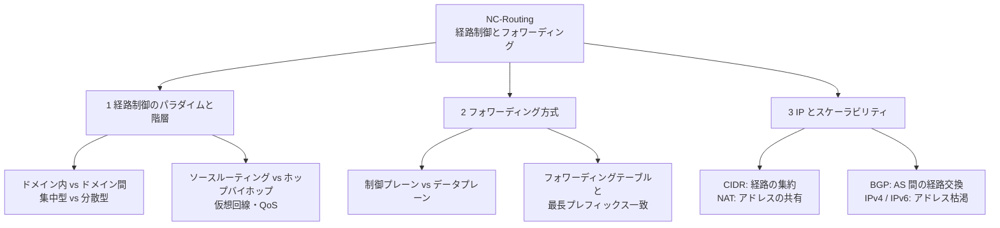
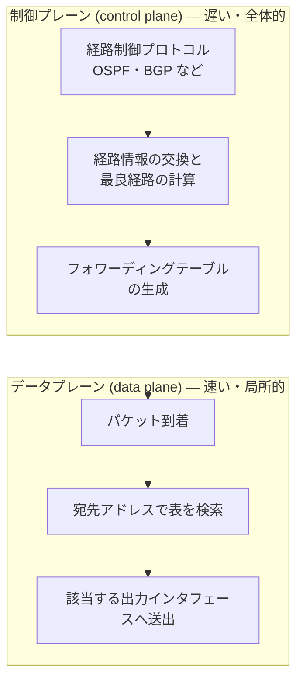

# NC-Routing: 経路制御とフォワーディング

CS2023 / Networking and Communication (NC) の Knowledge Unit「**NC-Routing**（Routing and Forwarding）」を整理した学習メモ。[NC-Fundamentals §1](NC-Fundamentals.md#importance-challenges) が挙げた困難のうち「**経路を決めなければならない**」に答えるユニットである。[NC-SingleHop §5](NC-SingleHop.md#l2-switching) までで「フレームを**隣の機器**へ届ける」話は済んでいる。ここからの問いは、**世界中のどこにあるかもしれない宛先まで、パケットがホップを重ねて辿り着く道をどうやって決めるか**——そしてその決定を、毎秒何億個ものパケットに対してどう実行するか、である。

!!! info "出典・凡例"
    出典: `ComputerScienceCurricula2023.pdf` p.199。
    **CS Core** = 全卒業生必須 / **KA Core** = 当該分野で必須 / **Non-core** = 発展。
    このユニットは **KA Core 4時間**（CS Core の割り当てはなし）。項目は3つだけだが、NC KA の KA Core 24時間のうち6分の1が割かれており、**項目あたりの密度は KA 中で最も高い**。3項目すべてが KA Core で、Non-core 項目はない。

## 全体像

---

## 1. 経路制御のパラダイムと階層 {#routing-paradigms}

経路制御 (routing) とは、**網のどのリンクを通って宛先へ向かうかを決める**こと。抽象的にはノードとリンクからなるグラフ上の最短経路問題であり、[AL-Foundational §6](../AL/AL-Foundational.md#graph-algorithms) の Dijkstra 法・Bellman-Ford 法がそのまま道具になる。だが現実の網では「**誰がグラフを知っているのか**」「**そもそもグラフが大きすぎて全体を1つと見なせない**」という制約が加わり、そこから複数のパラダイムが生まれる。

### ドメイン内経路制御とドメイン間経路制御 {#intra-inter-domain}

インターネットは単一の網ではなく、独立に運用される **AS（自律システム）** の集合体だった（[NC-Fundamentals §2](NC-Fundamentals.md#internet-organization)）。経路制御もこの境界で二層に分かれる。

| | **ドメイン内 (intra-domain / IGP)** | **ドメイン間 (inter-domain / EGP)** |
|---|---|---|
| **範囲** | 1つの AS の内部 | AS と AS の間 |
| **目的** | **性能の最適化**（遅延・帯域が最小の道を選ぶ） | **方針の適用**（どの隣人を経由させたい／させたくないか） |
| **前提** | 全ルータが同一管理下で、内部構造を開示してよい | 他 AS の内部は見えないし、見せたくない |
| **規模** | ルータ数十〜数千 | AS 数万、経路数十万以上 |
| **代表例** | OSPF, IS-IS, RIP | **BGP**（§3 で扱う） |

- **階層化する理由はスケーラビリティと自律性の2つ**。(1) 世界中のルータ1台1台を含むグラフで最短経路を計算するのは計算量的にも通信量的にも成立しない。AS を1つのノードに畳むことで問題を桁違いに小さくできる。(2) 各 AS は自分の網をどう運用するかを他人に決められたくないし、内部トポロジという営業機密を公開したくない。**階層は技術的必要と組織的必要の両方から要請されている**。
- 結果として、ドメイン間経路制御は「最短」を目指さない。[NC-Fundamentals §2](NC-Fundamentals.md#internet-organization) で見た**トランジットとピアリングの経済関係**が、どの経路を広告し、どの経路を選ぶかを決める。**物理的に近い道より、お金のかからない道が選ばれる**ことは日常的に起こる。

### 集中型と分散型——誰が経路を計算するか {#centralized-decentralized}

| | **集中型 (centralized)** | **分散型 (decentralized)** |
|---|---|---|
| **計算する主体** | 網全体を見渡す1つのコントローラ | 各ルータが隣人と情報交換しながら自分で計算 |
| **入力** | 全リンクの状態を集めた**大域的な情報** | 隣接ノードから届く**局所的な情報** |
| **典型** | SDN のコントローラ、Dijkstra 法による集中計算 | 距離ベクトル型（Bellman-Ford 的）、リンク状態型 |
| **強み** | 大域最適化・方針の一元管理が容易 | コントローラが単一障害点にならず、規模に強い |
| **弱み** | コントローラ障害・制御路の遅延が致命的 | 収束に時間がかかり、過渡期に一時的なループが起きうる |

- 分散型はさらに**リンク状態型**（各ルータが全リンクの地図を配り合い、各自が全体を Dijkstra で解く）と**距離ベクトル型**（隣人に「私からこの宛先までのコスト」だけを教え合う）に分かれる。前者は情報が全員に行き渡る代わりに広告量が多く、後者は情報が少なくて済む代わりに収束が遅い。歴史的にインターネットが分散型を選んだのは集中管理の主体が存在しないからだが、単一事業者が閉じて管理するデータセンター網では集中型が復権しており、これが NC-Emerging の SDN（Software-Defined Networking）の主題になる。

### ソースルーティングとホップバイホップ {#source-vs-hop-by-hop}

**経路の決定権を送信元が持つか、途中のルータが持つか**という軸。

- **ホップバイホップ**：パケットには**宛先だけ**が書かれ、各ルータが自分の表を引いて次の1ホップを独立に決める。インターネットの既定の動作。送信元は全体の経路を知らないし、知る必要もない。
- **ソースルーティング**：**送信元が経路そのものを指定**し、パケットの中に経路を書き込んで運ぶ。途中のルータは書かれた通りに転送するだけ。送信者が経路を完全に制御できる（測定・障害迂回・特定経路の指定）反面、送信者が網のトポロジを知っている必要があり、**セキュリティ上の危険**（フィルタリングの迂回や踏み台化に使える）もあるため、公衆インターネットでは一般に無効化されている。

!!! note "ホップバイホップが成立する条件"
    各ルータが**独立に**判断しているのに宛先へ届くのは、全ルータの経路表が「同じ宛先に対して矛盾しない方向」を指しているからにほかならない。この整合性が崩れた瞬間、パケットは**ルーティングループ**に陥って TTL が尽きるまで往復する。「経路表が収束するまでの時間」が経路制御プロトコルの中心的な評価軸になるのはこのため。

### 仮想回線——コネクション指向の経路制御 {#virtual-circuits}

[NC-Fundamentals §3](NC-Fundamentals.md#switching-techniques) の回線交換とパケット交換の対比を思い出すと、**仮想回線 (virtual circuit)** はその中間に位置する。

- 通信に先立って送信元から宛先までの**経路を1度だけ決めて確立**し、経路上の各ルータにその接続の項目を作る。以降のパケットには完全な宛先アドレスではなく短い **VC 識別子（ラベル）**だけを付け、ルータはラベルを見て転送する。
- **利点**：経路決定が接続確立時の1回で済み、以降の転送は短いラベルの検索だけになるので**速い**。経路が固定されるので順序が保たれやすく、資源の予約（QoS 保証）も載せやすい。
- **代償**：接続確立の往復が要る。さらに経路上のルータが**接続ごとの状態を持つ**ため、途中のルータが壊れると接続も壊れる——宛先アドレスだけで独立に転送するデータグラム方式なら、次のパケットから黙って別経路へ迂回するだけで済む。**状態を網の中に置いた分だけ壊れやすくなる**という一般則がここにも現れている。
- ATM や Frame Relay が代表例。現在の IP 網でも **MPLS** がこの考え方を IP の上に載せ、トラフィックエンジニアリングに使われている。

### QoS——最短だけが正解ではない {#qos-routing}

[NC-Fundamentals §7](NC-Fundamentals.md#queueing) で見た通り、パケット交換網の遅延と損失は混雑次第で変動する。**QoS (Quality of Service) を考慮した経路制御**は、リンクのコストを単なるホップ数や距離ではなく、**帯域の空き・遅延・ジッタ・損失率**といった要求条件で評価し、条件を満たす経路を選ぶ。

- 音声やビデオ会議は帯域より**遅延とジッタ**に敏感で、バックアップ転送は遅延に鈍感だが**帯域**を欲しがる。同じ2点間でも**トラフィックの種類ごとに最適な経路が違う**。ただし複数の条件を同時に満たす経路を求める問題（多制約経路問題）は一般に NP 困難であり、実務ではヒューリスティクスや、上記の MPLS のように**明示的に経路を敷く**方法が使われる。
- 経路で選ぶ（どの道を通すか）ことと、キューで差をつける（[NC-Fundamentals §7](NC-Fundamentals.md#queueing) の優先度付きキューイング）ことは**別々の道具**である点に注意。QoS はふつう両方を組み合わせて実現する。

## 2. フォワーディング方式——ルータの毎パケットの仕事 {#forwarding}

### 制御プレーンとデータプレーン {#control-data-plane}

このユニットで最も重要な概念的区別は、**経路制御 (routing)** と **フォワーディング (forwarding)** が別物だということ。

| | **経路制御（制御プレーン）** | **フォワーディング（データプレーン）** |
|---|---|---|
| **問い** | 宛先ごとに**どの道が最良か** | このパケットを**どのポートに出すか** |
| **時間尺度** | 秒〜分（トポロジが変わったとき） | **ナノ秒〜マイクロ秒**（パケット1個ごと） |
| **視野** | 網全体 | 自分の表1つ |
| **実装** | 汎用 CPU 上のソフトウェア | 専用ハードウェア（ASIC・TCAM） |
| **成果物** | フォワーディングテーブル | 送出されたパケット |

!!! note "分離しているから両方が成立する"
    この分離は単なる用語の整理ではなく、**性能の要請から生まれた設計**である。BGP の経路計算は複雑で重いが、実行するのは経路が変わったときだけでよい。一方フォワーディングは単純だが、100Gbps のリンクなら毎秒1億回以上実行される。**「複雑だが稀な処理」と「単純だが超高頻度な処理」を切り離し、後者だけをハードウェア化する**——これが現代のルータの基本構造。[OS-Principles §2](../OS/OS-Principles.md#abstractions) の「方針と機構の分離」と同じ形の判断であり、この線をどこに引き直すかを問い直したのが SDN でもある。

### フォワーディングテーブルと最長プレフィックス一致 {#longest-prefix-match}

フォワーディングテーブルは「**宛先アドレスのプレフィックス → 出力インタフェース**」の対応表である。IP 網でこの検索が**完全一致ではなくプレフィックス一致**になっているのが要点。

| 宛先プレフィックス | 出力インタフェース |
|---|---|
| `203.0.113.0/24` | 0 |
| `203.0.0.0/16` | 1 |
| `0.0.0.0/0`（デフォルト経路） | 2 |

- 宛先 `203.0.113.42` は上の3行すべてに一致する。ここで採用されるのは**最も長いプレフィックスに一致した行**（`/24`、インタフェース0）——これが**最長プレフィックス一致 (longest prefix match)** である。
- **なぜ完全一致ではないのか**：世界には約43億個の IPv4 アドレスがあり、1アドレス1行の表は作れない。**アドレスをまとめて「この方向」と書けること**が表を現実的な大きさに保つ唯一の方法であり、そのために「まとめた大きな範囲」と「その中の例外的な小さな範囲」が同時に存在することを許す必要がある。**最長一致は「より具体的な指定が一般的な指定に勝つ」という例外処理の規則**にほかならない。
    - この規則の下では、デフォルト経路 `0.0.0.0/0` は**すべてに一致する最短のプレフィックス**、すなわち他のどの行にも当たらなかったパケットの受け皿になる。末端のルータはこの1行だけで外の世界すべてを扱える——これも階層化がスケーラビリティを生む一例。
- **実装上の課題**は「毎秒1億回、最長一致を求める」こと。ソフトウェアではトライ木（プレフィックスをビット列の木として辿る）が使われ、ハードウェアでは **TCAM**（ワイルドカードを含む検索を1クロックで並列に行える連想メモリ）が使われる。TCAM は高速だが高価で電力を食うため、**フォワーディングテーブルの大きさそのものがルータの原価を決める**。§3 の経路集約が重要になる理由がここにある。

## 3. IP とスケーラビリティ {#ip-scalability}

インターネットが数十億の端末まで成長できたのは、**アドレス空間の使い方と経路情報の量**という2つのスケーラビリティ問題を解いてきたからである（学習成果3）。

### CIDR——クラスをやめて集約する {#cidr}

- **かつて**：IPv4 アドレスはクラス A（`/8`、約1678万アドレス）・クラス B（`/16`、約65000）・クラス C（`/24`、254）という**固定の3サイズ**でしか配れなかった。500台の組織はクラス C では足りず、クラス B を取ると6万個以上を死蔵する。**サイズが飛び飛びなために膨大な無駄が出た**。
- **CIDR (Classless Inter-Domain Routing)**：クラスを廃し、アドレスを `203.0.113.0/24` のように**プレフィックス長を明示**して扱う。長さは1ビット刻みで選べるので、必要な規模に近いブロックを割り当てられる。
- **もう1つの効果が経路集約 (route aggregation)**。連続する `198.51.100.0/24` と `198.51.101.0/24` を持つ組織は上流に対して `198.51.100.0/23` **1行**として広告でき、ISP は配下の顧客プレフィックスをまとめて1行に畳める。**フォワーディングテーブルの行数を、アドレスの数ではなく網の階層構造に比例させる**のが CIDR の本質的な貢献である（§2 で見た TCAM の高価さを思い出すこと）。
- 集約が効くためには**アドレスがトポロジに沿って配られている**必要がある。ある組織が上流 ISP を変えてもアドレスを持ち続ける（PI アドレス）と、その分だけ集約が崩れて経路表が膨らむ——**アドレスの可搬性と経路表の小ささはトレードオフ**の関係にある。

### NAT——アドレスを共有する {#nat}

- **解く問題**：手元に使えるグローバル IPv4 アドレスが1つしかないのに、家庭やオフィスには何十台も端末がある。
- **仕組み**：内側では私用アドレス（`192.168.0.0/16` 等、インターネット上では一意でない）を使い、外へ出るパケットの**送信元アドレスとポート番号を書き換えて**1つのグローバルアドレスに束ねる。戻ってきたパケットは、変換表に記録したポート番号から内側の誰宛てかを引いて書き戻す。**ポート番号を借りてアドレス空間を多重化している**と見るとわかりやすい。
- **効果**：IPv4 アドレスの枯渇を実際に何十年も先送りした。副次的に、外から内側の端末を直接指せなくなるという遮蔽効果もある。
- **代償**：
    - **end-to-end 原則が壊れる**。[NC-Fundamentals §5](NC-Fundamentals.md#hourglass) の「網の中は単純に保つ」という設計思想に反し、ルータが**接続ごとの状態**（変換表）を持つ。§1 の仮想回線と同じで、NAT 機器が落ちれば通信中の接続も落ちる。
    - **外から内へ最初に呼びかけられない**。P2P・ビデオ会議・オンラインゲームなどが穴あけ (hole punching) や中継サーバといった回避策を必要とするのはこれが理由。
    - アドレスとポートを書き換えるため、**上位層のヘッダを覗いて書き直す**必要がある場合があり、層の独立性も損なわれる。

!!! warning "NAT は「アドレス枯渇の解決」ではなく「延命」"
    NAT はアドレスが足りない状態を**運用で耐えられるようにした**にすぎず、一意なアドレスを増やしたわけではない。だからこそ IPv6 が必要であり続けている。「NAT があるから IPv6 は不要」という主張は、上記の代償（端点間の到達性が失われること）を勘定に入れていない。

### BGP——AS 間の経路を交換する {#bgp}

**BGP (Border Gateway Protocol)** は、[NC-Fundamentals §2](NC-Fundamentals.md#internet-organization) で見た AS 同士が経路情報を交換する唯一の実質的な手段であり、**インターネットを1つの網として成立させている接着剤**である。

- **何を交換するか**：「このプレフィックスへは、この AS の並び（**AS パス**）を辿れば届く」という広告。距離ベクトル型の一種だが、コストの数値ではなく**経由する AS の列そのもの**を配る（パスベクタ型）。
- **AS パスを配る理由は2つ**。(1) 自分の AS 番号が既にパスに含まれていれば広告を捨てるだけで**ループを確実に防げる**。(2) 「どこを通るか」が見えるので、**特定の AS を避ける／通す**という方針を経路選択に書ける。
- **最短ではなく方針で選ぶ**：BGP の経路選択は、AS パスの長さより先に**ローカル優先度**（＝自 AS の運用方針）を見る。顧客からの経路を優先し、ピアやトランジット上流の経路は後回しにする——という**経済的関係の反映**が最優先される。ある経路を隣人に広告しないという選択（フィルタリング）自体も方針の表明になる。
- **スケーラビリティ上の位置づけ**：BGP が扱うのは AS 単位に畳まれた経路であり、各 AS の内部構造は現れない。CIDR による集約と組み合わせて初めて、全世界の到達性情報がルータ1台に収まる規模に保たれている。一方で BGP は隣人の広告を基本的に信じる設計であり、誤った（あるいは悪意ある）広告が広まるとトラフィックが本来と違う AS へ吸い寄せられる**経路ハイジャック**が起きる——これは NC-Security（未作成）の領域にまたがる。

### IPv4 と IPv6 {#ip-versions}

| | **IPv4** | **IPv6** |
|---|---|---|
| アドレス長 | 32ビット（約43億） | **128ビット**（実質的に枯渇しない） |
| 枯渇への対処 | CIDR + NAT で延命 | **そもそも足りている** |
| アドレス割り当て | 手動 / DHCP | 自動設定の仕組みを標準に内包 |
| ヘッダ | 可変長・オプションあり | 固定長で簡素化され、ルータの処理が軽い |
| NAT の必要性 | 事実上必須 | 原則不要（end-to-end の到達性が戻る） |

- **IPv6 が存在する理由は一言でアドレス枯渇**である。32ビットは1980年代の規模感では十分すぎたが、1台1アドレスどころか1人が複数台を持ち、さらに IoT が加わる世界には全く足りない。
- **移行が何十年もかかっている理由**は [NC-Fundamentals §5](NC-Fundamentals.md#hourglass) の砂時計モデルが説明する。IP は砂時計の**くびれ**、すなわち全員が共有する唯一の約束事であり、**くびれを取り替えるには上も下も全員が同時に対応しなければならない**。IPv4 のみのホストと IPv6 のみのホストは直接には話せないため、移行期間は両方を併走させる（デュアルスタック）ほかなく、その期間が極めて長くなる。加えて **NAT で当座しのぎができてしまった**ことが IPv6 へ移る経済的な動機を弱めた——**短期の回避策が長期の移行を遅らせる**という、技術選択の典型的な構図になっている。

---

## 学習成果（Illustrative Learning Outcomes）

KA Core:

1. さまざまな**経路制御のパラダイムと階層**を説明できる。→ [§1](#routing-paradigms)
2. **IP 網でパケットがどのようにフォワーディングされるか**を説明できる。→ [§2](#forwarding)
3. **インターネットがスケーラビリティの課題にどう取り組んでいるか**を説明できる。→ [§3](#ip-scalability)

!!! tip "学習成果2・3の答え方と、混同しやすい組"
    - **学習成果2**：「経路表を引いて転送する」で止めない。(1) **制御プレーンとデータプレーンの分離**（[§2](#control-data-plane)）を先に立て、(2) データプレーン側の具体的な動作として**最長プレフィックス一致**を説明し、(3) なぜ完全一致ではないのか（表を小さく保つため）まで述べると、動作と設計理由の両方に答えられる。
    - **学習成果3**：スケーラビリティの課題は**アドレスの数**と**経路情報の量**の2つに分けて整理する。前者に効くのが NAT と IPv6、後者に効くのが CIDR の集約と BGP の AS 単位の階層化。**どの仕組みがどちらの問題を解いているか**を対応づけて述べるのが要点。

    | 混同しやすい組 | 区別の軸 |
    |---|---|
    | ルーティング / フォワーディング | 経路を**決める** か 決まった表で**転送する**か（[§2](#control-data-plane)） |
    | ドメイン内 / ドメイン間 | 性能の最適化 か 方針の適用か（[§1](#intra-inter-domain)） |
    | 仮想回線 / 回線交換 | 帯域は共有したまま経路だけ固定 か 帯域ごと専有するか（[§1](#virtual-circuits)・[NC-Fundamentals §3](NC-Fundamentals.md#switching-techniques)） |
    | CIDR / NAT | 経路情報を減らす仕組み か アドレスを共有する仕組みか（[§3](#cidr)・[§3](#nat)） |

## 前後のユニット

- 前: NC-Reliability（未作成） — 信頼できる通信路の構築
- 次: [NC-SingleHop](NC-SingleHop.md) — 単一ホップ通信（本来の CS2023 の並びでは NC-Routing の後に NC-SingleHop が来るが、本メモでは先に NC-SingleHop を作成済み）
- 関連: [NC-Fundamentals](NC-Fundamentals.md) — AS・ピアリング・砂時計モデル・キューイングという本ユニットの前提知識
- 関連: [AL-Foundational §6](../AL/AL-Foundational.md#graph-algorithms) — 経路計算の土台となる最短経路アルゴリズム（Dijkstra・Bellman-Ford）
- 関連（未作成）: NC-Security（経路ハイジャック） / NC-Emerging（SDN による制御プレーンの集中化）

疑問が出たら [NC-Routing Q&A](NC-Routing-QA.md) に記録する。
