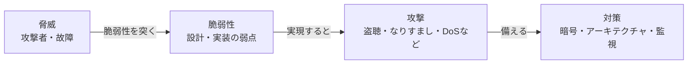
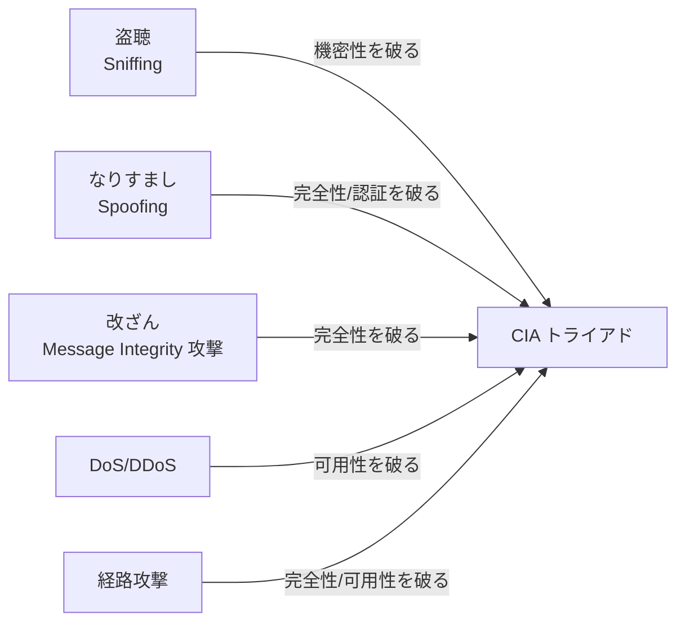

# NC-Security: ネットワークセキュリティ

CS2023 / Networking and Communication (NC) の Knowledge Unit「**NC-Security**（Network Security）」を整理した学習メモ。ここまでの NC の各ユニットは「**協力的な参加者**の間でどう通信を成立させるか」を扱ってきた——[NC-Fundamentals §1](NC-Fundamentals.md#importance-challenges) が挙げた困難のリストには「敵対者がいる」という項目もあったが、その中身は先送りにしていた。本ユニットはその項目に正面から答える：**網には協力しない、あるいは積極的に妨害しようとする参加者がいることを前提に、通信をどう成立させ続けるか**。

!!! info "出典・凡例"
    出典: `ComputerScienceCurricula2023.pdf` p.200。
    **CS Core** = 全卒業生必須 / **KA Core** = 当該分野で必須 / **Non-core** = 発展。
    このユニットは **KA Core 3時間**（CS Core の割り当てはなし）。3項目すべてが KA Core。1と3の項目には `See also: SEP-Security, SEC-Foundations, SEC-Engineering, SEC-Crypto` という参照があり、**セキュリティ専門の Knowledge Area（SEC）の入口として、ネットワークに限定した側面だけをここで扱う**という位置づけになっている。

## 全体像 {#overview}

**中心的な問い**：協力しない、あるいは積極的に妨害する参加者がいることを前提に、通信をどう成立させ続けるか。

CIA トライアド（機密性・完全性・可用性）ごとに、代表的な脅威・攻撃とその対策を並べる：

| 脅威・攻撃 | 主に破る性質 | 対策 |
|---|---|---|
| 盗聴 sniffing | 機密性 | 暗号化・TLS →[§3a](#cryptography) |
| なりすまし spoofing | 完全性・認証 | 認証・デジタル署名・証明書 →[§3a](#cryptography) |
| AitM/MITM | 機密性・完全性 | TLS証明書による相手確認 →[§3a](#cryptography) |
| メッセージ改ざん | 完全性 | メッセージ認証コード →[§3a](#cryptography) |
| 経路攻撃・BGPハイジャック | 完全性・可用性 | BGPsec・RPKI →[§3c](#monitoring-detection) |
| DoS/DDoS | 可用性 | ファイアウォール・IDS・レート制限 →[§3c](#monitoring-detection) |

**図の読み方**

- 上の小さな図は[§1 脅威・脆弱性・対策](#threats-vulnerabilities-countermeasures)の関係——脅威が脆弱性を突いて攻撃として実現し、対策で備える、という一本の流れ。
- 表の行は[§2 ネットワーク固有の脅威と攻撃](#network-attacks)、右列は[§3 対策](#countermeasures)（暗号は[§3a](#cryptography)、監視は[§3c](#monitoring-detection)）に対応する。表にない境界防御（VPN・DMZ・ゼロトラスト）は[§3b](#secure-architectures)を参照。
- 経路攻撃の詳細は[NC-Routing §3](NC-Routing.md#bgp)、1台の計算機内でのアクセス制御との対比は[OS-Protection](../OS/OS-Protection.md#access-control)を参照。

---

## 1. セキュリティの基本語彙——脅威・脆弱性・対策 {#threats-vulnerabilities-countermeasures}

ネットワークセキュリティに限らず、セキュリティ全般（[OS-Protection §7](../OS/OS-Protection.md#access-control) が1台の計算機の内側で扱った認証・アクセス制御もこの枠組みの一部）は共通の語彙で組み立てられる（学習成果1）。

| 用語 | 意味 |
|---|---|
| **資産 (asset)** | 守りたいもの。データそのもの、通信の可用性、利用者の身元など |
| **脅威 (threat)** | 資産を損なう可能性のある主体・事象（攻撃者、故障、自然災害） |
| **脆弱性 (vulnerability)** | 脅威が付け込める**設計・実装上の弱点** |
| **攻撃 (attack)** | 脆弱性を突いて脅威を現実化させる具体的な行為 |
| **対策 (countermeasure)** | 脅威を防ぐ・検知する・被害を抑える仕組み |

- **脅威と脆弱性は別物**という区別が要点：脅威（例：悪意ある第三者が回線を盗聴する）は組織の努力だけでは消せないことが多いが、脆弱性（例：暗号化していない通信）は設計で埋められる。**セキュリティ設計とは、消せない脅威を前提に脆弱性を減らす作業**である。
- 何を守るかは伝統的に **CIA トライアド**で整理される：**機密性 (Confidentiality)**（許可されていない者に内容を見られない）・**完全性 (Integrity)**（内容が改ざんされていないと確認できる）・**可用性 (Availability)**（必要なときにサービスが使える）。§2 の攻撃分類、§3 の対策分類はいずれもこの3軸のどれを狙う／守るものかで整理すると見通しがよい。
- ネットワークならではの前提は、**通信路そのものが敵の管理下にありうる**こと。1台の計算機なら OS が資源へのアクセスを仲介して守れる（[OS-Protection §5](../OS/OS-Protection.md#policy-mechanism)）が、パケットが自組織の外に出た瞬間、その先のリンクやルータを信頼できる保証は何もない。**エンドツーエンドの脅威モデル**（送信者と受信者以外は全員信頼しない）が本ユニットの基本姿勢になる。

## 2. ネットワーク固有の脅威と攻撃 {#network-attacks}

「何が起こりうるか」をカタログ化する（学習成果1・3）。攻撃はどの層でも起こりうるが、代表的な型を CIA トライアドと対応づけて整理する。

| 攻撃 | 何をするか | 主にどの性質を破るか |
|---|---|---|
| **盗聴 (sniffing)** | 通過するパケットを黙って読む。共有媒体（古い Ethernet ハブ、無線）では特に容易 | 機密性 |
| **トラフィック解析 (traffic analysis)** | 内容が暗号化されていても、**通信のパターン**（誰といつどれだけ話したか）から情報を推測する | 機密性 |
| **なりすまし (spoofing)** | 送信元アドレス（IP・MAC・メールアドレス等）を偽って、別の主体であるかのように振る舞う | 完全性・認証 |
| **アタッカー・イン・ザ・ミドル (attacker-in-the-middle, AitM/MITM)** | 通信する2者の間に割り込み、双方には正規の相手だと思わせたまま内容を盗み見・改ざんする | 機密性・完全性 |
| **メッセージ完全性攻撃** | 通過中のメッセージの中身を書き換える（暗号化されていても、認証のない暗号は改ざん検出できない場合がある） | 完全性 |
| **トラフィックリダイレクション** | 経路情報を操作し、パケットを本来と違う（攻撃者経由の）経路に誘導する | 完全性・機密性 |
| **経路攻撃 (routing attacks)** | 経路制御プロトコル自体を騙す。[NC-Routing §3](NC-Routing.md#bgp) で触れた**BGP の経路ハイジャック**が代表例——偽の広告で本来別の AS 宛てのトラフィックを自分に引き込む | 可用性・完全性 |
| **サービス妨害 (DoS) / 分散サービス妨害 (DDoS)** | 大量のリクエストや細工したパケットで資源（帯域・CPU・接続テーブル）を使い果たし、正規利用者を締め出す | 可用性 |
| **ランサムウェア** | 端末やデータを暗号化して人質に取り、復旧と引き換えに金銭を要求する。侵入経路としてネットワークが使われる | 可用性・機密性 |

!!! note "DoS 攻撃が「増幅」を好む理由"
    多くの DDoS 攻撃は、被害者の IP アドレスを送信元に**偽装**して（spoofing）、DNS や NTP のような「短い問い合わせに長い応答を返す」サービスへ問い合わせを送る。応答は攻撃者ではなく偽装された被害者に届き、**小さな入力で大きなトラフィックを被害者に浴びせられる**（増幅攻撃）。このタイプは spoofing・帯域の非対称性・オープンなサービスの3つが揃って初めて効くため、**送信元の検証だけでこの経路は防げる**。ただし DDoS 全般は送信元偽装や増幅に頼らない攻撃（大量の正規に見えるリクエストで資源を枯渇させる等）も成立するため、**この対策1つで DDoS 全体が防げるわけではない**点に注意。

## 3. 対策 {#countermeasures}

脅威をなくせない以上、対策は**予防（暗号・アーキテクチャ）**と**検知・対応（監視）**の2段構えになる（学習成果2）。

### 3a. 暗号——通信路そのものは信頼せず、数学で守る {#cryptography}

- **対称鍵暗号**：送受信者が**同じ鍵**を共有し、暗号化と復号に使う。処理が高速なので大量データの暗号化に向くが、**鍵をどう安全に配るか**という別問題を生む。
- **公開鍵暗号（非対称鍵）**：**公開鍵**（誰に教えてもよい）と**秘密鍵**（本人だけが持つ）の対を使う。公開鍵で暗号化したものは対応する秘密鍵でしか復号できない。鍵配送問題を解決できる代わりに計算コストが重い。ただし**相手の公開鍵が本当にその相手のものだと確認できなければ**、AitM（§2）に偽の公開鍵をすり替えられてしまう——この確認を担うのが後述の証明書である。
- **実務ではハイブリッド構成**が標準：通信の最初に、相手の証明書で公開鍵の真正性を確認したうえで、その公開鍵を使って**セッション鍵（対称鍵）を安全に交換**し、以降の本体データはその対称鍵で高速に暗号化する。**TLS**（HTTPS の "S" の正体。旧称 SSL は脆弱性のため廃止済み）はこの構成の代表例で、[NC-Applications](NC-Applications.md) が扱った HTTP の下に挟まることで、上位のアプリケーションを変えずにセキュリティを足せる——[NC-Fundamentals §5](NC-Fundamentals.md#hourglass) の階層化の恩恵がここにも現れている。
- 暗号は**機密性**だけでなく、**完全性**（改ざんされていないことを示すメッセージ認証コード）と**認証**（デジタル署名・証明書によって、公開鍵の持ち主が名乗る本人であることの確認）も提供する。**証明書自体が通信路を暗号化するわけではない**——証明書が保証するのは「この公開鍵は確かにこのサイトのものだ」という身元であり、実際の暗号化はその公開鍵を使って安全に交換されたセッション鍵で行われる。TLS はこの**認証**と**暗号化**の両方を組み合わせて初めて安全な通信路になる。

!!! warning "暗号化しても解決しない問題がある"
    暗号は**通信路上の盗聴・改ざん**には強いが、§2 のトラフィック解析（誰といつ話したか自体が漏れる）や、経路攻撃（そもそも正しい相手に届かない）、DoS（届いても処理しきれない）には効かない。**「暗号化した」＝「安全になった」ではない**——どの脅威に対する対策かを常に確認する必要がある。

### 3b. セキュアなアーキテクチャ——網の構造で守る {#secure-architectures}

暗号が「通信の中身」を守る道具だとすれば、アーキテクチャは「**どこを通すか・誰を境界の内側に入れるか**」を設計で決める道具。

| 仕組み | 考え方 |
|---|---|
| **セキュアな通信路 (secure channel)** | 認証と暗号を組み合わせ、なりすましと盗聴の両方に耐える通信路を確立する（TLS の到達点） |
| **セキュアな経路制御プロトコル** | BGP のような「隣人の広告を基本的に信じる」設計に認証を足す（後述の BGPsec） |
| **セキュアな DNS (DNSSEC)** | DNS の応答に署名を付け、偽の応答（DNS スプーフィング／キャッシュポイズニング）を検出可能にする |
| **VPN (Virtual Private Network)** | 信頼できない網（インターネット）の上に、暗号化されたトンネルで**論理的に隔離された私設網**を作る |
| **DMZ (非武装地帯)** | 外部に公開せざるを得ないサーバ（Web・メール等）を、内部網とも外部網とも別の**緩衝区画**に置き、DMZ が破られても内部網まで一気に到達されないようにする |
| **ゼロトラストネットワークアクセス (ZTNA)** | 「内部網にいる＝信頼してよい」という**暗黙の信頼を捨て**、内側にいても毎回の接続ごとに認証・認可を要求する（境界での制御自体は併用してよい） |
| **匿名通信プロトコル** | Tor のような多段中継により、通信内容だけでなく「誰が誰と通信しているか」自体を隠す |
| **隔離 (isolation)** | [NC-SingleHop §5](NC-SingleHop.md#vlan) の VLAN のように、ネットワークを論理的に分割してセキュリティ境界を作る。侵害の被害を**一区画に閉じ込める**のが目的 |

!!! note "境界防御からゼロトラストへ——DMZ と ZTNA は同じ問いへの違う答え"
    DMZ もゼロトラストも出発点は同じ問い、「どこまでを信頼できる内側とみなすか」である。DMZ は**境界線を引き直す**（外部・DMZ・内部の3層にする）ことで答えたのに対し、ゼロトラストは**「境界の内側にいること」を信頼の根拠にすることをやめ**、内部網の中でも接続ごとに認証する（境界防御自体を廃止するわけではなく、併用が前提）。クラウド化・リモートワークで「内部網」という概念自体が曖昧になったことが、後者への移行を後押ししている。

### 3c. 監視と検知——防ぎきれない攻撃をどう見つけるか {#monitoring-detection}

暗号もアーキテクチャも**予防**の道具だが、予防だけで全てを防げる保証はない。監視は「攻撃が起きつつある／起きた」ことを見つけ、対応につなげる。

| 仕組み | 役割 |
|---|---|
| **ファイアウォール** | 事前に定めた規則に基づき、通過してよいトラフィックとよくないトラフィックを仕分ける関所 |
| **ネットワーク侵入検知システム (NIDS)** | トラフィックを観察し、既知の攻撃パターン（シグネチャ）や異常な振る舞いを検知する |
| **なりすまし・DoS 対策** | 送信元アドレスの正当性を境界で検証する（例：上流が偽装元を弾く）、異常な急増トラフィックを検出して制限する（レート制限）など |
| **ハニーポット** | わざと脆弱に見せかけたおとりのシステムを用意し、攻撃者を誘い込んで手口を観測する |
| **トレースバック (traceback)** | 送信元が偽装されたパケット（DoS 攻撃など）について、実際にどの経路を辿ってきたかを再構成する技術 |
| **BGPsec / RPKI** | [NC-Routing §3](NC-Routing.md#bgp) の BGP は広告を基本的に信じる設計だった。**RPKI (Resource Public Key Infrastructure)** はアドレスブロックの正当な所有者を暗号的に証明し、その証明（ROA）をもとに「どの AS がこのプレフィックスを広告してよいか」を検証する（ROV）。**BGPsec** はこれとは別に、AS パスの広告そのものに署名を付けて経路をたどった AS の並びを検証可能にする——2つを組み合わせることで§3a の暗号の考え方を経路制御プロトコルに適用し、経路ハイジャックを検出可能にする |

!!! tip "学習成果3「ケーススタディで分析する」への備え"
    実際の事例（ある DDoS 攻撃、ある BGP ハイジャック事件など）を分析する設問では、単に「何が起きたか」を説明するだけでなく、**(1) どの脅威・攻撃分類に当たるか（§2）→ (2) CIA トライアドのどの性質が破られたか（§1）→ (3) どの対策で防げた／防げるはずだったか（§3）**、という3段の筋で語ると答案が締まる。単発の暗記知識の羅列にしないこと。

---

## 学習成果（Illustrative Learning Outcomes）

KA Core:

1. ネットワークセキュリティの**脅威モデル**を説明できる。→ [§1](#threats-vulnerabilities-countermeasures)・[§2](#network-attacks)
2. **ネットワーク固有の対策**を説明できる。→ [§3](#countermeasures)
3. ケーススタディから**ネットワークセキュリティの諸側面を分析**できる。→ [§2](#network-attacks)・[§3](#countermeasures) のヒントを参照

!!! tip "混同しやすい組"
    | 混同しやすい組 | 区別の軸 |
    |---|---|
    | 脅威 / 脆弱性 | 消せないもの か 設計で埋められるものか（[§1](#threats-vulnerabilities-countermeasures)） |
    | 対称鍵暗号 / 公開鍵暗号 | 鍵を共有する か 公開鍵と秘密鍵を分けるか（[§3a](#cryptography)） |
    | 機密性 / 完全性 | 見られないこと か 改ざんされていないと確認できることか（[§1](#threats-vulnerabilities-countermeasures)） |
    | DMZ / ゼロトラスト | 境界線を引き直す か 内側にいることを信頼の根拠にするのをやめるか（[§3b](#secure-architectures)） |
    | IDS / ファイアウォール | 検知が主目的 か 通過の可否を規則で仕分けるのが主目的か（[§3c](#monitoring-detection)） |

## 前後のユニット

- 前: [NC-SingleHop](NC-SingleHop.md) — 単一ホップ通信
- 次: [NC-Mobility](NC-Mobility.md) — モビリティ
- 関連: [NC-Routing §3](NC-Routing.md#bgp) — BGP の経路ハイジャックと BGPsec/RPKI による対策
- 関連: [OS-Protection](../OS/OS-Protection.md) — 1台の計算機の内側での認証・アクセス制御・ポリシー／メカニズム分離
- 関連: [NC-Emerging §1](NC-Emerging.md#middleboxes)（ミドルボックスとしてのファイアウォール・侵入検知の発展形）

疑問が出たら [NC-Security Q&A](NC-Security-QA.md) に記録する。
