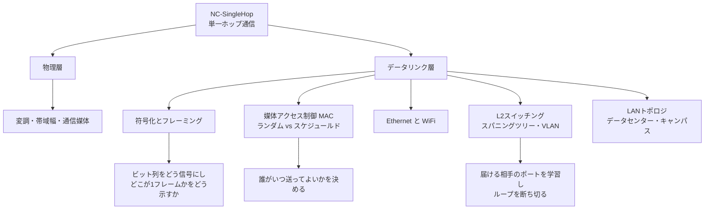

# NC-SingleHop: 単一ホップ通信

CS2023 / Networking and Communication (NC) の Knowledge Unit「**NC-SingleHop**（Single Hop Communication）」を整理した学習メモ。[NC-Fundamentals §4](NC-Fundamentals.md#layers) で見た5層のうち、**物理層とデータリンク層**——つまり「**隣の機器まで1ホップだけ届ける**」層を扱う。IP が世界中を旅する話（NC-Routing）の手前にある、**ビットを電気や電波に載せ、共有された媒体の上で衝突せずに送り届ける**ための技術群である。

!!! info "出典・凡例"
    出典: `ComputerScienceCurricula2023.pdf` p.200。
    **CS Core** = 全卒業生必須 / **KA Core** = 当該分野で必須 / **Non-core** = 発展。
    このユニットは **KA Core 3時間**（CS Core の時間割り当てはなし）。CS2013 からの変更点として、CS2023 は単一ホップ通信をコアに**拡充**した（前文の "broadens its core focus to expand on ... single-hop communication"）。6項目すべてが KA Core で、Non-core 項目はない。

## 全体像

---

## 1. 変調・帯域幅・通信媒体 {#modulation-media}

最下層の問いは「**0と1をどうやって物理現象に載せるか**」である（学習成果1）。

### 変調 (modulation) {#modulation}

**搬送波 (carrier)** という一定の波の性質を、送りたいデータに応じて変化させることを変調という。変化させられる性質は3つ：

| 変調方式 | 変化させるもの | 名前 |
|---|---|---|
| **振幅変調** | 波の**大きさ** | ASK (Amplitude Shift Keying) |
| **周波数変調** | 波の**細かさ**（周波数） | FSK (Frequency Shift Keying) |
| **位相変調** | 波の**ずれ**（位相） | PSK (Phase Shift Keying) |

- 実用系は複数を組み合わせる。**QAM (Quadrature Amplitude Modulation)** は振幅と位相を同時に変え、1回の変調（**シンボル**）で複数ビットを運ぶ。例えば 16-QAM は16通りの状態を区別できるので 1シンボル = 4ビット。
- **シンボルあたりのビット数を増やすほど高速になるが、状態の差が小さくなりノイズに弱くなる**——これが変調方式のトレードオフの核。無線 LAN が電波状況に応じて変調方式を落とす（レートアダプテーション）のはこのため。
- **ベースバンド伝送**（搬送波を使わず、信号の波形をそのまま線路に流す。有線 LAN の短距離など）と**パスバンド伝送**（搬送波に載せる。無線・光など）の区別も押さえておく。

### 帯域幅 (bandwidth) {#bandwidth}

!!! warning "「帯域幅」は2つの意味で使われる"
    - **信号帯域幅**：媒体や通信路が通せる**周波数の幅**。単位は **Hz**。物理的な性質。
    - **スループット／データレート**：単位時間に運べる**ビット数**。単位は **bps**。しばしばこれも「帯域幅」と呼ばれる。

    2つは無関係ではなく、**シャノン＝ハートレーの定理**が結びつける：通信路容量 `C = B log₂(1 + S/N)`（B は Hz の帯域幅、S/N は信号対雑音比）。つまり **bps を増やす道は「Hz の幅を広げる」か「雑音に対する信号を強くする」かの2つしかない**。5G のミリ波が広い周波数帯を使うのも、WiFi が近距離ほど高速なのも、この式の帰結として理解できる。会話の中で「バンド幅」が出てきたら **Hz の話か bps の話か**を毎回確かめる癖をつけるとよい。

### 通信媒体 {#media}

| 媒体 | 特徴 |
|---|---|
| **ツイストペア（より対線）** | 銅線を撚り合わせて雑音を打ち消す。安価で LAN の主流（Cat5e/Cat6）。距離に制限（100m 程度） |
| **同軸ケーブル** | 芯線をシールドで囲む。かつての Ethernet、現在はケーブルテレビ回線など |
| **光ファイバ** | 光の全反射で伝送。**極めて広帯域・低損失・電磁ノイズ耐性**。長距離バックボーンとデータセンター内幹線 |
| **無線** | 電波を空間に放射。**配線不要だが媒体が共有され、干渉・減衰・遮蔽の影響を受ける** |

- 無線が特別なのは**媒体を物理的に分離できない**こと。有線なら「このケーブルは自分専用」にできるが、電波は同じ空間を全員が使う。この性質が §3 の MAC を無線でとりわけ重要にする。

## 2. 符号化とフレーミング {#encoding-framing}

物理的な信号が送れるようになっても、まだ2つの問題が残る：**受信側はビットの区切りをどう知るのか**、そして**どこからどこまでが1つのまとまりなのか**（学習成果3）。

### 符号化 (encoding) {#encoding}

ビット列を信号の変化パターンにどう対応させるか。単純な方式ほど効率がよいが、**クロック同期**の問題が生じる。

| 方式 | 仕組み | 得失 |
|---|---|---|
| **NRZ (Non-Return to Zero)** | 1 を高電位、0 を低電位にそのまま対応 | 単純だが、**同じ値が続くと信号が変化せず**、受信側のクロックがずれていく（何ビット続いたか数えられなくなる） |
| **NRZI (NRZ Inverted)** | 1 のときだけ信号を反転させる | 1 の連続には強いが、**0 の連続に弱い** |
| **マンチェスタ符号** | 各ビット区間の**中央で必ず反転**させる（IEEE 802.3 では 0 = 高→低、1 = 低→高） | 常に遷移があるためクロック復元が確実。ただし**必要な信号変化が2倍**で効率50%（10BASE-T Ethernet が採用） |
| **4B/5B・8B/10B** | 4ビットを5ビット、8ビットを10ビットに写像し、**遷移が十分に含まれる符号だけを使う** | 効率80%（4B/5B）と確実な同期を両立。高速 Ethernet 以降の主流 |

- ここでのトレードオフは明確に**「効率 vs 同期の確実性」**。マンチェスタは帯域の半分を同期のために払い、4B/5B は 20% で済ませる。学習成果3が問う「符号化とフレーミングの解のトレードオフ」とはこのこと。
- 符号化には**直流成分の抑制**（線路に偏った電位が残らないようにする）や、**特殊符号の確保**（データとして現れない符号をフレームの区切り記号に使える）といった副次的な目的もある。

### フレーミング (framing) {#framing}

連続するビットの流れを、**フレーム**という意味のある単位に切り分ける。方法は4系統：

| 方式 | 仕組み | 問題と対処 |
|---|---|---|
| **センチネル（バイト指向）** | 特別なバイト列でフレームの開始・終了を示す | **データ中に同じバイトが現れたら**誤検出する → **バイトスタッフィング**（エスケープ文字を挿入） |
| **ビットスタッフィング（ビット指向）** | HDLC の `01111110` のようなフラグで囲む | データ中に 1 が5個続いたら**送信側が強制的に 0 を挿入**、受信側が取り除く |
| **長さフィールド** | ヘッダにペイロード長を書く | 長さフィールド自身が壊れると同期を失う（フレーミングエラー） |
| **クロックベース** | 一定周期でフレームが区切られる（SONET など） | 特別な区切り記号が不要だが、厳密な時刻同期が要る |

- Ethernet は**プリアンブル**（`10101010` の繰り返し7バイト）で受信側のクロックを同期させ、続く **SFD (Start Frame Delimiter, `10101011`)** でフレーム本体の開始を示す、という組み合わせを使う。
- フレームの末尾には通常 **FCS (Frame Check Sequence)** として **CRC** が付き、伝送中のビット化けを検出する。誤りを見つけたフレームは**黙って捨てる**——訂正や再送はここでは行わず、上位層に任せるのがインターネットの基本方針。

!!! note "チェックサムは OS でも出てきた道具"
    CRC による誤り検出は、[OS-Faults §5](../OS/OS-Faults.md#error-detection-correction) で見たチェックサム・ECC と同じ考え方が、リンク層に現れたもの。**「データが動くところ・保存されるところには必ず化ける可能性があり、検出機構が要る」**という一般原則の一例である。ただし検出後の扱いが違う——ECC メモリは訂正まで行うが、Ethernet は**捨てるだけ**で、回復は上位層（TCP の再送）に委ねる。どの層で回復させるかという設計判断が、ここに現れている。

## 3. 媒体アクセス制御 (MAC) {#mac}

複数の送信者が**同じ媒体を共有**しているとき、同時に送れば信号が混ざって双方が壊れる（**衝突, collision**）。「誰がいつ送ってよいか」を決めるのが **MAC (Medium Access Control)** である（学習成果2）。方式は大きく2系統：

### ランダムアクセス {#random-access}

「送りたくなったら送る。ぶつかったらやり直す」という楽観的な方式。

| 方式 | 仕組み |
|---|---|
| **ALOHA** | 送りたいときに送る。衝突したらランダム時間待って再送 |
| **スロット付き ALOHA** | 送信開始を一定のスロット境界に揃える。衝突する時間帯が半分になり効率が約2倍 |
| **CSMA (Carrier Sense Multiple Access)** | 送る前に**媒体が空いているか聞く**（キャリアセンス）。空いていれば送る |
| **CSMA/CD (Collision Detection)** | 送信**しながら**衝突を検出し、検出したら即座に送信を中止して無駄を減らす。**有線 Ethernet** の方式 |
| **CSMA/CA (Collision Avoidance)** | 衝突を検出できない環境で、そもそも**衝突を避ける**ように振る舞う。**無線 (WiFi)** の方式 |

- 衝突後の再送は **指数バックオフ (exponential backoff)**：衝突するたびに待ち時間の候補範囲を倍にしてランダムに選ぶ。混雑しているほど自然に送信間隔が広がり、**分散したまま安定点に収束する**という優れた性質を持つ。

!!! warning "CSMA/CD と CSMA/CA を混同しない"
    どちらも「送る前に聞く」までは同じだが、**その先が正反対**。

    - **CD（衝突検出・有線）**：送信中も自分の信号と線路上の信号を比べられるので、**衝突が起きたことを検出できる**。だから「まず送ってみて、ぶつかったら即やめる」戦略が成立する。
    - **CA（衝突回避・無線）**：無線機は送信中に自分の強い電波で相手の弱い電波がかき消されるため、**衝突を検出できない**。だから「ぶつかってから対処」ができず、送信前にランダム時間待つ・ACK で成功を確認する・必要なら RTS/CTS で予約する、という**予防**に頼る。

    **「検出できるかどうか」という物理的制約の違いが、プロトコルの戦略を決めている**——ここが学習成果2「MAC プロトコルを詳細に説明する」の勘所。

- 無線特有の難所が **隠れ端末問題 (hidden terminal problem)**：A と C が互いの電波は届かないが、中間の B には両方届く配置では、A も C も「媒体は空いている」と判断して同時に送り、B の位置で衝突する。対策が **RTS/CTS**——送信前に短い「送ってよいか (RTS)」「よろしい (CTS)」を交換し、CTS を聞こえた全員が**その間は黙る**。

### スケジュールドアクセス {#scheduled-access}

「順番を決めておき、その通りに送る」という計画的な方式。

| 方式 | 分ける軸 |
|---|---|
| **TDMA (Time Division)** | **時間**をスロットに分け、各局に割り当てる |
| **FDMA (Frequency Division)** | **周波数**を分割して各局に割り当てる |
| **CDMA (Code Division)** | 直交する**符号**で多重化し、同じ時間・周波数を同時に使う |
| **トークンパッシング** | 送信権を表す**トークン**を巡回させ、持っている局だけが送る |
| **ポーリング** | 中央の制御局が各局に順番に「送るものはあるか」と尋ねる |

- **選び方の軸は負荷**：負荷が軽いときはランダムアクセスが有利（すぐ送れる。スケジュール型は自分の番まで待たされる）。負荷が重いときはスケジュールドアクセスが有利（衝突で潰れる無駄がなく、上限性能と**遅延の予測可能性**が保証される）。セルラー網（NC-Mobility）がスケジュール型を基礎に置くのは、多数の端末を確実に収容する必要があるため。

!!! note "衝突と競合状態は同じ構図"
    「複数の主体が同時に共有資源へアクセスして壊れる」というのは、[OS-Concurrency §2](../OS/OS-Concurrency.md#race-conditions) の**競合状態 (race condition)** そのもの。OS はロックという**排他制御**で解いたが、ネットワークではロックを置く中央がなく、参加者に強制もできない——だから**「聞いてから送る」「ぶつかったらランダムに待つ」という確率的な作法**で秩序を作る。中央集権が使えない環境で協調をどう作るか、という点が MAC プロトコルの面白さであり、スケジュール型はここに**あえて中央を置く**という逆の答えを与えている。

## 4. Ethernet と WiFi {#ethernet-wifi}

代表的な2つのリンク層技術を具体的に押さえる（学習成果4）。

### Ethernet (IEEE 802.3) {#ethernet}

フレーム形式：

| フィールド | サイズ | 役割 |
|---|---|---|
| プリアンブル + SFD | 7 + 1 バイト | クロック同期とフレーム開始の合図（§2） |
| 宛先 MAC アドレス | 6 バイト | 受信すべき機器の指定 |
| 送信元 MAC アドレス | 6 バイト | 送信者の識別（スイッチの学習に使われる、§5） |
| タイプ / 長さ | 2 バイト | 上位層プロトコルの識別（IPv4 なら `0x0800`） |
| ペイロード | 46〜1500 バイト | 上位層のパケット。1500 が標準的な **MTU** |
| FCS (CRC) | 4 バイト | 誤り検出 |

- **MAC アドレス**は 48 ビットで、製造時に機器へ焼き付けられる**平坦な（階層構造を持たない）識別子**。IP アドレスが位置に基づく階層的なアドレスなのと対照的で、この違いが「MAC はローカルな配送、IP は世界規模の経路制御」という役割分担を生む。
- **最小フレーム長 64 バイトの理由**が Ethernet 実装の要：CSMA/CD が正しく働くには、**送信が終わる前に衝突を検出できなければならない**。最遠端まで信号が往復する時間（スロットタイム）より送信時間が短いと、送り終わってから衝突が起きて気づけない。10Mbps・最大 2500m の想定でこの往復が 512 ビット時間 = 64 バイトだった。46 バイトという最小ペイロードはここから逆算されたもので、足りなければ**パディング**される。
- **現代の Ethernet では CSMA/CD は事実上使われていない**。ハブが L2 スイッチに置き換わり（[NC-Fundamentals §6](NC-Fundamentals.md#network-elements)）、各ポートが**全二重の専用リンク**になったため衝突自体が起きなくなった。歴史的経緯として理解しつつ、「共有媒体だった時代の設計制約が、最小フレーム長という形でいまも規格に残っている」ことを押さえるとよい。

### WiFi (IEEE 802.11) {#wifi}

- **CSMA/CA** を基礎とし、送信前にキャリアセンス + ランダムバックオフ、送信後は**受信側からの ACK** で成功を確認する。有線と違い「送れた＝届いた」ではないため、**リンク層で再送を行う**のが Ethernet との大きな違い。
- **フレーム間隔 (IFS)** による優先度制御：ACK など優先すべきフレームは短い待ち時間 (SIFS) で送れ、通常のデータは長い待ち時間 (DIFS) の後にしか送れない。**待ち時間の長短で優先順位を表現する**という巧妙な仕組み。
- **NAV (Network Allocation Vector)**：RTS/CTS やフレームヘッダに書かれた「あとどれくらい媒体を使うか」を各局が記録し、その間は物理的に聞かずとも送信を控える（**仮想キャリアセンス**）。
- アクセスポイント (AP) はビーコンを定期送信し、端末は**アソシエーション**によって特定の AP に接続する。移動しながら AP を切り替える仕組み（ローミング）は NC-Mobility（未作成）の主題。

## 5. L2 スイッチング——学習・スパニングツリー・VLAN {#l2-switching}

LAN の中でフレームを届ける機器の動作（学習成果5）。

!!! warning "ここでの「スイッチング」は L2 機器の話"
    [NC-Fundamentals §3](NC-Fundamentals.md#switching-techniques) の「回線交換 / パケット交換」は**網全体のパラダイム**の話だった。本節はその中で、**L2 スイッチという機器がフレームをどう転送するか**という一段下の話。同じ語だが指しているものが違う。

### 学習型ブリッジ (learning switch) {#learning-switch}

スイッチは設定なしで自律的に賢くなる：

1. **学習**：フレームを受け取ったら、その**送信元 MAC アドレス**と**入ってきたポート**の対応を表に記録する。
2. **転送**：宛先 MAC が表にあれば、**そのポートだけ**に送る。
3. **フラッディング**：宛先 MAC が表になければ、**入ってきたポート以外の全ポート**に送る（相手が応答すれば、その時点で学習できる）。
4. **エージング**：一定時間使われないエントリは削除する（機器の移動に追従するため）。

この「知らなければ全員に聞き、応答から学ぶ」という設計により、管理者が何も設定しなくても LAN が動く。

### スパニングツリープロトコル (STP, IEEE 802.1D) {#stp}

冗長性のために LAN を**ループ状に**配線すると、フラッディングしたフレームがループを永久に回り続け、増殖して LAN を壊す（**ブロードキャストストーム**）。IP と違い、**Ethernet フレームには TTL がない**ため自然には止まらない。

- 対策が **STP**：スイッチ同士が情報を交換して**ルートブリッジ**を選出し、そこを根とする**全域木 (spanning tree)** を計算する。木に含まれないポートは**ブロッキング状態**にして論理的に切り離す——**物理的にはループがあるが、論理的にはループのない木**にする。
- リンク障害が起きると木を再計算し、ブロックしていたポートを開いて**自動的に迂回**する。冗長配線を安全に使えるようにするのが STP の目的。
- 全域木 (spanning tree) という概念そのものは [AL-Foundational](../AL/AL-Foundational.md) のグラフアルゴリズム——最小全域木 (MST) を求める Prim 法・Kruskal 法——で扱ったもの。ただし STP が作るのは重み最小の木ではなく、**ルートブリッジからのコストが最小になる木**（最短経路木に近い）である点が異なる。そして最大の違いは、**全体を見渡す計算主体が存在せず、各スイッチが隣とメッセージを交換するだけで木が決まる**こと——**アルゴリズムの授業で1台の計算機の中で解いた問題を、分散環境で解き直している**のが STP の面白いところ。

### VLAN (IEEE 802.1Q) {#vlan}

1つの物理 LAN を、**論理的に複数の独立した LAN に分割**する仕組み。

- スイッチのポートごとに VLAN ID を割り当て、**異なる VLAN 間ではフレームが転送されない**（通信させるにはルータ／L3 スイッチを経由する必要がある）。
- 複数のスイッチにまたがる場合は、スイッチ間のリンク（**トランク**）で Ethernet フレームに **4バイトの 802.1Q タグ**（VLAN ID を含む）を挿入して、どの VLAN のフレームかを示す。
- 効用は3つ：**ブロードキャストドメインの分割**（不要なブロードキャストの抑制）、**セキュリティ境界**（部門・用途ごとの分離）、**配線からの独立**（物理的な場所に縛られず論理的なグループを作れる）。
- 「1つの物理資源を分割して複数の独立した論理資源に見せる」という発想は、[OS-Virtualization](../OS/OS-Virtualization.md) の仮想化そのもの。**VLAN はネットワークの仮想化の最も素朴な形**であり、その延長線上にある SDN・ネットワーク仮想化が NC-Emerging（未作成）の主題になる。

## 6. LAN トポロジ {#lan-topologies}

同じ L2 技術でも、**どう組み合わせるか**は用途で大きく変わる（学習成果6）。

### キャンパスネットワーク {#campus-network}

オフィスビルや大学構内の伝統的な設計は**3層階層モデル**：

| 層 | 役割 |
|---|---|
| **アクセス層** | 端末を収容する。各フロアのスイッチ |
| **ディストリビューション層** | アクセス層を束ね、VLAN 間ルーティングやポリシー適用を行う |
| **コア層** | 建物間・拠点間を高速に相互接続する。転送に専念する |

- トラフィックの多くが**上下方向**（端末 → コア → 外部インターネット）に流れることを前提にした設計。上に行くほど帯域を集約するため、**上位ほど太いリンク**を持つ。

### データセンターネットワーク {#datacenter-network}

- サーバ間の**東西トラフィック**（サーバ ↔ サーバ）が支配的で、キャンパス型の前提が崩れる。分散処理・ストレージ複製・マイクロサービス間通信がその中身。
- そこで **leaf-spine（リーフ・スパイン）／Clos・fat-tree** と呼ばれるトポロジが使われる：各ラック上部のスイッチ（**ToR, Top of Rack**）＝リーフを、複数の**スパイン**スイッチが全対全に近い形で接続する。
    - どのサーバ間も**同じホップ数**（リーフ → スパイン → リーフ）で到達でき、遅延が均一。
    - 経路が複数あるため、**負荷分散と障害時の迂回**が自然にできる（ECMP による複数経路の等価利用）。
    - スパインを増やすだけで**帯域を水平に拡張**できる。
- STP は「ループを切って1本にする」ため冗長経路を遊ばせてしまい、東西トラフィックの多いデータセンターには不向き。そのため実際には L3 でのルーティングや、TRILL / SPB / VXLAN などの技術で**複数経路を同時に使う**構成が採られる。**「トポロジの選択は、そこを流れるトラフィックの向きで決まる」**というのが本節の要点。

---

## 学習成果（Illustrative Learning Outcomes）

KA Core:

1. **変調・帯域幅・通信媒体**の基本的な側面を説明できる。
2. ある **MAC プロトコル**を詳細に説明できる。
3. **符号化とフレーミング**の解のトレードオフを理解していることを示せる。
4. **Ethernet の実装**の詳細を説明できる。
5. **スイッチングの仕組み**を説明できる。
6. ある **LAN トポロジ**を1つ説明できる。

!!! tip "学習成果2・4の答え方"
    「詳細に説明せよ」という設問は、**列挙ではなく因果で答える**と強い。

    - MAC（学習成果2）：「CSMA/CA は待ってから送る」で止めず、**なぜ CD ではなく CA なのか**（無線では送信中に衝突を検出できないから）→ だから ACK が要る、だから隠れ端末には RTS/CTS が要る、と**制約から設計が導かれる筋**で語る。
    - Ethernet（学習成果4）：フレーム形式の暗記に加え、**最小フレーム長 64 バイトがなぜその値なのか**（CSMA/CD が衝突を検出し終えるまで送信を続ける必要がある）を説明できると、規格の背後にある物理的制約まで理解していることを示せる。

!!! tip "3つの「似た用語」チェック"
    | 混同しやすい組 | 区別の軸 |
    |---|---|
    | 帯域幅 (Hz) / スループット (bps) | 物理的な周波数の幅 か 運べるビット数か（§1） |
    | CSMA/CD / CSMA/CA | 衝突を**検出**できる有線 か **回避**するしかない無線か（§3） |
    | 回線交換・パケット交換 / L2 スイッチング | 網のパラダイム か LAN 内の機器動作か（§5） |

## 前後のユニット

- 前: [NC-Fundamentals](NC-Fundamentals.md) — ネットワークの基礎（CS2023 の並びでは間に NC-Applications・NC-Reliability・NC-Routing があるが、いずれも未作成）
- 次: NC-Security — ネットワークセキュリティ（未作成）
- 関連（未作成）: NC-Mobility（無線 LAN とセルラーの続き） / NC-Emerging（ネットワーク仮想化・SDN）

疑問が出たら [NC-SingleHop Q&A](NC-SingleHop-QA.md) に記録する。
