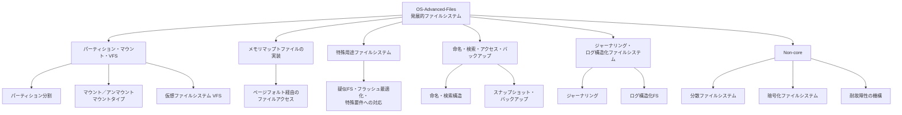

# OS-Advanced-Files: 発展的ファイルシステム

CS2023 / Operating Systems (OS) の Knowledge Unit「**OS-Advanced-Files**（Advanced File systems）」を整理した学習メモ。[OS-Files](OS-Files.md) でファイルシステムのAPIと基本実装を見た——本ユニットはその**土台の上に立つ「実装の掘り下げ」と「特殊化」**を扱う。マウント／仮想ファイルシステムから、メモリマップトファイルの実装詳細、特殊用途のファイルシステム、命名・検索・バックアップ、ジャーナリングまで、ハードウェアの変化がファイルシステム設計にどう波及するかを軸に整理する。

!!! info "出典・凡例"
    出典: `ComputerScienceCurricula2023.pdf` pp.212–213。
    **CS Core** = 全卒業生必須 / **KA Core** = 当該分野で必須 / **Non-core** = 発展。
    このユニットは全体が **KA Core 2時間**（CS Core の時間割り当てはなし）。`See also: AR-IO`（メモリマップトファイル）、`SF-Reliability`（ジャーナリング）への参照があり、**アーキテクチャ・信頼性設計との接点**が多いユニット。

## 全体像

---

## 1. ハードウェアの変化と設計優先順位——パーティション・マウント・VFS {#mount-vfs}

ファイルシステム設計は**下にある記憶装置の特性**に強く縛られる。この関係を押さえると、以降の各節がなぜそう作られているかが見えてくる（学習成果1）：

- **HDD 時代の優先順位**: 機械的なシーク・回転待ちが支配的コストだったため、**局所性**（関連するブロックを近くに置く）や**逐次アクセスへの最適化**が最重要だった。
- **SSD / 不揮発性メモリ時代の優先順位**: シーク遅延は消え、代わりに**書き込みの非対称性**（消去してからしか書けない）、**摩耗（wear leveling）**、**ランダムアクセスの相対的な速さ**が支配的になった。§5 のログ構造化ファイルシステムが SSD と相性が良い理由はここにある。
- こうした前提の変化のたびに、ファイルシステムは実装を作り直してきた——「ファイルシステムはハードウェアの鏡」という見方が学習成果1の核心。

**パーティション**: 1台の物理ディスクを論理的に複数の区画に分け、それぞれに独立したファイルシステムを持たせる。OS・データ・スワップ領域の分離や、複数OSの共存に使う。

**マウント／アンマウント**: パーティション（や他のファイルシステム）を**既存のディレクトリツリーのある1点（マウントポイント）に接ぎ木**して、単一の階層に見せる操作。アンマウントは接続を切り離す（`See also: AR-IO` — デバイスとの物理的な着脱にも対応）。マウントタイプはいくつかに分類できる（学習成果3）：

| マウントタイプ | 典型例 | 特徴 |
|---|---|---|
| **ローカル（永続ストレージ）** | ext4・APFS・NTFS のマウント | 通常の読み書き可能なディスク領域 |
| **読み取り専用** | インストールメディア、`ro` オプション | 改変不可を保証。設定ファイルの保護などにも使う |
| **ネットワークマウント** | NFS・SMB 共有 | リモートのファイルシステムをローカルの木に接ぐ（詳細は §6） |
| **仮想／メモリ上のマウント** | `tmpfs`、`procfs` | ディスクの実体を持たない（§3） |
| **バインドマウント／オーバーレイ** | コンテナのルートFS構築 | 既存の1つのディレクトリを別の場所にも見せる／複数層を重ねて1つに見せる |

**仮想ファイルシステム (VFS)**: マウントで**種類の異なるファイルシステム実装（ext4・NFS・tmpfs…）を1つの木にまとめる**には、それらを共通のインタフェースで扱う抽象層が要る。VFS は `open`・`read`・`write` などのファイル抽象を、各実装が提供する具体的な操作にディスパッチする（学習成果2）。[OS-Files](OS-Files.md) で見たシステムコールAPI は、この VFS 層を通ることで「どの実装が下にあるか」をアプリケーションから隠す——[OS-Purpose](OS-Purpose.md) の抽象化テーマの典型例。

## 2. メモリマップトファイル——実装の掘り下げ {#mmap}

[OS-Memory §8](OS-Memory.md#virtual-memory-services) で「メモリマップトファイル (mmap): ファイルをアドレス空間に割り付け、read/write の代わりにメモリアクセスで読み書きする」と軽く触れた。ここではその**実装**を掘り下げる（`See also: AR-IO`）。

- **ページフォルトが read/write の代わりになる**: `mmap` はファイルの一部を仮想アドレス空間の範囲に対応づけるだけで、その場ではディスクから何も読まない。プロセスがその範囲に**触れた瞬間にページフォルトが起き**、OS がフォルトハンドラの中でファイルの該当ページをページキャッシュへ読み込み、ページテーブルに繋ぐ（[OS-Memory §4](OS-Memory.md#paging) のデマンドページングと全く同じ機構の再利用）。
- **`MAP_SHARED` と `MAP_PRIVATE`**: 複数プロセスが同じファイルを `MAP_SHARED` でマップすると、同じ物理ページを共有し、書き込みは全員に見える最終的にはファイルへも書き戻される。`MAP_PRIVATE` はコピーオンライト（[OS-Memory §8](OS-Memory.md#virtual-memory-services)）で、書いた瞬間だけ自分専用のコピーができ、ファイル本体には反映されない——実行ファイルのロード（[OS-Process §3](OS-Process.md#loading-linking)）で複数プロセスがテキスト領域を共有しつつ、データ領域だけ個別に持てるのはこの仕組みによる。
- **ページキャッシュとの統合**: マップされたページは通常の read/write でも使われる**ページキャッシュ**そのもの。同じファイルを `mmap` で触るプロセスと `read`/`write` で触るプロセスは、同じキャッシュページを介して一貫性を保つ。
- **ダーティトラッキングと書き戻し**: 変更されたページには**ダーティビット**が立ち、OS が随時（またはメモリ圧迫時、または `msync` 呼び出し時）にディスクへ書き戻す。クラッシュ時にまだ書き戻されていない変更が失われうる点は、§5 のジャーナリングが扱う耐障害性の議論に直結する。
- 通常の read/write が毎回カーネル空間へコピーするのに対し、mmap は**ページテーブルの張り替えだけで済む**ため大きなファイルの繰り返しアクセスで有利——ただし小さな読み書きにはページフォルトのオーバーヘッドが割高になることもある、というトレードオフ。

## 3. 特殊用途ファイルシステム {#special-purpose}

ファイルシステムという抽象は「ディスク上の永続データ」に限らない。**特定の要件に応える特殊化**が多数存在する（学習成果4）：

| 種別 | 例 | 満たす要件 |
|---|---|---|
| **疑似ファイルシステム** | `procfs`（プロセス情報）、`sysfs`（デバイス・カーネル設定） | ディスクに実体を持たず、カーネルの内部状態をファイル階層として**動的に**見せる。既存のファイルAPI（open/read）をそのまま「情報の取得インタフェース」に転用できる |
| **メモリ上のファイルシステム** | `tmpfs` | RAM をバッキングストアにし、永続性を捨てる代わりに**高速な一時領域**を提供（`/tmp` など） |
| **光学メディア向け** | ISO 9660 | 書き込み後に変更されない読み取り専用メディアに最適化 |
| **フラッシュ最適化** | FTL (Flash Translation Layer) を意識したFS、F2FS | §1 で述べた摩耗平準化・消去単位の制約に対応 |
| **アーカイブ／WORM (Write Once Read Many)** | 監査ログ用途のFS | 改竄防止のため追記のみを許す |

これらはいずれも「汎用ファイルシステムの機能を絞る／特化させることで、特定の要件を効率よく満たす」という同じ発想の変種であり、§1のVFSがあるからこそ既存のツールチェーンから**透過的に**利用できる。

## 4. 命名・検索・アクセス・バックアップ {#naming-search-backup}

- **命名 (naming)**: パス名は階層的な名前空間を提供する。**ハードリンク**（同一inodeへの複数の名前）と**シンボリックリンク**（パス文字列への間接参照）の違いは、ファイル本体の削除タイミング（参照カウント）に現れる。
- **検索 (searching)**: パス階層をたどる線形探索はファイル数が増えると遅い。**ディレクトリの内部構造**（線形リストではなくB木やハッシュテーブル）や、**索引データベース**（`locate` のインデックス、Spotlight のようなデスクトップ検索）で高速化する。
- **アクセス (access)**: 開く・読む・書くという基本操作に加え、**アクセス制御**（[OS-Protection §7](OS-Protection.md#access-control) のACL／ケイパビリティ）がファイル単位で効いてくる場所。
- **バックアップ (backups)**: [OS-Protection §4](OS-Protection.md#mitigations) で「定期取得・オフライン/別系統に保管・復元の練習」というバックアップ運用の一般論に触れた。ファイルシステムの視点ではこれを支える具体的な機構がある：
    - **スナップショット**: ある時点のファイルシステム全体の状態を**コピーオンライトで安価に**凍結する（ZFS・Btrfs・LVM など）。実データはコピーせず、以後の変更だけを新しい領域に書くことで「過去の一貫した像」を保持する。
    - **増分バックアップ**: 前回からの差分（変更されたブロック／ファイル）だけを転送・保存し、容量と時間を節約する。
    - スナップショットは「事故った操作を戻す」即応的な保険、オフラインバックアップは「システム全体が壊れた／暗号化された」場合の最終防衛線——両者は補完関係にある。

## 5. ジャーナリングとログ構造化ファイルシステム {#journaling}

ファイルシステムの操作（ファイル作成、ブロック割り当て、メタデータ更新）は**複数のディスク書き込みにまたがる**。電源断やクラッシュがその途中で起きると、ファイルシステムは一貫性を失いかねない（学習成果5）。

- **ジャーナリング (journaling)**: 実際の更新を行う**前に**、その更新内容（メタデータ、時にデータも）を**ジャーナル（ログ領域）へ先に書く** (write-ahead logging)。クラッシュ後の起動時は、旧来の全ディスクスキャン（`fsck`）ではなく**ジャーナルを読んで未完了の操作をやり直す／巻き戻すだけ**でよく、復旧が桁違いに速くなる。ext4・NTFS・APFS など現代の主要ファイルシステムはほぼ標準でジャーナリングを持つ。
- **ログ構造化ファイルシステム (log-structured file system)**: 発想をさらに推し進め、**ファイルシステム全体をひとつの追記ログとして扱う**。すべての書き込み（データもメタデータも）はディスクの末尾に順に追記され、ランダムな上書きを避ける。§1で述べたSSD/フラッシュの「消去してから書く」制約や、シーケンシャル書き込みの速さと相性がよい。古いバージョンのブロックは後で**ガベージコレクション**によって回収される。
- ジャーナリングもログ構造化も、根本の狙いは同じ——**部分的な書き込みからの回復**によってファイルシステムの一貫性（≒耐故障性）を高めること。より広い耐故障性の議論（RAID・チェックサム・レプリケーションなど）は [OS-Faults](OS-Faults.md) で扱う（`See also: SF-Reliability`）。

## 6. (Non-core) 分散・暗号化・耐故障ファイルシステム {#non-core}

- **分散ファイルシステム**: 複数のマシンにまたがってファイルを保存し、単一のファイルシステムであるかのように見せる（学習成果6）。単一マシンのファイルシステムには無い課題——ネットワーク遅延・部分故障・複数クライアントからの同時アクセスの一貫性——を扱う分だけ複雑さが跳ね上がる。代表的なプロトコル・実装（学習成果7）：
    - **NFS (Network File System)**: Unix系で標準的なリモートマウント型プロトコル。
    - **SMB/CIFS**: Windows系で標準的な共有プロトコル。
    - **HDFS・GFS 系**: 大規模データ処理向けに、ファイルを巨大なブロックへ分割し複数ノードへ複製する設計。
- **暗号化ファイルシステム**: ディスク全体を暗号化する**フルディスク暗号化**（BitLocker・FileVault）と、ファイル／ディレクトリ単位で暗号化する**方式**（eCryptfs など）がある。鍵の管理（どこに鍵を置き、いつ復号するか）が設計の核心。
- **耐故障性の機構**: §5のジャーナリング／ログ構造化に加え、**RAID**（複数ディスクへの冗長化）、**チェックサム／自己修復**（ZFS のブロック単位チェックサムなど）、**レプリケーション**（分散FSでの複製）がファイルシステム層で耐故障性を実現する主な手段（学習成果8）。

---

## 学習成果（Illustrative Learning Outcomes）

KA Core:

1. **ハードウェアの発展**がファイルシステムの設計・管理の優先順位をどう変えてきたかを説明できる。
2. **ファイル抽象**を関連するデバイス・インタフェースの一覧に対応づけられる。
3. さまざまな**マウントタイプを識別・分類**できる。
4. 特定のファイルシステム要件と、それを満たす**特殊化されたファイルシステム機能**を説明できる。
5. **ジャーナリング**の利用法と、**ログ構造化ファイルシステムがどう耐故障性を高めるか**を説明できる。

Non-core:

6. **分散ファイルシステムの目的と複雑さ**を説明できる。
7. **分散ファイルシステムのプロトコル**の例を挙げられる。
8. ファイルシステムにおいて**耐故障性を高める機構**を説明できる。

## 前後のユニット

- 前: [OS-Files](OS-Files.md) — ファイルシステムAPIと実装
- 次: [OS-Virtualization](OS-Virtualization.md) — 仮想化

疑問が出たら [OS-Advanced-Files Q&A](OS-Advanced-Files-QA.md) に記録する。
