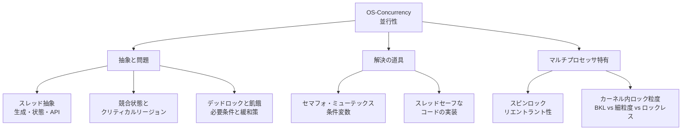
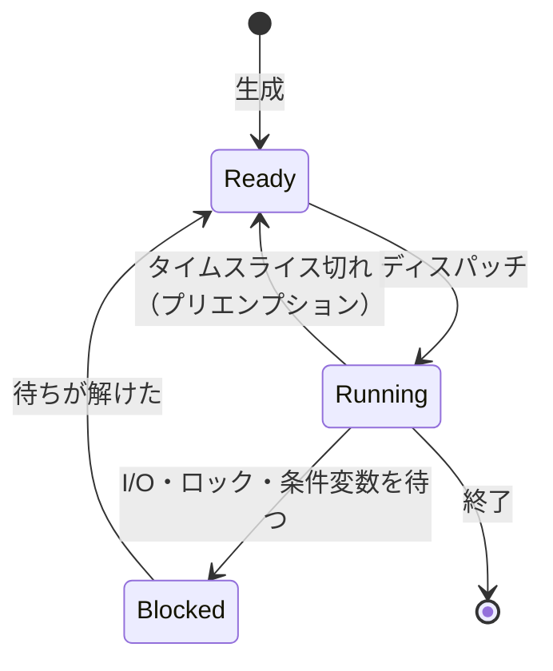

# OS-Concurrency: 並行性

CS2023 / Operating Systems (OS) の3つ目の Knowledge Unit「**OS-Concurrency**（Concurrency）」を整理した学習メモ。[OS-Principles](OS-Principles.md) で見た「割り込みとタイムスライス」が可能にする**複数の実行流（スレッド）が同時に走る世界**で何が起きるか——競合状態・デッドロック・同期——を扱う。

!!! info "出典・凡例"
    出典: `ComputerScienceCurricula2023.pdf` pp.208–209。
    **CS Core** = 全卒業生必須 / **KA Core** = 当該分野で必須 / **Non-core** = 発展。
    このユニットは **CS Core 2時間 + KA Core 1時間**。`See also: PDC-Coordination`（並列分散）への参照が多く、**並行性の入口**となるユニット。

## 全体像



---

## 1. スレッド抽象と並行性 {#thread-abstraction}

**スレッド (thread)** は「プロセス内の実行流」の抽象。並行性 (concurrency) との関係で押さえる：

- プロセスが「資源割り当て・保護の単位」（→ [OS-Principles §2](OS-Principles.md#abstractions)）なのに対し、スレッドは「**CPU スケジューリングの単位**」。
- 1プロセス内の複数スレッドは**アドレス空間（コード・ヒープ・グローバル変数）を共有**し、**スタックとレジスタ（プログラムカウンタ含む）だけを各自で持つ**。
- 共有しているからこそ通信は速い——そして共有しているからこそ、以降のすべての問題（競合状態）が生まれる。

## 2. 競合状態とクリティカルリージョン {#race-conditions}

**競合状態 (race condition)**: 複数の実行流が共有データに同時アクセスし、**結果が実行タイミング（インターリーブ）に依存**してしまう状態。

典型例——`counter++` は機械語レベルでは3命令（load → add → store）：

```
スレッドA: load counter(=5) → add → (ここで割り込み・切替) →           store 6
スレッドB:                              load counter(=5) → add → store 6
結果: 2回インクリメントしたのに 6（正しくは 7）
```

- **クリティカルリージョン（critical region / critical section）**: 共有データに触れる、**同時に1つの実行流しか入ってはいけない**コード区間。
- **割り込みの役割**: 単一 CPU では、切替はタイマ割り込み等で起きる（→ [OS-Principles §6](OS-Principles.md#interrupts)）。だからカーネル内の短いクリティカルリージョンは**割り込み禁止**で守れることもある。ただしマルチプロセッサでは割り込み禁止だけでは守れない（他の CPU が同時に走っている）。
- アーキテクチャレベルの実装（複数命令への分解・命令の並べ替え・キャッシュ）が競合状態の根本原因という視点が学習成果2。

## 3. デッドロックと飢餓 {#deadlock-starvation}

- **デッドロック (deadlock)**: 複数の実行流が**互いに相手の持つ資源を待ち合って全員停止**する状態。
- **飢餓 (starvation)**: 停止はしていないが、特定の実行流が**いつまでも資源をもらえない**状態（→ スケジューリングの公平性 [OS-Scheduling §5](OS-Scheduling.md#fairness-starvation) にも同じ概念が現れる）。

### デッドロックの必要条件（KA Core） {#deadlock-conditions}

4条件が**すべて**成り立つときだけデッドロックは起こりうる（Coffman 条件）：

| # | 条件 | 意味 | 緩和策の例 |
|---|---|---|---|
| 1 | **相互排除** (mutual exclusion) | 資源は同時に1つの実行流しか使えない | 資源を共有可能にする（読み取り専用化） |
| 2 | **保持して待機** (hold and wait) | 資源を持ったまま別の資源を待つ | 必要な資源を最初に一括獲得する |
| 3 | **横取り不可** (no preemption) | 資源を強制的に取り上げられない | 取り上げ（プリエンプション）を許す |
| 4 | **循環待機** (circular wait) | 待ちの連鎖が輪になる | **資源に全順序を付け、順番にしか獲得させない** |

→ どれか1つを崩せば防げる。実務では条件4（ロック獲得順序の統一）が最も使われる。


## 4. マルチプロセッサの問題 {#multiprocessor-issues}

複数の CPU が本当に同時に走る環境で特有の道具・注意点：

- **スピンロック (spin-lock)**: ロックが取れるまで**ループで回り続ける（busy-wait）**ロック。スリープ／起床のコスト（コンテキストスイッチ、→ [OS-Principles §9](OS-Principles.md#context-switch-cost)）を払わないので、**保持時間が非常に短い**ロックに向く。単一 CPU では無意味（回っている間、ロック保持者が走れない）どころか有害。
- **リエントラント性 (reentrancy)**: 実行の途中で同じ関数が再び（別スレッドや割り込みハンドラから）呼ばれても正しく動く性質。グローバル変数や static な状態に依存しないことが条件。割り込みハンドラやシグナルハンドラから呼ばれるコードには必須。

## 5. マルチプロセス並行 vs マルチスレッド {#process-vs-thread}

並行性を得る2つの構え方の比較：

| | マルチプロセス | マルチスレッド |
|---|---|---|
| メモリ | **分離**（別アドレス空間） | **共有**（同一アドレス空間） |
| 通信 | IPC が必要（遅いが明示的） | メモリ共有で速い（が競合状態のリスク） |
| 故障分離 | 強い（1つ落ちても他は無事） | 弱い（1スレッドのクラッシュで全体が死ぬ） |
| 生成・切替コスト | 高い | 低い |
| 例 | Chrome のタブ、nginx ワーカー | 1プロセス内のワーカースレッド |

→ 「分離・堅牢性」対「性能・共有の手軽さ」のトレードオフ（[OS-Purpose §4](OS-Purpose.md#design-issues) の具体化）。

## 6. スレッドの生成・状態・構造・API（KA Core） {#thread-lifecycle}

- **生成**: `pthread_create` (POSIX) / `std::thread` / Java `Thread` など。**Thread API** はシステムコールを包むライブラリとして提供される（→ [OS-Principles §3](OS-Principles.md#system-calls)）。
- **状態遷移**: 新規 → **実行可能 (ready)** ⇄ **実行中 (running)** → **待機 (blocked/waiting)** → 終了。running→ready はタイムスライス切れ（プリエンプション）、running→blocked は I/O やロック待ち。
- **構造**: スレッドごとに TCB (Thread Control Block) ——レジスタ退避領域・スタックポインタ・状態・優先度など——を OS が管理する。



## 7. スレッドセーフなコードの実装（KA Core） {#thread-safety}

クリティカルリージョンを守る代表的な同期プリミティブ：

| プリミティブ | 何か | 典型用途 |
|---|---|---|
| **ミューテックスロック (mutex)** | 「入れるのは1人だけ」の鍵。所有者だけが解錠できる | クリティカルリージョンの相互排除 |
| **セマフォ (semaphore)** | 非負整数カウンタ + P(wait)/V(signal) 操作。カウンタ n なら同時に n 個まで入れる | 資源プールの空き管理、順序付け |
| **条件変数 (condition variable)** | 「条件が成り立つまで眠り、成り立ったら起こしてもらう」仕組み。必ずミューテックスと組で使う | 生産者・消費者（キューが空/満杯の待ち合わせ） |

- セマフォは **OS プリミティブ（キューへの追加とスリープ、ハードウェアのアトミック命令）で実装できる**——これを説明できるのが学習成果5。
- ハードウェアの**アトミック命令**（test-and-set、compare-and-swap 等）が最下層の土台（`See also: AR-Performance-Energy`）。

## 8. 共有メモリでの競合状態（KA Core） {#shared-memory-races}

- 明示的にスレッドを作らなくても、**共有メモリ IPC** を使うプロセス間でも競合状態は起きる（`See also: PDC-Coordination`）。
- コードを読んで「どこが共有データか」「どのインターリーブで壊れるか」「どのプリミティブで守るか」を特定できること（学習成果6）が、このユニットの実践的ゴール。

## 9. (Non-core) OS オブジェクトへのアトミックアクセス管理 {#kernel-locking}

カーネル自身も共有データの塊であり、ロック設計の歴史がある：

- **ビッグカーネルロック (big kernel lock)**: カーネル全体を1つのロックで守る。単純だが、マルチプロセッサでスケールしない。
- **多数の細かいロック**: データ構造ごと・部分ごとにロックを分ける。並列性は上がるが、デッドロックのリスクと複雑さが増す。
- **ロックレスデータ構造**: アトミック命令だけで整合性を保つ（例：ロックレスリスト、RCU）。最高の並列性だが設計・検証が最も難しい。

→ 「単純さ」対「スケーラビリティ」のトレードオフの縮図。

---

## 学習成果（Illustrative Learning Outcomes）

CS Core:

1. OS の枠組みと不可分な機能としての並行性の**利点と欠点**を理解する。
2. アーキテクチャレベルの実装が**競合状態などの並行性問題**を生むことを理解する。
3. **マルチプロセッサシステム**における並行性の問題を理解する。

KA Core:

4. 並行システムを実現するために OS レベルで使える**メカニズムの幅**と、それぞれの利点を理解する。
5. OS における**同期の実現手法**を理解する（例：セマフォを OS プリミティブでどう実装するか。並行制御とハードウェアアトミックの利用を含む）。
6. コードを正確に分析して**競合状態を特定**し、適切な解決策を示せる。

!!! tip "学習成果6の練習法"
    「共有変数はどれか → その読み書きは何命令に分解されるか → どの切替タイミングで壊れるか」の3ステップで追う。§2 の `counter++` が最小の練習台。

## 前後のユニット

- 前: [OS-Principles](OS-Principles.md) — OS の原理（割り込み・モード分離）
- 次: [OS-Scheduling](OS-Scheduling.md) — スケジューリング（CS2023 の並びでは間に OS-Protection: Protection and Safety がある）

疑問が出たら [OS-Concurrency Q&A](OS-Concurrency-QA.md) に記録する。
