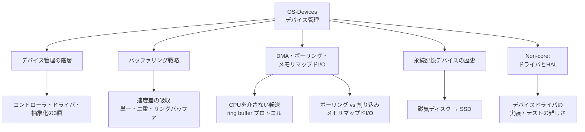

# OS-Devices: デバイス管理

CS2023 / Operating Systems (OS) の Knowledge Unit「**OS-Devices**（Device management）」を整理した学習メモ。[OS-Memory](OS-Memory.md) では「メモリ」という1種類の資源をどう仮想化・管理するかを見た。本ユニットはその視野を**あらゆる周辺デバイス**（ディスク・ネットワークカード・キーボード等）に広げ、OS が物理ハードウェアと折り合いをつける層——バッファリング・DMA・デバイスドライバ——を扱う。

!!! info "出典・凡例"
    出典: `ComputerScienceCurricula2023.pdf` pp.211–212。
    **CS Core** = 全卒業生必須 / **KA Core** = 当該分野で必須 / **Non-core** = 発展。
    このユニットは **KA Core 2時間**（CS Core の時間割り当てはなし）。`See also: AR-IO`（I/O アーキテクチャ）への参照が中心で、**アーキテクチャと OS の合流点**。歴史的経緯を扱う項目には `See also: SEP-History` が付く。

## 全体像

---

## 1. デバイス管理の階層——コントローラ・ドライバ・抽象化 {#device-layers}

OS がデバイスを扱う仕組みは3層に分かれる（`See also: AR-IO`）：

| 層 | 役割 | 具体例 |
|---|---|---|
| **物理ハードウェア** | 実際にデータを読み書きする装置本体 | ディスクの磁気ヘッド、NIC のチップ |
| **デバイスコントローラ** | ハードウェアを制御する小さな回路。**レジスタ**を通じて命令を受け、割り込みで完了を知らせる | ディスクコントローラ、USB ホストコントローラ |
| **デバイスドライバ** | コントローラのレジスタ操作を**OS 共通のインタフェース**（read/write/ioctl）に翻訳するカーネルコード | `sd.ko`（Linux の SCSI/SATA ドライバ）など |
| **デバイス抽象化** | アプリから見える統一像。UNIX 系では「**すべてはファイル**」（`/dev/sda`, `/dev/tty` 等） | ファイルディスクリプタ経由の read/write |

- アプリケーションは**物理ハードウェアの違いを一切意識しない**——SSD だろうと磁気ディスクだろうと同じ `read()` で扱える。これは OS の**仮想化テーマ**（[OS-Purpose](OS-Purpose.md)）がデバイス領域に現れた形であり、実体（物理ハードウェア）と OS が維持する**仮想デバイス**の関係そのものが学習成果3の主題。
- コントローラとドライバの分業は [OS-Protection §5](OS-Protection.md#policy-mechanism) の「メカニズムとポリシーの分離」に近い——コントローラは「どう電気信号を出すか」の**メカニズム**、ドライバの上位（OS のファイルシステム層など）が「いつ何を読むか」の**ポリシー**を決める。

!!! note "デバイスもプロセスの外から来る「割り込み」で動く"
    デバイスコントローラは処理が終わると**割り込み**で OS に知らせる。この基本形は [OS-Principles §6](OS-Principles.md#interrupts) で既出——タイマ割り込みがスケジューリングを駆動したのと同じ仕組みが、ここではデバイス I/O の完了通知に使われる。

## 2. (KA Core) バッファリング戦略 {#buffering}

デバイスと CPU／メモリの間には大きな**速度差**がある（ネットワークやディスクはメモリよりずっと遅く、しかもデータが不定期に届く）。この差を吸収するのが**バッファ**：一時的にデータを溜めておく領域。

- **単一バッファリング**: 1つの緩衝領域にデバイスが書き込み、OS がそこから読み出す。単純だが、書き込み中は読み出せず（逆も同様）、**双方が遊ぶ時間**が生じる。
- **二重バッファリング (double buffering)**: バッファを2つ用意し、デバイスが片方に書いている間にアプリはもう片方を読む。役割を交互に**スワップ**することで、デバイスと消費側を並行に走らせられる——[OS-Memory §8](OS-Memory.md#virtual-memory-services)のコピーオンライトと同様、「待たせない」ための時間差トリック。
- **リングバッファ (ring buffer / circular buffer)**: 固定長の配列を輪のように使い、**書き込み位置**と**読み出し位置**の2つのポインタで管理する（→ [AL-Foundational §1](../AL/AL-Foundational.md#linear) の循環リスト／キューの実装そのもの）。バッファがいっぱいになったら先頭に戻って上書きせずに待つ（あるいは古いデータを捨てる）。生産者（デバイス）と消費者（OS/アプリ）の速度差を吸収する定番構造で、§3 の DMA 通信プロトコルの主役でもある。

!!! tip "バッファリングと IPC の類似（学習成果4）"
    リングバッファは [OS-Process §5](OS-Process.md#ipc) で見た IPC の発想——生産者・消費者間でデータをやり取りしつつ、速度差や非同期性を吸収する——のデバイス版。カーネル内のパイプ実装にもリングバッファが使われることが多く、「同じ道具がプロセス間通信にもデバイス通信にも現れる」ことが分かる。

## 3. (KA Core) DMA・ポーリングI/O・メモリマップドI/O {#dma-io}

CPU がデバイスとどうデータをやり取りするか、3つの方式を対比する（`See also: AR-IO`）：

| 方式 | 仕組み | 得失 |
|---|---|---|
| **ポーリング I/O (polled I/O)** | CPU がデバイスの状態レジスタを**繰り返し確認**し、準備できたらデータを読み書きする | 実装は単純だが、待っている間 CPU を**無駄に消費**する（ビジーウェイト） |
| **割り込み駆動 I/O** | CPU は要求を出したら他の仕事に戻り、デバイスが完了時に**割り込み**で知らせる | CPU を有効活用できる。[OS-Principles §6](OS-Principles.md#interrupts) の I/O 割り込みそのもの |
| **DMA (Direct Memory Access)** | 専用の DMA コントローラが、CPU を介さず**メモリとデバイスの間で直接**データを転送する | 大量データの転送で CPU 負荷を大きく下げる。転送完了時に1回だけ割り込みが上がる |

- **DMA の通信プロトコル**の代表例が**リングバッファ**（§2）：ドライバがメモリ上にリングバッファを用意し、デバイスがそこへ直接書き込む（あるいはそこから読み出す）。ドライバは「どこまで進んだか」を示すポインタを更新するだけで、実データのコピーは発生しない——[OS-Process §5](OS-Process.md#ipc) の共有メモリ IPC が「同じ物理ページを複数プロセスで共有してコピーを避ける」のと同じ発想を、CPU とデバイスの間で行っている。
- **メモリマップド I/O (memory-mapped I/O)**: デバイスのレジスタを**通常のメモリアドレス空間の一部**に割り付け、CPU は特別な I/O 命令ではなく普通のロード/ストア命令でデバイスにアクセスする。[OS-Memory §8](OS-Memory.md#virtual-memory-services) の `mmap`（ファイルをアドレス空間に割り付ける）と字面は似ているが、こちらは**ファイルではなくデバイスレジスタ**をアドレス空間に写像する点が異なる——同じ「アドレス変換という間接層を使い倒す」発想の別の応用。
- ポーリング vs 割り込みの対立は [OS-Principles §6](OS-Principles.md#interrupts) で既に見た構図の再登場。ただし高速デバイス（高スループット NIC など）では、**割り込みのオーバーヘッドがポーリングより高くつく**逆転現象もあり、実際の高性能ドライバはポーリングと割り込みを状況に応じて切り替える（学習成果5：DMA が有利な状況の判断にも通じる）。

## 4. (KA Core・歴史) 永続記憶デバイス管理の変遷——磁気ディスクからSSD {#persistent-storage-history}

歴史的・文脈的な位置づけとして、永続記憶デバイスの管理方式の変化を押さえる（`See also: SEP-History`）：

- **磁気ディスク (HDD)**: データは回転する磁性ディスク上に記録され、読み書きヘッドが**シーク**（目的のトラックへ移動）してから**回転待ち**（目的のセクタが来るまで待つ）を経てアクセスする。この機械的な動作のため、アクセスパターン（連続 vs ランダム）が性能に大きく効く——OS のディスクスケジューリングやキャッシング戦略（[OS-Memory](OS-Memory.md) のメモリ階層の最下層）が生まれた背景でもある。
- **SSD (Solid State Device)**: 可動部品を持たず、フラッシュメモリへの電気的な読み書きで動作する。シーク時間が事実上ゼロになりランダムアクセスが劇的に速くなる一方、**書き込み回数に上限**があり、**ウェアレベリング**（書き込みをセル間で平均化する）や、ページ単位でしか消去できない特性への対応が OS／ドライバ側に新たに求められた。
- この変遷が OS 設計に与えた影響——「シーク時間を隠すためのスケジューリング」から「フラッシュの寿命を延ばすための書き込みパターン管理」への重心移動——は、これから扱う **OS-Files**（ファイルシステムの実装）で具体的なアルゴリズムとして再登場する。ここでは「デバイスの物理特性が OS の上位層の設計を規定する」という関係性を押さえておけば十分。

## 5. (Non-core) デバイスドライバとハードウェア抽象化層 {#drivers-hal}

- **デバイスインタフェース抽象化 / HAL (Hardware Abstraction Layer)**: 同種のデバイス（例：複数ベンダのディスクコントローラ）を**共通のインタフェース**の背後に隠す層。OS 本体やファイルシステムは HAL の向こう側さえ実装すれば、個々のハードウェアの違いを気にしなくてよい。
- **デバイスドライバの目的と難しさ**（学習成果6）: ドライバは「ハードウェア固有の詳細」と「OS 共通の抽象」を橋渡しする、**カーネル空間で動く**コードである。
    - 目的別の抽象化（ブロックデバイス／キャラクタデバイス／ネットワークデバイスなど、デバイスの性質ごとの共通インタフェース）の設計。
    - 実装の難しさ：ハードウェアの仕様書のバグや曖昧さ、割り込みハンドラは**極めて短時間で処理を終える**必要がある（長く止めると他の割り込みや処理を遅延させる）等の制約。
    - テストの難しさ：実機がないと再現しない不具合、タイミング依存の競合状態（[OS-Concurrency](OS-Concurrency.md) の一般論がハードウェアという「もう1つの並行実体」を相手にする形で現れる）、そしてカーネル空間で動くためバグが**システム全体をクラッシュさせうる**こと。
- **通信の高レベルな耐障害性**: デバイスとの通信は物理的なノイズや接続不良で失敗しうる。タイムアウト・リトライ・チェックサムといった、ネットワーク層でおなじみの耐障害設計が、ローカルなデバイス通信にも同様に必要になる。

---

## 学習成果（Illustrative Learning Outcomes）

KA Core:

1. アーキテクチャレベルのデバイス制御の実装を説明し、関連する OS の**機構とポリシー**（バッファリング戦略、DMA 等）を結びつけて理解している。
2. OS のデバイス管理の**階層とアーキテクチャ**（デバイスコントローラ・デバイスドライバ・デバイス抽象化）を説明できる。
3. **物理ハードウェア**と、OS が維持する**仮想デバイス**の関係を説明できる。
4. I/O の**データバッファリング**と、その実装戦略を説明できる。
5. **ダイレクトメモリアクセス**の利点・欠点を説明し、その使用が正当化される状況を論じられる。

Non-core:

6. デバイスドライバ作成の**複雑さとベストプラクティス**を説明できる。

!!! tip "学習成果1・5の練習法"
    「このデータ転送、CPU は何をしている間に終わるか？」を軸に §3 の3方式を比べ直すとよい。ポーリングは CPU が**張り付いて待つ**、割り込み駆動は CPU が**手放して呼ばれるまで他をする**、DMA は**転送自体を他のハードウェアに丸投げする**。転送量が大きいほど DMA の優位性（CPU をほぼ解放できる）が際立つ一方、ごく小さな転送では DMA のセットアップコストの方が高くつくこともある。

## 前後のユニット

- 前: [OS-Memory](OS-Memory.md) — メモリ管理
- 次: [OS-Files](OS-Files.md) — ファイルシステムAPIと実装

疑問が出たら [OS-Devices Q&A](OS-Devices-QA.md) に記録する。
