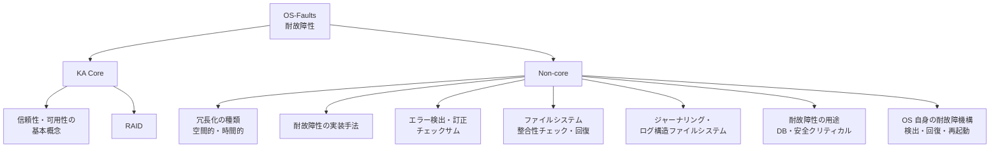

# OS-Faults: 耐故障性

CS2023 / Operating Systems (OS) の Knowledge Unit「**OS-Faults**（Fault tolerance）」を整理した学習メモ。[OS-Real-time §6](OS-Real-time.md#failures-safety) で「故障の検出・回復は OS-Faults で扱う」と予告した通り、ここでは**「壊れることを前提に、それでも動き続ける／戻れるようにする」**という設計思想を正面から扱う。

!!! info "出典・凡例"
    出典: `ComputerScienceCurricula2023.pdf` pp.214–215。
    **CS Core** = 全卒業生必須 / **KA Core** = 当該分野で必須 / **Non-core** = 発展。
    このユニットは **KA Core 1時間**（CS Core の時間割り当てはなし）。KA Core 自体はわずか2項目（信頼性・可用性の基本概念、RAID）だが、Non-core に実務的な内容——冗長化の種類、実装手法、チェックサム、ファイルシステム整合性チェック、ジャーナリング、ユースケース、OS 自身の耐故障機構——が厚く並ぶ、CS2023 全体でも短いが密度の高いユニット。`See also: SF-Reliability`（Software Engineering の信頼性分野）への参照が全項目にわたり付いている。

## 全体像

---

## 1. (KA Core) 信頼性・可用性の基本概念 {#reliability-availability}

耐故障性を語る前に、目的となる2つの指標を区別する（学習成果1、`See also: SF-Reliability`）：

- **信頼性 (reliability)**: システムが**故障せずに動き続ける**度合い。指標は **MTBF (Mean Time Between Failures)** ——平均故障間隔。長いほど信頼性が高い。
- **可用性 (availability)**: 利用者から見て**使いたいときに使える**度合い。故障しても復旧が速ければ可用性は保てる。指標は **MTTR (Mean Time To Repair/Recovery)** ——平均修復時間との組み合わせで `availability = MTBF / (MTBF + MTTR)` と表せる。

!!! note "信頼性と可用性は別物"
    信頼性が低くても（よく壊れても）、MTTR が極めて短ければ可用性は高く保てる——これがフェイルオーバーやホットスワップの狙い。逆に、めったに壊れなくても（信頼性が高くても）、直すのに数日かかるなら可用性は低い。**耐故障性の設計は多くの場合「壊れないようにする」より「壊れても素早く戻す」に軸足を置く**。

耐故障性 (fault tolerance) とは、この2指標を**冗長性 (redundancy)** によって底上げする設計原則の総称。「故障 (fault) → エラー (error) → 障害 (failure)」という因果の連鎖のどこかで**検出し、影響が利用者に届く前に止める、あるいは吸収する**のが基本戦略。

## 2. (KA Core) RAID——ハードウェアによる耐故障性 {#raid}

**RAID (Redundant Array of Independent Disks)** は、複数のディスクを組み合わせて**冗長性**を作る代表的なハードウェア（またはソフトウェア）アプローチ（学習成果2）：

| レベル | 仕組み | 耐えられる故障 | トレードオフ |
|---|---|---|---|
| **RAID 0** | ストライピング（分散書き込み）のみ | なし（冗長性ゼロ） | 速度は上がるが1台壊れると全滅——「耐故障性」ではなく性能目的 |
| **RAID 1** | ミラーリング（全データを複製） | 1台（構成による） | 容量効率は50%だが単純で読み取りも速い |
| **RAID 5** | ストライピング + 分散パリティ | 1台 | 容量効率が良いが書き込みにパリティ計算コスト、リビルド中に追加故障すると全損 |
| **RAID 6** | RAID 5 + 二重パリティ | 2台 | 大容量ディスクでのリビルド時間長期化（リビルド中の追加故障）に対応 |

!!! tip "RAID 0 は仲間はずれ"
    RAID の名前がついていても RAID 0 は冗長性を持たない（むしろ故障率は上がる）。耐故障性の文脈で RAID を語るときは実質 RAID 1 以上を指す。

## 3. (Non-core) 冗長化の種類——空間的冗長性と時間的冗長性 {#redundancy-types}

RAID は**空間的冗長性 (spatial redundancy)** の一例。冗長化にはもう1つの軸がある（`See also: SF-Reliability`）：

- **空間的冗長性**: **同じデータ・処理を複数の場所に同時に持つ**。RAID のミラーリング、複製されたサーバ（レプリカ）、ECC メモリの冗長ビットなど。コストは「余分な資源」。
- **時間的冗長性 (temporal redundancy)**: **同じ処理を時間をずらして繰り返す**。通信路の再送（パケットロス時のリトライ）、計算のリトライ、投票のために同じ計算を複数回行って多数決を取る（N-version programming）など。コストは「余分な時間」。

どちらを選ぶかは、資源（空間）と時間のどちらに余裕があるかで決まる——リアルタイムシステム（[OS-Real-time §4](OS-Real-time.md#latency-sources)）では時間的冗長性（リトライ）はデッドラインを脅かすため、空間的冗長性（多重化ハードウェア）が好まれやすい。

## 4. (Non-core) 耐故障性を実装する手法 {#implementation-methods}

冗長性を持たせるだけでは不十分で、それを**使いこなす仕組み**が必要（`See also: SF-Reliability`）：

- **検出 (detection)**: 何かがおかしいと気づく——チェックサム、ハートビート、タイムアウト、境界チェック。
- **隔離 (isolation/containment)**: 壊れた部分が他に波及しないよう切り離す（[OS-Protection](OS-Protection.md) の分離機構が土台）。
- **フェイルオーバー (failover)**: 冗長化しておいた予備系に切り替える。
- **縮退運転 (graceful degradation)**: 一部機能を落としてでも動き続ける（[OS-Real-time §6](OS-Real-time.md#failures-safety) で見た考え方）。
- **回復 (recovery)**: 既知の正しい状態まで巻き戻す、または再構築する。

## 5. (Non-core) エラー識別・訂正機構——RAM のチェックサム {#error-detection-correction}

「壊れる前に壊れかけを検知する」層。ビットが物理的に化ける（宇宙線・電気ノイズなど）ことは実際に起きる（`See also: AR-Memory`）：

- **チェックサム／パリティビット**: データに冗長ビットを付け、読み出し時に整合性を検証する。**誤り検出**（1ビット化けを検出）と**誤り訂正**（訂正まで行う、例：ハミング符号）を区別する。
- **ECC メモリ (Error-Correcting Code memory)**: RAM に訂正符号を持たせ、1ビットエラーは自動訂正、2ビットエラーは検出だけ行う（[OS-Memory](OS-Memory.md) のメモリ管理はこの上に成り立つ——OS のページテーブルやカーネルデータ構造が化けると被害が甚大なため、サーバ用途では ECC が標準的）。
- ディスク・ネットワークにも同種の仕組みがある（ディスクのセクタ CRC、TCP/IP のチェックサム）——「データが動く・保存されるところには必ず化ける可能性があり、検出機構が要る」という一般原則。

## 6. (Non-core) ファイルシステム整合性チェックと回復 {#fs-consistency-check}

電源断やクラッシュの**タイミングが悪い**と、ファイルシステムのメタデータが**中途半端に更新された状態**で残ることがある（例：ファイルサイズは更新されたがブロック割り当ては未更新）。

- **fsck（file system consistency check）**のようなツールは、起動時にファイルシステム全体を走査し、矛盾（参照されていないブロック、二重に割り当てられたブロック等）を検出・修復する。
- 大容量ディスクでは全走査に時間がかかり**可用性を犠牲にする**——これが §7 のジャーナリングが生まれた動機の1つ。

!!! note "詳しい実装は OS-Advanced-Files へ"
    整合性チェックやジャーナリングの**具体的な実装**（ログの構造、書き込み順序保証など）は [OS-Advanced-Files](OS-Advanced-Files.md) で扱う。ここでは**「なぜ必要か」という耐故障性の目的軸**からのみ整理する——同じ話題でも見る角度が違う。

## 7. (Non-core) ジャーナリングとログ構造ファイルシステム {#journaling}

fsck の全走査を避けるための代表的アプローチ（`See also: SF-Reliability`、詳細は [OS-Advanced-Files](OS-Advanced-Files.md)）：

- **ジャーナリング (journaling)**: メタデータの変更を**先に専用のログ（ジャーナル）へ記録**してから実際のディスク領域に反映する。クラッシュしても、ジャーナルを再生（replay）するだけで整合性が取れた状態に戻せる——全走査が不要になる。
- **ログ構造ファイルシステム (log-structured file system)**: メタデータだけでなく**データそのもの**を常に追記のログとして書く。書き込みが常にシーケンシャルになる利点がある一方、ガベージコレクションが必要になる。
- 発想はデータベースの**WAL (Write-Ahead Logging)** と同型——「変更前に意図をログへ」が回復可能性の鍵になるのは OS でも DB でも共通。

## 8. (Non-core) 耐故障性のユースケース——データベースと安全クリティカルシステム {#use-cases}

耐故障性への要求の強さは用途で大きく変わる（`See also: SF-Reliability`）：

- **データベース**: トランザクションの **ACID** 特性（特に Durability）を支えるため、ジャーナリング／WAL・レプリケーション・RAID を組み合わせる。「書いたと応答した以上、絶対に失われない」が期待値。
- **安全クリティカルシステム (safety-critical systems)**: [OS-Real-time §6](OS-Real-time.md#failures-safety) で触れた通り、故障の帰結が物理的損害・人命に関わる。多重化（トリプルモジュラー冗長など）・フェイルセーフ設計・厳格な検証が要求される。
- 対極として、耐故障性への投資が最小限でよい用途（使い捨てのバッチ処理など）もある——**耐故障性はタダではなく、要求水準に応じて投資量を決める設計判断**。

## 9. (Non-core) OS 自身の耐故障機構——検出・回復・再起動 {#os-self-fault-tolerance}

ここまでは「アプリケーションやデータをどう守るか」だったが、**OS 自身のサービスにも同じ考え方が適用される**（学習成果3・5、`See also: SF-Reliability`）：

- **プロセスの検出**: [OS-Process §1](OS-Process.md#process-as-virtualization) の PCB・状態管理を使い、OS はプロセスの異常終了（クラッシュ、ハングによるタイムアウト）を検出できる。
- **回復・再起動**: クラッシュしたプロセスを**自動的に再起動**する監視の仕組み（Linux の `systemd` のサービス監視、`supervisord`、Erlang/OTP の "let it crash" 哲学に基づくスーパーバイザツリーなど）。「壊れたら直す」より「壊れたら**さっさと作り直す**」方が実務的に頑健なことが多い。
- **カーネル自身の耐故障性**: カーネルパニック時のクラッシュダンプ取得・再起動、ウォッチドッグタイマ（[OS-Real-time §6](OS-Real-time.md#failures-safety)）、マイクロカーネルにおけるドライバのユーザ空間分離（1つのドライバのクラッシュがカーネル全体を道連れにしない設計、[OS-Principles §1](OS-Principles.md#design-approaches) のマイクロカーネル議論と接続）。
- **OS の起動プロセス自体の耐故障性**: 前回起動が失敗した場合に前の既知動作構成へフォールバックする仕組み（Windows の「前回正常起動した構成」、GRUB のフォールバックエントリなど）。

!!! tip "バックアップとの違いを明確に"
    [OS-Protection §4](OS-Protection.md#mitigations) で扱った**バックアップ**（定期取得・オフライン保管・復元の練習）と、本ユニットの**冗長化・RAID**は、しばしば混同されるが**別レイヤーの対策**である。冗長化（RAID・レプリケーション）は「**事前に壊れないようにする／壊れても即座に切り替えられるようにする**」ための仕組みで、可用性を高める。一方バックアップは「**壊れた後に、過去のある時点まで戻す**」ための仕組みで、主に誤削除・ランサムウェア・論理的なデータ破損（RAID では守れない）に効く。RAID はディスク1台の物理故障には強いが、`rm -rf` やランサムウェアによる暗号化はミラーされた側にもそのまま反映される——**冗長化はバックアップの代わりにならない**。両方を重ねるのが実務の標準。

---

## 学習成果（Illustrative Learning Outcomes）

KA Core:

1. OS が**耐故障性・信頼性・可用性**をどう促進できるかを説明できる。
2. OS における耐故障性の実装方法の**範囲**を説明できる。
3. 故障が起きた後も OS が**動作を継続する**方法を説明できる。
4. 耐故障性を使うことの**性能と柔軟性のトレードオフ**を説明できる。

Non-core:

5. OS の耐故障性に関する課題と機構を**詳細に**説明できる。

!!! tip "学習成果4の答え方"
    「冗長化・チェックサム・ジャーナリングはすべて追加コスト」という軸で答える。RAID はディスクI/O性能や容量効率を犠牲にし、チェックサムは計算コストを、ジャーナリングは二重書き込みのオーバーヘッドを伴う。**耐故障性は無料ではなく、可用性・信頼性と性能・コストのトレードオフの上に設計される**——§8 のユースケースごとの投資量の違いはこの帰結。

## 前後のユニット

- 前: [OS-Real-time](OS-Real-time.md) — リアルタイムと組み込みシステム
- 次: OS-SEP — 社会・倫理・専門性（未作成）

疑問が出たら [OS-Faults Q&A](OS-Faults-QA.md) に記録する。
