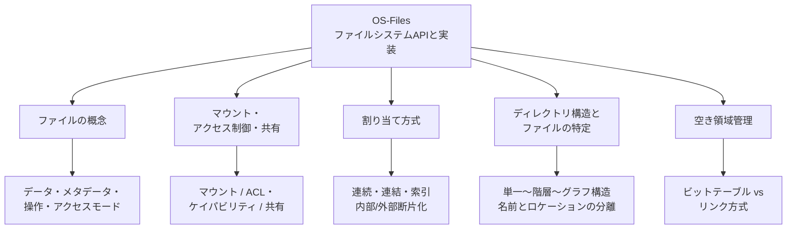

# OS-Files: ファイルシステムAPIと実装

CS2023 / Operating Systems (OS) の Knowledge Unit「**OS-Files**（File Systems API and Implementation）」を整理した学習メモ。[OS-Devices](OS-Devices.md) で見た「揮発性のメモリと違い、電源を切っても消えない」補助記憶を、OS はどう**名前を持つファイルの集合**として見せ、どう物理ブロックへ落とし込むかを扱う。ファイルという抽象の設計判断（概念・アクセス制御・共有）から、実装の中身（割り当て方式・ディレクトリ・空き領域管理）まで、**全体が1ユニットに収まる短い範囲**を一望する。

!!! info "出典・凡例"
    出典: `ComputerScienceCurricula2023.pdf` p.212。
    **CS Core** = 全卒業生必須 / **KA Core** = 当該分野で必須 / **Non-core** = 発展。
    このユニットは **KA Core 2時間**（CS Core の時間割り当てはなし）。ファイルシステムの「概念」と「実装」の両方を、1つの短いユニットで通しで扱う構成になっている。

## 全体像

---

## 1. ファイルの概念——データ・メタデータ・操作・アクセスモード {#file-concept}

**ファイル**とは、補助記憶上に永続化された、**名前を持つデータのまとまり**への抽象。OS はこの抽象を通じて、物理的にどのブロックへ・どう散らばって格納されているかをアプリケーションから隠す（[OS-Purpose](OS-Purpose.md) の抽象化テーマの一例）。

- **データ**: ファイルの中身そのもの。OS にとってはただのバイト列で、構造（テキスト・画像・実行ファイル）を解釈するのはアプリケーション側の責務。
- **メタデータ**: データそのものではなく「データについてのデータ」。サイズ・作成/更新日時・所有者・権限・データブロックへのポインタなど。Unix 系では **inode** と呼ばれる構造にまとめて持つ。ディレクトリエントリ（§4）は「名前 → メタデータ（または inode 番号）」の対応表になる。
- **操作**: `create` / `open` / `read` / `write` / `seek`（読み書き位置の移動） / `close` / `delete` / `truncate` などの基本操作の集合として API が定義される。`open` はファイル記述子（後述 §2 の共有・[OS-Process §5](OS-Process.md#ipc) のケイパビリティ的な性格を思い出すとよい）を返し、以後の操作はそれを介する。
- **アクセスモード**: **順次アクセス**（先頭から順に読み進める。テープ時代からの伝統的モデル）と**ランダムアクセス**（`seek` で任意位置に飛べる。ディスクの物理特性が前提）。モードの選択は §3 の割り当て方式の向き不向きにも直結する。

## 2. マウント・アクセス制御・共有 {#mount-access-sharing}

- **ファイルシステムのマウント**: 個別のファイルシステム（別パーティション・別デバイス・ネットワーク先など）を、既存のディレクトリツリーの**特定の場所（マウントポイント）に接ぎ木**して、利用者からは1本の名前空間に見せる操作。Unix 系は「ルート `/` から辿れる単一のツリー」に統合するのに対し、Windows は `C:\` のようにドライブレターで分けるなど、流儀に幅がある。パーティショニングや mount/unmount の詳細、仮想ファイルシステム (VFS) による「どんなファイルシステム実装でも同じ API で扱えるようにする」仕組みは、この先の [OS-Advanced-Files](OS-Advanced-Files.md) でさらに掘り下げる。
- **ファイルアクセス制御**: 「誰が」「このファイルに」「何をしてよいか」を決める仕組み。[OS-Protection §7](OS-Protection.md#access-control) で見た認可の2つの実装方針が、ファイルにそのまま当てはまる：
  - **ACL 的**: Unix の `rwxr-xr--`（所有者/グループ/その他 × 読み/書き/実行）や、より柔軟な拡張 ACL。権限をファイル（資源）側に持たせる。
  - **ケイパビリティ的**: `open` に成功して得た**ファイル記述子**自体が以後の権限を表す——「持っていること」が権限になる。プロセスに渡されたファイル記述子だけを制限すれば、そのプロセスができることを絞り込める（サンドボックスの基礎）。
- **ファイル共有**: 複数のプロセス・複数のユーザが同じファイルに同時にアクセスできるようにする機能。[OS-Process §5](OS-Process.md#ipc) の IPC（共有メモリ・メッセージパッシング）と対比すると位置づけがはっきりする——**ファイル共有は「永続化された」IPC**とも言える。共有メモリのように高速だが揮発性ではなく、メッセージパッシングのように構造化されているが宛先はプロセスでなく名前空間上の場所。同時書き込みの整合性は**ロック**（advisory：紳士協定的、破っても止まらない／mandatory：OS が強制する）で調整する。

## 3. 基本的な割り当て方式——連続・連結・索引 {#allocation-methods}

ファイルのデータを、補助記憶上の物理ブロックにどう対応づけるか。ここは [OS-Memory §5](OS-Memory.md#allocators) の**アロケータ**の議論と全く同型の問題——対象が「RAM のバイト範囲」から「ディスクのブロック」に変わっただけで、**可変長の要求を有限の物理資源に割り当てる**という本質は変わらない。

| 方式 | 仕組み | 得失 |
|---|---|---|
| **連続割り当て (contiguous)** | ファイルを**連続したブロック範囲**に丸ごと置く | 順次アクセスもランダムアクセスも高速（先頭ブロック番号＋長さだけで済む）。だがファイルが伸びると隣が塞がっており拡張できず、生成・削除の繰り返しで**外部断片化**が進む（[OS-Memory §5](OS-Memory.md#allocators) のフリーリスト方式と同じ悩み） |
| **連結割り当て (linked allocation)** | 各ブロックが**次のブロックへのポインタ**を持ち、鎖のようにつながる | 外部断片化が起きない。空きブロックをどこからでも継ぎ足せる。だが**ランダムアクセスが遅い**（n 番目のブロックを読むには先頭から n 回辿る）うえ、ポインタ分の記憶域を消費し、途中のポインタが壊れると鎖全体が読めなくなる（信頼性の弱さ） |
| **ファイル割り当てテーブル (FAT)** | 連結割り当てのポインタを、各ブロック内ではなく**専用のテーブルに集約**して持つ | ランダムアクセス時もテーブルを引けば次ブロックが分かる（テーブルさえメモリに載れば連結より速い）。テーブル自体は先頭に集中して置くため壊れると被害が大きい |
| **索引割り当て (indexed allocation)** | ファイルごとに**索引ブロック**を持ち、そこにデータブロックへのポインタを集約する（inode の直接/間接ブロックポインタなど） | ランダムアクセスが高速。大きなファイルは多段索引（間接・二重間接ブロック）で対応。索引ブロック自体の記憶域コストがある |

**内部断片化**（ブロック単位で切り出すため、ファイル末尾の端数ブロックに無駄が出る）はどの方式でも起こる。**外部断片化**は連続割り当てで顕著、連結・索引系はほぼ免れる——[OS-Memory §5](OS-Memory.md#allocators) のフリーリスト vs スラブ/サイズクラスの得失構造がそのまま「連続割り当て vs 連結・索引割り当て」に対応している。

!!! note "性能と柔軟性のトレードオフ（学習成果2の核心）"
    連続割り当ては「速いが硬直的」、連結割り当ては「柔軟だが遅い」、索引割り当てはその折衷——ランダムアクセス性能を保ちながら断片化にも強い、現代のファイルシステムの主流。どの方式も**アクセスパターン（順次 vs ランダム）とファイルサイズの分布**次第で向き不向きが変わる、という一般則は §1 のアクセスモードの話と地続き。

## 4. ディレクトリ構造とファイルの特定 {#directory-structures}

**ディレクトリ**とは、ファイル名からそのファイルの位置（またはメタデータの在り処）への対応を持つ、それ自体も特殊なファイル（内容はエントリの一覧で、格納には §3 の割り当て方式がそのまま使われる）。

- **単一レベル (single-level)**: 全ファイルが1つのディレクトリに並ぶ。単純だが名前の衝突が避けられない。
- **2レベル (two-level)**: ユーザごとに専用ディレクトリを分ける。衝突は減るが、ユーザ間の共有がしづらい。
- **木構造 (tree-structured)**: ディレクトリの中にディレクトリを持てる階層構造。今日ほとんどの OS の標準形。
- **非巡回グラフ (acyclic graph)**: 同じファイル（や部分木）を複数の場所から指せる**リンク**（ハードリンク・シンボリックリンク）を許す。共有はできるが、循環参照が起きない範囲に限る。
- **一般グラフ**: リンクに循環まで許すと、参照カウントだけでは回収できないゴミ（誰からも辿れないのに循環参照で残る）が生じ、ガベージコレクションのような仕組みが要る——単純な参照カウント解放の限界。

「ファイルを一意に特定する手段」として、**名前**（人間向け、パス経由でディレクトリを辿って解決）と、**識別子・メタデータの格納場所**（inode 番号など、OS 内部での実体特定）の**2層構造**になっているのがポイント。ハードリンクは「同じ inode を指す複数の名前」を許すことで、名前と実体を分離した設計の恩恵をそのまま体現している。

## 5. 空き領域管理——bit table vs リンク方式 {#free-space-management}

割り当て（§3）の裏側で、「今どのブロックが空いているか」を追跡する必要がある。

| 方式 | 仕組み | 得失 |
|---|---|---|
| **ビットテーブル（ビットベクトル）** | 全ブロックに対応する**1ビットずつ**のビット列を持ち、空き/使用中を表す | 連続した空き領域（§3 の連続割り当てに必要）を**ビット列の走査で見つけやすい**。ただしテーブル自体のサイズがディスク容量に比例し、メモリに載らないほど大きいディスクでは扱いが重くなる |
| **リンク方式（空きブロックの連結リスト）** | 空きブロック同士を**連結割り当てと同じ要領で**鎖につなぐ | 専用テーブルが要らず、空間効率がよい。だが空きブロックへの**ランダムアクセスができず**、連続した空き領域を探すのが原理的に難しい（鎖を辿るしかない） |

- どちらを選ぶかは、**割り当て方式（§3）で何を優先したか**と表裏一体——連続割り当てを多用するなら連続した空き範囲を素早く見つけたく、ビットテーブルが有利。連結・索引割り当て中心なら、空きブロックの取得は「1個くれればよい」ので、リンク方式でも困りにくい。
- グループ化（空きブロック番号をまとめて記録する）やカウント方式（連続する空きブロックの先頭と個数を記録する）など、両者の折衷的な工夫も実用されている。
- ここでも [OS-Memory §5](OS-Memory.md#allocators) のフリーリストと発想は同じ——「空き資源をどう記録すれば、次に割り当てるときのコストと断片化を抑えられるか」という**アロケータ設計の一般問題**が、対象をメモリページからディスクブロックに変えて再登場している。

---

## 学習成果（Illustrative Learning Outcomes）

KA Core:

1. ファイルシステムを設計する際に**下すべき選択肢**を説明できる（ファイルの概念とアクセスモード、マウント・アクセス制御・共有の方針、割り当て方式、ディレクトリ構造、空き領域管理——本ページ §1–§5 のそれぞれが1つの設計判断に対応する）。
2. ファイル編成への**異なるアプローチを評価**し、それぞれの強み・弱みを認識できる（§3 の連続・連結・索引割り当ての比較、§5 のビットテーブル vs リンク方式の比較が該当）。
3. ファイルシステムの実装に関する知識を踏まえて、**適切なソフトウェア構成を適用**できる（例：ランダムアクセスが多いワークロードには索引割り当てが向くファイルシステムを選ぶ、大量の小ファイルにはビットテーブルより走査コストの低い管理方式を選ぶ、といった判断）。

!!! tip "学習成果2–3の練習法"
    手元の環境で `df -T` や `mount` の出力を眺め、実際に使われているファイルシステム（ext4, APFS, NTFS など）が§3–§5のどの方式に近いかを調べてみる。多くの現代的ファイルシステムは索引割り当て＋ビットマップ系の空き領域管理を採用している——「なぜランダムアクセスが遅い連結割り当てが主流でないのか」を、§3 の表と結びつけて説明できるかが理解の目安になる。

## 前後のユニット

- 前: [OS-Devices](OS-Devices.md) — デバイス管理
- 次: [OS-Advanced-Files](OS-Advanced-Files.md) — 発展的なファイルシステム

疑問が出たら [OS-Files Q&A](OS-Files-QA.md) に記録する。
