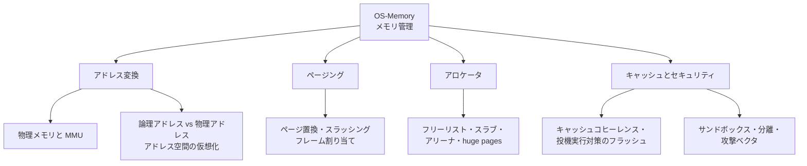

# OS-Memory: メモリ管理

CS2023 / Operating Systems (OS) の Knowledge Unit「**OS-Memory**（Memory Management）」を整理した学習メモ。[OS-Process](OS-Process.md) で「各プロセスは自分のアドレス空間を持つ」と述べた——**その幻想を物理メモリの上にどう実装するか**が本ユニット。アドレス変換・ページング・アロケータ・そしてメモリを介した攻撃と防御までを扱う。

!!! info "出典・凡例"
    出典: `ComputerScienceCurricula2023.pdf` pp.210–211。
    **CS Core** = 全卒業生必須 / **KA Core** = 当該分野で必須 / **Non-core** = 発展。
    このユニットは **KA Core 0.5時間（＋1.5時間は AR 側で計上）**。`See also: AR-Memory` の参照が多く、内容の半分以上は**アーキテクチャ（AR）と共有**——ハードウェア（MMU・キャッシュ）と OS の共同作業を扱うため。

## 全体像



---

## 1. 物理メモリ・アドレス変換・MMU {#address-translation}

- 物理メモリ（RAM）は単なる「番地つきバイト列」。これをプロセスごとの独立空間に見せる主役が **MMU (Memory Management Unit)**：CPU が発行する全アドレスを**実行時に**変換するハードウェア（`See also: AR-Memory`）。
- OS の仕事は**変換表（ページテーブル）を用意する**こと、MMU の仕事は**それを毎アクセス高速に引く**こと——ポリシー（どこに置くか）とメカニズム（どう変換するか）の分担（→ [OS-Protection §5](OS-Protection.md#policy-mechanism)）。
- 変換表を毎回メモリから引くと遅すぎるので、MMU は変換結果を **TLB** (Translation Lookaside Buffer) にキャッシュする。

!!! note "ページテーブル・PTE・TLB——電話帳の比喩"
    **ページテーブル**＝分厚い電話帳そのもの（本棚にあり、探すのに時間がかかる）。**PTE（ページテーブルエントリ）**＝電話帳の中の1行（「このページ→このフレーム」という1件のレコード）。**TLB**＝電話のそばに置いてある「よくかける番号」のメモ用紙——毎回分厚い電話帳をめくらなくても、直近よく使う番号はこのメモで即座にわかる。

    ```mermaid
    graph TD
      CPU[CPU がアドレス変換を要求]
      CPU --> TLB{"TLB<br/>(電話のそばのメモ用紙)"}
      TLB -->|ヒット: メモにあった| FAST[数サイクルで解決]
      TLB -->|ミス: メモになかった| BOOK["ページテーブル<br/>(分厚い電話帳を本棚から引く)"]
      BOOK --> SLOW[数百サイクルかけて解決]
      SLOW -.結果をメモに追記.-> TLB
    ```

## 2. メモリ階層とキャッシュの OS への影響 {#memory-hierarchy}

レジスタ → L1/L2/L3 キャッシュ → 主記憶 → 補助記憶の**メモリ階層**（速いほど小さく高価。`See also: AR-Memory, SF-Performance`）は、OS の機構と方針の両方に効いてくる：

- **キャッシュの基本**: 直近使ったデータ（時間的局所性）とその近所（空間的局所性）をキャッシュラインに保持し、**ルックアップ**はアドレスの一部でセットを選んでタグ比較する。ヒットすれば数サイクル、ミスすれば数百サイクル。
- **per-CPU キャッシュ**: 各コアが自分の L1/L2 を持つため、タスクをコア間で移すとキャッシュが冷える → スケジューラの**親和性** ([OS-Scheduling §3](OS-Scheduling.md#smp-cache)) の根拠。OS 自身も per-CPU データ構造（コアごとの ready キューやアロケータのキャッシュ）を持って共有と競合を避ける。
- コンテキストスイッチのコストの実体も、レジスタ退避そのものより**キャッシュ・TLB が冷えること**が大きい（→ [OS-Principles §9](OS-Principles.md#context-switch-cost)）。

## 3. 論理アドレスと物理アドレス——アドレス空間の仮想化 {#address-space}

- プロセスが見るのは**論理（仮想）アドレス**、RAM 上の実在の番地が**物理アドレス**。全プロセスが「自分は番地 0 から始まる広大な空間を持つ」と思っている（`See also: AR-Memory, MSF-Discrete`）。
- この間接層が一気に多くを可能にする：**分離**（他人のページへの変換が存在しない＝物理的に触れない）、**再配置**（物理のどこに置いてもよい）、**共有**（同じ物理ページを複数空間に割り付け——共有ライブラリ・共有メモリ IPC、→ [OS-Process §3,5](OS-Process.md#loading-linking)）、**見かけ以上のメモリ**（§4）。
- 「少数の物理資源から多数の仮想資源を作る」——OS の仮想化テーマ（[OS-Purpose](OS-Purpose.md)）の最重要例。

## 4. ページング・ページ置換・スラッシング {#paging}

**ページング**: 仮想空間を固定長の**ページ**（典型 4KiB）、物理メモリを同サイズの**フレーム**に切り、ページテーブルでページ→フレームを対応づける。固定長なので外部断片化が出ない。

!!! note "ページとフレーム——引っ越しの比喩"
    荷物は全部「同じサイズの段ボール箱」に詰めるとする。この箱1つが**ページ**（プロセスが「自分の荷物はここにある」と思っている単位）。新居側には、その箱がぴったり収まる「同じサイズの棚のマス目」が並んでいる。このマス目1つが**フレーム**（物理メモリ上の実際の置き場所）。箱とマス目の対応表が**ページテーブル**——プロセスから見れば連番の箱（ページ0, 1, 2, ...）に見えるが、実際のマス目（フレーム）はメモリのあちこちに散らばっていてよい。

    ```mermaid
    graph LR
      subgraph "プロセスの視点(ページ = 段ボール箱)"
        P0[箱0]
        P1[箱1]
        P2[箱2]
      end
      subgraph "ページテーブル(対応表)"
        T["箱0→マス5<br/>箱1→マス1<br/>箱2→マス8"]
      end
      subgraph "物理メモリの視点(フレーム = 棚のマス目)"
        F1[マス1]
        F5[マス5]
        F8[マス8]
      end
      P0 -.-> T
      P1 -.-> T
      P2 -.-> T
      T --> F5
      T --> F1
      T --> F8
    ```

- **デマンドページング**: ページは**触られたときに初めて**割り当て・読み込みする。存在しないページへのアクセスは**ページフォルト**（例外 → [OS-Principles §6](OS-Principles.md#interrupts)）となり、OS が処理して再実行する。
- **ページ置換**: 空きフレームが尽きたら誰かを追い出す。**FIFO**（単純だが古参が重要でも追い出す）、**LRU**（最近使っていないものを追い出す。理想に近いが厳密な実装は高価）、**クロック**（参照ビットで LRU を近似。実用の定番）。
- **フレーム割り当て**: 各プロセスに何フレーム与えるか。少なすぎるとそのプロセスがフォルトを連発する。
- **スラッシング (thrashing)**: 全体のフレームが足りず、**ページ入れ替えばかりで仕事が進まない**状態。実行に「いま必要なページ集合」（ワーキングセット）がメモリに収まらないのが原因で、対策は多重度を下げる（→ [OS-Scheduling](OS-Scheduling.md) の中期スケジューラ）かメモリを増やすしかない。

!!! note "スラッシング——小さな机でパズルを組む比喩"
    小さな作業机（＝フレームの総数）の上で、大きなパズルを何個も同時に組み立てようとしている状況を想像する。机に載せられるピースは限られているので、パズルAのピースを置くたびに、パズルBのピースを棚（ディスク）にしまわないといけない。次にパズルBに手を伸ばすと、今度はパズルAのピースをしまう羽目に——**ピースの出し入れ（＝ページイン/アウト）だけで時間が過ぎ、どのパズルも完成に近づかない**。

    ```mermaid
    sequenceDiagram
        participant 机 as 作業机(限られたフレーム)
        participant A as パズルA(プロセスA)
        participant B as パズルB(プロセスB)

        A->>机: ピースを置きたい
        机->>B: 場所がないのでBのピースを棚(ディスク)へ退避
        B->>机: ピースを置きたい
        机->>A: 場所がないのでAのピースを棚(ディスク)へ退避
        Note over A,B: 出し入れの繰り返しだけで時間が過ぎ、どちらも完成しない
    ```

## 5. アロケータ——確保・解放・格納の技法 {#allocators}

カーネル・ライブラリ（`malloc`）双方で使われる、可変長確保の技法。**性能と柔軟性（断片化耐性）のトレードオフ**：

| 技法 | 仕組み | 得失 |
|---|---|---|
| **フリーリスト** | 空き塊を連結リストで管理し、first-fit / best-fit で探す | 汎用だが探索コストと**断片化**が課題 |
| **サイズクラス** | よく使うサイズ別に空きリストを分けておく | 探索が O(1) に。クラス内の余りは内部断片化 |
| **スラブアロケータ** | 同一型のオブジェクト専用のスラブ（ページ群）を用意し、初期化済みで使い回す | カーネルで定番（PCB や inode など同型が大量の場面）。速く断片化しにくい |
| **アリーナ** | まとめて確保して**まとめて解放**する領域を作る | 個別解放を放棄する代わりに超高速・リーク知らず（リクエスト単位の処理などに） |
| **huge pages** | 4KiB でなく 2MiB/1GiB の大ページを使う | ページテーブルと **TLB のエントリ数を節約**。大メモリの DB 等で効く。無駄（内部断片化）は増える |

## 6. キャッシュコヒーレンスと投機実行脆弱性対策のフラッシュ {#cache-speculative}

- **キャッシュコヒーレンス**: 各コアのキャッシュ間の一貫性はハードウェアが保つが、タダではない——コア間で同じキャッシュラインを取り合うと遅くなる（`See also: AR-Organization, AR-Memory, SF-Performance`）。OS が per-CPU データ構造を好む理由（§2）。
- **投機実行の脆弱性** (Meltdown/Spectre, → [OS-Protection §3](OS-Protection.md#real-vulnerabilities)): 投機的に実行された（本来届かないはずの）アクセスの痕跡が**キャッシュに残り**、タイミング測定で読み取れる。
- 緩和策はカーネル／ユーザの分離を強めること：**KPTI**（カーネル空間をユーザのページテーブルからほぼ外す）や、切替時の**キャッシュ・分岐予測のフラッシュ**。いずれもコンテキストスイッチとシステムコールを**恒常的に高コスト化**した——セキュリティと性能のトレードオフ（[OS-Purpose §4](OS-Purpose.md#design-issues)）が全ユーザに課された実例。

## 7. メモリ管理のセキュリティ——サンドボックス・保護・分離 {#memory-security}

メモリ管理はセキュリティ機構の土台でもある（`See also: SEC-Foundations`）：

- **保護ビット**: ページ単位の読/書/実行 (r/w/x) 権限。**NX**（データページを実行不可に）はコード注入攻撃を止める。テキスト領域は読み取り専用に。
- **分離とサンドボックス**: アドレス空間分離を最大限使い、疑わしいコードを権限を絞ったプロセスに閉じ込める（ブラウザが各タブを別プロセスにするのはこれ）。
- **攻撃ベクタ**: バッファオーバーフロー（スタックの戻りアドレス上書き）、use-after-free（解放済みメモリの再利用を突く）など、**メモリ安全性のバグ**が侵入口になる。**ASLR**（配置のランダム化）は攻撃に必要な番地を当てにくくする緩和策。多層防御（→ [OS-Protection §4](OS-Protection.md#mitigations)）の主要な層がメモリ管理に実装されている。

## 8. (Non-core) 仮想メモリ——VM ハードウェアの活用 {#virtual-memory-services}

ページフォルトと変換表は「足りないメモリの補填」以外にも使える万能フックである：

- **スワップ**: 使われていないページを補助記憶に追い出し、物理メモリ以上の空間を見せる。
- **コピーオンライト (COW)**: fork 時にページを共有し、**書いた瞬間だけ**複製する。fork を高速・省メモリにする（Dirty COW はこの機構のバグだった）。

    !!! note "COW と Dirty COW——共有ノートの比喩"
        兄弟で1冊のノート（＝物理フレーム）を共有しているとする。2人とも読むだけなら1冊で十分。だが片方が書き込もうとした**その瞬間だけ**、コピー機が動いて「あなた専用の1冊」が作られる——これが COW の仕組み。**Dirty COW**（2016, Linux, → [OS-Protection §3](OS-Protection.md#real-vulnerabilities)）は、このコピー機が動く**タイミングにスキ（競合状態）**があり、コピー先ではなく元のノート（本来は読み取り専用のはずのファイル）に直接書き込めてしまったバグ。

        ```mermaid
        sequenceDiagram
            participant 兄 as 兄(プロセスA)
            participant ノート as 共有ノート(物理フレーム)
            participant コピー機 as コピー機(COW機構)

            兄->>ノート: 読むだけなら共有でOK
            兄->>コピー機: 書き込みたい→権限チェックOK
            Note over コピー機: 本来はここで専用コピーを作ってから書くはず
            Note over コピー機: だがタイミングのスキ(競合状態)を突かれると…
            コピー機-->>ノート: コピー完成前に元のノートへ直接書き込めてしまう
            Note over ノート: 本来読み取り専用のはずのファイルが書き換わる(Dirty COW)
        ```
- **メモリマップトファイル (mmap)**: ファイルをアドレス空間に割り付け、read/write の代わりにメモリアクセスで読み書きする。
- デマンドページングによる**遅延ロード**、変更ページだけ書き戻す**ダーティトラッキング**など——「アクセスを検知して介入できる」ことが OS サービスの効率化に広く効く（学習成果6）。

---

## 学習成果（Illustrative Learning Outcomes）

KA Core:

1. **メモリ階層**とコスト・性能のトレードオフを説明できる。
2. キャッシングとページングに適用される**仮想メモリの原理を要約**できる。
3. メモリサイズ（主記憶・キャッシュ・補助記憶）と**プロセッサ速度のトレードオフを評価**できる。
4. **キャッシュメモリの理由と使い方**（性能と近接性、キャッシュが分離や仮想マシン抽象を複雑にすること）を説明できる。
5. **ページ置換とフレーム割り当てが性能に与える影響**を考慮した効率的なプログラムを書ける。

Non-core:

6. **効率的な仮想化のためにハードウェアがどう使われるか**を説明できる。

!!! tip "学習成果5の練習法"
    大きな2次元配列を「行順」と「列順」でなめて時間を比べる（キャッシュラインの空間的局所性）。次に、実メモリより大きなデータを触って `vmstat` や Activity Monitor でページイン／アウトを観察する。局所性の良し悪しがページフォルト数と実行時間にそのまま出ることが体感できる。

## 前後のユニット

- 前: [OS-Process](OS-Process.md) — プロセスモデル
- 次: [OS-Devices](OS-Devices.md) — デバイス管理

疑問が出たら [OS-Memory Q&A](OS-Memory-QA.md) に記録する。
