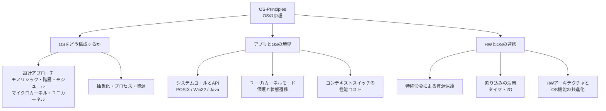
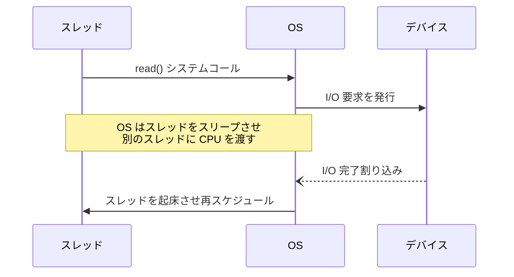
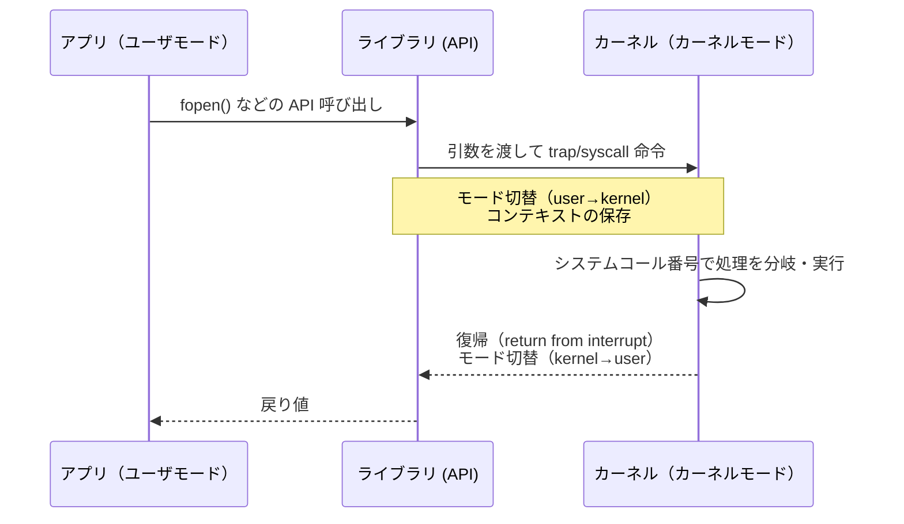

# OS-Principles: OSの原理

CS2023 / Operating Systems (OS) の2つ目の Knowledge Unit「**OS-Principles**（Principles of Operating System）」を整理した学習メモ。[OS-Purpose](OS-Purpose.md) で見た「仲介者としての OS」を**どういう仕組みで実現するか**——カーネルの設計アプローチ・システムコール・カーネル/ユーザモード・割り込み——を扱う。

!!! info "出典・凡例"
    出典: `ComputerScienceCurricula2023.pdf` pp.207–208。
    **CS Core** = 全卒業生必須 / **KA Core** = 当該分野で必須 / **Non-core** = 発展。
    このユニットは **CS Core 2時間**。全項目が CS Core。`See also: AR-Assembly` の参照が多く、**ハードウェア（アーキテクチャ）との接点**が主役のユニット。

## 全体像

---

## 1. OS ソフトウェアの設計アプローチ {#design-approaches}

カーネル（OS の中核）をどう構成するかの代表的アプローチ：

| アプローチ | 構成 | 長所 | 短所 | 例 |
|---|---|---|---|---|
| **モノリシック (monolithic)** | 全 OS 機能を1つの大きなカーネルに詰める | 高速（内部呼び出しは関数呼び出し） | 巨大・1つのバグが全体を壊しうる | 伝統的 UNIX、Linux |
| **階層型 (layered)** | 機能を層に分け、各層は直下の層だけを使う | 設計・検証がしやすい | 層の通過コスト、層の切り方が難しい | THE システム |
| **モジュール型 (modular)** | コア＋動的にロード可能なモジュール | 拡張性と性能の折衷 | モジュールはカーネル空間で動く（故障分離は弱い） | Linux カーネルモジュール |
| **マイクロカーネル (microkernel)** | 最小機能（IPC・スケジューリング等）だけカーネルに残し、他はユーザ空間のサーバへ | 堅牢・保守しやすい（サーバの故障が全体を壊さない） | IPC のオーバーヘッド | Mach、MINIX、seL4 |
| **ユニカーネル (unikernel)** | 1つのアプリ＋必要な OS 機能だけを単一イメージにリンク | 極小・高速起動・攻撃面が小さい | 汎用性がない（単一アプリ専用） | MirageOS |

!!! note "学習成果1との対応"
    設計アプローチの選択は OS の**堅牢性 (robustness) と保守性 (maintainability)** に直結する。モノリシック→マイクロカーネルの軸は「性能」と「故障分離・保守性」のトレードオフ（→ [OS-Purpose §4](OS-Purpose.md#design-issues) の設計課題の具体化）。

## 2. 抽象化・プロセス・資源 {#abstractions}

OS の仕事は **物理資源（resources）** を **抽象（abstractions）** に変換して見せること。

| 物理資源 | OS が見せる抽象 |
|---|---|
| CPU（有限個） | **プロセス／スレッド**（それぞれが CPU を独占しているかのような錯覚） |
| 物理メモリ | **仮想アドレス空間**（連続で広大な自分専用メモリの錯覚） |
| ディスク・デバイス | **ファイル／ストリーム**（統一的な読み書きインタフェース） |

**プロセス**は「実行中のプログラム」の抽象であり、OS が資源を割り当て・保護する単位。

## 3. システムコールと API {#system-calls}

**システムコール (system call)** は、アプリケーションが OS のサービスを要求する唯一の正規の入口。

- アプリが直接システムコールを書くことは少なく、**API 経由**で使う。例：**POSIX**（UNIX系）、**Win32**（Windows）、**Java API**（JVM がさらに抽象化）。
- API はシステムコールを包む**ライブラリ関数**を提供し、移植性を与える（同じ `fopen` が OS ごとに違うシステムコールに翻訳される）。
- `See also: AR-Assembly` — 呼び出しの実体は特殊な機械命令（trap / syscall 命令）。

## 4. ハードウェアと OS 機能の共進化 {#hw-os-evolution}

ハードウェアアーキテクチャと OS 機能の結びつきは**歴史的に共進化**してきた。

- HW がモード切替（特権レベル）を提供 → OS が保護を実装できるように。
- HW が MMU（アドレス変換）を提供 → OS が仮想記憶を実装。
- HW が割り込み・タイマを提供 → OS がマルチプログラミング・タイムシェアリングを実装。
- 逆方向もある：OS 側の要求（仮想化・セキュリティ）が HW 拡張（仮想化支援命令、NX ビット等）を生む。

## 5. 資源の保護 = 特定の機械命令/機能の保護 {#protection}

資源を守るとは、突き詰めれば **一部の機械命令・機能を勝手に実行できなくする**こと（`See also: AR-Assembly`）。

CS2023 の例：

- アプリケーションは**任意のメモリ番地やファイルストレージデバイスのアドレス**へ勝手にアクセスできない（アドレス変換・保護ビットで遮断）。
- **コプロセッサやネットワークデバイスの保護**（デバイスへの直接命令発行はカーネルだけが行う）。

## 6. 割り込み（interrupts）の活用 {#interrupts}

ハードウェアレベルの**割り込み**を、OS はサービスルーチン（interrupt service routine）で受けて活用する（`See also: AR-Assembly`）。

CS2023 の例：

- **タイマ割り込み** → **タイムスライス**の実装。一定時間ごとに CPU を OS に戻させ、プロセスを強制的に切り替えられる（プリエンプション）。
- **I/O 割り込み** → **ポーリングせずに**ブロック中のスレッドを眠らせておける。I/O 完了時にデバイスが割り込みで知らせてくるので、CPU は待ち時間を他の仕事に使える。

*ポーリング（完了したか CPU で何度も確認する）との対比が、KA 序文の言う「多くの層で再利用される横断的テーマ」の代表例。*

## 7. ユーザ状態／システム状態と保護 {#user-kernel-mode}

CPU には少なくとも2つの動作モードがある：

- **ユーザモード（user mode）**: アプリケーションが動く。特権命令は実行できない。
- **カーネルモード（kernel/system mode）**: OS が動く。全命令・全資源にアクセスできる。

ユーザモードのコードがカーネルモードへ移る正規の手段が**システムコール**（→ §3）。この**モード分離**が §5 の保護を支えるメカニズム（`See also: AR-Assembly`）。

## 8. システムコール呼び出しの機構 {#syscall-mechanism}

システムコール1回の流れ（`See also: AR-Assembly`）：

押さえるポイント：

1. **引数の渡し方**（レジスタ・スタック・メモリブロック）
2. **モード切替**とそれに伴う**コンテキスト切替**
3. **割り込みからの復帰**（return from interrupt）で元のユーザコードに戻る

## 9. コンテキストスイッチの性能コスト {#context-switch-cost}

- モード切替・プロセス切替は**タダではない**：レジスタ退避/復元、TLB・キャッシュの効きの悪化。
- 特に **Spectre 緩和が入った環境**では、プロセス切替時に**キャッシュ（分岐予測などの状態）のフラッシュ**が追加され、コストがさらに増す。
- → [OS-Purpose §4](OS-Purpose.md#design-issues)・[§6f](OS-Purpose.md#security-protection) の「セキュリティ vs 性能」トレードオフの具体例。

---

## 学習成果（Illustrative Learning Outcomes）

CS Core:

1. ソフトウェア設計アプローチ（階層型・モジュール型など）の適用が OS の**堅牢性と保守性**にどう影響するかを理解する。
2. システムコールを**目的別に分類**できる（例：プロセス制御・ファイル操作・デバイス操作・情報保守・通信・保護）。
3. システムコール呼び出しの**動的な流れ**（引数渡し・モード変更）を理解する。
4. ある機能が**アプリケーション層で実装できるか、システムコールでしか実現できないか**を評価できる。
5. **分離・保護・スループット**のための OS 技法を OS 内外の機能に適用できる（例：プロセススケジューリング・ディスク要求スケジューリング・セマフォに共通する**飢餓（starvation）**の類似性）。
6. **カーネル/ユーザモードの分離**が安全性と性能に与える影響を理解する。
7. マルチプログラミングを可能にする**割り込み処理の利点・欠点**を理解する。
8. **OS を経由した攻撃ベクタ**と、それを防ぐために設計されたセキュリティ機能を分析できる。

!!! tip "学習成果4の考え方"
    「その機能は特権（§5 の保護された命令・資源）を必要とするか？」が判定基準。必要ならシステムコール（カーネル）でしか実現できず、不要ならアプリケーション層（ライブラリ）で実装できる。例：文字列整形はユーザ層で足りるが、物理デバイスへの I/O 発行はカーネルにしかできない。

## 前後のユニット

- 前: [OS-Purpose](OS-Purpose.md) — OS の役割と目的
- 次: OS-Concurrency — 並行性（スレッド・競合状態・デッドロック）

疑問が出たら [OS-Principles Q&A](OS-Principles-QA.md) に記録する。
