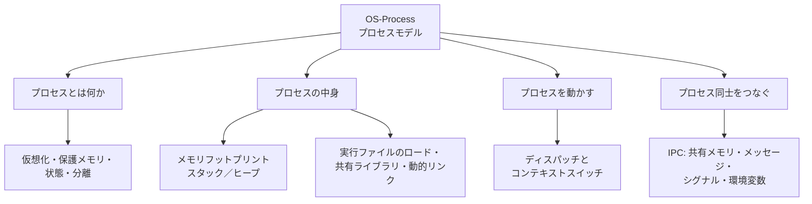
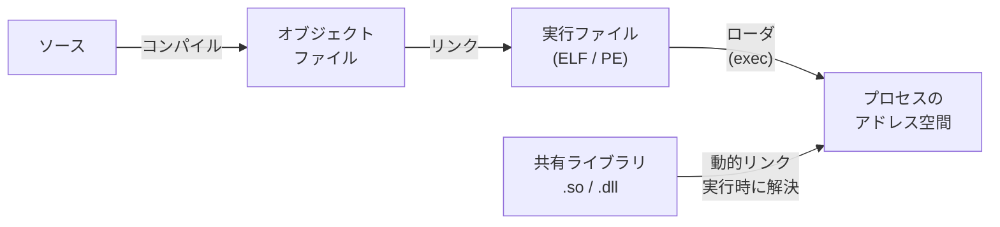

# OS-Process: プロセスモデル

CS2023 / Operating Systems (OS) の Knowledge Unit「**OS-Process**（Process Model）」を整理した学習メモ。[OS-Concurrency §5](OS-Concurrency.md#process-vs-thread) で導入したプロセス／スレッドを、**「プログラムがどうやって動く実体になり、どう管理されるか」**という観点で掘り下げる。実行ファイルのロードからコンテキストスイッチ、プロセス間通信までを扱う。

!!! info "出典・凡例"
    出典: `ComputerScienceCurricula2023.pdf` p.210。
    **CS Core** = 全卒業生必須 / **KA Core** = 当該分野で必須 / **Non-core** = 発展。
    このユニットは **KA Core 2時間**（CS Core の時間割り当てはなし）。`See also: AR-Assembly`（機械語レベル）と `FPL-Translation`（翻訳系）への参照があり、**コンパイラ・アーキテクチャと OS の合流点**。

## 全体像



---

## 1. プロセスとスレッド——仮想化としてのプロセス {#process-as-virtualization}

**プロセス = 実行中のプログラム**。OS はプロセスごとに「自分だけが計算機を使っている」ような幻想を与える（→ [OS-Purpose](OS-Purpose.md) の仮想化テーマ）：

- **保護メモリ・メモリ分離**: 各プロセスは自分の**アドレス空間**を持ち、他プロセスのメモリは見えない（実施機構は → [OS-Memory](OS-Memory.md)）。
- **プロセス状態 (process state)**: 実体は常に走っているわけではない。**生成 → ready ⇄ running → 待機 (waiting) → 終了** の状態を遷移する（[OS-Concurrency](OS-Concurrency.md) のスレッド状態遷移と同型）。
- **スレッド**はプロセス内の実行流：アドレス空間を**共有**し、スタックとレジスタだけ個別に持つ。「分離の単位 = プロセス、実行の単位 = スレッド」。

!!! note "タスク管理のデータ構造（学習成果3）"
    OS はプロセスごとに **PCB (Process Control Block)** を持つ：PID・状態・保存レジスタ・アドレス空間情報（ページテーブルへのポインタ）・開いているファイル・優先度など。多数のタスクは**状態別のキュー**（ready キュー、デバイスごとの待ちキュー）に PCB をつないで管理する。[OS-Scheduling](OS-Scheduling.md) の ready キューはその1つ。

    **PCB＝病院のカルテの比喩**: 看護師（CPU）が患者A（プロセスA）の対応を中断して患者B（プロセスB）に切り替えるとき、患者Aの**カルテ**（バイタル・現在の処置状況・病室番号など）を棚に戻し、患者Bのカルテを取り出す。カルテがあるからこそ、後で患者Aに戻ったときに「どこまで進んでいたか」を寸分違わず再開できる——PCBはこの「カルテ」に相当する。

    ```mermaid
    sequenceDiagram
        participant 看護師 as 看護師(CPU)
        participant 棚 as カルテ棚(メモリ上のPCB群)
        participant A as 患者A(プロセスA)
        participant B as 患者B(プロセスB)

        看護師->>A: 対応中(running)
        Note over 看護師,A: コンテキストスイッチの契機(割り込み)
        看護師->>棚: 患者Aのカルテ(レジスタ・PC・ページテーブル情報)を保存
        棚->>看護師: 患者Bのカルテを取り出す
        看護師->>B: 対応再開(running)
        Note over B: カルテのおかげで寸分違わず再開できる
    ```

## 2. メモリフットプリント——スタックとヒープ {#memory-layout}

プロセスのアドレス空間は用途別の領域（セグメント）に分かれる（`See also: AR-Assembly`）：

| 領域 | 中身 | 伸びる方向・寿命 |
|---|---|---|
| **テキスト** | 機械語コード（読み取り専用・共有可） | 固定 |
| **データ / BSS** | 初期化済み／未初期化のグローバル変数 | 固定 |
| **ヒープ** | `malloc` / `new` による動的確保 | 上へ伸びる。明示的に解放するまで生きる |
| **スタック** | 関数呼び出しフレーム（ローカル変数・戻りアドレス） | 下へ伸びる。関数リターンで自動解放 |

- スレッドは**スタックだけ各自**持ち、他は共有——スレッド間のデータ共有が「速いが危険」（→ [OS-Concurrency §2](OS-Concurrency.md)）な理由がこの図で分かる。
- 確保方式の得失（学習成果4）：**スタック**は確保・解放がポインタ移動だけで超高速だが寿命が関数スコープに縛られる。**ヒープ**は寿命が自由だが、確保コストと**断片化**・解放忘れ（リーク）の問題を持つ（アロケータの内部は → [OS-Memory §5](OS-Memory.md#allocators)）。

## 3. 実行ファイルの生成・ロードと動的リンク {#loading-linking}

「ソースコードがプロセスになるまで」（`See also: FPL-Translation`）：



- **静的リンク**: ライブラリのコードを実行ファイルに**埋め込む**。単体で動くが、ファイルが大きく、ライブラリ更新には再リンクが要る。
- **動的リンク**: 実行時（ロード時）に**共有ライブラリ** (`libc.so` など) を割り付けて参照を解決する。同じライブラリの**テキスト領域を全プロセスで物理的に共有**できるためメモリ効率がよく、ライブラリだけ更新できる（セキュリティパッチ！）。代償として起動時の解決コストと「入れ替わり」のリスク。
- Unix では **fork**（自分の複製を作る）と **exec**（自分のアドレス空間を新しい実行ファイルで置き換える）の組み合わせで新プログラムを起動する。

## 4. ディスパッチとコンテキストスイッチ {#dispatch-context-switch}

- **ディスパッチ**: スケジューラが選んだ（→ [OS-Scheduling](OS-Scheduling.md)）タスクに実際に CPU を渡す動作。
- **コンテキストスイッチ**の手順: 走行中タスクのレジスタ・PC を PCB に**保存** → 次タスクの PCB から**復元** →（プロセスが変わるなら）アドレス空間を切り替え → ユーザモードへ復帰（`See also: AR-Assembly`）。
- 割り込み（タイマ・I/O 完了）がスイッチの契機になる——割り込み・モード遷移・切替コストの仕組みは [OS-Principles §6–9](OS-Principles.md#interrupts) で既出。**同一プロセス内のスレッド切替**はアドレス空間の切り替えが不要なぶん軽い（プロセス vs スレッドの得失、→ [OS-Concurrency §5](OS-Concurrency.md#process-vs-thread)）。

## 5. プロセス間通信 (IPC) {#ipc}

分離されたプロセス同士が協調するための穴を、OS が**管理された形で**開ける（`See also: PDC-Communication`）：

| 機構 | 仕組み | 向く用途・特徴 |
|---|---|---|
| **共有メモリ** | 同じ物理ページを複数プロセスの空間に割り付け | **最速**（コピー不要）。ただし同期は自前（→ [OS-Concurrency §4](OS-Concurrency.md)） |
| **メッセージパッシング**（パイプ・ソケット・メッセージキュー） | カーネル経由で送受信（コピーあり） | 同期が仕組みに内蔵され安全。ネットワーク越しにも自然に拡張（ソケット） |
| **シグナル** | 非同期にイベントを通知（`SIGINT`, `SIGKILL` など） | 「通知」専用。データはほぼ運べない。割り込みのユーザ空間版 |
| **環境変数** | 親から子へ、**起動時に一方向**で渡る文字列表 | 設定の受け渡し。実行中の通信には使えない |

!!! tip "使い分け（学習成果5）"
    「大量データを高頻度でやりとり」→ 共有メモリ＋同期プリミティブ。「構造化された要求／応答」→ パイプ・ソケット。「止めろ・終われの合図だけ」→ シグナル。「子プロセスへの初期設定」→ 環境変数・コマンドライン引数。**データ量 × 頻度 × 方向 × 同期の要否**で選ぶ。

---

## 学習成果（Illustrative Learning Outcomes）

KA Core:

1. プロセスとスレッドが並行性の機能を使って**制御流を仮想化**する仕組みを理解している。
2. 並行性と仮想化を支えるために**割り込み・ディスパッチ・コンテキストスイッチ**を使う理由を理解している。
3. タスクが通る**状態遷移**と、多数のタスク管理に必要な**データ構造**（PCB・キュー）を理解している。
4. タスクへの**メモリ割り当て方式**（スタック／ヒープ等）の得失を挙げて理解している。
5. 目的に応じた**適切な IPC 機構を選んで**プログラムに適用できる。

!!! tip "学習成果1–2の練習法"
    `ps` や `top` でプロセス一覧と状態 (R/S/Z) を眺め、1つのプロセスについて「いま ready / running / waiting のどれか」「次に何の割り込みで状態が変わるか」を言葉にしてみる。仮想化（全プロセスが同時に動いて見える）と実体（CPU 数だけしか running はない）のギャップが体感できる。

## 前後のユニット

- 前: [OS-Scheduling](OS-Scheduling.md) — スケジューリング
- 次: [OS-Memory](OS-Memory.md) — メモリ管理

疑問が出たら [OS-Process Q&A](OS-Process-QA.md) に記録する。
