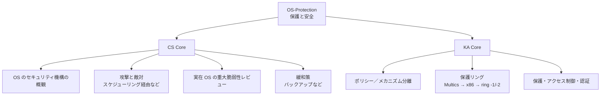
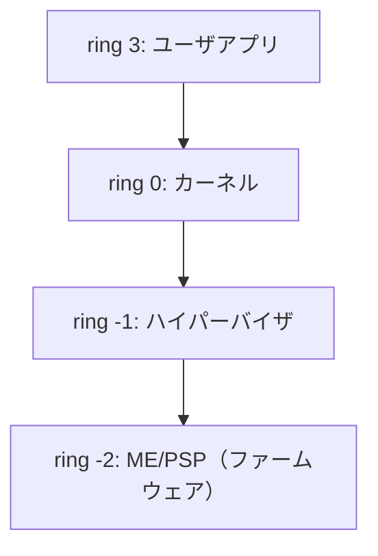

# OS-Protection: 保護と安全

CS2023 / Operating Systems (OS) の Knowledge Unit「**OS-Protection**（Protection and Safety）」を整理した学習メモ。OS は資源を共有させながら**互いを守る**存在でもある。[OS-Purpose §4](OS-Purpose.md#design-issues) で見た「あらゆる層でセキュリティを考えないと侵入口になる」という横断的関心事を、ユニットとして正面から扱う。

!!! info "出典・凡例"
    出典: `ComputerScienceCurricula2023.pdf` p.209。
    **CS Core** = 全卒業生必須 / **KA Core** = 当該分野で必須 / **Non-core** = 発展。
    このユニットは **CS Core 2時間 + KA Core 1時間**。`See also: SEC-Foundations`（セキュリティ基礎）への参照が最も多く、**OS とセキュリティの接点**となるユニット。

## 全体像

---

## 1. OS のセキュリティ機構の概観 {#mechanisms-overview}

OS が持つ守りの道具立てを一望する（`See also: SEC-Foundations`）。多くは既出の仕組みの「セキュリティ面」：

| 機構 | 何を守るか | 既出の場所 |
|---|---|---|
| **ユーザ／カーネルモード分離** | 特権命令・ハードウェアへの直接アクセス | [OS-Principles §5,7](OS-Principles.md) |
| **メモリ保護（アドレス空間分離）** | プロセス同士の読み書き | [OS-Memory](OS-Memory.md)（MMU・ページング） |
| **アクセス制御**（ファイル権限・ACL） | ファイル・デバイスなど名前を持つ資源 | 本ページ §5 |
| **認証** | 「誰であるか」の確認（ログイン） | 本ページ §5 |
| **監査（ログ）** | 事後の検知・追跡 | — |

!!! note "保護 (protection) と安全 (safety)"
    **保護**は「意図的な攻撃・不正アクセスから守る」機構、**安全**は「事故・故障・バグからも壊れないこと」まで含む広い概念。バックアップ（§4）は攻撃（ランサムウェア）にも事故（ディスク故障・誤削除）にも効く——両者はしばしば同じ道具で支えられる。

## 2. 攻撃と敵対——スケジューリング経由の攻撃など {#attacks}

資源を**共有**していること自体が攻撃面になる（`See also: SEC-Foundations`）：

- **資源独占（DoS 的挙動）**: CPU を手放さない・fork を繰り返す（fork bomb）・メモリを食い尽くす。→ プリエンプション（[OS-Scheduling §1](OS-Scheduling.md#preemptive-nonpreemptive)）や資源クォータが対策。
- **サイドチャネル**: 共有資源の「使われ方」から秘密が漏れる。同じ CPU キャッシュを共有する攻撃者が、被害者のメモリアクセスパターンを**時間差**で観測する（キャッシュタイミング攻撃）。スケジューラが攻撃者と被害者を同じコアに載せること自体がリスクになる。
- **権限昇格**: OS のバグを突いて一般ユーザからカーネル権限を得る。

## 3. 実在 OS の重大脆弱性レビュー {#real-vulnerabilities}

「OS も間違える」ことを実例で学ぶ（`See also: SEC-Foundations`）。代表例：

| 脆弱性 | 何が起きたか | 教訓 |
|---|---|---|
| **Meltdown / Spectre** (2018) | CPU の**投機実行**の痕跡がキャッシュに残り、ユーザプロセスがカーネルメモリを読めた | ハードウェアの最適化が分離を破る。緩和策（KPTI）はコンテキストスイッチを高コスト化（→ [OS-Principles §9](OS-Principles.md#context-switch-cost)、[OS-Memory §6](OS-Memory.md#cache-speculative)） |
| **Dirty COW** (2016, Linux) | コピーオンライト処理の**競合状態**で読み取り専用ファイルに書き込めた | 並行性バグ（→ [OS-Concurrency §2](OS-Concurrency.md)）がそのまま権限昇格になる |
| **EternalBlue** (2017, Windows SMB) | カーネル内ネットワーク処理のバッファ計算ミスでリモートコード実行。WannaCry が悪用 | カーネル内のバグは影響が全システムに及ぶ。**パッチ適用の速さ**が防御力 |

## 4. 緩和策——バックアップなど {#mitigations}

攻撃・事故を**前提として**被害を限定する戦略（`See also: SF-Reliability`）：

- **バックアップ**: 定期取得・**オフライン/別系統に保管**（ランサムウェアは接続中のバックアップも暗号化する）・**復元の練習**までがバックアップ。
- **最小権限の原則**: 各プロセス・ユーザに必要最小限の権限だけ与える。破られたときの被害を限定する。
- **多層防御**: ASLR（アドレス配置のランダム化）・NX ビット（データ領域を実行不可に）・サンドボックス（→ [OS-Memory §7](OS-Memory.md#memory-security)）を重ねる。1枚破られても次の層で止める。
- **更新（パッチ）**: §3 の実例が示す通り、既知の穴を塞ぎ続ける運用が前提。

## 5. (KA Core) ポリシー／メカニズム分離 {#policy-mechanism}

- **メカニズム** = 「**どうやって**やるか」の仕組み（例：ページ保護ビット、権限チェックのフック）。**ポリシー** = 「**何を**許すか」の決定（例：このユーザはこのファイルを読める）。
- 分離しておくと、**仕組みを作り直さずに方針だけ変えられる**（`See also: SEC-Governance`）。例：Linux の LSM (Linux Security Modules) はフック（メカニズム）を提供し、SELinux や AppArmor が各々のポリシーを載せる。
- スケジューラ（ready キューという仕組み vs どれを選ぶかの方針）など、OS 設計全般に現れる分離原則の、セキュリティ版。

## 6. (KA Core) セキュリティの手法とデバイス——保護リング {#rings}

**保護リング (rings of protection)**: 特権を同心円状の層で表す。内側ほど強い権限。

- 歴史は **Multics**（8リング）に始まり、x86 は ring 0–3 を持つが、実際の OS はほぼ **ring 0（カーネル）と ring 3（ユーザ）の2層**しか使わなかった——モード分離（[OS-Principles §7](OS-Principles.md)）のハードウェア実装。
- 仮想化の登場で「カーネルより偉い」層が必要になり、**ring -1** と呼ばれる **ハイパーバイザ**モード（Intel VT-x / AMD-V のルートモード）が追加された。ゲスト OS は自分が ring 0 のつもりでも、その下にホストがいる。
- さらに下、**ring -2** と俗称される **Intel ME / AMD PSP**：メインCPU とは別に常時動く管理プロセッサで、OS からは見えず制御もできない。「自分より下の層は検証できない」——[OS-Purpose §4](OS-Purpose.md#design-issues) の「ブート層を先に押さえられると OS の防御は無効化される」の極端な形。

## 7. (KA Core) 保護・アクセス制御・認証 {#access-control}

3つの問いを区別する（`See also: SEC-Foundations, SEC-Crypto`）：

1. **認証 (authentication)** = 「**あなたは誰か**」。パスワード・鍵・生体認証。パスワードは平文でなく**ソルト付きハッシュ**で保存する（`SEC-Crypto`）。
2. **認可／アクセス制御 (authorization / access control)** = 「**その資源に何をしてよいか**」。概念モデルは**アクセス制御行列**（主体 × 資源 → 権限）。実装は2通りに割れる：
   - **ACL**（アクセス制御リスト）: 行列を**資源側**（列）で持つ。例：Unix の `rwxr-xr--`、ファイルごとの ACL。
   - **ケイパビリティ**: 行列を**主体側**（行）で持つ。「持っていること自体が権限」のトークン。例：ファイルディスクリプタ（open できた事実が以後の権限）。
3. **保護 (protection)** = それらをすり抜けられないようにする**実施機構**（モード分離・メモリ保護）。API 境界での認可チェック漏れがあれば、プロセス分離は健在でも侵入される（[OS-Purpose](OS-Purpose.md) の例）。

---

## 学習成果（Illustrative Learning Outcomes）

CS Core:

1. OS に保護・セキュリティ機構が**なぜ必要か**を理解している。
2. OS の脆弱性を突く**攻撃ベクタを列挙・説明**できる。
3. 資源アクセスを制御するために OS が持つ**機構**を理解している。

KA Core:

4. 保護とセキュリティに影響する **OS の機能と限界を要約**できる（例：ring -2 のように OS から見えない層がある、緩和策には性能コストがある）。

!!! tip "学習成果2の練習法"
    攻撃ベクタを「どの共有資源を悪用するか」で分類してみる：CPU 時間（独占・タイミング観測）、メモリ（分離破り・投機実行）、ファイル（権限チェック漏れ・競合状態）、ブート層（OS 起動前の改竄）。§2–§3 の実例がそれぞれどれに当たるか対応づけると整理できる。

## 前後のユニット

- 前: [OS-Concurrency](OS-Concurrency.md) — 並行性
- 次: [OS-Scheduling](OS-Scheduling.md) — スケジューリング

疑問が出たら [OS-Protection Q&A](OS-Protection-QA.md) に記録する。
