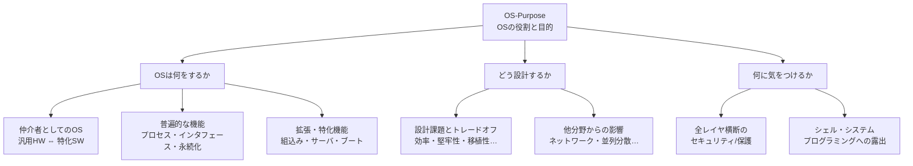
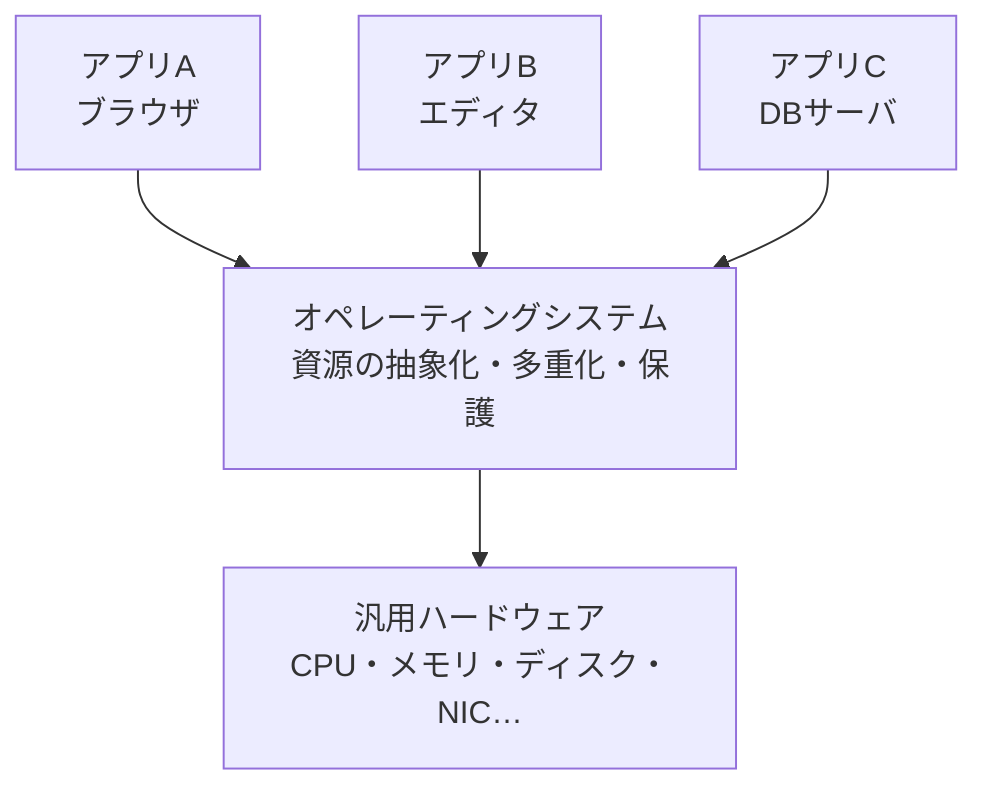

# OS-Purpose: OSの役割と目的

CS2023 / Operating Systems (OS) の1つ目の Knowledge Unit「**OS-Purpose**（Role and Purpose of Operating Systems）」を整理した学習メモ。**「OS とは何のためにあるのか」**という出発点のユニットで、OS の普遍的な機能・設計上のトレードオフ・全レイヤに横断するセキュリティの関心を扱う。

!!! info "出典・凡例"
    出典: `ComputerScienceCurricula2023.pdf` pp.205–207（KA 序文含む）。
    **CS Core** = 全卒業生必須 / **KA Core** = 当該分野で必須 / **Non-core** = 発展。
    このユニットは **CS Core 2時間**。全項目が CS Core（＝全員必修の基礎）。

!!! note "OS Knowledge Area 全体の位置づけ（KA 序文より）"
    OS とは「**ハードウェアとアプリケーションを安全に橋渡しするためのサービスの集合**」。コアトピックは**計算・メモリ・I/O を仮想化する**ためのメカニズムとポリシー。
    OS には計算機システムの多くの階層で再利用される横断的テーマが凝縮されている（例：ポーリング vs 割り込み、キャッシング、柔軟性 vs コスト、スケジューリング、ページ置換）。また **信頼境界（trust boundary）・並行性・永続性・安全な拡張性** という、他の KA の土台となる概念を含む。

## 全体像

---

## 1. 仲介者としての OS {#os-as-mediator}

> Operating systems mediate between general purpose hardware and application-specific software.

OS は「**汎用のハードウェア**」と「**用途特化のアプリケーションソフトウェア**」の**間を仲介（mediate）**する。

- ハードウェアはどのアプリのためにも作られていない「汎用品」。アプリは個別の目的しか知らない。
- OS がその間に立ち、**抽象化**（扱いやすいインタフェースの提供）、**多重化**（1つの CPU/メモリを多数のアプリで共有）、**保護**（互いに壊し合わない・覗き合わないようにする）を行う。

## 2. 普遍的な OS 機能 {#universal-functions}

どんな OS にも共通する（universal）機能。例として：

| 機能 | 内容 |
|---|---|
| **プロセス** | 実行中のプログラムの管理（生成・スケジューリング・終了） |
| **ユーザインタフェース** | シェル・GUI などユーザとの接点 |
| **デバイスインタフェース** | 多様なハードウェアを統一的に扱う接点 |
| **データの永続化** | ファイルシステム等による、電源を切っても残るデータ管理 |

## 3. 拡張・特化した OS 機能 {#specialized-functions}

汎用機能に加えて、用途に応じて拡張・特化された機能がある。

- **組込みシステム (embedded systems)**: 限られた資源・リアルタイム制約の下で動く OS 機能。
- **サーバの種類**: ファイルサーバ・Web サーバ・マルチメディアサーバなど、サーバ用途ごとの機能。
- **ブートローダとブートセキュリティ**: OS 自身を起動する仕組みと、その起動過程の保護（→ §6b とつながる）。

## 4. 設計課題（design issues）とトレードオフ {#design-issues}

OS 設計で考慮する性質（`See also: SEC-Engineering`）：

**効率 (efficiency)・堅牢性 (robustness)・柔軟性 (flexibility)・移植性 (portability)・セキュリティ (security)・互換性 (compatibility)・電力 (power)・安全性 (safety)**

これらは同時にすべて最大化できず、**トレードオフ**になる。CS2023 が明示する代表例：

| トレードオフ | 例 |
|---|---|
| **エラーチェック vs 性能** | 引数検証・整合性チェックを増やすほど安全だが遅くなる |
| **柔軟性 vs 性能** | 汎用的な抽象層を挟むほど適応範囲は広がるがオーバーヘッドが増す |
| **セキュリティ vs 性能** | 保護機構・緩和策（→ §6f の Spectre/Meltdown 緩和）は性能を削る |

## 5. 他分野からの影響 {#influences}

OS の機能・設計は、次の分野の発展から影響を受けて進化してきた：

- **セキュリティ**（保護機構の強化）
- **ネットワーキング**（ネットワークスタック、分散資源へのアクセス）
- **マルチメディア**（リアルタイム性・ストリーミング対応）
- **並列・分散コンピューティング**（マルチコア対応、分散システム支援）

## 6. 横断的関心としてのセキュリティ/保護 {#security-protection}

> Neglecting to consider security at every layer creates an opportunity to inappropriately access resources.

**どこか1つのレイヤでセキュリティを考慮し忘れると、そこが資源への不正アクセスの入口になる**。CS2023 が挙げる具体例（a–f）：

| # | 例 | 教訓 |
|---|---|---|
| a | **暗号化されていないドライブ**は、メディアを別のコンピュータに繋ぎ替えるだけでファイルへ不正アクセスできる | OS のアクセス制御は媒体自体を守らない → 暗号化が必要 |
| b | OS がロードされる**前のブート層**に侵入されると、OS が強制するセキュリティは無効化できる | ブートセキュリティ（Secure Boot 等）の必要性（→ §3） |
| c | **API 境界での認可チェックが不十分**だと、プロセス分離は破られる | 分離機構は境界での検査とセットで初めて機能する |
| d | **システムファームウェアの脆弱性**は OS を完全に迂回する攻撃ベクタになる | OS より下の層も信頼の連鎖に含まれる |
| e | **仮想マシンのメモリ・計算・ハードウェアの分離が不適切**だと、ゲストからホストへの攻撃に晒される | 仮想化にも分離の徹底が必要 |
| f | ハードウェア/ファームウェア脆弱性の悪用を **OS 側で緩和**しなければならないことがあり、性能低下を招く（例：**Spectre / Meltdown 緩和**） | セキュリティ vs 性能のトレードオフ（→ §4） |

!!! tip "覚え方"
    a–f は「**下の層から順に**：媒体 → ブート → プロセス境界 → ファームウェア → 仮想化 → HW 脆弱性の緩和コスト」と、**どの層をサボっても破られる**という同じメッセージの変奏になっている。

## 7. シェルとシステムプログラミングへの露出 {#shells-sysprog}

OS の機能は、**シェル**（コマンドラインからの操作）や**システムプログラミング**（システムコールを直接使うプログラミング）を通じてユーザ・開発者に露出される（`See also: FPL-Scripting`）。

- 例：`ps`・`kill`（プロセス管理）、リダイレクト・パイプ（I/O とファイル）、`chmod`（保護）は、いずれも §2 の普遍的機能がシェルに顔を出したもの。

---

## 学習成果（Illustrative Learning Outcomes）

CS Core:

1. 現代の OS の**目的と機能**を理解する。
2. **利用シナリオごとの設計課題**を評価できる（例：リアルタイム OS・モバイル・サーバ）。
3. **利便性・効率・進化可能性**の観点から現代 OS の機能を理解する。
4. **進化（evolution）と安定性（stability）**がどちらも望ましいのに**互いに相反する**ことを理解する。

!!! note "学習成果4の含意"
    OS は新しいハードウェア・新しい要求に合わせて**進化し続ける必要がある**一方、その上のアプリケーション資産のために**インタフェースの安定**も求められる。進化すれば互換性が壊れ、安定を守れば古い設計に縛られる——この緊張関係が OS 設計の根底にある。

## 次のユニットへ

[OS-Principles](OS-Principles.md) では、この「OS は仲介者である」という役割を**どういう仕組みで実現するか**（設計アプローチ・システムコール・カーネル/ユーザモード・割り込み）に踏み込む。

疑問が出たら [OS-Purpose Q&A](OS-Purpose-QA.md) に記録する。
