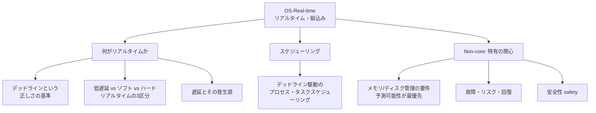

# OS-Real-time: リアルタイム・組込みシステム

CS2023 / Operating Systems (OS) の Knowledge Unit「**OS-Real-time**（Real-time and Embedded Systems）」を整理した学習メモ。[OS-Scheduling](OS-Scheduling.md) では「平均的に速く・公平に」を目指したが、ここでは**「決められた時刻（デッドライン）までに必ず終わること」**が正しさの一部になる世界を扱う。

!!! info "出典・凡例"
    出典: `ComputerScienceCurricula2023.pdf` p.214。
    **CS Core** = 全卒業生必須 / **KA Core** = 当該分野で必須 / **Non-core** = 発展。
    このユニットは **KA Core 1時間**。`See also: SPD-Embedded`（組込み）との接続が深い。

## 全体像

---

## 1. リアルタイムシステムとは {#what-is-realtime}

**リアルタイムシステム**とは「速いシステム」ではなく、**結果の正しさが「値」だけでなく「間に合ったか」にも依存する**システム（学習成果1）。

- 平均性能ではなく**最悪ケースの保証（予測可能性、determinism）**が問われる。
- 例：自動車のエアバッグ制御、ペースメーカー、工場の制御装置、音声・動画の再生。
- 組込みシステム (embedded systems) は資源制約（CPU・メモリ・電力）の中でこれを実現することが多く、両者はセットで語られる（`See also: SPD-Embedded`）。

## 2. 低遅延 vs ソフトリアルタイム vs ハードリアルタイム {#hard-soft-lowlatency}

CS2023 が挙げる3区分（`See also: SPD-Embedded, FPL-Event-Driven`）：

| 区分 | デッドラインの意味 | 遅れたらどうなるか | 例 |
|---|---|---|---|
| **低遅延 (low-latency)** | 明示的なデッドラインはないが、応答は速いほどよい | 品質・体感が下がるだけ | 対話的 UI、ゲーム、金融取引システム |
| **ソフトリアルタイム (soft real-time)** | デッドラインはあるが、たまに逃しても致命的ではない | 品質劣化（コマ落ち・音飛び）として現れる | 動画再生、音声通話、ストリーミング |
| **ハードリアルタイム (hard real-time)** | デッドラインを逃すこと＝**システムの故障** | 物理的損害・人命に関わりうる | エアバッグ、航空機の飛行制御、産業用ロボット |

→ ハードリアルタイムでは「平均は速いが稀に遅い」は許されず、**最悪実行時間 (WCET) の見積もり**と保証が設計の中心になる。

## 3. プロセス・タスクスケジューリング {#rt-scheduling}

デッドラインを守るためのスケジューリングは、汎用 OS の「公平性・スループット」（→ [OS-Scheduling §2](OS-Scheduling.md#policies)）とは発想が変わる：

- **優先度ベース + プリエンプション必須**: 重要なタスクが来たら即座に CPU を明け渡させる。プリエンプションとデッドラインスケジューリングが有効な文脈の代表例（→ [OS-Scheduling](OS-Scheduling.md) 学習成果6）。
- 代表的方式：**RMS**（rate-monotonic: 周期が短いタスクほど高優先度、固定優先度）と **EDF**（earliest deadline first: デッドラインが近いタスクを最優先、動的優先度）。
- 周期タスク（センサを 10ms ごとに読む等）が主役で、**利用率が一定以下ならデッドライン保証が数学的に示せる**（スケジューラビリティ解析）ことが汎用スケジューリングとの大きな違い。
- **優先度逆転 (priority inversion)** に注意：低優先度タスクがロックを握ったまま中優先度に横取りされると、そのロックを待つ高優先度タスクまで止まる。緩和策は優先度継承（priority inheritance）など。

## 4. 遅延とその発生源 {#latency-sources}

デッドラインを脅かす**遅延 (latency)** はソフトウェアシステムの至る所から生まれる（学習成果2）：

- **割り込み遅延**: 割り込み発生からハンドラ実行開始まで（割り込み禁止区間が長いと伸びる）。
- **ディスパッチ遅延**: スケジューラが切替を決めてから実際にタスクが走るまで（→ [OS-Principles §9](OS-Principles.md#context-switch-cost)）。
- **カーネル内のプリエンプション不可区間**、他タスクとの**ロック競合**（優先度逆転を含む）。
- **キャッシュミス・ページフォルト**など、メモリ階層由来の変動（平均は速いが最悪が読めない）。

→ リアルタイム OS (RTOS) は、これらの**最悪値を小さく・予測可能に**するよう設計されたカーネル（短い割り込み禁止区間、プリエンプティブルカーネル、優先度継承付きロックなど）。

## 5. (Non-core) リアルタイム環境のメモリ・ディスク管理要件 {#rt-memory-disk}

汎用 OS の便利機能は「平均を速くし、最悪を読めなくする」ものが多く、リアルタイムでは避けられる：

- **メモリ**: デマンドページング（ページフォルトの遅延が予測不能）を避け、**ページのロック（ピン留め）**や静的割り当てを使う。GC やヒープの断片化も遅延の変動源。
- **ディスク**: 要求の並べ替えやキャッシュで平均は改善しても最悪は保証できない。デッドライン付き I/O スケジューリングや、そもそも機械的ディスクを避ける設計が採られる。

## 6. (Non-core) 故障・リスク・回復と安全性 {#failures-safety}

- リアルタイムシステムの多くは**物理世界を制御**しており、故障の帰結が「データ破損」ではなく**物理的損害・人命リスク**になりうる（safety-critical）。
- そのため**故障の検出・回復・縮退運転 (graceful degradation)**——ウォッチドッグタイマによる再起動、冗長化、フェイルセーフ状態への移行——が設計の一部になる（→ 故障一般は OS-Faults で扱う）。
- **リスク**をどう見積もり、どの緩和策を組み込むかを説明できることが学習成果3。

---

## 学習成果（Illustrative Learning Outcomes）

KA Core:

1. システムを**リアルタイムシステムたらしめるものは何か**を説明できる。
2. **遅延**とは何か、ソフトウェアシステムにおけるその**発生源と特性**を説明できる。
3. リアルタイムシステム特有の関心（**リスクを含む**）と、その対処法を説明できる。

Non-core:

4. 具体的な**リアルタイム OS の機能・メカニズム**を説明できる。

!!! tip "学習成果1の答え方"
    「速さ」ではなく「**締切に間に合うことが正しさの定義に入っているか**」で答える。速い汎用システム（平均 1ms 応答）よりも、遅くても保証のあるシステム（必ず 100ms 以内）の方がリアルタイムシステムである。

## 前後のユニット

- 前: [OS-Scheduling](OS-Scheduling.md) — スケジューリング（CS2023 の並びでは間に OS-Process / OS-Memory / OS-Devices / OS-Files / OS-Advanced-Files / OS-Virtualization がある）
- 次: OS-Faults — 耐故障性（未作成）

疑問が出たら [OS-Real-time Q&A](OS-Real-time-QA.md) に記録する。
