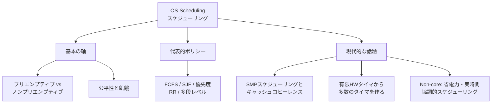

# OS-Scheduling: スケジューリング

CS2023 / Operating Systems (OS) の Knowledge Unit「**OS-Scheduling**（Scheduling）」を整理した学習メモ。実行可能なタスクが CPU より多いとき、**「次に誰を走らせるか」をどう決めるか**を扱う。[OS-Concurrency](OS-Concurrency.md) のスレッド状態遷移（ready ⇄ running）の「ready の列から誰を選ぶか」を決めるのがスケジューラ。

!!! info "出典・凡例"
    出典: `ComputerScienceCurricula2023.pdf` pp.209–210。
    **CS Core** = 全卒業生必須 / **KA Core** = 当該分野で必須 / **Non-core** = 発展。
    このユニットは **KA Core 2時間**（CS Core の時間割り当てはなし）。ここから先は「OS を専門的に学ぶ人の必修」ゾーンに入る。

## 全体像

---

## 1. プリエンプティブ vs ノンプリエンプティブ {#preemptive-nonpreemptive}

| | ノンプリエンプティブ（協調的） | プリエンプティブ（横取り型） |
|---|---|---|
| CPU を手放すタイミング | タスクが**自発的に**手放す（終了・I/O 待ち・yield） | OS が**強制的に**取り上げる（タイマ割り込み） |
| 実装 | 単純。タイマ割り込み不要 | タイマ割り込みが必須（→ [OS-Principles §6](OS-Principles.md#interrupts)） |
| 弱点 | 1つの暴走タスクが全体を止める | コンテキストスイッチのコスト、競合状態への配慮が増える |
| 例 | 初期 Windows / Mac OS（協調的マルチタスク） | 現代の汎用 OS ほぼすべて |

## 2. スケジューラとポリシー {#policies}

代表的なスケジューリングポリシー（`See also: SF-Resource`）：

| ポリシー | 選び方 | 長所 | 短所 |
|---|---|---|---|
| **FCFS**（first come, first serve） | 到着順 | 単純・公平に見える | 長いジョブの後ろで短いジョブが待たされる（**コンボイ効果**） |
| **SJF**（shortest job first） | 実行時間が最短のもの | **平均待ち時間を最小化**（理論的最適）。「毎回いちばん短いものを取る」という貪欲な選択が最適解を与える例（→ [AL-Strategies §4](../AL/AL-Strategies.md#greedy)） | 実行時間は事前に分からない（予測が必要）。長いジョブが**飢餓**しうる |
| **優先度**（priority） | 優先度が最高のもの | 重要な仕事を先に | 低優先度が**飢餓**しうる → **エイジング**（待つほど優先度を上げる）で緩和 |
| **RR**（round robin） | タイムスライスごとに順繰り | 応答性がよい・飢餓しない | スライスが短いと切替コスト増、長いと FCFS に近づく |
| **多段レベル**（multilevel） | 複数のキューを性質別に持つ（対話的/バッチ等）。フィードバック付きなら挙動を見てキュー間を移動 | 実用的（対話的タスクの応答性とスループットの両立） | 設計パラメータが多く複雑 |

!!! note "評価指標"
    ポリシーの良し悪しは何を測るかで変わる：**スループット**（単位時間に完了する仕事量）、**ターンアラウンド時間**（投入→完了）、**待ち時間**、**応答時間**（対話的タスクで重要）、**公平性**。SJF は平均待ち時間に最適だが応答性や公平性では選ばれない——[OS-Purpose §4](OS-Purpose.md#design-issues) のトレードオフの典型例。

### スケジューラの種類（学習成果3） {#scheduler-types}

- **短期（short-term）スケジューラ**: ready キューから次に走らせるタスクを選ぶ（ミリ秒単位、本ページの主役）。
- **中期（medium-term）**: メモリが苦しいときプロセスを丸ごと退避（スワップアウト）・復帰させる。
- **長期（long-term）**: システムに受け入れるジョブ数（多重度）を制御する（バッチ系で顕著）。
- **I/O スケジューラ**: ディスク要求の並べ替えなど、CPU 以外の資源のスケジューリング。

## 3. SMP スケジューリングとキャッシュコヒーレンス {#smp-cache}

**SMP (Symmetric Multi-Processor)**: 全 CPU が対等で、どの CPU でもどのタスクも走れる構成（↔ 非対称：役割固定）。

- 各 CPU は自分の**キャッシュ**を持つ。タスクを前回と同じ CPU で走らせれば、キャッシュに残ったデータ（**温かいキャッシュ**）が再利用できる → **プロセッサ親和性（affinity）**を考慮したスケジューリング。
- 別の CPU へ移すとキャッシュを温め直すコストがかかる。一方で特定 CPU だけ忙しいと**負荷分散**が必要 → 「親和性」対「負荷分散」のトレードオフ。
- **キャッシュコヒーレンス**（各 CPU のキャッシュ間の一貫性維持、`See also: AR-Memory`）はハードウェアが担うが、そのコストはスケジューリング判断に効いてくる。

## 4. タイマ——有限のハードウェアから多数のタイマを作る {#timers}

- ハードウェアタイマは**有限個**（1個のことも多い）。しかし OS はタイムスライス・タイムアウト・`sleep()` など**無数のタイマ**を提供する必要がある（`See also: AR-Assembly`）。
- 定石：タイマ要求を**満了時刻順のデータ構造**（ソート済みリスト・タイマホイール・優先度キュー）で持ち、ハードウェアタイマは**最も近い満了時刻**にセットする。優先度キューはヒープで実装するのが定番で、ready キューの優先度付き実装も同じ道具（→ [AL-Foundational §3](../AL/AL-Foundational.md#tree) のヒープ）。割り込みが来たら満了分を処理し、次の満了時刻で再セット。
- 「少数の物理資源から多数の仮想資源を作る」——OS の仮想化テーマ（→ [OS-Purpose](OS-Purpose.md)）のミニチュア版。

## 5. 公平性と飢餓 {#fairness-starvation}

- **公平性 (fairness)**: 各タスク（またはユーザ・グループ）が妥当な割合で CPU を得られること。fair-share スケジューリングはユーザやグループ単位で配分する。
- **飢餓 (starvation)**: 特定のタスクがいつまでも選ばれないこと。SJF・優先度スケジューリングで起きやすい。**エイジング**が代表的な緩和策。
- 飢餓はスケジューリング固有ではなく、**ディスク要求スケジューリングやセマフォの待ち行列でも同じ構造で現れる**（→ [OS-Principles](OS-Principles.md) 学習成果5、[OS-Concurrency §3](OS-Concurrency.md#deadlock-starvation)）。スケジューリングの論理は計算機以外（プロジェクト管理・行列の整理）にも適用できる（Non-core 学習成果7）。

## 6. (Non-core) エネルギー考慮・リアルタイムスケジューリング {#energy-realtime}

- **エネルギー考慮 (energy-aware) スケジューリング**: 消費電力・発熱を考慮して CPU 周波数を変えたり（DVFS）、仕事を少数のコアに寄せて他を眠らせたりする（`See also: AR-Performance-Energy, SPD-Mobile`）。モバイル・データセンターで重要。
- **リアルタイムスケジューリング**: デッドラインを守ることを最優先にする。詳細は [OS-Real-time](OS-Real-time.md) で扱う（`See also: SPD-Embedded`）。

## 7. (Non-core) 協調的スケジューリング——futex とユーザランドスケジューリング {#cooperative}

- **futex** (fast userspace mutex, Linux): 競合が**ない**ときはユーザ空間のアトミック操作だけでロックを取り、**競合したときだけ**システムコールでカーネルに眠らせてもらう。システムコールのコスト（→ [OS-Principles §9](OS-Principles.md#context-switch-cost)）を「必要なときだけ」払う設計。
- **ユーザランドスケジューリング**: グリーンスレッド・コルーチン（例：Go の goroutine）のように、カーネルを介さずユーザ空間のランタイムが実行流を切り替える。切替は軽いが、OS からは見えないため 1 スレッドのブロックで全体が止まりうる等の注意がある。

---

## 学習成果（Illustrative Learning Outcomes）

KA Core:

1. プリエンプティブ／ノンプリエンプティブの**代表的アルゴリズムを比較対照**できる（優先度・性能比較・fair-share を含む）。
2. スケジューリングアルゴリズムと**アプリケーション領域の関係**を説明できる（対話的なら応答性、バッチならスループット、実時間ならデッドライン）。
3. **短期・中期・長期・I/O スケジューラ**の区別を説明できる。
4. 問題や解法が**非対称／対称マルチプロセッシング**のどちらに適するか評価できる。
5. 問題や解法が**プロセス向きかスレッド向きか**評価できる（→ [OS-Concurrency §5](OS-Concurrency.md#process-vs-thread)）。
6. **プリエンプションやデッドラインスケジューリング**が有効な文脈を挙げられる。

Non-core:

7. スケジューリングアルゴリズムの論理が**他の OS メカニズムや計算機以外の問題**（ディスク I/O・ネットワーク・プロジェクトスケジューリング）にも適用できることを説明できる。

!!! tip "学習成果1の練習法"
    同じジョブ列（例：到着順に実行時間 24, 3, 3）を FCFS / SJF / RR で手で流し、平均待ち時間を計算して比べる。FCFS のコンボイ効果と SJF の最適性が数字で体感できる。

## 前後のユニット

- 前: [OS-Protection](OS-Protection.md) — 保護と安全
- 次: [OS-Process](OS-Process.md) — プロセスモデル

疑問が出たら [OS-Scheduling Q&A](OS-Scheduling-QA.md) に記録する。
