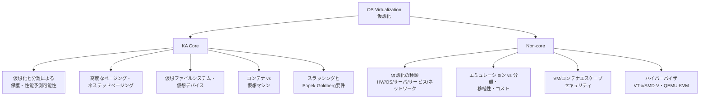
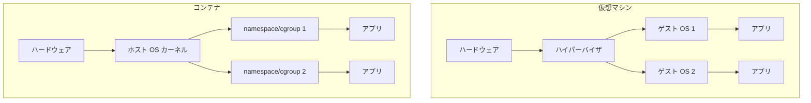

# OS-Virtualization: 仮想化

CS2023 / Operating Systems (OS) の Knowledge Unit「**OS-Virtualization**（Virtualization）」を整理した学習メモ。[OS-Protection §6](OS-Protection.md#rings) で触れた「仮想化の登場で ring -1（ハイパーバイザ）が追加された」という一文を起点に、ハードウェア仮想化支援・多段のページング・コンテナ・仮想化版のスラッシングまでを一望する。**保護（Protection）・プロセスモデル（Process）・メモリ管理（Memory）のこれまでの学習が合流する**、総仕上げ的なユニット。

!!! info "出典・凡例"
    出典: `ComputerScienceCurricula2023.pdf` pp.213–214。
    **CS Core** = 全卒業生必須 / **KA Core** = 当該分野で必須 / **Non-core** = 発展。
    このユニットは全体が **KA Core 3時間**（CS Core の時間割り当てはなし）。`See also: SF-Performance`（性能とのトレードオフとして繰り返し参照される）と `See also: SEC-Engineering`（VM/コンテナエスケープの文脈）への参照がある。

## 全体像

---

## 1. (KA Core) 仮想化と分離による保護・性能予測可能性 {#isolation-protection}

**仮想化 (virtualization)** = 1つの物理資源を、複数の独立した論理インスタンスに見せる技術。目的は大きく2つ（`See also: SF-Performance`）：

- **保護**: 各仮想マシン (VM) は「自分専用のマシンだ」と思い込み、他の VM のメモリやディスクには**構造的に**触れない。プロセス分離（[OS-Process §1](OS-Process.md#process-as-virtualization)）が「1台の中で複数のプロセスを騙す」のに対し、仮想化は「1台の中で複数の**マシン**を丸ごと騙す」——同じ**幻想を作る**というOSのテーマ（[OS-Purpose](OS-Purpose.md)）を、階層を1つ上げて再適用したもの。
- **性能の予測可能性**: 複数のテナントが物理資源を奪い合うと、自分の負荷が一定でも隣のテナントの挙動で性能が揺れる（**ノイジーネイバー問題**）。CPU 時間・メモリ量・I/O 帯域に**上限を切って割り当てる**ことで、各 VM が「保証された性能」を得られるようにする。

[OS-Protection §6](OS-Protection.md#rings) の保護リングの図をもう一段掘る——**ring -1（ハイパーバイザ）**は、この「保護」を実現するハードウェアの実体そのものである。ゲスト OS は自分が ring 0（カーネル）のつもりで動くが、その下にハイパーバイザが控えていて、全メモリ・全特権命令を最終的に監督する。この仕組みの詳細は §9 で扱う。

!!! note "仮想化は OS の入れ子"
    ハイパーバイザ自身も「資源を共有させながら分離する」という OS そのものの仕事をしている。仮想化を理解することは、OS の仕事を**1階層上から**見直すことに等しい。

## 2. (KA Core) 高度なページングと仮想メモリ——ネステッドページング {#nested-paging}

[OS-Memory §3](OS-Memory.md#address-space) では**論理アドレス → 物理アドレス**の1段変換を見た。仮想化環境ではこれがもう一段重なる：

**ゲスト仮想アドレス (GVA) → ゲスト物理アドレス (GPA) → ホスト物理アドレス (HPA)** の2段階変換が必要になる。ゲスト OS はページテーブルで GVA→GPA を管理しているつもりだが、その「物理アドレス」は実は本物の RAM 番地ではなく、ハイパーバイザが割り当てた**もう1枚の仮想アドレス**にすぎない。

- **シャドウページテーブル (shadow page table)**: ソフトウェアだけで実現する方式。ハイパーバイザがゲストのページテーブル操作を**すべてトラップ**し、GVA→HPA に直結する「影の」ページテーブルを裏で保守する。正しく動くが、ゲストのページフォルトや TLB ミスのたびに VM exit（ハイパーバイザへの制御移譲）が起き、非常に高くつく。
- **ネステッドページング（Intel EPT / AMD NPT）**: ハードウェア支援。MMU が GVA→GPA→HPA の変換を**1回のページウォークで**（ハイパーバイザの介入なしに）解決できるようにする専用の第2レベル変換表を持つ。ページフォルト処理の大半がゲスト内で完結し、VM exit が激減する。TLB エントリにも VPID/ASID（仮想プロセッサ ID）でタグを付け、VM 切り替え時の TLB フラッシュを避ける。
- トレードオフ（`See also: SF-Performance`）: 変換の段数が増える分、TLB ミス時のページウォークコストは通常の2倍近くなる。[OS-Memory §5](OS-Memory.md#allocators) の **huge pages** はここでも効く——ウォーク対象のページテーブルの段数と TLB エントリの消費を減らせるため、仮想化環境では特に重宝される。

## 3. (KA Core) 仮想ファイルシステムと仮想デバイス {#virtual-fs-devices}

ハイパーバイザ（あるいはコンテナランタイム）は、ストレージやネットワークカードといったデバイスも「本物らしく」見せる必要がある。実装は速度と互換性のトレードオフで3方式に分かれる：

| 方式 | 仕組み | 得失 |
|---|---|---|
| **フルエミュレーション** | 実在デバイスのレジスタ・挙動をソフトウェアで完全再現 | ゲストは無改造ドライバで動く（互換性最大）が**遅い** |
| **準仮想化 (paravirtualization)** | ゲストが「仮想化されている」ことを前提にした軽量ドライバ（`virtio` 等）を使う | 大幅に速いが、ゲスト側にドライバが必要 |
| **パススルー**（SR-IOV 等） | 実デバイスの一部を直接ゲストに渡す | ほぼネイティブ速度だが、VM の**ライブマイグレーションが難しくなる** |

仮想ファイルシステムも同じ発想の延長にある：VM ではホストのディレクトリをゲストに透過的に見せる `virtio-fs`／`9p` があり、コンテナでは**オーバーレイファイルシステム (overlayfs)** が定番——イメージの差分レイヤを Union mount で重ね、1枚のファイルシステムに見せる（レイヤの合成もまた「実体を1つに見せる」仮想化）。コンテナの詳細は §4 で扱う。

## 4. (KA Core) コンテナと仮想マシン {#containers-vs-vms}

[OS-Process §1](OS-Process.md#process-as-virtualization) の「プロセスも仮想化の一種——自分だけが計算機を使っている幻想」というテーマを、両極端に発展させたのが VM とコンテナ。

| | 仮想マシン | コンテナ |
|---|---|---|
| **何を仮想化するか** | ハードウェアごと（各ゲストが自分のカーネルを持つ） | **カーネルは共有**し、プロセスの見え方だけ分離 |
| **分離の実装** | ハイパーバイザ（§9） | **namespaces**（PID・mount・network・UTS・IPC・user 等、各々がカーネルの大域資源を種類ごとに個別に見せる）＋ **cgroups**（CPU・メモリ等の使用量制限・計測、§1 の「性能の予測可能性」の実装） |
| **起動時間・オーバーヘッド** | OS 全体のブートが要る（秒〜分） | プロセス起動と同程度（ミリ秒） |
| **分離の強さ** | 強い（カーネルごと別） | 弱い（カーネルのバグが全コンテナに波及しうる、→ §8） |

**使い分け**: 「異なる OS カーネル・強い分離が要る」→ VM。「同じカーネルでよく、軽量・高密度に並べたい」→ コンテナ。実運用では両者を重ねる（VM の中でコンテナを動かす）ことも多い——分離の階層を積み重ねて弱点を補う発想。

## 5. (KA Core) スラッシングと Popek-Goldberg 要件 {#thrashing-popek-goldberg}

### 仮想化版のスラッシング

[OS-Memory §4](OS-Memory.md#paging) で扱った**スラッシング**（ページ入れ替えばかりで仕事が進まない状態）は、仮想化環境では**VM 単位で再文脈化**される：複数の VM がホストの物理メモリを奪い合い、各ゲストのワーキングセット合計がホストの物理メモリを超えると、ホスト側のスワップ（あるいはゲスト側のページング）が連鎖して起動し、全 VM の性能が崩壊する。対策も相似形：

- **メモリオーバーコミット**をそもそも避ける／上限を切る。
- **バルーニング (memory ballooning)**: ハイパーバイザがゲスト内に「風船」ドライバを飼い、ゲストに余っているページを申告させて回収する——ゲストのページ置換アルゴリズム（[OS-Memory §4](OS-Memory.md#paging)）をそのまま利用して間接的にメモリを取り戻す仕組み。
- **ページ共有（KSM: Kernel Samepage Merging 等）**: 複数ゲストの同一内容ページ（同じ OS のカーネルコードなど）を1枚の物理ページに統合する——[OS-Memory §8](OS-Memory.md#virtual-memory-services) の COW の多対多版。

### Popek and Goldberg の要件

「あるアーキテクチャで trap-and-emulate 方式の仮想化が成立するための条件」を定式化した古典（1974年）。命令を3種に分類する：

- **特権命令 (privileged instruction)**: 非特権モードで実行するとトラップする命令。
- **センシティブ命令 (sensitive instruction)**: 資源の設定を変える（**制御センシティブ**）か、その振る舞いが現在のモード・資源設定に依存する（**振る舞いセンシティブ**）命令。
- **無害命令**: それ以外。仮想化に関係しない。

!!! note "Popek-Goldberg の定理"
    「**センシティブ命令の集合が特権命令の集合の部分集合**であれば、そのアーキテクチャは trap-and-emulate によって効率的に（そして**再帰的にも**——ハイパーバイザの上でさらにハイパーバイザを走らせられる形で）仮想化可能」という定理。ゲストが実行するセンシティブな命令は必ずトラップしてハイパーバイザに制御が渡るので、ハイパーバイザはそれをソフトウェアでエミュレートするだけでよい。

- 旧来の x86（VT-x/AMD-V 以前）はこの要件を**満たしていなかった**：`POPF` など約17個の命令が、非特権モードで実行すると**トラップせずに黙って失敗**した（センシティブなのに非特権）。純粋な trap-and-emulate では正しく仮想化できず、当時の VMware などは実行時に命令列を書き換える**バイナリトランスレーション**で回避していた。
- **Intel VT-x / AMD-V** は、これらの命令もすべてトラップするハードウェアモード（ルートモード）を追加し、x86 を Popek-Goldberg の要件を満たすアーキテクチャに変えた——§9 のハイパーバイザ方式の刷新はこの上に成り立つ。

## 6. (Non-core) 仮想化の種類 {#types-of-virtualization}

「仮想化」は文脈によって指すものが違う（`See also: SF-Performance`）：

| 種類 | 何を仮想化するか | 例 |
|---|---|---|
| **ハードウェア/プラットフォーム仮想化** | マシン全体 | §4 の VM |
| **OS レベル仮想化** | カーネルの中のプロセスの見え方 | §4 のコンテナ |
| **サーバ仮想化** | 複数の物理サーバを少数の物理機に集約 | データセンターの統合・仮想化（VM の応用） |
| **サービス仮想化** | 外部依存サービスの振る舞いを模倣 | テストのために本物の決済 API の代わりにモックを立てる |
| **ネットワーク仮想化** | 物理ネットワークトポロジ | VLAN・仮想スイッチ・SDN・VXLAN 等のオーバーレイネットワーク |

## 7. (Non-core) エミュレーションと分離、移植性、コスト {#emulation-isolation-cost}

- **分離 (isolation) と エミュレーション (emulation) の違い**: **分離**はゲストとホストが**同じ命令セット (ISA)** で、ハイパーバイザはセンシティブな命令だけをトラップして横取りし、それ以外はネイティブ速度で走らせる（§5 の Popek-Goldberg 要件が成立する場合の話）。**エミュレーション**はゲストとホストの ISA が**異なる**場合に、命令を1つずつ解釈・翻訳しながら実行する（例: QEMU のユーザーモードエミュレーションで ARM バイナリを x86 上で動かす）。命令の意味を丸ごとソフトウェアで作り直すぶん**大幅に遅い**が、異なるアーキテクチャ間の**移植性**を生む。
- **移植性のある仮想化**: VM イメージやコンテナイメージは、下の差異が十分抽象化されていれば別ホストへ**移動**できる。**ライブマイグレーション**は動作中の VM のメモリ状態を新しいホストへ段階的にコピーし、ダウンタイムをほぼゼロに抑える技術。
- **仮想化のコスト**（`See also: SF-Performance`）: (1) CPU オーバーヘッド——VM exit/entry のたびにコンテキストが切り替わる（§2・§5 の trap のコスト）。(2) I/O 仮想化のオーバーヘッド——エミュレーション層を通るたびに遅くなる（§3）。(3) メモリオーバーヘッド——VM はゲスト OS のイメージをまるごと複製するのに対し、コンテナはカーネルを共有するぶん軽い（§4）。(4) 運用・オーケストレーションのオーバーヘッド。

## 8. (Non-core) VM/コンテナエスケープ——セキュリティの観点 {#escapes-security}

仮想化は「保護」の手段（§1）だが、その境界自体にもバグが入りうる（`See also: SEC-Engineering`）。[OS-Protection](OS-Protection.md) の多層防御・攻撃ベクタの議論の延長：

- **VM エスケープ**: ゲスト内のコードが、ハイパーバイザや仮想デバイスのエミュレーション層のバグを突いてホスト側で実行を得る攻撃。例: VENOM（2015、QEMU の仮想フロッピーコントローラのバッファオーバーフロー）。§3 のエミュレーション層は**攻撃面が広い**——実デバイスの複雑な挙動を再現するコードが多いほど、バグの入る余地も増える。
- **コンテナエスケープ**: コンテナ内のプロセスが namespace/cgroup の制約を破ってホストの資源に到達する攻撃。特権コンテナ（root 権限・ホストのマウントへのアクセスを許した設定）や、共有カーネル自体の脆弱性が典型的な入口。
- **VM とコンテナのリスクの違い**: コンテナは**カーネルを共有する**ため、1つのカーネル脆弱性が同一ホスト上の**全コンテナ**に波及しうる。VM は各ゲストが自分のカーネルを持つため、ハイパーバイザ自体さえ堅牢なら影響範囲は狭い——「隔離の層をどこに置くか」が、破られたときの被害範囲を決める（[OS-Protection §4](OS-Protection.md#mitigations) の多層防御の考え方そのもの）。

## 9. (Non-core) ハイパーバイザ——VT-x/AMD-V・QEMU-KVM {#hypervisors}

ハイパーバイザ (hypervisor) は §1 で触れた **ring -1** の主体。実装は大きく2種類：

- **Type 1（ベアメタル型）**: ハードウェアの上に直接載る。ゲスト OS の下にホスト OS は存在しない。例: Xen、VMware ESXi、Hyper-V。データセンター向け——オーバーヘッドが小さい。
- **Type 2（ホスト型、kernel support）**: 通常のホスト OS の**上**でアプリケーションとして動く。例: KVM（Linux カーネルのモジュールとして動作し、Linux 自体を「ホスト型ハイパーバイザ」に変える）、VirtualBox、VMware Workstation。

**Intel VT-x / AMD-V** は、CPU にハイパーバイザ専用の実行モード（ルート/非ルートモード）を追加するハードウェア拡張。ゲストのセンシティブな命令実行やページフォルトを**ハードウェアレベルで**トラップして root モード（ハイパーバイザ）に制御を戻す——§5 で述べた Popek-Goldberg の要件を、ソフトウェアのバイナリトランスレーションなしに満たせるようにした立役者。

**QEMU-KVM** は Linux 上の代表的な組み合わせ：**KVM**（カーネルモジュール）が VT-x/AMD-V を使って CPU・メモリ仮想化の高速パス（§1・§2）を担当し、**QEMU**（ユーザ空間プロセス）が仮想デバイスのエミュレーション（§3）とゲストの管理を担当する——ポリシー／メカニズムの分離（[OS-Protection §5](OS-Protection.md#policy-mechanism)）がハイパーバイザの実装にもそのまま現れている。

---

## 学習成果（Illustrative Learning Outcomes）

KA Core:

1. **ハードウェアアーキテクチャが仮想化にどのような支援・効率化を提供するか**を説明できる（例: EPT/NPT によるネステッドページング、VT-x/AMD-V による Popek-Goldberg 要件の充足）。
2. **エミュレーションと分離の違い**を説明できる。
3. **仮想化のトレードオフを評価**できる（保護・性能予測可能性 vs コスト、コンテナの軽量さ vs VM の分離の強さ）。

Non-core:

4. **ハイパーバイザ**と、その様々な種類（Type 1/Type 2、ハードウェア支援の有無）に応じて**なぜそれが必要か**を説明できる。

!!! tip "学習成果2・3の練習法"
    「同じアーキテクチャの Linux VM を KVM で動かす」vs「ARM バイナリを x86 上で QEMU のユーザーモードエミュレーションで動かす」を比較してみる。前者は分離（ほぼネイティブ速度）、後者はエミュレーション（命令ごとに解釈するぶん大幅に遅い）——速度差の体感が、両者の違いと §7 の「コスト」の実感につながる。

## 前後のユニット

- 前: [OS-Advanced-Files](OS-Advanced-Files.md) — 発展的なファイルシステム
- 次: [OS-Real-time](OS-Real-time.md) — リアルタイムと組み込みシステム

疑問が出たら [OS-Virtualization Q&A](OS-Virtualization-QA.md) に記録する。
